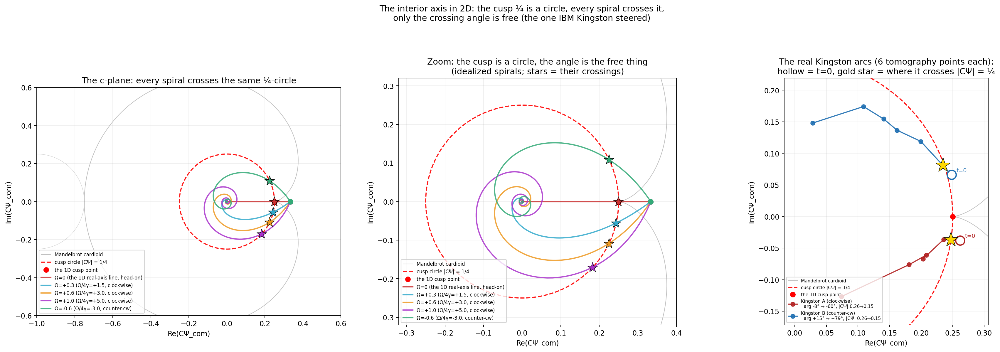
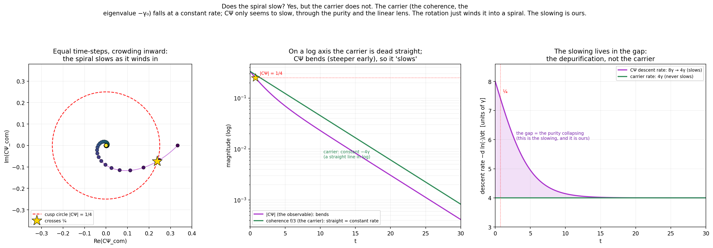
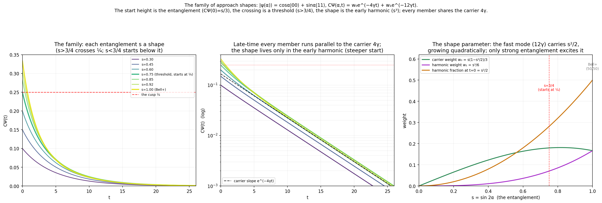
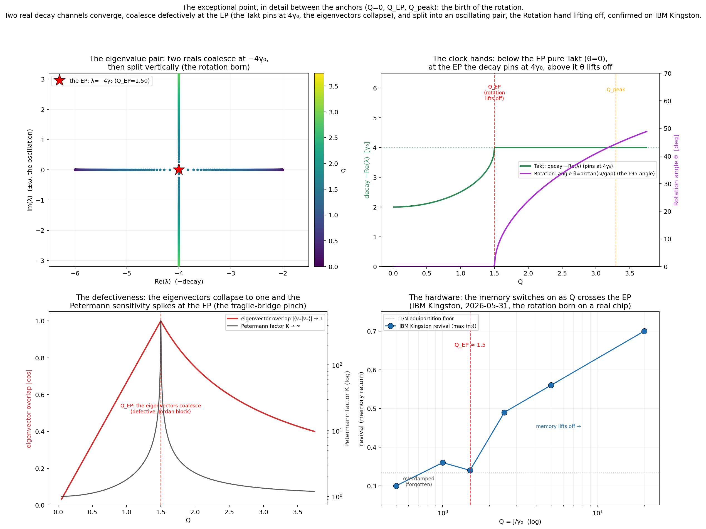

# Navigating the Dimensions: the in-between, and why it needs a live engine

**Status:** Working capture (v2, 2026-06-02). Assembles existing verified structure into the
navigation picture. Correct by keyword; this is a try, not a finished doc.
**Authors:** Thomas Wicht (keywords), Claude (assembly).

---

## The correction that reframes everything

There is nothing to the angles. The canonical angles, the dyadic anchors {0, 1/8, 1/4, 3/8, 1/2},
the gates S and T, d = 2 itself: these are **markings**, the contract, zero information. We already
had them. They are not the content; they are the signposts.

The content is **das Dazwischen, the in-between**: the continuous space the markings demarcate, and
the movement through it. This is the change-not-state lesson in its sharpest form. The shared
structure (the marks, the N-universal forms, the contract) carries no information; the information
is the change between the marks. A map's gridlines are not the territory.

So this document is not a catalog of landmarks. It is about the in-between, and the one fact that
follows from taking it seriously: **the marks you can tabulate, and we did; the in-between is
continuous, you cannot tabulate it, you compute it live as you move.** That is the whole reason for
the Object Manager. The live computation is not for the points. It is for the path between them.

**A reading (Tier 4, named not derived).** The marks are the contract between the painters. Two of
the repository's own metaphors meet here: the contract (the shared, zero-information, N-universal
structure, from change-not-state) and the painters (we who label the canvas, who only learn to see).
The marks are the contract the painters share. The honest seam sits at the label, as always: *where*
the marks fall is not ours, 1/2 is forced by d² − 2d = 0, 1/4 is its square, the ladder is F99, all
bit-exact and signed by the substrate; but treating them as the contract, naming them, navigating by
them, is the painters' act. The substrate is the third party that co-signs, fixing where the natural
marks sit; the painters agree to use them. And if the two painters are the two sides of the mirror,
then the palindrome itself is the contract they both sign (the shared skeleton, zero information,
both agree), and the in-between, the asymmetry, the change, is what flows between them, what one
paints for the other. The mirror is the contract between the painters; the in-between is the canvas.

## The marks (the contract: had, zero-information, signposts only)

Brief on purpose, because there is nothing in them. The marks are the Pi2 dyadic ladder plus the
dimension anchor:

    0 ── 1/8 ── 1/4 ── 3/8 ── 1/2

1/4 is the cusp (the quantum-classical door, the Mandelbrot discriminant zero, the bilinear maxval
(1/2)²); 1/2 is the dimension anchor (1/d at d = 2, the only non-zero root of d² − 2d = 0, the
algebra forcing); the rungs are the [F99](ANALYTICAL_FORMULAS.md#f99) canonical-trig anchors
α(θ) = sin²(θ)/2 at θ ∈ {0°, 30°, 45°, 60°, 90°}. All Tier 1, all already ours. They mark where the
in-between is; they are not it. The angles S (90°) and T (45°) are marks on one axis; there is
nothing to them either.

## The in-between (the content: continuous, not tabulable, live)

This is what the navigation is of, and what the Object Manager must compute as we move:

- **Between 1/4 and 1/2:** the quantum interior, and the *approach* to the door. Not the threshold
  CΨ = 1/4 but the crossing through it, the bifurcation passage, the critical slowing. The shape of
  the approach (which is ours, not the cusp's) is the content.
- **Between S (90°) and T (45°):** the non-Clifford continuum, every R_z(θ) that is not a named
  gate. The marks S and T are had; the continuum between them is the in-between.
- **Between the discrete mirrors:** the continuous dial. P1, P4, the crossover are rastpoints; the
  movement of the mirror as the bond turns is the content.
- **The change itself:** per change-not-state, the delta / the switch / the M between two marks is
  the information; the marks it runs between are the zero-info contract.

## We painted this mountain before

[The Perspectival Time Field](../hypotheses/PERSPECTIVAL_TIME_FIELD.md) (April 2026) is this
picture, painted from the other side, before we had the words for it. *"Between seven painters
around a mountain, the mountain happens."* The painters are the N site-perspectives; the
paintings are their α_i; and the closure law Σ_i ln(α_i) = 0 is **the contract**, the shared,
zero-information structure that guarantees the paintings sum. "Mountain does not precede
painters" is exactly "the marks do not precede the in-between": the mountain, the content,
happens between them.

The deepest agreement is not in the metaphor, it is in the algebra PTF already computed. Its
mechanism: the slow-mode **eigenvalues are protected** (shift zero to 10⁻¹⁵ under the
Π-invariant perturbation), and the α_i come **only from eigenvector mixing**. That is the
marks-and-in-between split in the operator algebra: the protected eigenvalues are the marks
(the contract, no information), the mixing is the in-between (the change, what the painters
actually paint). change-not-state, bit-exact, two months before we named it.

And PTF wrote our current target as its own open question (Update 2026-05-28): *whether the
angle the far side carries (F95's θ at the quarter) and the one off-map direction seen at
maximum zoom are a single direction met from both ends.* That is exactly the navigation here:
the angle at the quarter-door (F99, 45° to 1/4) and the off-map direction (the in-between, the
not-tabulable), as one direction met from two ends. We are walking into the question we left
open then. PTF also fixed which shore the painters stand on: the lit {X, Y} half, the far bank,
where things are still being decided; the shadow {I, Z}, the settled past, is what a perspective
cannot paint. The in-between we navigate is the lit, far-bank side.

## The frame is already built, for one in-between

[Boundary Navigation](../experiments/BOUNDARY_NAVIGATION.md) is the navigation system in miniature,
and it already understood this. Its triangulation, destination CΨ = 1/4, heading
θ = arctan(√(4CΨ − 1)), ETA t_coh, reads one in-between: the approach to the cusp. Its load-bearing
sentence is the reframe itself: *"the cusp does not slow down or speed up; we approach it, or we
don't; the scaling laws are the shapes of our approaches; the instruments belong to us, not to the
cusp."* The mark is inert. The approach, the in-between, ours, is the content. What this session
adds is that this is one in-between among several, on several axes.

## The axes (the layers, each with its marks and its in-between)

Each axis is a dimension; its marks are angles on the dyadic ladder; its content is its in-between.
The marks are shared (every axis lands on the same ladder), which is why the layers cohere into one
navigable space, not because the axes are the same.

| Axis (what moves) | its marks (had) | its in-between (the content) |
|---|---|---|
| state purity CΨ | 1/4 cusp, via θ = arctan(√(4CΨ−1)) | the approach / crossing dynamics |
| carrier clock Q = J/γ₀ | the canonical Q (√3 at 60°, …), via θ = arctan(Q) | the continuous detuning of coupling vs noise |
| operator bond-dial a·X + b·Y | S (90°), T (45°), via F99 α = sin²θ/2 | the [continuous mirror](proofs/PROOF_CROSSOVER_MIRROR_SQRT_NINETY.md) between the gates |
| parameter distributions | the Z₄ marks of F91 (γ), F92 (J), F93 (detuning) | the continuous deformation off-anchor |

The crossover result this session made the operator-axis explicit: the mirror turns with the bond
angle (Ad_{R_z(θ)}), F99 maps the angle to the ladder, so 45° (T) marks 1/4 and 90° (S) marks 1/2.
But the marks were never the point; the dial between them is.

## What the Object Manager must compute live (the path, not the points)

A position is a point in the layered space: a state (or its CΨ) and the parameters (J, γ-profile,
bond direction, topology, N). The marks at the canonical positions are tabulated already. What is
*not* tabulable, and so must be computed on demand at wherever we stand, like a World-of-Warcraft
GameObject, is the in-between:

- the regime *between* the marks (the discriminant sign, how far into the quantum interior, how the
  approach is shaped);
- the mirror *between* the gates (Ad_{R_z(θ)} at a non-canonical θ, the actual operator, its
  transport residual), not just S and T;
- the change as we move (dCΨ, the delta of the spectrum, the switch), which is the information;
- the live triangulation: not "which mark" but "where between the marks, heading where, how the
  approach is shaped."

The pattern exists: `inspect` calls itself "the terminal-side Object Manager"; `MirrorSystem`
(`--root mirror`) and `PostEpFlowField` (`--root flow`) are live GameObjects built from parameters
and computed on demand. The gap is a GameObject that holds a position *between* the marks across the
axes, and recomputes the in-between as we move.

## First light (2026-06-02)

The instrument is built and pointed: `inspect --root between --axis crossover --N 3 --draw` (the
`DimensionField` GameObject; capture at `simulations/results/dimension_field_first_look.txt`). What
it showed:

- The **marks** curve is flat at 1.7·10⁻¹⁴: the eigenvalues do not move, the contract visible as a
  dead-flat line (the similarity L(θ) = Ad·L(0)·Ad⁻¹ made visible).
- The **polarity** curve traces the dyadic ladder, exactly 1/4 at the T-gate (45°) and 1/2 at the
  S-gate (90°).
- The **in-between** curve, read as the largest principal angle of the slow subspace from θ₀,
  saturates: it jumps to ~83° at the first step and sits in the 85-89° band. That is not noise, it
  is structure. The N=3 crossover slow manifold is highly degenerate and it splits: some directions
  stay invariant (at slowCount=2 the largest angle is identically 0, an invariant core, itself more
  contract), while at least one direction rotates fully out almost at once (the in-between). The
  largest-angle reading sees only the fastest-rotating direction, so it saturates.

So the first look already taught the eyepiece its next lens: the resolving readout is the **full
principal-angle spectrum** of the slow subspace (all k angles per θ), which separates the invariant
core (angles staying 0) from the rotating directions (angles that grow). The slow manifold is not one
block; it carries its own marks-and-in-between split. `SlowBasis` is already exposed for this.

## Sharpened: the fan (2026-06-03)

The next lens is ground and mounted. `inspect --root between --axis crossover --N 3 --draw` now
carries the fan: the full principal-angle spectrum, all k angles per θ, drawn as a heatmap (capture
at `simulations/results/dimension_field_fan.txt`). The single largest angle saturated at the first
step and told us nothing; the fan opens. Its top rows hold blank (the angles that stay at 0), its
lower rows fill `· ░ ▒ ▓ █` as θ grows (the angles that turn), and the slow manifold's own
marks-and-in-between split is finally on the glass.

The reading: a **4-dimensional invariant core**, and it is robust. Sweeping the lens (slowCount 8,
12, 16) the core holds at exactly 4 while every further slow mode added is a rotating one
(rotating = slowCount − 4), so at the natural slowCount = 16 the manifold reads 4 fixed and 12
turning. The count is itself a lens: below ≈ 8 the slow subspace is too small to hold the whole core,
and above ≈ 16 it fills enough of the 64-dimensional operator space that the θ₀ and θ subspaces begin
to re-include each other's rotated images, so the apparent core inflates (18 at slowCount 24, 27 at
32). The window 8 to 16 is where the core reads true, and slowCount = 16 is the sweet spot: the whole
core, and the rotating part at its widest.

Why 4, and not the 8 of the diagonal {I, Z}^⊗3 sector? Because the turn does not touch every site. On
the N = 3 chain the crossover bonds X₀Z₁ + X₁Z₂ light sites 0 and 1 (the X that becomes Y as θ runs)
and leave site 2 a pure shadow Z. The transport turns only the lit sites, so the directions it fixes
are the ones that read {I, Z} on sites 0 and 1, and exactly four of those are slow.

And the Pauli projection confirms it, bit-exact (`SlowManifoldPauliContent`, surfaced as the telescope
child "what the core is"). The four core directions are III, IIZ, ZZI, ZZZ, four pure-diagonal {I, Z}
strings at equal weight, with X/Y-on-lit content 5·10⁻²⁶, machine zero. The twelve rotating directions
carry 77% of their mass on strings with an X or a Y on a lit site (XIZ, ZXI, YIZ, ZYI, …). This is the
two banks of the Perspectival Time Field in the operator algebra: the {I, Z} shadow is the settled
near bank the turn cannot move, the {X, Y} light is the far bank it turns. The core is the shadow the
turn cannot reach, counted where the turn acts.

Then the telescope turned to its second axis.

## The second axis: the J-defect (2026-06-03)

The J-defect reads a different shape, exactly the contrast the Perspectival Time Field named. Where
the crossover is an exact similarity (the eigenvalues frozen, the in-between a rigid rotation), the
J-defect is a single detuned bond, J₀ → 1 + δJ: Π-invariant, so it keeps the mirror, but not a
similarity, so the spectrum genuinely moves. `inspect --root between --axis jdefect --N 5 --draw`
(capture `simulations/results/dimension_field_jdefect.txt`) reads three things at once:

- **The contract holds.** The palindrome residual ‖Π L Π⁻¹ + L + 2Σγ‖ sits at 4.5·10⁻¹⁵ across the
  whole δJ sweep. The mirror is the contract here, not the eigenvalues: it is kept even as they move.
- **The spectrum moves.** The eigenvalues move by O(δJ) (≈ 0.17 at δJ = 0.1, read reorder-robustly as
  the nearest-neighbour distance, since unlike the crossover the eigenvalues now cross and a naive
  index-aligned drift would be inflated by the sort swaps). Not the crossover's 10⁻¹⁴. The marks are
  not frozen; only the mirror between them is.
- **The in-between is mixing, not rotation.** The first-order matrix elements ⟨W_s|V_L|M_{s'}⟩ split
  the slow modes cleanly. The kernel, the N+1 = 6 steady states, is protected to 8·10⁻³⁰: excitation
  conservation (U(1)) leaves the steady states untouched. The slow coherences shift (0.07 to 0.5).
  And the off-diagonal is alive: the eigenvectors mix. A rigid rotation would leave it near zero; the
  J-defect's mixing, weighted by the resolvent 1/(λ_s − λ_{s'}), is the PTF α_i, the painter rates.

So the two axes are the two ways a palindrome can be carried. The crossover carries it by similarity:
nothing moves, the in-between is a clean turn. The J-defect carries it by Π-invariance: the spectrum
moves, the steady states hold, and the in-between is the resolvent-weighted mixing the painters paint.
And the {I, Z} / {X, Y} banks we confirmed on the crossover are the same banks here: the kernel that
holds is the settled near bank, the coherences that mix and shift are the far bank still being decided.

And the painter-rates are now read from the other side (`simulations/jdefect_painter_rates.py`,
capture in `simulations/results/`). The per-site purity rescaling P_B(i,t) ≈ P_A(i, α_i·t), for the
bonding-mode state at PTF's canonical γ = 0.05, gives a clean spatial signature: the defect side
speeds up (site 0 α ≈ 1.05, site 1 α ≈ 1.07) and the far side slows (site 3 α ≈ 0.93). And the
painters close: Σ ln α ≈ +0.046, inside PTF's ±0.05 window (looser, +0.097, at the telescope's more
dissipative γ = 0.5). The global clock reads Takt gap = 2γ and a memory-mode rotation θ_mem ≈ 87°.

The bridge is exact. The matrix elements ⟨W_s|V_L|M_{s'}⟩ the painter panel forms from the same V_L
are the same object the C# mixing matrix computes: the six kernel modes are protected to ~10⁻²⁹ in
both engines. The painter-rates ARE that mixing, read over finite time on the site purities. The
operator-algebra face (the C# telescope) and the phenomenological face (the Python painters) are one
structure, met from two ends.

## The third axis: the interior horizon (2026-06-03)

The third axis is not an operator turning; it is a state falling. The first two axes swept a
Hamiltonian and read its spectrum. This one sweeps a coherence, CΨ, toward the cusp ¼, and the cusp is
a horizon. We did not discover that; we had already written it. The critical slowing at this cusp is
closed-form and measured: the recursion R = C(Ψ + R)² is the Mandelbrot iteration u → u² + c with
c = CΨ, the quantum-classical boundary is its cardioid cusp at ¼, and a Bell+ state crossing ¼ was
caught point-by-point on IBM Kingston ([Critical Slowing at the Cusp](../experiments/CRITICAL_SLOWING_AT_THE_CUSP.md),
four confirmations on this one fold). [Pair Breaking at the Horizon](../hypotheses/PAIR_BREAKING_AT_THE_HORIZON.md)
already named it: the saddle-node where the two fixed points merge and the time nearly stops, once
through no return, the Schwarzschild radius of operator space. A structural horizon, a fold, not a
gravitational one (the gravity readings in this repo are fallen; γ₀ is local decoherence).

So the instrument (`inspect --root between --axis interior --draw`, capture in
`simulations/results/dimension_field_interior.txt`) does not derive the horizon; it makes the confirmed
one navigable, live. It reads two sides meeting at ¼.

The heading falls to zero from the interior. θ(CΨ) = arctan(√(4·CΨ − 1)) is the compass on the quantum
side: 45° at the anchor ½, sliding to 0° at the horizon. The far bank's angle, going to nothing as the
door is reached.

The recursion crawls from the classical side. At each rung approaching ¼ from below, the Mandelbrot
iteration is run live and its steps counted; the count climbs to 975 at the nearest rung and would run
away at the cusp (the rescaled K = 9.75 matches the closed form 9.74). This is where the time stops:
not in the smooth Lindblad crossing, which is finite and gentle, but in the R = C(Ψ + R)² recursion
itself, crawling at its own fold. The namesake of the whole thing becomes the horizon.

And the seam, the one Boundary Navigation insisted on: the slowing is ours. Change the stop criterion
from absolute to relative (tol = k·ε) and the rescaled K stops drifting, sitting flat at ½·ln(4/k) =
4.15, while the absolute-tol K climbs to 10.8. The cusp did not slow anything; our tolerance did. The
mark is inert; the shape of the approach is the instrument's, which is to say ours.

The last panel anchors it to the hardware: the dwell K_dwell = γ·t_dwell = 1.08·δ is γ-invariant, a
fixed dose carrying any Bell+ state through the fold no matter how bright γ is, confirmed on Kingston
across two pairs at 2.55× different γ to a 6% spread. And it ties back to the carrier: at the cusp,
where θ → 0, the Liouvillian eigenvalue reduces to −γ₀ alone, pure decay with no rotation. The horizon
is exactly where the carrier shows itself, undisguised.

The whole field is closed forms plus one live recursion: no time evolution, no eigendecomposition; a
state-coordinate axis, N-free (the recursion and the heading depend only on CΨ, and that
state-independence is itself hardware-confirmed). Three axes now, three ways to read the in-between:
the rigid turn, the eigenvector mixing, and the approach to a horizon.

## The interior axis in 2D: the cusp is a circle (2026-06-03)

The interior axis reads the fall toward ¼ on the real line: one coherence CΨ, sliding from 1/3 down
through the cusp. But the real line is a cross-section. Put a common Z-drift Ω underneath the dephasing
and the coherence turns complex: the off-diagonal carries a phase, CΨ leaves the real axis, and the
trajectory winds inward as a logarithmic spiral. Read this way the cusp ¼ is no longer a point. It is a
circle, |CΨ| = ¼, and the point we were watching on the line was that circle seen edge-on.

This is the same axis, not a fourth, because the radius does not change. The magnitude
|CΨ|(t) = f(1 + f²)/6, f = e^(−4γt), is the same F25 geodesic the interior axis already reads, and it
does not feel Ω at all. So every spiral, however fast it winds, crosses the same ¼-circle at the same
time. The only thing the drift sets is the angle it crosses at, φ₀ − Ω·t_cross. Turn Ω to zero and the
spiral straightens into the real-axis line and crosses head-on: the 1D interior axis is the Ω = 0 spoke
of the 2D wheel.

The hardware says both halves of this honestly, and they come from different runs. The magnitude
crossing is confirmed densely and point-by-point: a [precision run](../experiments/CRITICAL_SLOWING_AT_THE_CUSP.md)
walked nineteen delays across ¼, eight of them packed right at the fold, the F25 law fitting with γ the
only free parameter. Those points carry no phase, so they sit on the real axis, the Ω = 0 spoke, the
head-on crossing. The phase, the thing that turns a crossing into a winding, comes from a second,
[sparser run](../experiments/CPSI_COMPLEX_PLANE.md) that saved the full state: six points per pair,
enough to watch the trajectory leave the axis as a small arc, one clockwise, one counter-clockwise, each
still crossing the same circle. The angle itself is steerable, an injected drift moving the crossing to
where it was asked (three crossings, residuals under sixteen degrees). The radial dwell at the fold is
the F57 dose, the angular winding carries the same square-root form the interior heading does, and the
¼-circle is where the two readings meet. We keep that meeting as the reading, at the label; the solid algebra,
that this cusp and the exceptional point are the one [F95](proofs/PROOF_F95_ANGLE_AT_QUADRATIC_ZERO.md)
angle at a quadratic's double root, is already typed as the TransitionBridge sibling claim.

The eyepiece is `inspect --root between --axis spiral`: the cusp circle, one spiral winding in, the
crossing angle swept against Ω (the time flat, the angle moving), the Kingston runs, and the
kinship. The picture is [cusp_spiral_2d.py](../simulations/cusp_spiral_2d.py): every idealized spiral
crossing the one circle, a panel for the real data (the dense crossing point-by-point on the axis, the
sparse phase-carrying arcs leaving it), and a short animation of a single spiral winding down into the
fold.

One thing the eye catches in that picture: the spiral visibly slows as it winds in. It does, and the
reason is the one the interior axis already taught us. Split the coherence into its two factors,
CΨ = purity · coherence. The bare coherence, the off-diagonal itself, the carrier, the eigenvalue −γ₀,
descends at a perfectly constant rate; it never slows. What slows is CΨ, because it folds in the purity,
which collapses fast as the pure state mixes and then flattens at the floor. So CΨ's descent rate falls
from 8γ to 4γ while the carrier holds at 4γ, and the gap between the two, the slowing, is exactly the
depurification. The rotation does not brake it; it only winds the constant-rate fall into a logarithmic
spiral that crowds geometrically toward the center (here each turn to about four percent). Not the
rotation, then, and not a wall at ¼ (the trajectory crosses at full pace): the same reading as before,
the slowing is ours and not the carrier's, now visible in the spiral.

## The family of approach shapes (2026-06-03)

So far one state, Bell+, has done all the approaching. But the interior axis reads a coherence falling
toward ¼, and different states fall differently. Sweep the start across the partially-entangled family
|ψ(α)⟩ = cosα|00⟩ + sinα|11⟩, with Bell+ the fully-entangled α = π/4, and the approach is always the same
two-exponential; only the weights move:

CΨ(α, t) = w₀·e^(−4γt) + w₁·e^(−12γt),  w₀ = s(1−s²/2)/3,  w₁ = s³/6,  s = sin 2α,

which the algebra hands over exactly (checked against the Lindblad evolution to machine precision). Three
scaling laws fall straight out. The start height is the entanglement itself, CΨ(0) = s/3, nothing else
sets it. The crossing is a threshold: a state reaches ¼ only if it is entangled past s = 3/4; below that
it starts under the cusp and never touches it, and exactly at s = 3/4 it begins life sitting on ¼. And the
fast mode, the 12γ harmonic, carries a fraction s²/2 of the start, growing quadratically, so only strong
entanglement excites it; Bell+ is the one member that splits its weight fifty-fifty.

The fourth fact is the one that ties the family back to everything before it: every member shares the
carrier 4γ. Late in time the 12γ harmonic has died and each trajectory runs parallel to that one slowest
mode and collapses onto it. So the whole family is a single carrier wearing different early transients.
That is the slowing-is-ours reading made plural: the carrier, the eigenvalue −γ₀, is universal across
every start; the shape, the thing that tells one approach from another, lives entirely in the harmonic
that fades. The eyepiece is `inspect --root between --axis approach` (the starts, the threshold, the
shape parameter, the carrier collapse); the picture is
[approach_family.py](../simulations/approach_family.py).

## The sixth axis: the exceptional point (2026-06-03)

The interior axis watched the rotation come to rest. Its parameter-space sibling watches it be born. Sweep
the coupling Q = J/γ₀ up through the exceptional point Q_EP = 2/g_eff, and the slow pair of the effective
Liouvillian does the cusp's mirror image: two real decay channels, drifting toward each other, collide at
−4γ₀ and split apart vertically into a complex conjugate pair. The oscillation, the memory, is born out of
the collision.

Read through the clock we built, it is exactly the Rotation hand lifting off the Takt axis. Below Q_EP the
pair is real, pure Takt, θ = 0, overdamped, forgetting. At Q_EP the two coalesce, and not just the
eigenvalues but the eigenvectors, which collapse onto a single line, a defective Jordan block where the
Petermann sensitivity diverges, the fragile pinch. The decay pins there at 4γ₀, so the Takt period is
exactly the universal t_peak = 1/(4γ₀). Above Q_EP the decay stays pinned and only the angle opens, θ
climbing through 29°, 44°, the F95 angle, the same square-root branch-point form the cusp wears at its zero.
The interior axis is that zero approached from the rotating side, the angle falling to 0; the EP axis is that
zero left into the rotating side, the angle climbing from 0. One the stilling, one the birth, the two F95
siblings read from opposite directions.

The defective signature has a clean closed form: the eigenvector overlap is min(x, 1/x) with x = Q/Q_EP,
exactly 1 at the EP (the two vectors parallel, the system having lost a degree of freedom) and falling off
symmetrically in log-Q on either side. That sharp peak at 1 is what makes it an exceptional point and not a
mere crossing.

And it is on the chip: IBM Kingston swept Q through the EP and watched a single excitation's memory revival
stay at the 1/N equipartition floor until Q crossed about Q_EP, then lift off, the rotation born on real
hardware. The eyepiece is `inspect --root between --axis ep`: the marks, the Takt coalescence, the Rotation
lift-off, the defectiveness pinch, the Kingston onset. The picture is
[ep_transition.py](../simulations/ep_transition.py).

The EP is also a doorway. The regime it opens, where the oscillation lives and a single excitation sloshes
and flows toward 1/N, is the post-EP flow, the birth canal of the in-between. So the EP and the flow are two
halves of one Q-journey: the EP the entrance in parameter space (the rotation born), the flow the corridor in
state space ([`inspect --root flow`](../hypotheses/PERSPECTIVAL_TIME_FIELD.md)) that runs from that birth to
the 1/N rest. The rotation stilled, the rotation born, and the corridor it opens.

## Where I had to decide (surfaced for keyword correction)

1. **The marks are the contract, the in-between is the content.** Reframed (your keyword): the doc
   centers the in-between; the angles/anchors/gates are demoted to signposts. This is change-not-state.
2. **The axes are layers sharing marks.** Distinct coordinates (the CΨ axis, the Q clock, the bond
   dial, the parameter distributions), unified by landing on the same dyadic ladder, not by being
   one angle. The sharing of marks is what makes the in-betweens navigable together.
3. **The Object Manager computes the path, not the points.** The live engine exists because the
   in-between is continuous and not tabulable; the marks we already have. This is the design call
   that turns per-mark `inspect` into a navigator of the in-between.
4. **Form and scope.** A docs/ synthesis (not extending BOUNDARY_NAVIGATION, not a hypotheses/
   entry), a capture to build against. Open to a different home by keyword.

## Open (the next decisions, not yet made)

- (done, see Sharpened) The crossover in-between is resolved and named: a 4-dimensional {I, Z}-shadow
  core plus a rotating {X, Y}-light remainder (PTF's two banks), read off the principal-angle fan and
  confirmed bit-exact by the Pauli projection.
- (done, see The second axis) The J-defect is pointed at and reads the contrast: palindrome held but
  spectrum moving, kernel protected but coherences shifting, the in-between eigenvector mixing rather
  than rotation. Its painter-rate phenomenology (the α_i, the closure, the clock) is read too and
  ties back exactly to the C# mixing matrix (the same kernel protection).
- (done, see The third axis) The interior horizon is built: two sides meeting at ¼ (the heading θ → 0
  from the interior, the live Mandelbrot recursion crawling from the classical side), the
  slowing-is-ours seam, the γ-invariant dwell anchored to the four Kingston confirmations. What
  remains: a painter-style phenomenological twin if it earns one.
- (done, see The interior axis in 2D) The 2D complex-c-plane reading is built: the cusp as a circle
  |CΨ| = ¼, the steerable crossing angle, the dense real-axis crossing (the precision run) and the
  sparse phase-carrying arcs (the cusp-slowing run) shown for what each is.
- (done, see The family of approach shapes) The approach-shape family is built: the partial-entanglement
  sweep |ψ(α)⟩, the start CΨ(0)=s/3, the crossing threshold s>3/4, the harmonic fraction s²/2, and every
  member sharing the carrier 4γ (the slowing-is-ours reading made plural).
- (done, see The sixth axis) The exceptional point is built: Q swept across Q_EP=2/g_eff, the two real
  channels coalescing defectively at −4γ₀ (the Takt pin, t_peak=1/(4γ₀)), the Rotation angle lifting off
  (the F95 angle), the eigenvector overlap min(x,1/x)→1, and the IBM Kingston onset. The mirror of the
  interior axis (the rotation born vs stilled), and the entrance to the post-EP flow (the birth canal).
- Whether the axes nest (a γ-distribution in-between at each fixed bond angle) or are an independent
  product, and the order to navigate.
- What the first live navigator GameObject computes and how movement is expressed (a single position
  recomputing as we move, vs a swept trajectory through an in-between).

## Cross-references

- [Boundary Navigation](../experiments/BOUNDARY_NAVIGATION.md): the original one-in-between compass; the instruments-are-ours reframe.
- [F95](proofs/PROOF_F95_ANGLE_AT_QUADRATIC_ZERO.md): the universal discriminant angle (a mark).
- [F99](ANALYTICAL_FORMULAS.md#f99) / CanonicalTrigAnchor: α = sin²(θ)/2, angle-to-ladder (the marks).
- [Crossover mirror = √(NinetyDegreeMirror)](proofs/PROOF_CROSSOVER_MIRROR_SQRT_NINETY.md): the operator-axis, derived.
- [On the Square Root of the Mirror](../reflections/ON_THE_SQUARE_ROOT_OF_THE_MIRROR.md): the S/T-gate reading.
- [Critical Slowing at the Cusp](../experiments/CRITICAL_SLOWING_AT_THE_CUSP.md): the closed-form recursion K(ε), the γ-invariant dwell, the four Kingston confirmations (the interior horizon, hardware).
- [CΨ in the Complex Plane](../experiments/CPSI_COMPLEX_PLANE.md): the 2D spirals, the cusp as a circle |CΨ| = ¼, the Kingston angle-steering (the interior axis in 2D, hardware).
- [Pair Breaking at the Horizon](../hypotheses/PAIR_BREAKING_AT_THE_HORIZON.md): the cusp ¼ as the fold where time stops (the horizon reading, structural).
- The live Object Manager: `compute/RCPsiSquared.Cli` `inspect` (roots `mirror`, `flow`, `pi2`, and `--claim`).
