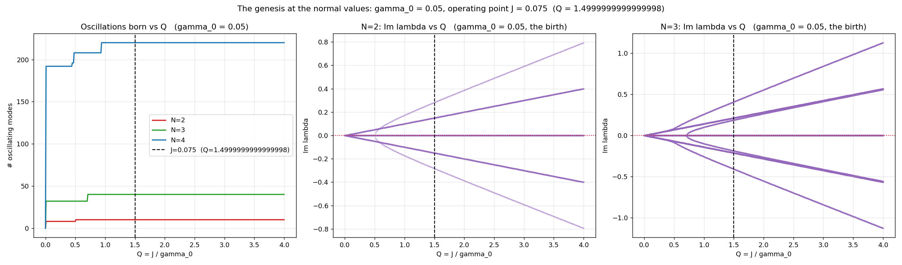
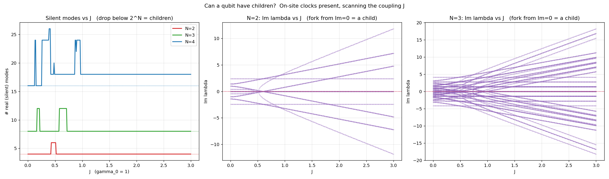

# The Genesis of an Oscillation: A Qubit Is a Source

**Date:** 2026-05-22
**Status:** an investigation in the carbon master-question thread, and its own
correction within the same session. The first reading, "coupling is birth", was
the artifact of a source-free model; the qubit-children test and a PTF
cross-check correct it: a qubit is a source, coupling re-tunes and births
nothing. Numerical results (N = 2 to 5 and N = 7); the source and wave-breaking
readings are Tier 2.
**Scripts:** the genesis Q-scan, the bath-orthogonality step, the
qubit-children test, and the PTF cross-check; full list in the Anchor.
**Thread:** the carbon master question, "where do qubits play carbon"
([carbon README](carbon/README.md), "the qubit is the quantum carbon"),
sharpened to "how does a qubit get a baby."

---

## The question

The carbon README states a structural identity: the qubit is the quantum
carbon, the half-occupied d = 2 system that `d² − 2d = 0` selects, the Level-0
instance of carbon's Level-1 half-filled valence shell. That identity raises a
master question. Where, and how, does a qubit acquire the structure that lets
it build, the way carbon builds?

Sharpened to its smallest computable form: the step N = 1 → N = 2, a single
qubit, then two qubits coupled. What is born in that step, and under what
condition? The framework's living thing is an oscillation, a heartbeat (the CΨ
oscillation). So the question is: how does a qubit get a heartbeat, or does it
carry one already?

## What was ruled out: the bath is orthogonal

The first guess followed the heat. Wave-breaking creates heat
([THERMAL_BREAKING](../experiments/THERMAL_BREAKING.md)); perhaps the heat
creates the new oscillation. It does not. A scan of the bath temperature moves
the real parts of the Liouvillian spectrum, the decay rates; the imaginary
parts barely respond. For N = 3 and N = 4 the count of oscillating modes does
not change across the whole scan. For N = 5 the bath does nudge eight modes off
the real axis, but only to |Im λ| of order 10⁻⁴: an overdamped flicker three to
four orders of magnitude below the genuine oscillation scale (|Im λ| ≈ 0.5). On
the scale that matters for a heartbeat, bath and Hamiltonian are orthogonal: the
bath damps, it cannot give one.

What remains is two quantities: γ₀, the Z-dephasing rate, and J, the coupling.
γ₀ is the fixed constant, the substrate unit, not measurable from inside the
system (only Q is). J is the only knob. Their ratio Q = J/γ₀ is the scale.

## Q is the scale, exactly

The Liouvillian of the pure F1 system, H + Z-dephasing, factors exactly:

> L(J, γ₀) = γ₀ · L₁(Q),   Q = J/γ₀

where L₁ is the Liouvillian at γ₀ = 1. Every eigenvalue scales by γ₀; the shape
of the spectrum, as a function of Q, is γ₀-independent. γ₀ is purely the unit
of the scale. This is verified: the genesis run at γ₀ = 0.05 lands its
staircase on the identical Q-values as the run at γ₀ = 1, digit for digit.

## The source-free model: an apparent birth

The first model set the Hamiltonian to the bonds alone, H = J·Σ_bonds(XX+YY),
with no on-site term per qubit. In that model a lone qubit (N = 1) has H = 0: it
only dephases, every Liouvillian eigenvalue is real, nothing oscillates. Couple
two qubits with the first J-bond and oscillating modes appear at once, 8 for
N = 2, 32 for N = 3, 192 for N = 4, born together at Q = 0+, the instant J
leaves zero. Above that a short staircase adds a few more at discrete Q (N = 2
at Q ≈ 0.51, N = 3 at ≈ 0.71, N = 4 at ≈ 0.45, 0.48, 0.94), the framework's
wave-breaking ([OFF_NIVEN_AS_WAVE_BREAKING](carbon/OFF_NIVEN_AS_WAVE_BREAKING.md)).

*The source-free model at γ₀ = 0.05. Left: the count of oscillating modes jumps
at Q = 0+, then climbs the wave-breaking staircase. Middle and right: Im λ vs Q
for N = 2 and N = 3; the fork opening from Q = 0 is the apparent birth.*

Read on its own this says "coupling is birth". But the conclusion is built into
the model. A model that sets H = 0 for a lone qubit has made the lone qubit
inert by hand; anything that then oscillates can only have come from the
coupling. The real question is whether a lone qubit is inert.

## The correction: a qubit is a source, no children

A real qubit is not inert. It has a level splitting, an on-site term, and its
coherence rotates on that on-site clock whether or not it is coupled. In that
exact sense a qubit is a source: it runs its own time.

Put the on-site clock back: H = Σ_l h_l Z_l + J·Σ_bonds(XX+YY), with distinct
on-site fields h_l. Now a lone qubit oscillates on its own clock. The test of a
genesis is then sharp: as the coupling J turns on, does a silent (real,
non-oscillating) mode lift off into oscillation, one that no single qubit had?
The all-I/Z Pauli strings are the silent modes, 2^N of them. Scanning J:

| N | silent modes at J = 0 | minimum over the J-scan |
|---|----------------------|------------------|
| 2 | 4  | 4 |
| 3 | 8  | 8 |
| 4 | 16 | 16 |

The silent-mode count never drops below 2^N. No silent mode lifts off. Children
= 0. Coupling does not birth an oscillation; it re-tunes the oscillations the
qubits already carry. The "birth at Q = 0+" of the source-free model was that
model's own artifact: it had set the qubits' clocks to zero.

*With the on-site clocks in. Left: the silent-mode count never drops below 2^N
for any N (it only rises above it): coupling births no oscillation, children =
0. Middle and right: Im λ vs J for N = 2 and N = 3. At J = 0 most modes already
oscillate (the on-site clocks, at nonzero Im λ); the coupling fans them out,
re-tuning oscillations present from the start, while the 2^N silent modes stay
on the Im = 0 axis.*

## PTF cross-check: the closure holds, a source keeps its time

A second, independent lens: the Perspectival Time Field
([PERSPECTIVAL_TIME_FIELD](../hypotheses/PERSPECTIVAL_TIME_FIELD.md)). Under a
local J-defect, each site's purity is a time-rescaling of the unperturbed chain,
P_B(i,t) ≈ P_A(i, α_i·t); the per-site rescalings α_i satisfy a closure law
Σ ln α_i ≈ 0. PTF reads the eigenvector side, where the scans above read the
eigenvalue spectrum.

Run on the genesis system, the standard case (no on-site clocks) reproduces the
published PTF α_i digit for digit, Σ ln α_i = +0.048: the machinery is verified.
With the on-site clocks in, the closure still holds, Σ ln α_i = −0.043, inside
PTF's empirical window. And the clocks pull the α_i toward 1: without them the
α_i spread from 0.85 to 1.18, with them only 0.92 to 1.03, about three times
tighter. A qubit already running its own clock is barely re-timed by the defect.
The source keeps its own time.

Both lenses agree. A J-perturbation re-tunes and redistributes; it creates
nothing. The eigenvalue side calls this "no children"; the perspectival-time
side calls it "the closure holds".

## The hour of birth: a qubit is made

A qubit does not get a heartbeat by coupling, and it does not get a child. It is
a source: it carries its own oscillation, its on-site clock, from the start.
Coupling re-tunes the sources, and the wave-breaking staircase reshuffles them,
but the count of oscillations is conserved. There is no reproduction inside the
dynamics.

Then where does a qubit come from? From construction, not from a genesis event
in the dynamics. The IBM machine makes this concrete: its qubits are fabricated
transmons, anharmonic oscillators built from a Josephson junction and a
capacitor, and the "qubit" is the lowest two levels of that oscillator, isolated
by the Josephson anharmonicity. The hour of birth of a qubit is the moment a
d = 2 subspace is carved out of an oscillator. A qubit is made, not born; and
the framework's `d² − 2d = 0` ([QUBIT_NECESSITY](QUBIT_NECESSITY.md)) is the
statement of why the carved subspace is d = 2.

## Open follow-ups

- The hour of birth as a computable event: model the carving of a d = 2 doublet
  from an anharmonic oscillator, the transmon route, and ask whether the
  framework's d = 2 selection appears as the carving stabilises.
- The wave-breaking staircase of the source-free model sits at Q ≈ 0.5,
  ≈ 0.71, and ≈ 0.94; the first two are suggestively near 1/2 and 1/√2. It is
  a reshuffling, not a birth, but a structured one; a finer Q-scan would settle
  whether those are exact anchors.
- How the source picture iterates up the hierarchy toward carbon-scale structure
  is the open arc behind the master question.

## Anchor

- Scripts: [`_genesis_q_threshold.py`](../simulations/_genesis_q_threshold.py)
  and [`_genesis_real_gamma.py`](../simulations/_genesis_real_gamma.py) (the
  Q-scan), [`_real_axis_liftoff.py`](../simulations/_real_axis_liftoff.py)
  (bath-orthogonality), [`_qubit_children.py`](../simulations/_qubit_children.py)
  (the correction), [`ptf_genesis.py`](../simulations/ptf_genesis.py) (the
  PTF cross-check)
- Figures: [genesis_real_gamma.png](../simulations/results/genesis_real_gamma/genesis_real_gamma.png),
  [qubit_children.png](../simulations/results/qubit_children/qubit_children.png)
- Carbon thread: [carbon README](carbon/README.md),
  [OFF_NIVEN_AS_WAVE_BREAKING.md](carbon/OFF_NIVEN_AS_WAVE_BREAKING.md),
  [HIERARCHY_OF_INCOMPLETENESS.md](HIERARCHY_OF_INCOMPLETENESS.md)
- PTF: [PERSPECTIVAL_TIME_FIELD.md](../hypotheses/PERSPECTIVAL_TIME_FIELD.md)
- Framework: the pure F1 system (XY-class H + Z-dephasing),
  [F1 palindrome](ANALYTICAL_FORMULAS.md),
  [QUBIT_NECESSITY.md](QUBIT_NECESSITY.md)
