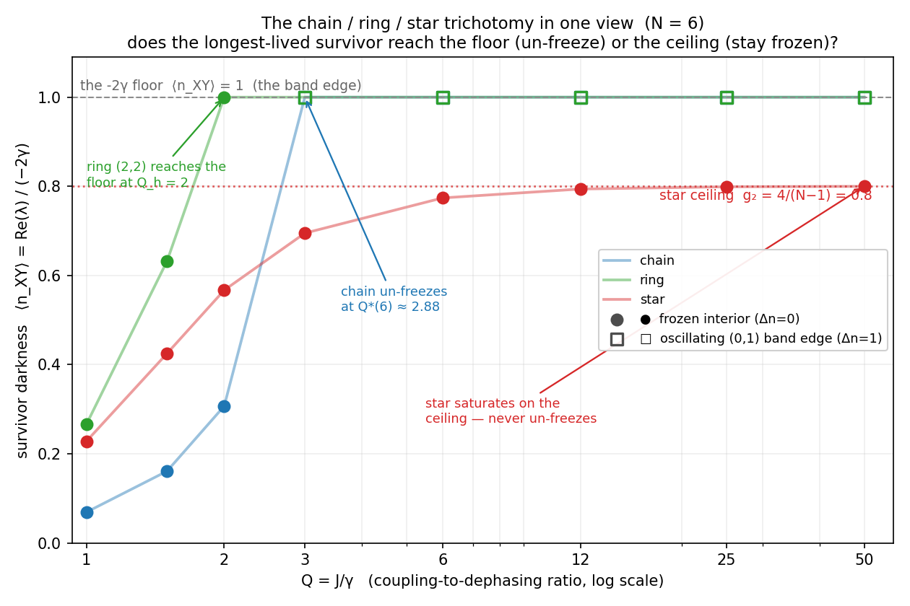
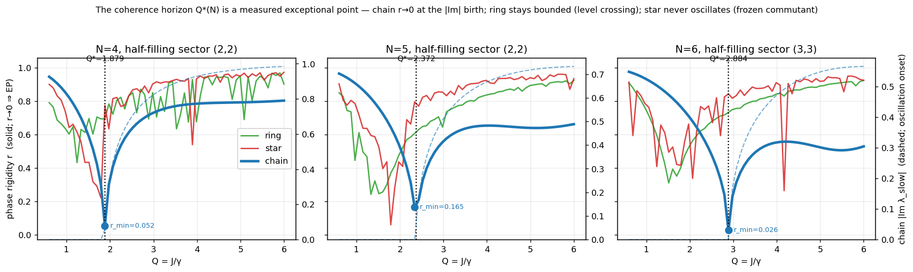
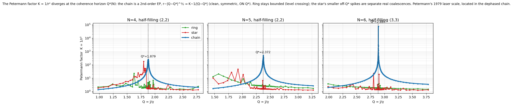

# The trichotomy, seen

**Status:** A reading of the live witness `inspect --root trichotomy`: its picture, assembled into one
figure and one tree so it is legible without running anything.
**Date:** 2026-06-18
**Authors:** Thomas Wicht, Claude (Anthropic, Opus 4.8)
**Witness:** `inspect --root trichotomy` ([`TrichotomyWitness`](../compute/RCPsiSquared.Diagnostics/Foundation/TrichotomyWitness.cs))
**Figures:** [`trichotomy_witness_figure.py`](../simulations/trichotomy_witness_figure.py) (darkness),
[`_trichotomy_ep_figure.py`](../simulations/_trichotomy_ep_figure.py) (the rigidity EP),
[`_trichotomy_petermann.py`](../simulations/_trichotomy_petermann.py) (the Petermann factor K=1/r²)

## What this is about

The chain / ring / star **trichotomy** of the longest-lived (slowest non-kernel) coherence used to live
scattered across five verifiers and four docs. The witness `inspect --root trichotomy` assembles it into
one browsable object. This note shows what that object looks like, in one figure and one rendered tree,
so the picture is legible without running anything.

The survivor's **darkness** is `⟨n_XY⟩ = Re(λ) / (−2γ)`: how slowly the longest-lived coherence decays,
in units of the dephasing. `⟨n_XY⟩ = 1` is the `−2γ` Absorption floor (the band edge). `Q = J/γ` is the
coupling-to-dephasing ratio; raising it means weakening the dephasing (watching the chain less hard).

A coherence is labelled `(a,b)` by how many excitations its two sides carry (the bra and ket particle
numbers, the joint popcount); `Δn = |a − b|` counts the places the two sides disagree. `(p,p)` (Δn=0) is a
number-conserving *interior* coherence; `(0,1)` (Δn=1) is the single-excitation *band edge*. The survivor is
whichever sector holds the longest-lived mode; at half filling `m = N/2` the interior is `(m,m)`.

## The one figure



The question the trichotomy answers: **does the longest-lived survivor reach the floor, or the ceiling?**

- **chain** (blue) and **ring** (green) climb to the `−2γ` floor (`⟨n_XY⟩ = 1`) and **un-freeze** there:
  the survivor switches from the frozen `(p,p)` interior (●) to the oscillating `(0,1)` band edge (□).
  The chain crosses at its coherence horizon `Q*(6) ≈ 2.88`; the ring at its handover `Q_h = 2`.
- **star** (red) saturates *below* the floor, on the structural ceiling `g₂ = 4/(N−1) = 0.8`, and stays
  frozen at **every** `Q` — its survivor is the `[H,A] = 0` commutant coherence, dark by construction.

That saturation at 0.8 is the structural ceiling (F122) read **dynamically**: the proof's high-Q closed
form `g₂ = 4/(N−1)` is exactly the value the darkness lands on.

A note on the coordinate: `⟨n_XY⟩` measures longevity, and `1` is its top, the band-edge value the chain and
ring climb *up* to. "Floor" names the `−2γ` rate floor seen from the spectrum; "ceiling" names the structural
cap `g₂` on the commutant darkness. For `N ≥ 6` that cap sits below `1`, so here the ceiling is numerically
*below* the floor, and the star stops short of the band edge.

## The rendered tree

What the witness prints (`inspect --root trichotomy --N 6 --max-depth 3`):

```
TrichotomyWitness (N=6, Q=1.5)  —  the chain/ring/star survivor trichotomy as one sweep
├── the route sweep (carbon): survivor + freeze-route across Q
│   ├── chain
│   │   ├── Q=1     (1,1) Δn=0 | UnfreezingSeEp | frozen      | r=0.93 | ⟨n_XY⟩=0.069
│   │   ├── Q=2     (2,2) Δn=0 | UnfreezingSeEp | frozen      | r=0.70 | ⟨n_XY⟩=0.307   ← r dips toward the EP
│   │   └── Q=3     (0,1) Δn=1 | UnfreezingSeEp | oscillating | r=1.00 | ⟨n_XY⟩=1       ← un-freezes at Q*(6)≈2.88
│   ├── ring
│   │   ├── Q=1.5   (2,2) Δn=0 | FrozenLevelCrossing | frozen      | r=0.51 | ⟨n_XY⟩=0.632
│   │   ├── Q=2     (2,2) Δn=0 | FrozenLevelCrossing | frozen      | r=0.50 | ⟨n_XY⟩=1     ← bounded r: a crossing, not an EP
│   │   └── Q=3     (0,1) Δn=1 | UnfreezingSeEp      | oscillating | r=0.98 | ⟨n_XY⟩=1
│   └── star
│       ├── Q=1.5   (1,1) Δn=0 | FrozenCommutant | frozen | r=0.43 | ⟨n_XY⟩=0.425
│       ├── Q=6     (5,5) Δn=0 | FrozenCommutant | frozen | r=0.91 | ⟨n_XY⟩=0.774
│       └── Q=50    (1,1) Δn=0 | FrozenCommutant | frozen | r=0.87 | ⟨n_XY⟩=0.8       ← saturates on the ceiling
├── the threshold ladder over N
│   ├── N=4   chain Q*=1.879 | ring Q_h=n/a | star g₂=1.333 → UN-FREEZES (g₂>1; the star outlier)
│   ├── N=5   chain Q*=2.372 | ring Q_h=1.491 | star g₂=1.0   → UN-FREEZES (marginal)
│   ├── N=6   chain Q*=2.884 | ring Q_h=2.0   | star g₂=0.8   → frozen (g₂≤1)
│   └── N=8   chain Q*=3.940 | ring Q_h=2.35  | star g₂=0.571 → frozen (g₂≤1)
├── the Δn seam (absolute): sterile / odd-drift / junction
│   ├── uniform N=5     Sterile  | Deviation=−0.000 | Δn 1→1
│   ├── canal N=5       OddDrift | Deviation=0.085  | Δn 1→1
│   └── deep-edge N=6   Junction | Deviation=0.408  | Δn 0→1   ← the survivor switches sector across Q
└── the vocabulary: rate_slow = min over Δn-sorted joint-popcount sectors, two reads
```

(Abridged; the live root sweeps Q ∈ {1, 1.5, 2, 3, 6, 12, 25, 50} and N = 4…8 in full.)

## The third axis: rigidity

The route row carries a third number besides `⟨n_XY⟩` (the rate) and `|Im|` (does it oscillate):
`r`, the **Petermann phase rigidity** of the survivor's slowest mode — the same `r = 1/(‖R⁻¹_row‖·‖R_col‖)`
the horizon witness uses to locate the chain EP. The witness computed it all along; the row now shows it.
`r ∈ (0,1]`: `r = 1` is a clean, isolated, normal mode; `r → 0` is an **exceptional point** (left and
right eigenvectors coalesce, the Petermann factor `1/r²` diverges) — not the same thing as a mere
eigenvalue degeneracy, where `r` stays bounded. So `r` reads the **mechanism**, not just the outcome.

Pin the half-filling `(m,m)` coherence sector and sweep `Q` through the transition (the route row only
sees `r` while that sector is the survivor; pinning shows the whole curve):



| sector `(m,m)` | chain | ring | star |
|----------------|-------|------|------|
| N=4 `(2,2)` | `r → 0.05` at **Q=1.88**, coincident with the `|Im|` birth — an **EP** at `Q*(4)=1.879` | `r` bottoms at `0.43`, `|Im|` **never born**: the ring's lone frozen case, its `(2,2)` sector sitting on the same commutant ceiling as the complete graph `K₄` (no handover; the ladder's `Q_h=n/a`) | `r` dips, `|Im|` **never born** — frozen |
| N=6 `(3,3)` | `r → 0.03` at **Q=2.89**, coincident with the `|Im|` birth — an **EP** at `Q*(6)=2.884` | `r` bottoms at `0.31`, dip and onset at different `Q` — a **level crossing** | `r` dips, no `|Im|` onset — frozen |

The three route *labels* — `UnfreezingSeEp` / `FrozenLevelCrossing` / `FrozenCommutant` — are assigned in
the witness by topology. The rigidity **measures** them, from a different observable: only the chain hits
`r → 0` coincident with the oscillation birth, and it lands exactly on the closed-form `Q*(N)`. The ring's
`r` stays bounded with its dip and its onset at different `Q` (a crossing); the star's `r` dips but no
oscillation is ever born (frozen). Three names become one measured axis.

### The Petermann factor

The rigidity has a name from another corner of physics. `K = 1/r²` is the **Petermann factor**: the
excess-noise / linewidth-enhancement factor Petermann (1979) found for the non-orthogonal modes of a
gain-guided laser — the amount by which mode non-orthogonality inflates the quantum fluctuations. At an
exceptional point the modes coalesce, `r → 0`, and `K` diverges; that the Petermann factor diverges at an EP
is the non-Hermitian community's reading (Berry 2004; Rotter's phase rigidity; Heiss; and the EP-sensing
line, Wiersig).

Resolved at our coherence horizon, the chain's `K` diverges with the textbook second-order-EP law:



`r ~ |Q − Q*|^{1/2}` (measured 0.49 / 0.49 / 0.58 at N = 4 / 5 / 6, scattered around ½ by the fit window and
finite size) so `K ~ 1/|Q − Q*|`, a symmetric divergence centred on the closed-form `Q*(N)` (the N=6 peak
reaches `K ≈ 7.6·10⁴` at `r = 0.0036`). The exponent ½ is the second-order-EP prediction.
The ring stays bounded (a level crossing is not an EP); the star's smaller, off-`Q*` spikes are separate real
coalescences in this non-survivor sector, not the horizon.

Physically: at the horizon the longest-lived coherence becomes a **defective, self-orthogonal** mode (its
left and right eigenvectors coalesce), and so it is the point of **maximal sensitivity**, the same fragility
Petermann's `K` measures in a laser and that EP sensors exploit today. In an open (Liouvillian) system `K` is
the excess-sensitivity factor in the general non-Hermitian sense: the same non-orthogonality → diverging
sensitivity that Petermann found in the laser, now carried by the Liouvillian.

`K` and the EP divergence are Petermann's and the non-Hermitian community's; what is ours is the *address*.
Petermann saw it in a laser, the EP-sensing line in the divergence; here it is in the dephased chain, pinned
to the closed-form `Q*(N)` with exponent ½. The same structure, a new place it lands.

## What one concludes

1. **Three topologies, three freeze-routes, one object.** The chain un-freezes through a square-root
   exceptional point (the dispersive band), the ring through a level crossing yielding to its band edge,
   the star never (its commutant survivor is frozen by construction). The map they were narrated across
   is now one read — and the rigidity `r` (above) **measures** the three mechanisms, rather than asserting
   them: `r → 0` at the chain EP, bounded for the ring crossing, no oscillation onset for the star.
2. **The structural ceiling is a dynamical fact, floor-capped.** The star's darkness saturates on
   `min(g₂, 1)` with `g₂ = 4/(N−1)`: for `N ≥ 6` (`g₂ < 1`) it lands on `g₂` and stays frozen *below* the
   floor (0.800 at N=6, 0.667 at N=7 — the F122 high-Q closed form, proven by a principal-angle argument,
   is the value the slowest mode's decay actually approaches); for `N ≤ 5` (`g₂ ≥ 1`) the ceiling is above
   the `−2γ` floor, so the darkness hits `1` and the star **un-freezes** like the chain and ring (the N=4
   outlier, N=5 marginal). The single statement `⟨n_XY⟩(Q→∞) = min(g₂, 1)` is exactly the threshold
   ladder's "un-freezes iff `g₂ > 1`". The static proof and the dynamical sweep meet on one number.
3. **Un-freezing is a sector switch.** Where the chain/ring reach the floor, the survivor's identity
   flips from the number-conserving `(p,p)` interior (Δn=0) to the number-changing `(0,1)` band edge
   (Δn=1). That same Δn-flip is the **junction** of the sterile↔birth-canal seam (the deep-edge row): the
   sterile / odd-drift / junction rows classify how the slowest mode's disagreement pattern drifts as the
   γ-profile changes (detailed in [`STERILE_BIRTHCANAL_AND_THE_JUNCTION.md`](STERILE_BIRTHCANAL_AND_THE_JUNCTION.md)).
   The two facets are one quantity, `rate_slow(Q) = min over Δn-sorted sectors`.

## Two conventions, on purpose

The witness reads on **two** conventions because the trichotomy and the seam are two different physical
sweeps. The un-freeze view is **carbon** (`Q = J/γ`, uniform γ, vary the dephasing); the Δn-seam view is
**absolute** (fixed γ, vary the profile). A single convention mislabels the chain — the gate-first build
found this, and the split is the fix.

## See also

- The per-facet detail: `inspect --root horizon` (the chain EP), `--root starseam` (the star commutant),
  `--root surface` (the birth-canal γ-surface), `--root ceiling` (the structural ceiling), `--root survivor`.
- The proofs and docs: [`THE_STAR_FROZEN_SEAM.md`](THE_STAR_FROZEN_SEAM.md),
  [`STERILE_BIRTHCANAL_AND_THE_JUNCTION.md`](STERILE_BIRTHCANAL_AND_THE_JUNCTION.md),
  [`proofs/PROOF_STRUCTURAL_CEILING.md`](proofs/PROOF_STRUCTURAL_CEILING.md) (F122),
  [`proofs/PROOF_COHERENCE_HORIZON_SLOPE.md`](proofs/PROOF_COHERENCE_HORIZON_SLOPE.md).
- Regenerate the figures: [`simulations/trichotomy_witness_figure.py`](../simulations/trichotomy_witness_figure.py)
  (darkness, data verbatim from `inspect --root trichotomy --N 6`) and
  [`simulations/_trichotomy_ep_figure.py`](../simulations/_trichotomy_ep_figure.py) (the rigidity EP, from a
  half-filling-sector `Q`-sweep of the witness' public `CarbonImAndRigidity` / `CarbonSlowestRate`) and
  [`simulations/_trichotomy_petermann.py`](../simulations/_trichotomy_petermann.py) (the Petermann factor
  `K=1/r²` diverging `~1/|Q−Q*|` at the horizon, from a log-spaced `δ`-sweep around `Q*(N)`).
