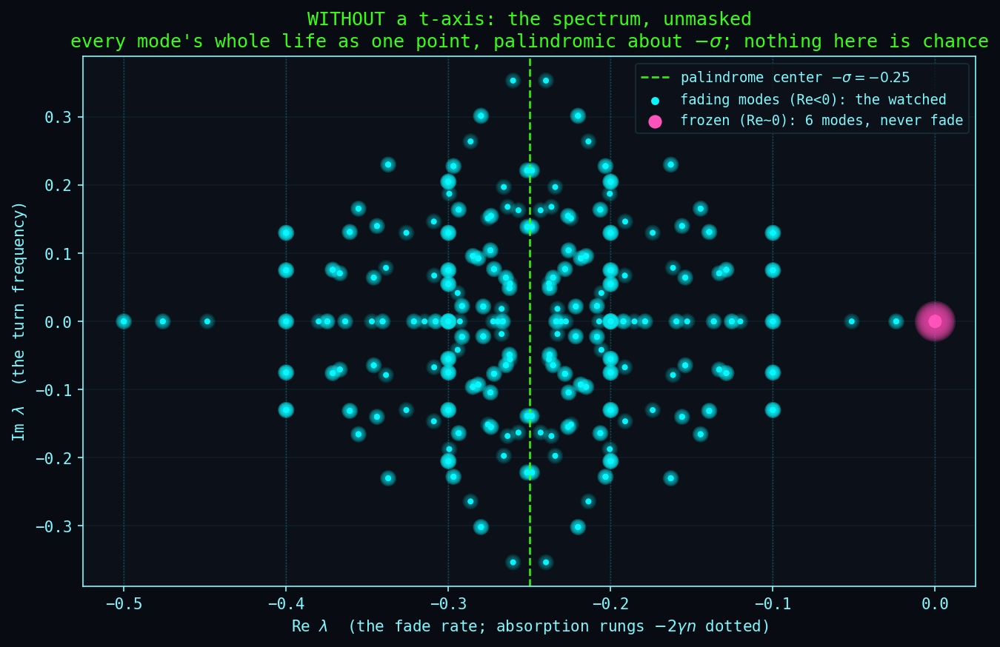

# The Mirror Symmetry Proof: The Core Result of This Project

**Status:** Tier 1 derived (analytical proof in three steps + numerical verification, N=2..8, 87,376 Liouvillian eigenvalues, zero mirror-symmetry exceptions on every tested topology. Two strengths of check: the operator identity itself is measured to N=5, where Π can still be built explicitly; from N=6 on what is measured is the consequence, that the spectrum pairs. Chain, star, ring, complete and tree are covered at N=4,5; at N=8 the tested set is chain, star, ring, and K₄ plus a disjoint 4-chain)
**Date:** Discovered 2026-03-14 (Π named + three-line proof); numerically verified 2026-03-19; this document restructured 2026-04-05; literature section extended 2026-07-05 (38-fold placement + nearest neighbour).
**Authors:** Thomas Wicht, Claude (Anthropic, Opus 4.6)
**Statement:** `Π · L · Π⁻¹ = −L − 2Σγ · I`: the Liouvillian spectrum of any Heisenberg / XY / Ising / XXZ system, on any graph and not only on a chain, under local Z-dephasing is palindromic around Σγᵢ. (The DM chain is palindromic too, but under a distinct site-alternating Π, not the uniform Π this identity uses; see the body.)
**Typed claim:** [`F1PalindromeIdentity.cs`](../../compute/RCPsiSquared.Core/F1/F1PalindromeIdentity.cs) (Tier 1 derived; analytic identity replaces the brute-force palindrome scan).

**Origin:** Our literature search turned up no proof of the palindrome as
a general theorem; the searches and what they covered are recorded in
[Connection to literature](#connection-to-literature), and the claim is
meant as "we did not find it", not as a settled negative about the whole
literature. One group (Haga et al., 2023) had
developed a grading system for quantum modes but missed the spectral
symmetry it implies. Another group (Medvedyeva-Essler-Prosen, 2016)
had proven a related result, but only for one-dimensional chains reachable
by the Bethe ansatz. The general proof, the operator that makes it work,
and the verification from N=2 to N=8 were new to us.
See [Connection to literature](#connection-to-literature) for details.

---

## What this document is about

This is the most important document in the repository. Every other
result in this project, the standing waves, the concentrator formula,
the bridge, the neural palindrome, depends on what is proven here.
If this proof is wrong, everything else falls. At N=8 all 65,536 Liouvillian
eigenvalues pair palindromically around Σγ with zero exceptions, on every
topology tested at that size (chain, star, ring, and K₄ plus a disjoint
4-chain, a deliberately disconnected graph; that four-topology sweep runs at
γ=0.5 throughout). Counting one full eigenvalue set per size, N=2..8 is
87,376 eigenvalues (Σ 4^N), zero exceptions; the configuration table below
runs several topologies per size, so it covers more spectra than that
single-topology total.

If you are a physicist, the proof is three steps (below). If you are
not, the next section explains what it says in plain language, and
you can skip to [Numerical verification](#numerical-verification) to
see the computational evidence.

## What this proof says, in plain language

Every quantum system that interacts with its environment falls apart
over time. Different parts fall apart at different speeds. This proof
shows that the list of all those speeds is always symmetric: for every
fast decay, there is a slow partner; for every slow decay, there is a
fast partner. The pattern reads the same from both ends, like a
palindrome.

This is not approximate. It is not a tendency. It is mathematically exact
for every system size and every connection pattern, at any combination of
noise strengths. Not a single exception in the 65,536 eigenvalues verified
at N=8, on any topology tested.

**What it does not cover.** The result is exact inside a specific family, and
the family has a precise edge. Noise along all three axes at once
(depolarizing) breaks it: the palindrome does not weaken, it disappears. A
field pulling on the qubits breaks it too, unless the field pulls at right
angles to every direction the noise acts along. And energy loss to the
environment breaks it when it shares an axis with the noise, which on real
hardware it usually does.

Three neighbouring cases are worth stating because the obvious guess is
wrong. A field at right angles to the noise leaves the palindrome exact, as
long as it pulls the same way on every qubit; its strength may differ from
qubit to qubit freely, its direction may not. Noise using different axes on
different qubits is also fine, as long as at most two axes turn up in any one
connected group. And energy loss to the environment (amplitude damping, or
T1), the dominant noise on today's hardware, does not destroy the palindrome
when it acts alone; it halves the shift.

Two warnings before the details. These are conditions on the whole system,
not a checklist: two of them can each hold and still fail together. And
although the edge is exact, crossing it is not a cliff. A small forbidden
term costs proportionally little, so a device that violates the conditions
slightly still shows a nearly palindromic spectrum. The Scope note gives
both precisely.

Running through all three is one distinction worth carrying: the mirror
operator Π failing and the palindrome failing are not the same event. Π is
one way to guarantee the symmetry, not the only thing that can produce it.
The Scope note under [The Theorem](#the-theorem) says which side of that
line each case falls on.

The proof works by finding a specific mathematical operation (an operator
called Π) that transforms the entire system into its mirror image. If you
apply Π and the system flips perfectly, then every decay rate must have a
partner. The proof shows that Π does flip perfectly, always.

Below is the full mathematical proof. If you are not comfortable with
the notation, you can skip to [Numerical verification](#numerical-verification)
to see the evidence, or to [How we got here](#how-we-got-here) for the
story of how we found it. But if you want to understand *why* the
palindrome is guaranteed and not just observed, the proof itself is only
three steps.

---

## The Theorem

What follows is the formal statement of the theorem. To state it
precisely, we need a few terms. Each is defined here so you do not
need to look them up elsewhere:

- **N qubits** are N quantum particles, each with two states (spin up or
  spin down). They are the building blocks.
- **The Hamiltonian H** describes how the qubits interact with each other.
  The Heisenberg-XXZ family is the most common case, parametrized as
  H = Σ J_{ij}(X_iX_j + Y_iY_j + δZ_iZ_j): for every pair of connected
  qubits i and j they interact through three types of spin exchange (X, Y,
  Z) with coupling strength J_{ij}, where the anisotropy parameter δ
  controls whether the Z-coupling differs from X and Y (δ=1 Heisenberg,
  δ=0 XY, general δ XXZ). The 16-row table below verifies anti-commutation
  with Π for the Heisenberg bond XX + YY + ZZ across all 16 two-qubit input
  strings; because each term (XX, YY, ZZ) anti-commutes with Π individually,
  the same uniform Π covers the whole XXZ family (any δ) and the Ising bond
  (Z_iZ_j only). The Dzyaloshinskii-Moriya bond (the antisymmetric
  X_iY_j − Y_iX_j) is also palindromic, but under a different, site-alternating
  Π, not the uniform Π used here; it and the other non-Heisenberg bonds are
  catalogued in [Non-Heisenberg Palindrome](../../experiments/NON_HEISENBERG_PALINDROME.md),
  which also finds that not every two-qubit bond combination preserves the
  palindrome (14 of 36 break). The connections can form any pattern: a chain,
  a ring, a star, a tree, any graph.
- **Z-dephasing** is the noise. Each qubit loses its quantum properties at
  its own rate γᵢ. This is the most common type of noise in real quantum
  hardware.
- **The Liouvillian L** is the master equation that combines the
  Hamiltonian (the interactions) and the dephasing (the noise) into one
  object. Its eigenvalues tell you every possible decay rate and oscillation
  frequency the system can have. The complete list of these eigenvalues is
  the decay spectrum. Explicitly, with the convention used throughout this
  document and in the compute engines:

  L[ρ] = −i[H, ρ] + Σᵢ γᵢ (Z_i ρ Z_i − ρ)

  The factor convention is load-bearing: it is what makes a Pauli string
  with an X or Y on site i decay at 2γᵢ per such site (Step 1 below).
  Writing the jump operator as √(γᵢ/2)·Z_i instead, also standard, halves
  every rate and moves the center to ½Σγᵢ.

The theorem:

**The Liouvillian spectrum is palindromic around Σᵢγᵢ.**

For every eigenvalue λ of L, the value −(λ + 2Σγᵢ) is also an eigenvalue.
Equivalently: decay rate d pairs with 2Σγᵢ − d.

This means the center of the spectrum sits at the sum of all the noise
rates. Everything is symmetric around that center: each decay mode has an
exact mirror partner on the other side.

**Two coordinates, one center.** In decay-rate coordinates d = −Re λ the
center is +Σγᵢ, which is how the theorem is stated above. In the complex
plane, where the eigenvalues actually live, the same center is at
Re λ = −Σγᵢ. Both appear in this document (the figure at the bottom is
drawn in the complex plane, its mirror line at −σ, where σ is this
document's Σγᵢ); they are the same number seen through opposite signs.

**A consequence worth naming.** L is trace-preserving, so λ = 0 is always
in the spectrum, and Re λ ≤ 0 for any Lindblad generator, so λ = 0 is the
rightmost point. The palindrome then *forces* its partner −2Σγᵢ to be an
eigenvalue too, and being the mirror of the rightmost point it is the
leftmost: the fastest possible decay rate is exactly 2Σγᵢ, no matter the
topology or the couplings. Measured in
[`conjugation_proof.txt`](../../simulations/results/conjugation_proof.txt) at
N=3 chain, N=4 chain, N=4 complete and N=5 ring, each hitting its own −2Σγ
(−0.3, −0.4, −0.4, −0.5 at γ=0.05), and again at N=8 on all four graphs of
the block-spectrum sweep, where γ=0.5 puts the floor at −8.

**Scope.** H is a sum of *bond* terms, and the proof needs no more than that.
Dephasing and on-site fields then obey a single boundary law (F138 in the
[formula registry](../ANALYTICAL_FORMULAS.md)), which is worth
stating before its consequences because every "exception" below falls out of
it. The palindrome holds exactly when, *in every connected component that
carries dephasing at all*:

1. at most two distinct dephasing axes appear, provided the bonds carry at
   least two terms, and
2. the on-site field has a single common axis within that component,
   orthogonal to every dephasing axis present in it.

Five things in that statement are load-bearing, and each was found by trying
to break the rule rather than by deriving it. *Component* means connected by
a nonzero coupling: a bond with J=0 is not an edge, and a path carrying three
axes across such a gap stays exact (256/256, against 1/256 for the connected
control). *Present* means acting at a nonzero rate: an axis assigned to a
site with γ=0 does not count, and a field may point straight along it (64/64,
against 0/64 when that rate is switched on). *Axis*, not arrow: antiparallel
fields on different sites are fine. A component carrying **no** dephasing
constrains nothing at all, because its Liouvillian is purely Hamiltonian and
such a spectrum is symmetric under λ ↦ −λ for any H whatsoever; a
dephasing-free bond with an X field on one site and a Z field on the other
pairs 16/16. And clause 1's *two-term* proviso is not decoration: a
single-term bond, the Ising bond ZZ among them, tolerates all three dephasing
axes at once, all eighteen three-axis assignments at N=4 pairing exactly where
Heisenberg, XX+ZZ and XX+YY all fail on the same assignments. Two bond terms
are what force the ceiling. That escape has two limits. Three axes stacked on
a single site is depolarizing there, and breaks the Ising bond too. And a
three-axis component must be **field-free**: this is not a separate condition
but clause 2 read carefully, since no direction is orthogonal to X, Y and Z
at once, so the clause is unsatisfiable there and only the empty field passes
it. Measured, and worth stating because the two clauses look like they
conflict here: Ising with all three axes pairs 64/64 with no field, and 0/64
under an X or Y field.

What follows from the rule, each of which we first met as a separate
exception:

- **Single-axis dephasing**, what this proof claims, is strictly
  conservative. Clause 1 permits two.
- **"Transverse" and "longitudinal" are not two facts.** Clause 2 asks the
  field to be orthogonal to the axes the noise uses. Under plain Z-dephasing
  that leaves the whole XY plane free and Z forbidden, which is the entire
  transverse-good, longitudinal-bad story. Dephase along X and Y instead and
  it inverts: the Z field is then the survivor.
- **Orthogonality, not avoidance.** With Z and X dephasing the free set
  shrinks from a plane to a line: a Y field survives at 64/64 while an X
  field dies at 0/64, and so does a field at 45° in the XY plane, which lies
  along neither dephasing axis. Avoiding the used axes is not enough.
- **Depolarizing is clause 1 failing**, three axes inside one component, not
  a separate phenomenon. Do not confuse clause 1 with the similarly worded
  two-axis theorem in
  [Depolarizing Palindrome](../../experiments/DEPOLARIZING_PALINDROME.md):
  that one is about several axes acting on the *same* site and turns on a
  per-site rate-pairing argument, while clause 1 gives each site a single
  axis and lets the axes differ *between* sites. Same slogan, different
  theorem.
- One case sits outside clause 2 and is worth naming because it is the
  common one: a *longitudinal* field, uniform in strength, still leaves the
  decay rates paired at 64/64 while the eigenvalues go to 0/64. That is
  uniformity doing the work, not U(1) conservation, since a non-uniform
  longitudinal field is equally U(1)-conserving and takes the rates to
  28/64. It is the complex statement that fails first, which is why the
  theorem is stated on λ and not on d.

**Why X looks special and is not.** Held against this proof's fixed Π, a
transverse field's residual comes out as 2·maxᵢ|hᵢ·sin φᵢ|, zero along X and
maximal along Y, which invites the reading that X is privileged. It is not. A
per-site rotation R_z(π/2) carries the X-field Hamiltonian to the Y-field one
and is a symmetry of Z-dephasing, so the two Liouvillians are unitarily
equivalent with identical spectra, and Π conjugated by the same rotation
satisfies the identity exactly for the Y field. The residual under a *fixed*
Π therefore measures the angle to that particular mirror's preferred axis,
not a defect of the field. The gauge argument stops where clause 2 does: one
global rotation can align one common direction, not several, so a field whose
direction varies *within* a component breaks it (4/64 for X, Y, X at N=3;
0/64 at three generic angles), while separate components may point different
ways and stay exact.

**Evidence, and its limits.** Clause 1 is swept exhaustively: every one of
the 3^N per-site axis assignments, at N=3 over chain, ring and complete and
at N=4 over chain, zero exceptions in either direction, plus disconnected
controls. Clause 2 is not exhaustive in that sense; it rests on axis-pattern
and field-direction combinations chosen to cover each case, on the angle
sweep, and on the per-component controls. Treat clause 1 as measured and
clause 2 as well supported but spot-checked. The rule has also been attacked
rather than confirmed, which is the more useful test, and every disagreement
ran the same way: the rule forbidding something that in fact held, never once
the reverse. The qualifiers above are what those disagreements taught, and
each carries its counterexample and control in
[`conjugation_proof.txt`](../../simulations/results/conjugation_proof.txt).

**The boundary is sharp, the failure is not.** Those "nonzero" qualifiers
read as knife edges and are not, which matters to anyone applying this to a
real device. Take a chain dephased along Z with a legal X field and turn on a
forbidden competing X-dephasing at rate γ_X on one site. The pairing does not
collapse at the first nonzero γ_X, it degrades with it: at 1e-12 the spectrum
still pairs 64/64 at any tolerance worth using, at 1e-9 it pairs 64/64 at
tolerance 1e-7 and 20/64 at 1e-10, by 1e-3 it is gone at both. A small
violating term costs proportionally little, and a measurement can only see a
violation larger than its own tolerance. The rule says where the palindrome
is exact; it does not say everything outside is equally far away.

**Amplitude damping sits outside this rule** and needs its own statement,
because it is a different channel rather than another axis:

- **T1 alone** is outside Π's reach but not outside the palindrome's. No
  site-local Π of the shape used here reproduces T1, and yet the spectrum
  still pairs, centered on −Σγᵢ/2 instead of −Σγᵢ: the shift is halved, not
  lost. Exact as a multiset on all 18 configurations swept (N=2 through 5,
  chain, ring, star and complete, uniform and site-dependent rates,
  anisotropies δ=−0.5 to δ=2). This is the sharpest case of "Π fails" and
  "the palindrome fails" being different claims.

  Only part of that is derived. One site at a time the T1 dissipator has
  Pauli-basis eigenvalues {0, −γ/2, −γ/2, −γ}, already mirrored about −γ/2,
  and N sites are a tensor sum, which settles the H=0 case. The commutator
  part is not a site-wise tensor sum, so with the Heisenberg H actually used
  in those runs the result is measured rather than proved.

- **T1 with dephasing** depends entirely on the axis, and the obvious guess
  is wrong. Dephasing *transverse* to T1 composes with it exactly: T1 plus
  X-dephasing and T1 plus Y-dephasing both pair 64/64, as does T1 plus a
  two-axis XYX pattern, at the combined shift 2Σγ_deph + Σγ_T1. Only
  *co-axial* Z-dephasing breaks it, down to 8/64. So the realistic hardware
  case, T1 alongside Z-dephasing, is the one combination that fails, and it
  fails because the two channels share an axis rather than because dephasing
  is present at all.

- **T1 admits no on-site field** in the component it acts on: 1/64 for a
  transverse field at N=3 with the non-uniform h used throughout here, and a
  longitudinal one leaves the rates paired but not the eigenvalues.

- **Both T1 restrictions are per component**, exactly like the two clauses
  above, and this is easy to miss because the bullets read globally. T1 on
  one bond of a disconnected pair sits happily beside co-axial Z-dephasing on
  the *other* bond (256/256), and beside a field there too (256/256). Put
  either on T1's own component and it goes: co-axial dephasing there gives
  192/256, a field there 16/256.

The T1 corrections have their own treatment in F82 and F84 of the
[formula registry](../ANALYTICAL_FORMULAS.md) (F83, between them, is a
different result: the anti-fraction closed form under plain Z-dephasing).
The half-shift itself is registry entry F137, the boundary law above F138.

---

## The Conjugation Operator Π

The proof works by constructing a specific operator Π that transforms L
into its mirror. Think of Π as a mathematical mirror: when you hold the
system up to it, every fast-decaying part maps onto a slow-decaying part
and vice versa.

For Z-dephasing, Π acts on each qubit independently (site by site) by
swapping certain quantum labels:

```
I → X   (factor +1)
X → I   (factor +1)
Y → iZ  (factor +i)
Z → iY  (factor +i)
```

For a system of N qubits, Π is the tensor product (the combined operation
built by applying the per-site rule independently to each qubit and
multiplying the results together) of these per-site operations. The
construction generalizes per dephasing axis: X- and Y-dephasing have
analogous Π's that swap their own immune sectors with their own damped
sectors, all three typed in
[`PiOperator`](../../compute/RCPsiSquared.Core/Symmetry/PiOperator.cs).
A second uniform Π for Z-dephasing exists too (the P4 partner of the P1
shown above). Alternating and continuous per-site Π families cover the bond
types that need them, catalogued by bond type in
[Non-Heisenberg Palindrome](../../experiments/NON_HEISENBERG_PALINDROME.md).
The proof below uses the P1 / Z-dephasing Π throughout.

**Physical meaning:** Π swaps populations (I, Z = diagonal elements of the
density matrix, the "classical" part) with coherences (X, Y = off-diagonal
elements, the "quantum" part), with a phase factor i on the Y ↔ Z swap.
In other words: Π exchanges what a system *is* with what it *could become*.

**Π² is conjugation by the global X-string (F1²):** Π is order 4 (Π⁴ = I).
Squaring the per-site rule, Π² fixes I and X and sends Y → −Y, Z → −Z, so on a
Pauli string Π² acts as (−1)^{n_Y+n_Z}. That is exactly conjugation by
X⊗N = ⊗_l X_l. Note the types: Π² is a superoperator, X⊗N is an operator, and
the identity is Π²(ρ) = X⊗N ρ X⊗N. This corollary is registered as F1² in
[Analytical Formulas](../ANALYTICAL_FORMULAS.md); X⊗N is the BlockSpectrum builder's
sector-pairing shortcut (`XGlobalChargeConjugationPairing`).

**Seen again 2026-06-10:** this Π is not elementary. It factors as Π = R·D,
the transpose D (ρ ↦ ρᵀ, a pure diagonal sign on the Pauli basis) followed by
the ket reflection R (ρ ↦ ρ·X⊗N), and the palindrome's two halves below are
carried separately by the two factors: D flips the Hamiltonian part (Step 2)
while R flips the noise part and carries the entire −2Σγᵢ shift (Step 1).
The two factors close into a dihedral group of order 8 that contains every
mirror of the palindrome story; see
[the mirror group factorization](PROOF_PI_FACTORS_AS_R_TIMES_D.md) and F118 in
[Analytical Formulas](../ANALYTICAL_FORMULAS.md).

---
## The Proof (3 steps)

### Step 1: Π flips XY-weight

Every quantum state of N qubits can be written as a combination of
"Pauli strings": sequences of labels I, X, Y, Z, one per qubit. For
example, XYI means "qubit 1 is X, qubit 2 is Y, qubit 3 is I." The
"XY-weight" of a string counts how many of its labels are X or Y (the
quantum, off-diagonal parts). XYI has XY-weight 2. ZZI has XY-weight 0.
(The same quantity is called `n_XY` in the
[Absorption Theorem](PROOF_ABSORPTION_THEOREM.md); two notations, one count.)

The Z-dephasing dissipator L_D is diagonal in the Pauli basis.
For a Pauli string σ, the eigenvalue is −2 times the sum of γᵢ over
all sites i where σ has an X or Y factor (the "XY-weight" contribution).

Π maps w_xy → N − w_xy (swaps {I,Z} ↔ {X,Y}).
Therefore: Π · L_D · Π⁻¹ = −L_D − 2(Σγᵢ)·I

In words: applying the mirror Π to the noise part of the equation flips
every XY-weight to its complement. A string that was mostly "quantum"
(high XY-weight, fast decay) becomes mostly "classical" (low XY-weight,
slow decay), and vice versa.

### Step 2: Π anti-commutes with [H, ·]

For a single Heisenberg bond H₁₂ = XX + YY + δZZ,
verify Π([H₁₂, σ]) = −[H₁₂, Π(σ)] for all 16 two-qubit Pauli strings.

4 strings commute with H₁₂ (II, XX, YY, ZZ) → trivially satisfied.
12 strings verified by explicit computation (see proof table below).

This holds for ALL δ (including XY-only at δ=0).
Since Π acts site-by-site and H is a sum of bonds: Π · L_H · Π⁻¹ = −L_H.
Extensions to bond types beyond the Heisenberg-XXZ family (Ising,
Dzyaloshinskii-Moriya, alternating XY+YX) require analogous per-bond
verification; the catalogue lives in
[Non-Heisenberg Palindrome](../../experiments/NON_HEISENBERG_PALINDROME.md).

In words: the mirror Π reverses the effect of the Hamiltonian. If the
Hamiltonian pushes a state in one direction, the mirrored version pushes
it in the opposite direction. This is what "anti-commutes" means: Π and
H work against each other perfectly.

### Step 3: Combine

Π · L · Π⁻¹ = Π · (L_H + L_D) · Π⁻¹ = −L_H + (−L_D − 2Σγᵢ·I) = −L − 2Σγᵢ·I

If λ is eigenvalue of L, then −(λ + 2Σγᵢ) is also eigenvalue.
With λ = −d + iω: partner has rate 2Σγᵢ − d and frequency −ω.  ∎

In words: the mirror Π transforms the entire system equation (Hamiltonian
plus noise) into its negative, shifted by a constant. This guarantees
that every eigenvalue has a mirror partner. The spectrum must be a
palindrome.

---
## Explicit 2-qubit proof table

You do not need to verify every row yourself. The table exists so
that anyone who doubts Step 2 can check it independently. Each row
is one computation. All 16 match. If even one did not match, the
proof would fail.

The following table is the complete verification of Step 2 for a single
bond. Each row takes one of the 16 possible two-qubit Pauli strings,
computes what the Hamiltonian does to it, applies the mirror Π, and
checks that the result is the negative of applying the Hamiltonian to
the mirrored string. All 16 match.

For H₁₂ = XX + YY + ZZ (extends to all δ since each term anti-commutes individually):

| σ | [H₁₂, σ] | Π(σ) | Π([H,σ]) | −[H,Π(σ)] | Match |
|---|-----------|------|----------|-----------|-------|
| II | 0 | XX | 0 | 0 | ✓ |
| IX | −2i·YZ + 2i·ZY | XI | −2i·YZ + 2i·ZY | −2i·YZ + 2i·ZY | ✓ |
| IY | 2i·XZ − 2i·ZX | iXZ | −2·IY + 2·YI | −2·IY + 2·YI | ✓ |
| IZ | −2i·XY + 2i·YX | iXY | 2·IZ − 2·ZI | 2·IZ − 2·ZI | ✓ |
| XI | 2i·YZ − 2i·ZY | IX | 2i·YZ − 2i·ZY | 2i·YZ − 2i·ZY | ✓ |
| XX | 0 | II | 0 | 0 | ✓ |
| XY | 2i·IZ − 2i·ZI | iIZ | −2·XY + 2·YX | −2·XY + 2·YX | ✓ |
| XZ | −2i·IY + 2i·YI | iIY | 2·XZ − 2·ZX | 2·XZ − 2·ZX | ✓ |
| YI | −2i·XZ + 2i·ZX | iZX | 2·IY − 2·YI | 2·IY − 2·YI | ✓ |
| YX | −2i·IZ + 2i·ZI | iZI | 2·XY − 2·YX | 2·XY − 2·YX | ✓ |
| YY | 0 | −ZZ | 0 | 0 | ✓ |
| YZ | 2i·IX − 2i·XI | −ZY | −2i·IX + 2i·XI | −2i·IX + 2i·XI | ✓ |
| ZI | 2i·XY − 2i·YX | iYX | −2·IZ + 2·ZI | −2·IZ + 2·ZI | ✓ |
| ZX | 2i·IY − 2i·YI | iYI | −2·XZ + 2·ZX | −2·XZ + 2·ZX | ✓ |
| ZY | −2i·IX + 2i·XI | −YZ | 2i·IX − 2i·XI | 2i·IX − 2i·XI | ✓ |
| ZZ | 0 | −YY | 0 | 0 | ✓ |

16/16 verified. The anti-commutation is exact.

The table above is δ=1. The extension to the whole XXZ family rests on each
term anti-commuting with Π *separately*, so that no cancellation between
terms is doing the work. Checked term by term at N=3, chain, as the max
entry of Π·L_H·Π⁻¹ + L_H:

| Bond term | Residual |
|-----------|----------|
| XX only | 0 |
| YY only | 0 |
| ZZ only | 0 |
| XX + YY (δ=0, the XY bond) | 0 |
| XX + YY + δZZ, δ ∈ {−0.5, 0.3, 1.5, 2.0} | 0 |

Since the three terms carry no cross-dependence, any δ works. The Ising bond
is the ZZ-only row and the XY bond is the XX + YY row, so both are covered
directly rather than by a limiting argument.

---
## Numerical verification

The analytical proof guarantees the palindrome mathematically. But
mathematics can contain errors. To be certain, we verified the proof
computationally, and the check comes in two strengths that this section keeps
apart. Up to N=5 we build Π explicitly and verify the identity
Π·L·Π⁻¹ = −L − 2Σγᵢ·I entry by entry. Beyond that Π itself is too large to
materialize, so what is verified is the consequence: that the spectrum pairs.
The second is what the theorem predicts, not what it asserts.

The table below shows every configuration tested. "Palindrome" counts
eigenvalues that have an exact mirror partner. Inside the theorem's scope
the two readings of that, complex λ ↦ −λ − 2Σγ and rate d ↦ 2Σγ − d, agree
at 100% on every row below; they part company only outside the scope, where
[`conjugation_proof.txt`](../../simulations/results/conjugation_proof.txt)
reports both side by side.

A note on the topology labels, because some of these small graphs coincide:
at N=3, star is the chain relabelled (path 1-0-2) and ring and complete have
the same edge set; at N=4 the binary tree is the path 2-0-1-3. Their spectra
are bit-identical. The counts here are of configurations run, not of distinct
physical systems, and the same applies to the 63/63 and 27/27 sweeps below.

### Across topologies and N (Heisenberg, uniform γ=0.05, J=1)

Every row here is the Python script, which pairs at tolerance 1e-7 and holds
the identity at 1e-10, both printed in its output.

| N | Topology | Π·L_H·Π⁻¹=−L_H | Π·L·Π⁻¹=−L−c·I | Palindrome |
|---|----------|-----------------|------------------|------------|
| 2 | single bond | ✓ | ✓ | 16/16 |
| 3 | star | ✓ | ✓ | 64/64 |
| 3 | chain | ✓ | ✓ | 64/64 |
| 3 | ring | ✓ | ✓ | 64/64 |
| 3 | complete | ✓ | ✓ | 64/64 |
| 4 | star | ✓ | ✓ | 256/256 |
| 4 | chain | ✓ | ✓ | 256/256 |
| 4 | ring | ✓ | ✓ | 256/256 |
| 4 | complete | ✓ | ✓ | 256/256 |
| 4 | binary tree | ✓ | ✓ | 256/256 |
| 5 | star | ✓ | ✓ | 1024/1024 |
| 5 | chain | ✓ | ✓ | 1024/1024 |
| 5 | ring | ✓ | ✓ | 1024/1024 |
| 5 | complete | ✓ | ✓ | 1024/1024 |
| 5 | binary tree | ✓ | ✓ | 1024/1024 |

15/15 configurations, zero exceptions. The table stops at N=5 because that is
where the *identity* is directly measured: building Π means materializing a
4^N × 4^N operator, which gets expensive fast. On the C# side
`PalindromeResidual.Build` reaches N=5 as well, on chain, ring, star and a
disconnected graph, so N=5 is where the identity's direct verification stands
across the repository. (A related script,
[`f1_general_topology_verify.py`](../../simulations/f1_general_topology_verify.py),
does build Π at N=6, but for a deliberately different Hamiltonian class: it
measures a residual *scaling law* on a non-Heisenberg bond, chosen precisely
because the Heisenberg residual vanishes identically and so carries no signal
for that purpose. It does not extend this identity's verified range.)

### Beyond N=5: the palindrome without the identity

At N=6,7,8 what is verified is the palindromic pairing of the spectrum, not
the operator identity. This is a weaker check, and it comes from two
different runs that should not be conflated:

| Source | Sizes | γ | Method | What is checked |
|--------|-------|---|--------|-----------------|
| [`rmt_eigenvalues_N6.csv`](../../simulations/results/rmt_eigenvalues_N6.csv) and [N7](../../simulations/results/rmt_eigenvalues_N7.csv) | N=6,7 chain | 0.05 | exported full spectra | every eigenvalue pairs, λ ↦ −λ − 2Σγ, at 1e-7: 4096/4096 and 16384/16384 |
| default C# suite | N=6,7,8 star | 0.05 | dense eigendecomposition | rate pairing on the oscillatory subset, tolerance 0.005 |
| [`f1_n8_n9_metrics/`](../../simulations/results/f1_n8_n9_metrics/) | N=8 chain, star, ring, K₄+4-chain | 0.5 | per-sector block spectra | all 65,536 eigenvalues paired, tolerance 1e-6 |

The first row is the one a reader can re-run without any engine: the
eigenvalues are committed as CSV, so the pairing check is a few lines of
arithmetic on a file.

**Two warnings about the recorded metrics**, because both fields in those
JSONs read worse than the physics is.

`MaxPairingDistance` has at least one record that does not reflect the
physics. The N=6 ring shows 4.5e-2, which reads like a failure. Rebuilding
that exact spectrum, in the run's own spin J/4 convention and at its γ=0.5
(the Pauli J=1 convention gives a different Hamiltonian and answers a
different question), every eigenvalue finds its mirror partner within 5.2e-8.
That is far below the recorded 4.5e-2, so the record's value remains
unexplained rather than diagnosed, but it is also far above machine
precision, and that gap is the degeneracy showing: the spectrum carries 4,096
eigenvalues on only 1,433 distinct values, with multiplicities up to 33, and
in such a cluster a nearest-neighbour walk can pair the wrong member. (Note
that comparing the two sides by sorting is no better: sorting complex numbers
is tie-order dependent, and the raw sorted difference here is 6.4 for a
spectrum that pairs to 5.2e-8.)

`OutlierPairCount` is the other field to read carefully. It counts pairs
whose distance exceeds 100 times the *median* distance, so it is a
histogram-shape diagnostic and not a count of exceptions: the recorded
N=8 runs report 0 for chain, ring and star, and 1,746 for the disconnected
graph, all of which pair completely. The definition is also fragile at the
bottom, since a run whose median distance comes out at exactly 0, as happens
when more than half the spectrum pairs bit-exactly, turns every nonzero
distance into an "outlier" and can report five figures of them on a spectrum
whose worst pair is 2e-13.

The claim "every one of the 65,536 eigenvalues is paired" rests on the
block-spectrum runs, not on the default suite. The default suite scores
mirror symmetry on the oscillatory rates only, at a loose 0.005, and reports
its result as a pair count rather than an eigenvalue count, so it is a sanity
check rather than a verification of the full spectrum. The block-spectrum
runs report max pairing distances of 4.2e-13 (chain), 2.6e-13 (ring),
3.2e-13 (star) and 2.6e-7 (the disconnected graph) against a 1e-6 tolerance.
That last one passes with a margin of 5 while the others pass with a margin
of several million; the disconnected graph is the hardest case here and worth
watching if this is ever pushed further.

The oscillatory subsets (|Im(λ)| > 0.05) at γ=0.05 are 3,228 / 13,264 /
54,118 on the star. The chain is verified at the same sizes, with
oscillatory subsets 3,836 / 15,744 / 64,146. Everything at N=6 is reproducible
from the committed CSVs by counting |Im λ| > 0.05, chain and star alike, as is
the N=7 chain count; the N=7 and N=8 star counts and the N=8 chain count have
no committed artifact behind them and are reported
from run logs. All of these are threshold-dependent in any case. The ring and
the disconnected
K₄-plus-4-chain graph are likewise verified palindromic at N=8 (zero
exceptions, block-spectrum). That multi-topology N=8 sweep is a separate run
family from the γ=0.05 topology table, recorded in
[`f1_n8_n9_metrics/`](../../simulations/results/f1_n8_n9_metrics/), and it
uses γ=0.5 throughout, not the table's γ=0.05. It carries the sharpest
check of the maximum-rate consequence noted earlier: all four graphs report
min Re λ = −2Σγ = −8 to within 9e-14.

The oscillatory count is topology-dependent and threshold-defined, and it
moves with J only once J gets small: the N=5 chain count is 904 at J=1, 0.5
and 0.25 alike, and drops to 848 only at J=0.075, the value the figure at the
bottom of this document uses. Most of that drop is the fixed |Im λ| > 0.05
threshold catching modes whose frequencies shrank with J, not modes that
stopped oscillating. The palindromic pairing of every eigenvalue depends on
none of this: it holds on every topology, at every J, at machine precision.

### XXZ coupling (H = XX + YY + δZZ, all topologies N=3,4)

δ = −0.5, 0.0, 0.3, 0.5, 1.0, 1.5, 2.0: ALL pass. 63/63
(7 δ values × 9 configurations: star, chain, ring, complete at N=3, the same
four plus binary tree at N=4).
The ZZ term anti-commutes with Π independently. δ is irrelevant.

### Non-uniform γ (Heisenberg, all topologies N=3,4)

Three γ profiles per size, run on every topology: 27/27
(N=3: [0.03, 0.05, 0.07], [0.01, 0.02, 0.03], [0.10, 0.01, 0.05] × 4 topologies;
N=4: [0.03, 0.05, 0.07, 0.04], [0.01, 0.02, 0.03, 0.04], [0.10, 0.01, 0.05, 0.02]
× 5 topologies).
Center shifts to Σγᵢ in every case, from 0.06 to 0.19.

### Different dephasing axes

Measured at N=3 chain, γ=0.05 (so Σγ = 0.15), using the Z-dephasing Π
throughout. The residual is the max entry of Π·L·Π⁻¹ + L + 2Σγ·I in the
Pauli-string basis.

Read the residual column with caution: it does not grade severity, for the
same reason the on-site-field discussion in the Scope note gives. The X
row's 0.3000 is identically 2Σγ, for every N
and every γ (0.2 at N=2, 0.4 at N=4, 1.2 at γ=0.2), because the Z-dephasing Π
leaves X-dephasing's dissipator untouched and only the constant offset
survives. It is a fixed marker that the identity does not apply, not a
measure of how badly. The pairing columns carry the physics.

| Axis | Π on L_H | Π on L_D | Residual | Palindrome (λ) | Palindrome (rates) |
|------|----------|----------|----------|----------------|--------------------|
| Z | ✓ | ✓ | 0.0000 | 64/64 | 64/64 |
| Y | ✓ | ✓ | 0.0000 | 64/64 | 64/64 |
| X | ✓ | ✗ | 0.3000 | 64/64 | 64/64 |
| mixed ZX | ✓ | ✗ | 0.1000 | 64/64 (!) | 64/64 |
| depolarizing, γ per axis | ✓ | ✗ | 0.9000 | 0/64 | 0/64 |
| depolarizing, γ/3 per axis | ✓ | ✗ | 0.1000 | 0/64 | 14/64 |

L_H always anti-commutes with Π (H doesn't know about dephasing).
For X-dephasing: the Z-dephasing Π breaks on L_D (row 3), but the
palindrome still holds via the dedicated X-dephasing Π
(per-site swaps I ↔ Z and X ↔ Y, with an imaginary phase on the X ↔ Y
swap; either sign works, ±i both give residual exactly 0, while real
phases give 4). All
three single-axis Π's are typed in
[`PiOperator`](../../compute/RCPsiSquared.Core/Symmetry/PiOperator.cs)
alongside the Z-dephasing P1 used throughout this proof. So the X row is
proven, not merely observed: its ✗ says only that the *wrong* Π was used
for it. The single "(!)" belongs to the mixed ZX row alone, which is the
genuinely open case:
empirical palindrome without an explicitly constructed compound Π. For
depolarizing noise the palindrome genuinely breaks, and here the
convention matters: depolarizing at *total* rate γ per site means γ/3 on
each of the three axes. Under that standard convention the typed
[F1 Claim](../../compute/RCPsiSquared.Core/F1/F1PalindromeIdentity.cs)
records the residual as (2/3)Σγ, linear in γ and N. Reading "X+Y+Z
dephasing" instead as rate γ on *each* axis, the residual becomes 6Σγ.
The ratio is 9 rather than 3 because the +2Σγ offset is not tripled along
with the rates. The residual as a function of the per-axis scale s is
piecewise: |−8Nγs + 2Nγ| for s ≥ 1/3, and the other branch |−4Nγs + 2Nγ|
below that, the two crossing exactly at s = 1/3. The registered constant
therefore sits on the kink, which is worth knowing before extrapolating the
first expression downward: at s = 1/4 it would predict 0 where the true
residual is 0.15. Both conventions break the palindrome; only γ/3 gives the
registered value.

Two cautions on that constant. First, it is the **max entry of
Π·L·Π⁻¹ + L + 2Σγ·I in the Pauli-string basis**, and a max entry is not a
norm: the same operator gives (2/9)Σγ read in the computational basis.
The basis is part of the number. Second, it should not be read as "the
palindrome nearly holds". It fails outright: at N=3 the eigenvalue
pairing λ ↦ −λ − 2Σγ collapses from 64/64 to **0/64 in both conventions**.
(The weaker rate-only pairing d ↦ 2Σγ − d still finds 14 of 64 partners in
the γ/3 case, which is the gap between the two readings that the Scope note
above describes. Counted as a multiset, with each partner consumed once; a
naive "does some partner exist" count reports 29 for the same spectrum, and
inside the theorem's scope, where both readings are 100%, that difference
never surfaces.)

---
## What this proves (beyond the palindrome)

The palindrome is the headline. But the proof also establishes five
additional facts that matter for the rest of the project:

1. **Topology-independence of the palindrome.** Step 2 holds for ANY bond
   set, so the palindrome itself is topology-independent. The *rates* are
   not: at N=4, γ=0.05 the four topologies carry different numbers of
   distinct decay rates, chain 21, star 21, ring 15, complete 11. That
   count is the discriminating fact. Resist the temptation to quote a
   spectral "distance" alongside it: comparing sorted spectra entry by
   entry gives ≈0.05 for chain against complete, but the same ≈0.05 for
   chain against star, which carries the *same* 21 rates. At γ ≪ J the
   number is simply γ, an offset on the −2γ·n_XY ladder rather than a
   measure of how far apart two topologies are; at larger γ it drifts
   below γ as the ladder and the couplings stop separating. What every
   topology shares is the pairing and the center, not the spectrum. This
   is the same statement as the
   [Absorption Theorem](PROOF_ABSORPTION_THEOREM.md)'s Re λ = −2γ⟨n_XY⟩:
   an average that moves with the bond set.

2. **Frequency mirroring.** Partner modes have frequency −ω. Note that
   conjugate-closure of the spectrum alone is generic (it follows from
   Hermiticity preservation and holds even for depolarizing noise, where
   the palindrome fails). What the palindrome adds is that the partner
   with frequency −ω also sits at the *mirrored decay rate* 2Σγ − d,
   which conjugation alone does not give.

3. **XY-weight complementarity.** Π maps XY-weight k to N−k. The
   qualifier is not decoration: for *total* Pauli weight the map fails
   (IY has total weight 1, Π sends it to XZ with total weight 2), and
   that failure is exactly the wrong first hypothesis recorded in
   [How we got here](#how-we-got-here).
   Mirror partners are complementary in the Incoherenton sense
   (Incoherentons are quantum modes classified by their XY-weight;
   the name was coined by Haga et al. 2023, see
   [Connection to literature](#connection-to-literature)). At the
   computational-basis coherence level this is the F89c
   Hamming-complement pair-sum n_diff(a, b) + n_diff(a, b̄) = N read
   by the [Absorption Theorem](PROOF_ABSORPTION_THEOREM.md).

4. **The center formula.** Center = Σγᵢ in decay-rate coordinates
   (Re λ = −Σγᵢ in the complex plane). For uniform γ this is Nγ; the
   sum form is what survives when the rates differ per site, which the
   27/27 non-uniform sweep above confirms.

5. **Why depolarizing breaks.** Depolarizing acts on all three axes at
   once (rate γ/3 each, for total rate γ per site). No single Π can
   anti-commute with all three simultaneously. The typed
   [F1 Claim](../../compute/RCPsiSquared.Core/F1/F1PalindromeIdentity.cs)
   quantifies the resulting residual: (2/3)Σγ, linear in γ and N, as a
   max operator-matrix entry. The palindrome does not degrade gracefully
   here; it fails outright.

---

## How we got here

Science papers present results as if they were inevitable. They were
not. This section documents how the proof was actually found, including
the wrong turns.

The proof did not arrive fully formed. The discovery path had false
starts, and the key insight was not obvious.

1. Literature search found the incoherenton paper (Haga et al. 2023)
   and the Bethe ansatz result (Medvedyeva-Essler-Prosen 2016). Neither
   states the palindrome as a general theorem, and we found no paper that
   does, nor one carrying the operator that proves it.

2. First hypothesis: total Pauli weight w has inversion symmetry.
   WRONG. w ↔ N−w is broken for total weight.

3. Discovery: XY-weight (not total weight) has PERFECT inversion
   symmetry under [H,·]. This is the off-diagonal Pauli count,
   exactly the incoherenton number. The right quantity to track was
   not the total complexity of a state, but specifically its quantum
   (off-diagonal) complexity.

4. Searched for conjugation operator Π as permutation + signs on
   Pauli indices. Real signs (±1) failed. Complex signs (±i) found it.

5. The key insight: Y→iZ and Z→iY (not Y→Z and Z→Y).
   The factor i is essential. It handles the phase relationship
   between Y and Z Pauli matrices. Without the complex phase, the
   mirror is slightly warped and the proof fails. What matters is the
   *relative* phase, not where the i is written: of the 256 assignments
   of phases in {±1, ±i} to the four labels, 16 work and none of them is
   purely real.

   Sweeping all 24 label permutations makes the structure plain. Exactly
   four admit any working phase at all, and they are exactly the four
   that swap the sets {I, Z} and {X, Y}: the two involutions (I↔X with
   Y↔Z, and I↔Y with X↔Z) and the two 4-cycles (I→X→Z→Y→I and
   I→Y→Z→X→I). Each admits the same 16 of 256 phase assignments, though
   those 16 are only 4 distinct operators: multiplying all four labels by
   a common phase rescales Π globally and cancels in the conjugation, so
   the assignments come in gauge classes of four. The
   condition is not a lucky choice of labels; it is Step 1 stated as a
   permutation, since swapping those two sets is precisely what sends
   XY-weight w to N − w.

6. Analytical proof: reduces to 16-entry table for a single
   Heisenberg bond. Then extends to arbitrary N and topology by
   site-locality of Π and linearity of [H,·].

---

## Connection to literature

Three research groups had found pieces of the puzzle before us. None
had the complete picture. Here is how our work relates to theirs:

- **Incoherentons (Haga et al. 2023; Phys. Rev. Research 5, 043225):**
  They grade eigenmodes by "incoherenton number"
  = our XY-weight. They see bands; we see the palindrome within and
  between bands, which their paper does not report. Natural collaborators.

- **Medvedyeva-Essler-Prosen (2016):** Their η-pairing symmetry
  in the Hubbard mapping is the 1D version of our Π, proven using
  the Bethe ansatz (an exact solution technique for one-dimensional
  quantum chains). Their route is specific rather than weak: dephasing
  maps the Liouvillian of a tight-binding chain onto a Hubbard model
  with imaginary interaction, which is Bethe-ansatz-solvable but not
  free. The restriction that matters is the 1D integrable structure the
  ansatz needs. Our Π needs no integrability and no solvability: it is
  an algebraic identity, so it reaches interacting spins on arbitrary
  graphs.

- **Albert-Jiang (2014):** Their weak/strong symmetry framework
  is the right language. Π is a weak anti-symmetry of L (meaning
  Π transforms L into its negative up to a constant shift, rather
  than leaving L unchanged, which would be a strong symmetry).

Two placement notes, added 2026-07-05:

- **Sá-Ribeiro-Prosen (2023):** the 38-fold symmetry classification
  of many-body Lindbladians ("Tenfold Way and Beyond", Phys. Rev. X
  13, 031019, [arXiv:2212.00474](https://arxiv.org/abs/2212.00474)).
  Π is not one of its classes: Π is unitary, not antiunitary, and
  the constant shift 2Σγ has no slot in their scheme, so Π falls in
  a gap between their Q₋ and P generators. That placement, Π as a
  shifted anti-similarity of L sitting outside the standard taxonomy, is
  worked out in [KMS and Detailed Balance](../KMS_DETAILED_BALANCE.md),
  which also records Π's order-4 structure as Π² = (−1)^{w_YZ}. Where
  Π² lands in their classification we have not settled: conjugation by
  X^⊗N commutes with the XXZ Hamiltonian but sends Z_i → −Z_i, so
  whether it counts as a strong symmetry depends on which of the
  competing definitions of that term is used, and we have not done that
  comparison.

- **Long-range XXZ under dephasing (Wei, Xu, Song, Yan, Pan,
  "Symmetry-Induced Relaxation Comb and Strong Quantum Mpemba Effect in
  Long-Range XXZ Spin Chains", [arXiv:2605.20930](https://arxiv.org/abs/2605.20930),
  May 2026):** the nearest published
  neighbour to date, tracked since 2026-07-05. The paper studies the
  same model family (XXZ with dephasing, long-range couplings), finds
  the −2γq absorption ladder, and uses U(1) + SU(2) symmetry for the
  quantum Mpemba effect; it does not state the palindrome or the
  vertical mirror line (verified against the abstract and full HTML
  text, 2026-07-05). The palindrome remains unclaimed there.

---

## Scripts

- [`simulations/pauli_weight_conjugation.py`](../../simulations/pauli_weight_conjugation.py):
  the proof script. Regenerates the N=3,4,5 rows, the δ and non-uniform-γ
  sweeps, the dephasing-axis table, the per-term residuals, the permutation
  sweep, and the scope-boundary tables. A few numbers quoted in the prose
  above are deliberately not in its output: the naive-matcher 29, the
  best-over-centers depolarizing count, and the sorted-spectrum gap. Each is
  a measurement this document argues against relying on, and each is
  described in place rather than tabulated.
  The N=6,7,8 rows come from the C# engine, not from here.
- [`simulations/results/conjugation_proof.txt`](../../simulations/results/conjugation_proof.txt):
  that script's full output
- [`simulations/mirror_symmetry_deep.py`](../../simulations/mirror_symmetry_deep.py) and
  [`simulations/results/mirror_symmetry.txt`](../../simulations/results/mirror_symmetry.txt):
  the *pre-proof* exploration, dated 2026-03-13, one day before Π was found.
  It surveys noise types and coupling structures at N=3,4,5, and its Test 9 is
  still hunting for the conjugation operator (it lands on X^⊗N, which is Π²,
  not Π). Kept as the record of how the search looked from inside; it is not
  a verification of the theorem.

## Typed claim

- [`F1PalindromeIdentity.cs`](../../compute/RCPsiSquared.Core/F1/F1PalindromeIdentity.cs): F1, Tier 1 derived. Π · L · Π⁻¹ = −L − 2Σγ · I; replaces the brute-force palindrome scan.
- [`PiOperator.cs`](../../compute/RCPsiSquared.Core/Symmetry/PiOperator.cs): all three single-axis Π families (Z, X, Y dephasing) in the 4^N Pauli-string basis.

## Related experiments

- [Π as time reversal](../../experiments/PI_AS_TIME_REVERSAL.md): connects proof, standing wave theory, and computation
- [Born Rule Mirror](../../experiments/BORN_RULE_MIRROR.md): mirror quality measurements
- [Orphaned Results](../../experiments/ORPHANED_RESULTS.md): palindrome pair activation explains which states cross 1/4
- [QST Bridge](../../experiments/QST_BRIDGE.md): palindrome applies to all QST channels, provides decay diagnostics
- [Non-Heisenberg Palindrome](../../experiments/NON_HEISENBERG_PALINDROME.md): the Π families (P1/P4, alternating, continuous per-site), all local, sorted by bond type
- [Absorption Theorem](PROOF_ABSORPTION_THEOREM.md): rate quantization Re(λ) = −2γ⟨n_XY⟩, the principal descendant of F1

## The spectrum, drawn live



The palindrome of this proof, seen at a glance. The 1024 eigenvalues of the live Liouvillian (`inspect --root symphony --N 5 --J 0.075 --gamma 0.05 --export`, drawn by `simulations/reel_and_projector.py`) sit symmetric about the center −σ: every fast mode paired with a slow one. The same figure is the shared anchor of two descendants also visible in it: the frozen sector on the Re = 0 edge is the [F4 kernel](PROOF_F4_KERNEL_DIMENSION_BY_COMPONENTS.md) (N + 1 = 6 modes that never fade), and the vertical rungs are the [absorption law](PROOF_ABSORPTION_THEOREM.md) Re λ = −2γ·n_XY. Nothing in the picture is chance.
