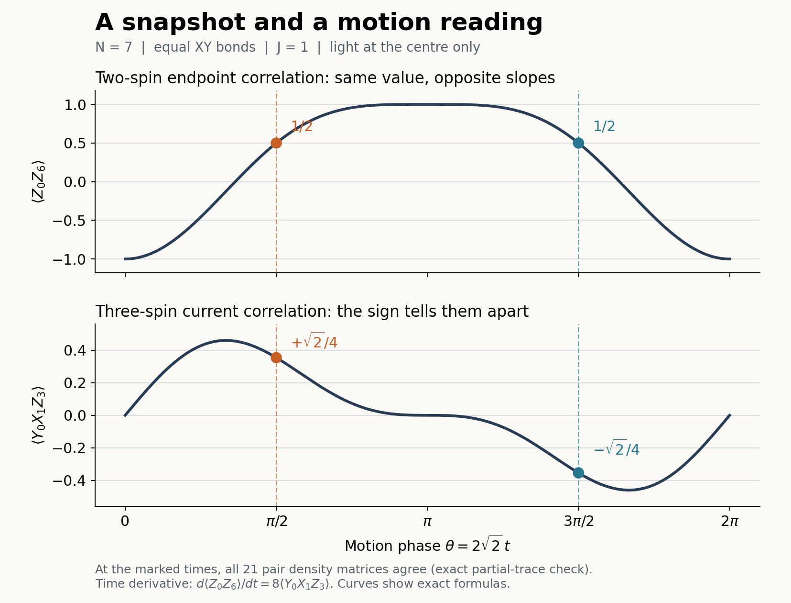

# PROOF: A physical readout of the N=7 missing-phase slow cluster

**Status:** Tier 1 derived, local in the one-end defect at fixed γ > 0.
**Authors:** Thomas Wicht, Codex (OpenAI)
**Typed claim:** [`MissingPhaseSlowReadoutClaim`](../../compute/RCPsiSquared.Diagnostics/Foundation/MissingPhaseSlowReadoutClaim.cs)
**Live exact witness:** [`MissingPhaseSlowReadoutWitness`](../../compute/RCPsiSquared.Diagnostics/Foundation/MissingPhaseSlowReadoutWitness.cs)
**Uniform three-spin check:** [`missing_phase_three_spin_readout.py`](../../simulations/missing_phase_three_spin_readout.py)
**Owning experiment:** [The Motion and the Missing Phase](../../experiments/THE_MOTION_AND_THE_MISSING_PHASE.md)

## What this is about

Seven quantum spins form a chain. Neighbouring spins can exchange an
excitation. In [the project's light picture](../GLOSSARY.md#parameters),
light falls only on the middle spin. This is our way of picturing local
Z-dephasing, with strength γ: phase relationships fade between alternatives
that differ at that spin.

With equal couplings, some patterns of internal motion have a node at the
middle site: their amplitude is zero there, even while the excitation moves
elsewhere. This internal motion stays untouched by the light. Changing one
end coupling slightly reshapes the motion and exposes part of it to the lit
centre. The illumination γ stays fixed, but that part now slowly fades. The
smaller the change, the longer this fading takes.

The equations already tell us that such a slow motion exists. Here we ask
how to see it. We use a starting state built from an excitation shared
between the two ends with opposite signs, coherently combined with its
all-spins-flipped copy. Then we read the two end spins together, comparing
how often their up-or-down outcomes agree or disagree. Their correlation
contains a slowly fading oscillation whose amplitude stays finite as the
coupling change becomes small. Making this contribution longer lived does
not make its starting amplitude disappear.

Other measurements can miss the same contribution. This gives us three
things to keep track of: which motion the dynamics allows, whether our
starting state excites it, and whether the chosen measurement can read it.
That connection is what we want to learn from this small system. Sections
1–3 work through it; the later sections explore the missing signals and give
an exact calculation we can run ourselves.

At equal couplings we can also compare two moments that look identical to
every two-spin measurement. Reading a third spin with a neighbouring pair
reveals opposite internal currents. Following the end correlation over time
gives the same information through its slope. Section 7.1 connects these two
ways of reading motion: a snapshot and a time series.

## Abstract

We connect a slow decay rate to a physical readout in an open seven-spin XY
chain with Z-dephasing of strength γ > 0 only at its centre. The left end
coupling is J₀ = 1+ε and the others are 1. For the coherent end preparation
defined in §1, we project the initial state onto the two conjugate slow
eigenspaces of the internal motion block A, each of dimension two. The
endpoint correlation Z₀Z₆ has a complex residue tending to −1/2, so the corresponding real
oscillation has an amplitude tending to 1 as ε → 0. Its envelope decays on
the already derived scale τ = 1/Δ_A ∼ 2/(γε²).

The same projection explains different outcomes for other readouts. The
leakage residue starts at order ε², and three spin pairs miss this slow
contribution exactly. At equal couplings, every two-spin readout loses the
sine component of this slow contribution while the ideal decoder retains it.
At that uniform point, Y₀X₁Z₃ recovers the sine component; three sites are
minimal for an instantaneous readout before decoding. On the full uniform
trajectory its expectation is one eighth of the time derivative of ⟨Z₀Z₆⟩.
The derivation and exact checks connect these outputs to the prepared state. The result
is local in ε at fixed γ; how it governs the nonlinear distances d_out and
d₂ from a continuing unitary reference at γ = 0 remains a further question.

The named-store search of `docs/ANALYTICAL_FORMULAS.md` returned F70's
partial-trace selection rule, F157's blind seat and F158's two-end count.
`docs/proofs/` returned the [N=7 relaxation proof](PROOF_MISSING_PHASE_RELAXATION_SCALE.md),
the [blind-seat proof](PROOF_BLIND_SEAT_SPAN_AND_NODE_LEMMA.md), and the
[chiral trajectory proof](PROOF_PTF_CHIRAL_MIRROR_RATE_LAW.md).
`experiments/`, including null results and prior hardware flights, returned
the owning preparation and physical maps, the separate N=4 readout problem
in [Route-B virtual readout](../../experiments/ROUTE_B_N4_VIRTUAL_READOUT.md),
and the [price-pair flight](../../experiments/PRICE_PAIR_HARDWARE_PREDICTION.md).
Neither that sweep nor searches of both `simulations/framework/confirmations.py`
and `compute/RCPsiSquared.Core/Confirmations/ConfirmationsRegistry.cs` returned
a hardware confirmation of this N=7 readout. Their price-pair and F120 flights
are other uses of multi-spin correlations, not tests of this residue.
`docs/GLOSSARY.md` supplies the distinctions between blindness, a site and
light content; `docs/CAUGHT_ERRORS.md` supplies the fixed-point preparation
and Riesz-versus-eigenvector warnings. The OpenArcs registry's
`relaxation_scale_as_the_defect_vanishes` is retired for its spectral question
and identifies physical coupling as a separate continuation.

Both typed stores were searched. Core owns
[`F70DeltaNSelectionRulePi2Inheritance`](../../compute/RCPsiSquared.Core/Symmetry/F70DeltaNSelectionRulePi2Inheritance.cs)
and [`ChiralKClaim`](../../compute/RCPsiSquared.Core/Symmetry/ChiralKClaim.cs);
Diagnostics owns
[`MissingPhaseRelaxationScaleClaim`](../../compute/RCPsiSquared.Diagnostics/Foundation/MissingPhaseRelaxationScaleClaim.cs),
its spectral/light witness, and
[`MissingPhaseOnsetWitness`](../../compute/RCPsiSquared.Diagnostics/Foundation/MissingPhaseOnsetWitness.cs).
The adjacency check, including complete reads of the relaxation proof and
owning experiment, joins the former's rank-two Riesz space to the latter's
preparation and physical maps. The other readout and hardware entries do not
own that composition. The new claim has the relaxation claim, F70 and
`ChiralKClaim` as its three direct typed parents. The generic cofactor
derivation belongs to this proof; the live witness reconstructs the uniform
residue, physical maps and leakage derivative described in §8.

## 1. System and physical preparation

Sites are zero-based. Take N = 7, H = Σⱼ Jⱼ(XⱼXⱼ₊₁ + YⱼYⱼ₊₁),
J₀ = r = 1+ε and J₁ = ⋯ = J₅ = 1, with Z-dephasing only at c = 3.
In the one-excitation basis |0⟩,…,|6⟩ the real Hamiltonian hᵣ has zero
diagonal, h₀₁ = h₁₀ = 2r and every other neighbouring hopping equal to 2.
Set

    P_c = |3⟩⟨3|,                 z = I − 2P_c,
    L_A(X) = −i[hᵣ,X] + γ(zXz−X),
    d = (|0⟩−|6⟩)/√2,           A_init = B_init = dd†.

With F = X⊗⁷ and W mapping the two seven-dimensional copies to |j⟩ and
F|j⟩, the prepared physical state is

    |Ψ_init⟩ = (|d⟩+F|d⟩)/√2,
    ρ(t) = ½ W [[A(t),B(t)],[B(t),A(t)]] W†.

The two copies are orthogonal. B evolves under
L_B(X) = −i[hᵣ,X] − γ(zXz+X). F70 removes B from every two-site marginal
because its excitation-number difference is 5. B must still be retained for
the full decoder and for comparisons with the unitary reference.

The relaxation proof owns

    vᵣ = (1,0,−r,0,r,0,−r)ᵀ/√(1+3r²),     P_v = vᵣvᵣ†,
    Kᵣ = −ihᵣ − 2γP_c,
    hᵣvᵣ = 0,                              zvᵣ = vᵣ.

For each fixed γ > 0 there is a neighbourhood of ε = 0 in which the simple
K eigenvalue λ₋ continuing −2√2i and its conjugate λ₊ each embed twice in A.
In a sufficiently small punctured neighbourhood they give its slowest
nonstationary rate,

    Δ_A = −Re λ₋ = (γ/2)ε² + (γ/2)ε³ + O_γ(ε⁴).

The radius need not be uniform in γ. Neither this result nor the readout
below is a claim about the complete 4⁷ Liouvillian or all odd N.

## 2. Project the preparation onto the complete cluster

The decomposition span(vᵣ) ⊕ span(vᵣ)⊥ is preserved separately by hᵣ and z,
so all four operator blocks are L_A-invariant. Let E₋ and E₊ denote the
simple K Riesz projectors at λ₋ and λ₊. The two cross blocks give the full
rank-two A Riesz projection at λ₋:

    ℘₋ᴬ(X) = E₋ X P_v + P_v X E₊†,
    M₋ = ℘₋ᴬ(A_init),                       M₊ = M₋†.

The relaxation proof's complete peripheral census ensures there is no
additional direction in this isolated cluster. Its two exact embeddings
also exclude an internal Jordan term. Thus its trajectory contribution is
e^(λ₋t)M₋ + e^(λ₊t)M₋†, with no polynomial factor in t.
For pᵣ(x) = det(xI−Kᵣ),

    E₋ = adj(λ₋I−Kᵣ)/pᵣ′(λ₋).

This is generally an oblique projector. The orthogonal right/left projectors
used by the spectral witness to read centre light do not project a prepared
state onto its spectral residue.

At r = 1 use the reflection-odd basis bⱼ = (|j⟩−|6−j⟩)/√2, j = 0,1,2.
Write v_* = vᵣ|ᵣ₌₁, avoiding a collision with the prepared d. Then

    v_* = (b₀−b₂)/√2,
    e₊ = (b₀+√2b₁+b₂)/2,      e₋ = (b₀−√2b₁+b₂)/2,
    h₁e₊ = 2√2 e₊,            h₁e₋ = −2√2 e₋,
    d = b₀ = e₊/2 + v_*/√2 + e₋/2.

The preparation therefore gives

    M₋(0) = (e₊v_*† + v_*e₋†)/(2√2),
    ‖M₋(0)‖²_F = 1/4.

Each of the two orthogonal dyads carries coefficient 1/(2√2). Keeping one
dyad is a rank-one mutation of this projection, not an alternative
normalization of the same prepared state.

## 3. Endpoint correlations see an order-one amplitude

For the physical state of §1,

    ⟨Z₀Z₆⟩ = 1 − 2(A₀₀+A₆₆).

The product is unchanged by flipping both spins. Its linear action on a
traceless residue is f_ZZ(M) = −2(M₀₀+M₆₆). Since both diagonal entries of
M₋(0) are 1/8,

    f_ZZ(M₋(0)) = −1/2.

The isolated slow contribution to this expectation value is exactly

    2 Re[f_ZZ(M₋(ε)) e^(λ₋(ε)t)],

with envelope amplitude 2|f_ZZ(M₋(ε))| e^(−Δ_A t). Analyticity of the
isolated Riesz projectors and vᵣ makes the residue analytic in ε. Its nonzero
limit gives a smaller neighbourhood in which it never vanishes, and
2|f_ZZ(M₋(ε))| → 1. This proves the envelope scale for this prepared linear
readout. The complete signal also has a stationary part and other A modes;
the oscillation has zero crossings even when its envelope is nonzero.

The physical X₀X₆ map gives

    f_XX(M) = M₀₆+M₆₀,         f_XX(M₋(0)) = −1/4,

so its paired amplitude tends to 1/2. Single-site Z expectations vanish by
the equal flip copies. The global F expectation is the separate exact
e^(−2γt) phase readout, not this slow motion.

## 4. Complex-linear pair maps and the chiral null pairs

For a complex traceless operator M the physical two-site map is

    s = M_aa + M_bb,            v = (M_ab+M_ba)/2,
    Φ_ab(M) = [[−s/2, 0,   0,   0],
               [0,    s/2, v,   0],
               [0,    v,   s/2, 0],
               [0,    0,   0,  −s/2]].

Tracing the two physical copies gives this complex-linear map. The familiar
v = Re M_ab is valid only after forming a Hermitian contribution or state
difference. Applying that shortcut to one complex residue would destroy
linearity and can fabricate or erase a quadrature.

Let C = diag((−1)ʲ). The zero-diagonal XY hopping gives ChᵣC = −hᵣ and
CP_cC = P_c, hence CKᵣC = conjugate(Kᵣ). For real ε this pairs the simple
branches: E₊ = C conjugate(E₋) C. Since Cd = d and Cvᵣ = vᵣ, with
w = E₋d and a = vᵣᵀd the complete residue is

    M₋ = a(wvᵣᵀ + vᵣwᵀC).

Its odd/odd block is zero because vᵣ has only even-site entries. Its mixed
even/odd cells are antisymmetric. In particular

    Φ₁₃(M₋) = Φ₁₅(M₋) = Φ₃₅(M₋) = 0

exactly throughout the local isolated branch. These three physical pages
miss this whole slow contribution; this says nothing about their other
modes. F70 removes B first, while chirality removes this A residue. These
are distinct cancellations.

## 5. Leakage residue from the endpoint cofactors

Let R|j⟩ = |6−j⟩ and Q_R = (I+R)/2. The experiment's leakage is
Tr(Q_R A), a population outside the original reflection-odd space. Put

    T(x) = x⁴ + 2γx³ + 12x² + 8γx + 16.

Its slow residue is

    Tr(Q_R M₋)
      = 2(1−r²)² T(λ₋)/[(1+3r²)pᵣ′(λ₋)].

Here is a finite polynomial route to the numerator, without an inverse at
a singular root. In D(x) = xI−Kᵣ the diagonal entries are dⱼ = x + 2γδⱼ₃,
and the adjacent entries are t₀ = 2ir, t₁ = ⋯ = t₅ = 2i. Define leading and
trailing continuants

    L₀ = 1,  L₁ = d₀,
    Lₖ₊₁ = dₖLₖ − tₖ₋₁²Lₖ₋₁                 (k = 1,…,6),
    U₇ = 1,  U₆ = d₆,
    Uⱼ = dⱼUⱼ₊₁ − tⱼ²Uⱼ₊₂                   (j = 5,…,0).

Then pᵣ = L₇ = U₀ and the symmetric adjugate entries for i ≤ j are

    adj(D)_ij = (−1)^(i+j) Lᵢ Uⱼ₊₁ ∏ₖ₌ᵢ^(j−1) tₖ.

The empty product is 1. Substitution in the endpoint diagonal entries gives

    adj(D)₀₀ − adj(D)₆₆ = U₁ − L₆ = 4(1−r²)T(x).

For the raw blind vector b = (1,0,−r,0,r,0,−r)ᵀ set y = adj(D)d. Applying
the same entry formula, now retaining both dyads, gives the polynomial
contraction

    Tr[Q_R (dᵀb)/(bᵀb) · (ybᵀ + byᵀC)]
      = 2(1−r²)²T(x)/(1+3r²).

Division by pᵣ′(λ₋) at the simple root proves the residue formula. This
last contraction fixes the normalization of the full rank-two residue;
the endpoint-minor difference alone would not fix its preparation overlap.

At r = 1 and λ_* = −2√2i the relaxation polynomial gives

    p₁′(λ_*) = 512,             T(λ_*) = −16 + 16√2iγ.

Since (1−r²)² = 4ε² + O(ε³), the result is

    Tr(Q_R M₋(ε)) = [(−1+i√2γ)/16] ε² + O_γ(ε³).

The leakage's slow complex amplitude is quadratic even though the endpoint
correlation's amplitude tends to one. Q_R measures a different component of
the same moving residue. This is an expansion in the defect, not the
experiment's short-time expansion of a leakage difference between two runs.

## 6. A derivative route to the leakage coefficient

An independent exact route uses only an eigenvector derivative at the uniform
point. Let u(0) = e₊ and choose e₊ᵀu(ε) = 1. The bordered system

    [[K₁−λ_*I, −e₊], [e₊ᵀ, 0]] [u′, λ′]ᵀ = [−K′e₊, 0]ᵀ,
    K′ = −2i(|0⟩⟨1|+|1⟩⟨0|),

is invertible because λ_* is simple. For rational γ its entries and solution
lie in ℚ(√2,i). At the uniform point K and the preparation's blind energy
vectors give w(0) = E₋(0)d = e₊/2. The reflection-even parts satisfy

    Q_R v′ = −(|0⟩+|6⟩)/4,       Q_R w′ = Q_R u′/2.

Both unperturbed even parts vanish. Since C fixes Q_Rvᵣ, the chiral residue
in §4 gives Tr(Q_RM₋) = 2a vᵣᵀQ_Rw, and its quadratic coefficient is

    (Q_Rv′)ᵀ(Q_Ru′)/√2 = −(u′₀+u′₆)/(4√2).

The bordered solve yields u′₀+u′₆ = √2/4 − iγ/2, recovering
(−1+i√2γ)/16. Terms differentiating a or the scalar coefficient multiplying
u do not contribute, because both even parts start at order ε. This route
checks the leakage germ without recomputing the generic adjugate family.

The live witness first evaluates λ′ = e₊ᵀK′e₊ and solves the equivalent
bordered system with right-hand side (λ′I−K′)e₊ and border column +e₊.
Its extra compatibility multiplier must be zero.

## 7. The decoder retains the missing quadrature

For the uniform residue form its Hermitian quadrature

    C_θ = e^(−iθ)M₋(0) + e^(iθ)M₋(0)†
        = (cos θ/2)(b₀b₀†−b₂b₂†)
          − (i sin θ/2)(b₁v_*†−v_*b₁†).

At cos θ = 0 all diagonals and all symmetric off-diagonal sums vanish.
Every one of the 21 physical two-site maps therefore annihilates C_θ.
The ideal decoder U = ∏ⱼ≠₃ CNOT(3→j), followed by tracing the centre, instead
has the complex-linear map from experiment §8.3:

    D(A,B) = Σᵢ,ⱼ≠₃ A_ij |i⟩_out⟨j| + A₃₃|f⟩_out⟨f|
             + Σⱼ≠₃ (B₃ⱼ|f⟩_out⟨j| + Bⱼ₃|j⟩_out⟨f|).

Here |f⟩_out is the all-ones outer state. Every vector in C_θ has zero
centre component, so D(C_θ,0) preserves its whole nonzero block. In the
three-dimensional blind space its characteristic polynomial is

    x[x²−(cos²θ+sin²θ)/4] = x(x²−1/4).

Thus its eigenvalues are +1/2, −1/2 and zeros, and

    ½‖D(C_θ,0)‖₁ = 1/2

for every θ. C_θ is a traceless operator contribution, not a density
matrix. This isolated uniform-limit norm is not the full d_out between the
historical γ > 0 and γ = 0 runs. The latter subtracts a moving unitary
reference before taking a norm. Likewise d₂ takes norms and then a maximum
over pages. Their nonlinear approach-to-plateau scales remain separate.

### 7.1 Three spins read the direction of motion

The cancellation in §7 is between the two flipped copies. The existing live
witness also checks it directly: removing the flipped copy exposes the sine
quadrature on pair (0,1). The middle spin can supply the missing distinction,
because its Z value has opposite signs in the two copies of the uniform
blind motion. Take the three-spin Pauli product

    O = Y₀X₁Z₃.

For n₀ = (I−Z₀)/2 and the Hamiltonian of §1 at J = 1, the outward bond
current is j₀→₁ = −i[H,n₀] = −(X₀Y₁−Y₀X₁). This is twice the normalized
adjacent-bond [current already used in the repository](../carbon/BENZENE_THREE_DEPHASE_LETTERS.md#y-axis-selected-single-site-model-axis-tier-4-candidate).
Both the current and Z₃ change sign under the global flip. Their product
does not, so its reading adds the two copies instead of cancelling them.
The unconditioned current remains zero.

The residue from §2 gives

    f_O(M₋(0)) = Tr[O · ½W diag(M₋(0),M₋(0))W†] = i√2/8,
    Tr[O · ½W diag(C_θ,C_θ)W†] = sin θ/(2√2).

Thus O reads the uniform sine component and gives zero on the cosine
component. Since every one- or two-spin reduction of C_{π/2} is zero by §7,
three sites are necessary and sufficient for an instantaneous readout of
this component before decoding.

The same distinction occurs between physical states of the original
preparation, not only between traceless operator contributions. At ε = 0 set

    u = (b₀+b₂)/√2,
    d(θ) = (v_* + cos θ · u − i sin θ · b₁)/√2,
    θ = 2√2t,               A(t) = d(θ)d(θ)†,
    B(t) = e^(−2γt) A(t).

Here d(0) = b₀ is the original end preparation. The hopping matrix obeys
i∂ₜd = h₁d, and z d = d, so the centre dephasing leaves A untouched.
The state ρ = ½W[[A,B],[B,A]]W† is a convex mixture of the symmetric and
antisymmetric coherent copies of d, with weights (1±e^(−2γt))/2.
F70 removes B from every two- and three-spin readout because its excitation
number difference is five. For every γ ≥ 0 the full trajectory therefore has

    ⟨O⟩ = sin θ(1+cos θ)/(2√2)
         = sin θ/(2√2) + sin(2θ)/(4√2),
    ⟨Z₃j₀→₁⟩ = 2⟨O⟩,       ⟨Y₀X₁⟩ = 0,
    ⟨Z₀Z₆⟩ = 1 − (1+cos θ)²/2,
    d⟨Z₀Z₆⟩/dt = 8⟨O⟩.

The full O signal contains a second harmonic in addition to the isolated
slow contribution. The slope equality holds on this trajectory with J = 1;
it is not an operator identity for arbitrary states.

At the two positive times t₊ = π/(4√2) and t₋ = 3π/(4√2),
d(t₊) = (v_*−ib₁)/√2 and d(t₋) = (v_*+ib₁)/√2. Their A blocks differ
by 2C_{π/2}. Their B blocks have different decay factors, but are invisible
to all pairs by F70. Hence all 21 pair density matrices agree between these
times, while the three-spin reading changes sign:

| Reading | t₊ | t₋ |
|---|---:|---:|
| ⟨Z₀Z₆⟩ | 1/2 | 1/2 |
| ⟨Y₀X₁⟩ | 0 | 0 |
| ⟨Y₀X₁Z₃⟩ | √2/4 | −√2/4 |



Three spins give an instantaneous reading of this internal-current
correlation; a two-spin time series supplies it through the slope. To read O,
prepare afresh at the chosen time, measure Y on site 0, X on site 1 and Z on
site 3, and average the product of the three outcomes. This does not read
the separately fading phase between the copies: that B phase retains its
five-spin threshold. The minimal-support statement here is at ε = 0; no
finite-defect or all-N minimum is asserted.

## 8. Live reconstruction and controls

From the repository root:

```powershell
dotnet run --project compute/RCPsiSquared.Cli -c Release -- inspect --root missingphasereadout
dotnet test compute/RCPsiSquared.Diagnostics.Tests -c Release --filter FullyQualifiedName~MissingPhase --nologo
```

The live witness uses exact ℚ(√2,i) arithmetic. At N = 7 it reconstructs
both uniform dyads, projects `MissingPhaseOnsetWitness.InitialBlock(7)`,
and reads the endpoint residues −1/2 and −1/4 and squared norm 1/4. Its
physical-copy partial traces compare the pair map on all 21 pairs,
including complex inputs. Its quadrature checks compare exact matrices;
its bordered 8 × 8 solve reconstructs the leakage germ. The CLI's canonical
instance uses γ = 3/10. Equality checks have residual exactly zero, with no
floating tolerance.

The separating controls are physical changes to the tested object:

- Preparing P_v at the uniform point makes the slow residue exactly zero.
- Omitting one dyad changes the endpoint ZZ residue from −1/2 to −1/4.
- Replacing an odd/odd pair by the endpoints breaks the null readout.
- The sine quadrature kills every pair map while the decoder retains norm
  1/2; using Re M_ab on one complex residue fails the linear-map check.

The uniform three-spin consequence in §7.1 has a separate exact
[Python check](../../simulations/missing_phase_three_spin_readout.py), using
SymPy, and a [formula plot](../../simulations/plot_missing_phase_three_spin_readout.py):

```powershell
python simulations/missing_phase_three_spin_readout.py
python simulations/plot_missing_phase_three_spin_readout.py
```

The check writes its [exact results](../../simulations/results/missing_phase_three_spin_readout.json)
and reconstructs the physical states, all 21 pair traces, the Pauli readings
and the full-spin Hamiltonian commutator. It checks positivity by the explicit
convex decomposition and removes or changes the centre tag to separate the
readings. The plot draws the derived formulas. This three-spin calculation
is separate from the C# live witness described above.

The proof owns the local analytic quantifiers, the chiral branch identity
and the generic cofactor formula. The live checks reconstruct exact finite
objects and the derivative coefficient; they do not compute a generic
symbolic adjugate family or certify a finite ε interval. The original
spectral arc remains retired. All-odd-N
extensions, γ-uniform neighbourhood control and the nonlinear d_out/d₂
lifetimes remain outside this result.
