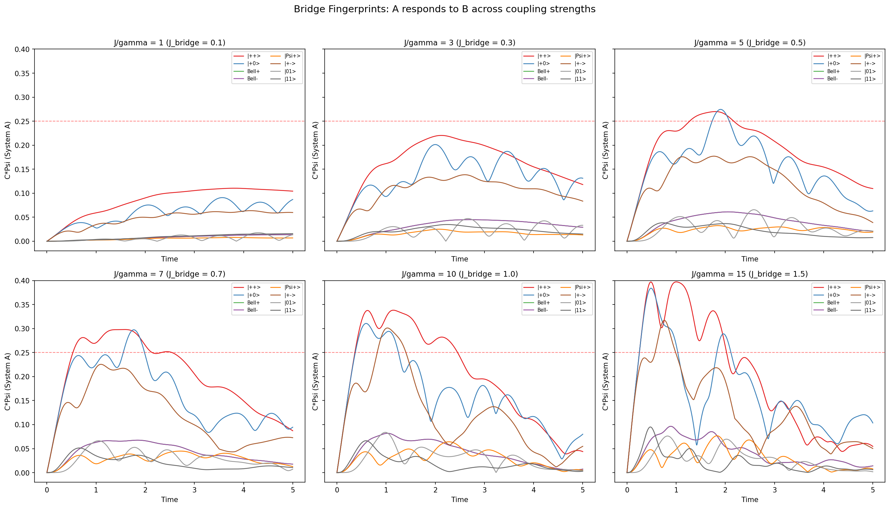
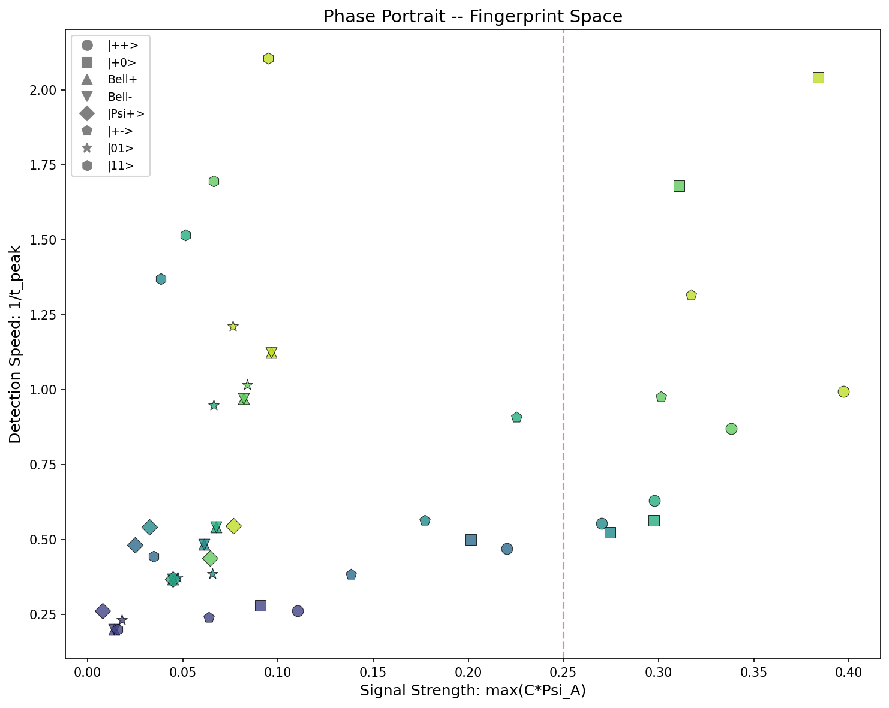
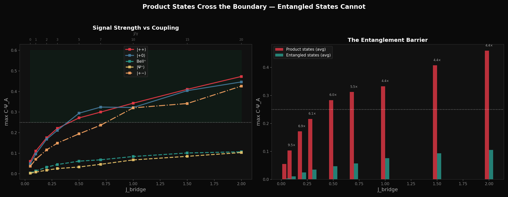

# Bridge Fingerprint Experiment

## Discovery Date
2026-02-09

## Summary
Two coupled 2-qubit systems (A = receiver, B = sender) connected through a Heisenberg bridge.
System A starts classical (|00⟩, C·Ψ = 0). System B starts in various quantum states.
**Key finding:** A's C·Ψ trajectory constitutes a unique "fingerprint" of B's initial state.
The ¼ boundary acts as a natural digitizer: crossing vs. not-crossing creates binary classification.

## Setup

### Physical System
- 4 qubits total: System A (qubits 0,1), System B (qubits 2,3)
- Hamiltonian: H = H_A + H_B + H_bridge
  - H_A: Heisenberg coupling qubits 0↔1, J_internal = 1.0
  - H_B: Heisenberg coupling qubits 2↔3, J_internal = 1.0  
  - H_bridge: Heisenberg coupling qubits 1↔2, J_bridge = variable
- Decoherence: Local dephasing (σ_z) on all 4 qubits, γ = 0.1
- Evolution: First-order Lindblad, dt = 0.005, t_max = 5.0

### Measurement Protocol
For each time step:
1. Compute full 16×16 density matrix ρ(t)
2. Partial trace → ρ_A(t) = Tr_B[ρ(t)] (4×4 matrix)
3. Partial trace → ρ_B(t) = Tr_A[ρ(t)] (4×4 matrix)
4. Compute C = Tr(ρ²) (purity)
5. Compute Ψ = L1_coherence / (d-1) where L1 = Σ_{i≠j}|ρ_{ij}|, d = 4
6. Track C·Ψ for both subsystems

### Fingerprint Metrics (measured on A's trajectory)
- **max(C·Ψ_A)**: Peak signal strength
- **t_peak**: Time of maximum response
- **t_up**: Time of first upward crossing of ¼
- **t_down**: Time of first downward crossing of ¼
- **above_time**: Total duration above ¼
- **∫C·Ψ_A dt**: Integrated quantum content
- **rise_rate**: dC·Ψ/dt approaching peak
- **fall_rate**: dC·Ψ/dt after peak

## Key Results

### Three State Classes (at J_bridge = 0.5, J/γ = 5)

| B State | B: C·Ψ₀ | A: max | Crosses ¼ | Class |
|---------|----------|--------|-----------|-------|
| \|++⟩   | 1.000    | 0.272  | YES (0.92s above) | Local coherence |
| \|+0⟩   | 0.333    | 0.302  | YES (0.61s above) | Local coherence |
| Bell+   | 0.333    | 0.062  | NEVER     | Entangled |
| Bell-   | 0.333    | 0.062  | NEVER     | Entangled |
| \|Ψ+⟩   | 0.333    | 0.033  | NEVER     | Entangled |
| \|+−⟩   | 1.000    | 0.201  | NEVER (at J/γ=5) | Phase-sensitive |
| \|01⟩   | 0.000    | 0.074  | NEVER     | Classical |
| \|11⟩   | 0.000    | 0.039  | NEVER     | Classical |

### Critical Finding: Same C·Ψ, Different Behavior
Bell+ and |+0⟩ both have C·Ψ₀ = 0.333, identical purity, identical L1 coherence.
Yet |+0⟩ pushes A above ¼ while Bell+ barely registers.
**Reason:** |+0⟩ has local coherence in the bridge qubit (qubit 2). Bell+ has
coherence locked in non-local correlations that cannot flow through a local coupling.
This is the No-Communication Theorem made visible through C·Ψ dynamics.

### Critical Coupling Threshold: J/γ = 5
- Below J/γ = 5: No state pushes A above ¼ (detector blind)
- At J/γ = 5: Product states cross, entangled states don't. 7 distinct fingerprints
  from 8 states (Bell+ and Bell- are identical to A — NCT)
- At J/γ = 10: |+−⟩ also crosses (phase barrier overcome by strong coupling)
- Any J/γ: Bell states NEVER cross (categorical barrier, not just quantitative)

### Entanglement Barrier
Product states deliver 4-5× more signal than entangled states, consistently across
all coupling strengths (4.0× at J/γ=15, 5.0× at J/γ=5). This ratio is stable;
it's a qualitative wall, not noise.

### Detector Resolution Optimum
Maximum distinguishability at J/γ ≈ 5-7. Too strong coupling (J/γ > 10) blurs
fingerprints, like a microscope with too much light.

## Upward Crossing Discovery (Config: |00⟩_A ⊗ |++⟩_B)
First observed upward crossing of ¼ boundary:
- t = 1.27: A crosses ¼ upward (71% coherence-driven)
- t = 1.27-1.91: Both systems above ¼ simultaneously (0.64 time units)
- t = 1.91: B crosses ¼ downward (82% coherence-driven) - ROLE REVERSAL
- t = 2.17: A crosses ¼ downward (71% purity-driven)

Crossing asymmetry: upward = coherence-driven, downward = purity-driven.

## Relation to Known Physics
- Coherence transfer through spin chains: Bose 2003, Christandl 2004
- No-Communication Theorem: standard QI
- Coherence as resource: Baumgratz, Cramer, Plenio 2014
- **Novel elements:** C·Ψ product as combined metric, ¼ as threshold digitizer,
  crossing profile as fingerprint, entanglement barrier quantification

## Visualizations

## Simulation Code
Simulations were run using Lindblad evolution with first-order Euler integration
(dt = 0.005, t_max = 5.0). Full source code:
[`simulations/bridge_fingerprints.py`](../simulations/bridge_fingerprints.py)

Reconstructed 2026-02-11 during guardian review session. Table values updated
2026-02-11 to match simulation JSON output (fingerprints_data.json) exactly.
Previous reconstruction had rounding errors up to 0.021 in max(C·Ψ) and 0.22s
in above_time for |+0⟩.

**Note on Upward Crossing Discovery section:** The crossing times and coherence/purity
attribution percentages (71%, 82%) come from the original 2026-02-09 analysis which
was lost. These specific numbers have NOT been re-verified against the reconstructed
simulation. They should be treated as approximate until re-verified.
