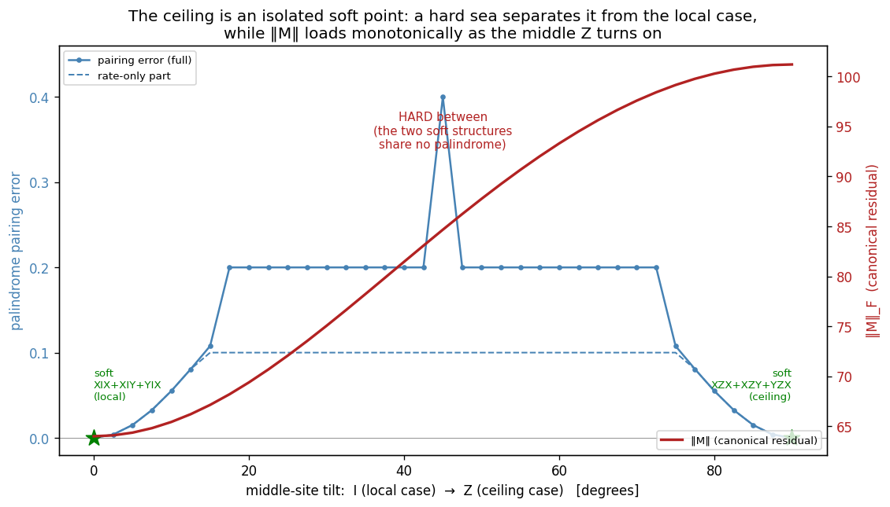

# The Four Non-Local Cases: the palindrome ceiling, narrowed to two

**Date:** 2026-06-06 (updated 2026-06-07: the 4 → 2 step, two more turned out local; updated 2026-06-10:
the 2 → 0 step, the last two route after all)
**Status:** the routing is constructively verified; the arc is closed at zero. The pair this writeup
narrowed the ceiling to turned out local on 2026-06-10: the period-4 golden router palindromizes both
Z-middle cases ([PROOF_CEILING_GOLDEN_ROUTER](../docs/proofs/PROOF_CEILING_GOLDEN_ROUTER.md), F116).
**Scripts:** [`simulations/ceiling_6to4_verification.py`](../simulations/ceiling_6to4_verification.py)
(the 6 → 4 step), [`simulations/ceiling_4to2_iheavy_local.py`](../simulations/ceiling_4to2_iheavy_local.py)
(the 4 → 2 step), [`simulations/ceiling_golden_router.py`](../simulations/ceiling_golden_router.py)
(the 2 → 0 step)

> **Update, the arc is 6 → 4 → 2.** This writeup keeps its title (the historical four), but the count has
> moved on twice. The first correction found two of an original six were local (XIX+XIY+YIX, YIY+XIY+YIX,
> routed by a continuous-uniform per-site map). The second correction, recorded here, finds two of the four
> are local as well, in exactly the same spirit: the I-heavy pair IXI+IIY+YII and IYI+IIX+XII palindromize
> through a constructive single-site-field route. That leaves the two genuine non-local cases, the Z-middle
> pair XZX+XZY+YZX and YZY+XZY+YZX. So the real ceiling as of 2026-06-07 was two, and the sections below
> carry both corrections in order.

> **Update, the arc is 6 → 4 → 2 → 0 (2026-06-10).** A third correction closes the arc, in exactly the
> spirit of the first two. The Z-middle pair, called the genuine non-local ceiling throughout this writeup,
> is palindromized by a per-site product after all: the period-4 **golden router**, per-site class-swap maps
> built in the golden frame a = φX + Y, b = X − φY, pattern [a, a, b, b] down the chain, satisfying
> W L W⁻¹ = −L − 2σ exactly at every N ≥ 3 with arbitrary site-dependent rates. The mechanism is a
> window-summed cancellation (the three templates cancel against each other inside each window; per term
> they do not), which is precisely what the per-term, uniform-continuous, and discrete-Klein lenses below
> could not see. The proof, with the exclusion side that vindicates the old evidence (no uniform router, no
> period-2 router, the Klein candidates locus-excluded, all now theorems), is
> [PROOF_CEILING_GOLDEN_ROUTER](../docs/proofs/PROOF_CEILING_GOLDEN_ROUTER.md); the anchor is
> [`simulations/ceiling_golden_router.py`](../simulations/ceiling_golden_router.py). The sections below keep
> their historical wording where it reads as dated narrative, with in-place corrections where a sentence
> asserted the non-locality as a present fact.

## The correction: six were really four

We had a ceiling, and the ceiling was too high. For a while the certifier's story ended with six k-body
term-sets that no per-site product Q could palindromize, the cases where the mirror is only ever an
entangled, non-local Π. Six "non-local" sets, neatly named XZX+XZY+YZX and its siblings. The trouble is
that the count was read off the wrong test. Two of the six were never given the chance the others got.

So we gave all six the same chance, under one reliable test: the complete uniform-continuous per-site map
family. Concretely, a 16-real-parameter palindrome objective, Q = M^⊗N built from a single 4×4 site map M,
scored by the residual ‖Q L Q⁻¹ −(−L−2σ)‖ relative to its target, and minimized over many restarts. Run
against all six candidate sets, the verdict splits 2 and 4. Two route: their residual falls to ≈8×10⁻¹⁴
with an invertible M, and it stays there at N=3, 4, 5. Four resist: the best the optimizer can manage is
bounded well away from zero (0.576 and 0.814, depending on the case).

The reason the split is trustworthy is that the optimizer is demonstrably capable of finding the routers
when they exist. It found the two. The same search, run on the four, simply cannot drive the residual
down; the floor is the structure pushing back, not the optimizer giving up. At this step the ceiling stood
at four, not six. (That four would later drop again to two, once a second, non-uniform route was tried on
the I-heavy pair; the uniform search here cannot see it. See "The four, on a second look" below.)

## The two that are local: XIX+XIY+YIX, YIY+XIY+YIX

What hid these two from the earlier count is that they route in a way the per-term test could not see. The
per-term routing strategy (Stufe B) asks for a single per-site Q that palindromizes every term on its own.
These two do not satisfy that; no fixed Klein router works term by term. They satisfy something weaker and
quieter: the continuous-sum cancellation {M^⊗k, Σ_terms [T, ·]_k} = 0. The router only has to balance the
whole sum of commutators, not each one, and a continuous map can thread that needle where a per-term map
cannot. This is why they also fail the discrete {P1, P4, M2} routers outright (residual ≈1.15): the
discrete Klein elements act per term, and per term there is nothing clean to grab.

So these are local, with no caveat: a per-site product Q palindromizes them, verified at N=3, 4, and 5.
But they are local in an awkward register. The routers the optimizer lands on are arbitrary continuous
maps; they are not order-4, and they differ from case to case. That makes them poor citizens for a clean
"addable" certifier, which wants a small fixed alphabet of routers, not a bespoke continuous map per
Hamiltonian. The honest reading is that their absence from the earlier list was a coverage gap, not a
discovery about them: the per-term lens was blind to continuous-sum routing. Fill the gap and they fall
out of the non-local class. They were never non-local; they were unseen.

## The four, on a second look: two local, two genuinely not

The original list of four was XZX+XZY+YZX, YZY+XZY+YZX, IXI+IIY+YII, IYI+IIX+XII. A closer look splits it
again. Two of the four, the I-heavy pair IXI+IIY+YII and IYI+IIX+XII, turned out LOCAL, by a constructive
route the first pass missed; the next subsection makes that explicit and corrects the obstruction reading
it had picked up. The other two, the Z-middle pair XZX+XZY+YZX and YZY+XZY+YZX, looked like the genuine
non-local cases: no per-site product Q in any family we could reliably close at the time. (Superseded
2026-06-10: they admit one after all, the period-4 golden router, outside every family tested here; see
[PROOF_CEILING_GOLDEN_ROUTER](../docs/proofs/PROOF_CEILING_GOLDEN_ROUTER.md).) The
uniform-continuous search leaves them bounded away from a palindrome, and the discrete-periodic Klein
routers miss them too; both exclusions are now theorems. What is interesting is not only that they resist
these families but how they resist; the obstruction has a clean mechanism, described after the I-heavy
correction.

### The two that are local after all: IXI+IIY+YII, IYI+IIX+XII (the 4 → 2 step)

The first pass read the I-heavy pair as non-local, with a "per-site sector overload" obstruction and a
joint floor near 0.47, "a single product map cannot turn both at once." That is true of the UNIFORM map,
the one the 16-parameter search above optimizes, where a single 4×4 site map M is repeated on every site.
But it is not the last word, because the I-heavy pair does not need a uniform map. It needs a SITE-VARYING
per-site product, and that exists in closed form.

Here is why. Summed over the windows of an N-chain, each I-heavy term-set is a sum of weight-1 transverse
fields: the chain Hamiltonian is H = Σ_i (a_i X_i + b_i Y_i), a little transverse field a_i X_i + b_i Y_i
sitting on each site. Single-site Pauli operators on different sites commute, so the Liouvillian splits as
a sum L = Σ_i L_i over commuting single-site pieces, one per site. Now each single-site transverse field is
something we already know how to palindromize: rotate it about the Z axis until it points along X (an
R_z-rotation, which leaves the Z-dephasing untouched because R_z commutes with Z), and it becomes a plain
single-site X-field, whose Liouvillian spectrum {0, −2γ, −γ ± 2i} is a clean palindrome about the centre
−γ. Call the resulting per-site map M_i (it carries its own rotation angle θ_i = atan2(b_i, a_i), so it is
genuinely site-varying, different on each site). The product Q = ⊗_i M_i then palindromizes the whole
chain at once, because the chain is just the commuting sum of pieces each M_i handles. The construction is
explicit, it is N-independent, and it checks to machine precision (residual ~1e-14) at N=4, 5, and 6
([`simulations/ceiling_4to2_iheavy_local.py`](../simulations/ceiling_4to2_iheavy_local.py)). In C# the
`SingleSiteField` strategy carries exactly this certificate.

The 0.47 floor was therefore the floor of the wrong family. It is real for the uniform map (one M repeated
everywhere genuinely cannot turn two sectors at once), but the I-heavy pair was never asking for a uniform
map; a product of distinct single-site crossover maps clears it cleanly. This is the same shape of
correction as the 6 → 4 step: a coverage gap, not a fact about the Hamiltonians. The per-term and uniform
lenses were blind to the site-varying single-site route, and once it is supplied the I-heavy pair falls out
of the non-local class. They were local all along.

One guardrail is worth stating, because it is what makes the certificate sound rather than greedy. The
locality is specific to TRANSVERSE fields. A single-site X or Y field is soft, its spectrum
{0, −2γ, −γ ± 2i} palindromic about −γ; but a single-site Z (longitudinal) field is HARD, its spectrum
{0, 0, −2γ ± 2i} leaving the 0 eigenvalue with no partner about −γ. So the route certifies a sum of
transverse single-site fields and pointedly excludes Z. The I-heavy pair is all-transverse, which is
exactly why it qualifies.

### The two that are not: XZX+XZY+YZX, YZY+XZY+YZX

The Z-middle pair was the last ceiling standing: no per-site product Q in any family we could reliably
close, and the way it resists those families has a clean mechanism. (Superseded 2026-06-10: a per-site
product Q does exist, the period-4 golden router of
[PROOF_CEILING_GOLDEN_ROUTER](../docs/proofs/PROOF_CEILING_GOLDEN_ROUTER.md). What this section
establishes remains true of the families it tested, and the mechanism below is real; it is the floor of
the uniform family, not of all per-site products.)

The cleanest way to see the obstruction is the F1 / F1² lens. The canonical residual M = Π L Π⁻¹ + L + 2σ
is anti-Hermitian everywhere it does not vanish. Anti-Hermitian means a rotation: to undo it, a per-site
map has to supply an angle, not a reflection, and the question becomes whether one product map carries
enough of the right angle to cancel it. Splitting M by its behaviour under Π² (the Π²-even sector is real,
the Π²-odd sector complex) is what exposes where the angle runs out.

For the Z-middle pair, XZX+XZY+YZX and YZY+XZY+YZX, the residual M carries an extra rotation that the
routable cases never have. On top of the Π²-odd (complex) rotation that the local cases route, the
Z-middle cases pick up an additional Π²-even (real) rotation. The best uniform per-site map can clear the
Π²-even sector cleanly, but once it is spent on that, the Π²-odd sector still holds a floor of about
0.30 that no uniform per-site map can reach. That floor is real for the uniform family, and since
2026-06-10 provably so (the uniform emptiness is a theorem,
[PROOF_CEILING_GOLDEN_ROUTER §4](../docs/proofs/PROOF_CEILING_GOLDEN_ROUTER.md)); a site-varying period-4
product clears it. The Z in the middle is not a spectator; it loads a second rotation into the residual,
and a single repeated map cannot turn both at once.

(The I-heavy pair shows a different, milder pattern under the same UNIFORM lens: each Π²-sector is
individually clearable but not both at once for a single repeated map, a per-site sector overload with a
joint floor near 0.47. That floor is real for the uniform map, but it is not the ceiling it once looked
like; the site-varying single-site-field route above clears the I-heavy pair outright, which is why they
are local and only the Z-middle pair remains here.)

So for the Z-middle pair the uniform-lens conclusion stands as a statement about the uniform family: one
repeated site map does not have the freedom the loaded second rotation needs. The further claim this
section first drew, that their palindrome exists only as an entangled, non-local Π, fell on 2026-06-10:
a site-varying per-site product, the period-4 golden router, carries exactly the freedom the uniform map
lacks ([PROOF_CEILING_GOLDEN_ROUTER](../docs/proofs/PROOF_CEILING_GOLDEN_ROUTER.md)).

### The obstruction is in the joining, not the part (2026-06-08)

The picture above pins the obstruction on the Z-middle's extra Π²-even rotation, the second turn a single
repeated map cannot also make. A sharper question is which of the two Π²-sectors is the hard one, the Π²-odd
rotation the local cases route or the extra Π²-even one. We split the ceiling set along that seam and
certified each sector on its own, and the answer was neither.

The Π²-odd half is the single term XZX. On its own it is local: a per-site product palindromizes it,
certified by the linear site-colouring route. The Π²-even half is the pair XZY+YZX. On its own it is local
too: a per-site product palindromizes it, certified by the excitation-pairing route (the per-part certifier
verdicts are tabled in [ceiling_parts_certify.md](../simulations/results/ceiling_parts_certify.md)). Each half, alone, is
per-site routable with no caveat. It is only their sum, the full XZX+XZY+YZX, that resisted; at the time we
read that as "admits no per-site product at all" (superseded 2026-06-10: the period-4 golden router routes
the sum, while routing neither half alone). (Every piece stays spectrally soft throughout; the split is a
statement about the routing operator, not the spectrum, which mirrors cleanly in each part.)

So the hardness of routing is not hiding in one sector; it is born in the joining. Each sector routes, but
by a different per-site rule: the Π²-odd half wants a site-colouring map, the Π²-even half wants an
excitation-pairing map, and those are different per-site structures. A product Q is one per-site rule run
down the chain; we concluded it can be one of the two routers, not both. That inference died on 2026-06-10:
a product is one per-site rule, but the rule does not have to serve either half. The period-4 golden router
serves the sum while routing neither half alone, by cross-template cancellation inside each window
([PROOF_CEILING_GOLDEN_ROUTER §2](../docs/proofs/PROOF_CEILING_GOLDEN_ROUTER.md)). What the
uniform-continuous search witnesses is narrower and still true: across the whole 16-parameter uniform
family there is no common map, and the residual rests at the ~0.30 floor, the gap between serving one
router and serving both. This refines the uniform-lens reading above: it is not that one sector resists
clearing, each clears alone; it is that no single uniform map Q clears both.

This sharpened the banked all-Q question without closing it. "The floor holds for every Q" became a
statement about two sets: the per-site Q's that route the Π²-odd half and the per-site Q's that route the
Π²-even half have empty intersection. The optimization was the numerical witness of that emptiness.
(Answered 2026-06-10: the intersection IS empty for those two families, the golden router itself routes
neither half alone, but emptiness of the intersection never implied non-locality of the sum. A third
per-site structure, the period-4 golden router, routes the whole directly, so the inference from
conflicting per-half routers to a whole-chain-only mirror died, and with it the banked all-Q obstruction:
there is no obstruction. See [PROOF_CEILING_GOLDEN_ROUTER](../docs/proofs/PROOF_CEILING_GOLDEN_ROUTER.md).)
The shape of the conflict stays plain and true: the Z-middle pair is two individually-routable structures
whose per-site routers conflict; the mirror they share simply turned out to be a per-site product neither
half asks for.

One honest note on the instrument. The soft-certifier is one-sided: a certificate proves local, but its
silence proves nothing. It returns NotCertified for the Z-middle ceiling, and it returns
NotCertified just the same for the known-local XIX+XIY+YIX, whose continuous-uniform router its scalable
strategies do not see. So the load-bearing result here is the positive one, that the two halves certify.
(The one-sidedness was vindicated on 2026-06-10: the Z-middle NotCertified was indeed a coverage gap, the
whole routes via the period-4 golden router, and the uniform-continuous floor above bounds only the
uniform family, now provably, since the uniform emptiness is a theorem in
[PROOF_CEILING_GOLDEN_ROUTER](../docs/proofs/PROOF_CEILING_GOLDEN_ROUTER.md).)

### The same two sectors, read in Frobenius: F81 and F83 (2026-06-08)

The joining is one lens on the two sectors, the routing one: each wants a different per-site map. There is a
second lens on exactly the same pair, one the framework already typed and hardware-confirmed.
[F81](../docs/proofs/PROOF_F81_PI_CONJUGATION_OF_M.md) decomposes the canonical residual M = Π·L·Π⁻¹ + L + 2σ
into a Π-symmetric and a Π-antisymmetric part, Frobenius-orthogonal, so ‖M‖² = ‖M_sym‖² + ‖M_anti‖². The
antisymmetric part is exactly the Π²-odd Hamiltonian commutator, M_anti = L_{H_odd}, and for the ceiling H_odd
is the single Π²-odd term, XZX (or YZY for the sibling case). So the two Π²-sectors of the joining ARE the F81
split: M_anti the Π²-odd half, M_sym the Π²-even half together with the dissipator.

Computed in C# from the built tools (PalindromeResidual and PiOperator) for the k=3 ceiling, both cases give
the same numbers: ‖M‖² = 10240, ‖M_sym‖² = 9216, ‖M_anti‖² = 1024. The Π²-odd half, the floor-carrier, is
exactly one tenth of M. That is the F83 anti-fraction ‖M_anti‖²/‖M‖² = 1/10, sitting on F83's closed form
anti-fraction = 1/(2 + 4r) at r = ‖H_even_nontruly‖²/‖H_odd‖² = 2 (the ceiling carries one Π²-odd term against
two Π²-even ones). On that ladder r = 0 gives 1/2 (pure Π²-odd), r = 1 gives 1/6, r → ∞ gives 0; the ceiling
sits at r = 2, one tenth.

This is a recognition, not a new mechanism. The two-sector structure we found by routing is the same structure F83
reads off as a Frobenius fingerprint, and F83 is the hardware-confirmed one (the four-Hamiltonian Π²-class
discriminator on Marrakesh and Kingston, per the PROOF_F81 hardware note). The routing lens says the two
sectors need incompatible maps; the Frobenius lens weighs them, nine tenths symmetric to one tenth
antisymmetric, and ties the ceiling to a quantity the hardware has actually measured. Two readings of one pair
of sectors.

### The ceiling is an isolated soft point: a hard sea in between (2026-06-09)

The joining picture begs one more question: if the local soft case and the ceiling soft case each mirror
cleanly, can you walk from one to the other without losing the mirror? Turn the middle site's letter
continuously from I to Z,

  H(θ) = cos θ · (XIX + XIY + YIX) + sin θ · (XZX + XZY + YZX),

which is exactly the middle-site operator cos θ·I + sin θ·Z inside each term (the two term triples pair up
one to one: XIX ↔ XZX, XIY ↔ XZY, YIX ↔ YZX), and classify every 2.5° waypoint at γ = 0.05 per site.

The answer is no, and not narrowly. Softness survives at exactly two angles, 0° and 90°; all 35 interior
angles are hard. And the strait has a remarkably clean depth: in the optimal (minimax) pairing of spec(L)
against −spec(L) − 2σ, the break sits at **exactly one dephasing-rate quantum, 2γ = 0.1, at every interior
angle**, a flat hard sea from 2.5° through 87.5°. The moment the middle letter starts to turn, some
eigenvalue's mirror partner is a full rate step off, and it stays exactly one step off until the other shore.
Meanwhile the canonical residual loads smoothly and monotonically underneath, ‖M‖² rising 4096 → 10240, the
same two endpoint values the F81/F83 section above weighs (the figure's right axis, ‖M‖ = 64 → 101.2).

So the two soft structures are not two ends of one soft family. Each is its own island, and this is the
spectral twin of the routing statement (restated 2026-06-10, after the golden router): both endpoints HAVE
per-site routers, the continuous-uniform map at 0° and the period-4 golden router at 90°, but they are
different per-site structures, and no per-site router serves the interior mixtures; the witness is at the
spectrum level, where even the palindrome itself (a strictly weaker ask than a per-site router) is already
gone at every interior angle.

Provenance, honestly: the sweep was first run 2026-06-08 by an ad-hoc script that was not preserved; only
the data survived ([TSV](../simulations/results/ceiling_middle_tilt.tsv),
[figure](../simulations/results/ceiling_middle_tilt.png)). The committed regenerator
[`simulations/ceiling_middle_tilt.py`](../simulations/ceiling_middle_tilt.py) re-derives it and is the
reproducible record: verdicts match the original 37/37, the residual-norm column matches row by row
(rel < 1e-5, the original column is 2√2 × the framework residual convention), and the original's smooth
small-angle pairing-error statistic (an unrecorded ad-hoc measure, the figure's left axis) is replaced by
the canonical minimax pairing, under which the interior break is the constant 2γ wall above
([regenerated TSV](../simulations/results/ceiling_middle_tilt_regen.tsv)).

## The explicit frontier (no hidden bottom)

A word on what "non-local" meant here, because it was a bounded claim and we wanted the boundary visible. For
the two Z-middle cases that remained, non-local meant: admits no per-site product Q in the reliably-testable
families. That is two families, both of which we can actually close by optimization, the uniform-continuous
family (the complete 16-parameter one above) and the discrete-periodic Klein routers. Across both, the
Z-middle pair is bounded away from a palindrome. (The I-heavy pair, by contrast, is now closed on the
constructive side: a site-varying single-site-field product palindromizes it outright, so it carries no
frontier asterisk at all.)

There is one family we deliberately did not claim to have closed for the Z-middle pair: the
continuous-periodic maps, period-2 and higher, where M itself varies from site to site. That objective is
32-dimensional and globally non-convex, and an optimizer that fails to find a router there has not proven
one absent; it has only failed to find one. So we named it rather than absorbed it. The continuous-periodic
family was the explicit open frontier of the Z-middle non-locality, a visible edge, not a hidden trap.
(Closed 2026-06-10, and positively: "an optimizer that fails to find a router there has not proven one
absent" turned out to be the operative sentence of this experiment. The router exists inside exactly this
named family, at period 4, the golden router of
[PROOF_CEILING_GOLDEN_ROUTER](../docs/proofs/PROOF_CEILING_GOLDEN_ROUTER.md); period 2 is empty, period 3
impossible for N ≥ 5, and the uniform floor above all upgraded from optimization evidence to theorems by
the same identity-column algebra. The frontier discipline is vindicated, in the direction nobody
expected.)
By contrast the local cases carried no such asterisk: the XIX/YIY pair routes in the uniform-continuous
family outright, and the I-heavy pair routes by the constructive single-site-field product, both
definitively local.

Beyond even that frontier sat the harder question we were not attempting here: the analytic all-Q
obstruction, a proof of why the Z-middle floor holds for every Q, of any family, periodic or not. That was
the banked hard problem; we referenced it without opening it. (Resolved negatively 2026-06-10: there is no
all-Q obstruction, because there is a Q; the golden router is it. The banked problem dissolves rather than
closes; see [PROOF_CEILING_GOLDEN_ROUTER](../docs/proofs/PROOF_CEILING_GOLDEN_ROUTER.md).) (One tempting certifier shortcut is ruled out
as a null result, banked from a 2026-06-05 scout since removed: a Pauli string K that GF(2)-anticommutes
with H exists for hard pairs too, e.g. XYI+YIX admits K = XXX-type strings, so Pauli-string anticommutation
with H is not a softness criterion; a K with X or Y letters flips A but fixes the dephaser Q, producing
−A + γQ rather than −M, an incomplete premise.) What this experiment establishes is the
constructive half, told honestly: across the 6 → 4 → 2 arc, four route and are local (two by continuous-sum
cancellation, two by the single-site-field product), and the two Z-middle cases resist over every test we
can trust; the line between "verified" and "open" is drawn exactly where the optimization stops being
reliable. (Seen again 2026-06-10: the line was drawn in the right place. The router lived exactly on the
far side of it, inside the named continuous-periodic family, and the arc completes as 6 → 4 → 2 → 0.)

## Links
- The 2 → 0 step (the golden router, F116): [PROOF_CEILING_GOLDEN_ROUTER](../docs/proofs/PROOF_CEILING_GOLDEN_ROUTER.md), anchor [`simulations/ceiling_golden_router.py`](../simulations/ceiling_golden_router.py)
- Mechanism + classification: [PROOF_F103 §7.12](../docs/proofs/PROOF_F103_F87_Z2_CUBED_REFINEMENT.md) (the single-site transverse-field lemma)
- The certifier + the Z-middle cases (NotCertified there: a per-term coverage gap, per the golden router proof): `compute/RCPsiSquared.Diagnostics/F87/PalindromeSoftCertifier.cs` (the `SingleSiteField` strategy), `PalindromeSoftCertifierClaim.cs`, `KBodyPalindromeRouting.cs`
- The 4 → 2 verification: [`simulations/ceiling_4to2_iheavy_local.py`](../simulations/ceiling_4to2_iheavy_local.py)
- The per-part certifier table: [`simulations/results/ceiling_parts_certify.md`](../simulations/results/ceiling_parts_certify.md)
- The isolated-soft-point tilt: [`simulations/ceiling_middle_tilt.py`](../simulations/ceiling_middle_tilt.py) (regenerator), [data](../simulations/results/ceiling_middle_tilt.tsv), [figure](../simulations/results/ceiling_middle_tilt.png)
- Related: [SOFTNESS_IS_N_DEPENDENT](SOFTNESS_IS_N_DEPENDENT.md)
