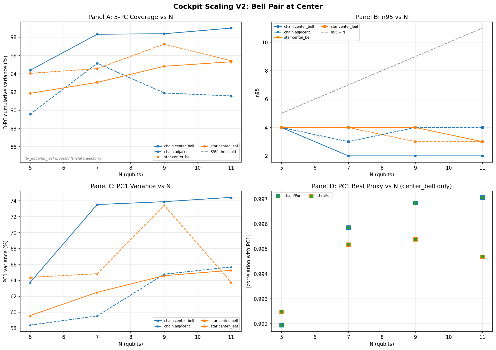

# Cockpit Scaling: Bell Pair Observers from N=5 to N=11

**Date:** April 7, 2026
**Status:** Complete (chain and star, N=5 through N=11)
**Scripts:**
[cockpit_scaling_analysis_v1.py](../simulations/cockpit_scaling_analysis_v1.py),
[Program.cs cockpit mode](../compute/RCPsiSquared.Propagate/Program.cs)
**Predecessors:**
[COCKPIT_UNIVERSALITY](COCKPIT_UNIVERSALITY.md) (the N=2-5 baseline that this document extends),
[Homework 7: Cockpit Scaling](../ClaudeTasks/homework/20260405/07_COCKPIT_SCALING.md) (the original brief)

---

## What this document is about

The cockpit framework introduced in [COCKPIT_UNIVERSALITY](COCKPIT_UNIVERSALITY.md) showed that for small Heisenberg systems (N=2 to 5), three observables capture 88 to 96 percent of the decoherence trajectory variance. The natural follow-up question is whether this still works when the system gets bigger. If the framework is going to be useful for real hardware monitoring, it needs to survive the jump from toy systems to systems with at least ten qubits.

This document extends the test to N=7, 9, and 11 using the C# matrix-free propagation engine, which can handle these sizes where the Python pipeline runs out of memory. We test two topologies (Heisenberg chain and star), with the Bell pair always placed on the two central qubits so that the observed pair is the same physical object regardless of system size. The result is that the cockpit framework scales, but not in the way the small-N baseline would have predicted.

The scaling behavior is governed by a physical effect that does not appear at N=5: Entanglement Sudden Death. When a Bell pair sits inside a growing dephasing environment, its concurrence does not decay smoothly to zero. It collapses to exactly zero in finite time, often within a single time unit, and the rest of the trajectory is classical decoherence on what is essentially a separable mixed state. The effective dimensionality of the cockpit trajectory therefore depends on how much of the trajectory occurs before versus after this collapse. For chain topology the collapse happens at roughly the same time regardless of N, so longer trajectories are dominated by the post-collapse classical phase and become structurally simpler. For star topology the collapse time grows with N (more leaves distribute the entanglement load and prolong its lifetime), so the trajectory retains more of its quantum richness.

Both topologies pass the cockpit threshold (3-PC coverage above 90 percent) at every N tested, but for different physical reasons. The interesting finding is not just that the framework scales, but that the scaling shape (n95 falling rather than rising with N) is set by a known physical mechanism with predictive power.

---

## Abstract

For Heisenberg spin chains and star topologies under uniform local Z-dephasing, with a Bell pair initialized on the two central qubits and the remaining qubits in `|+>` product states, the 3-observable cockpit framework continues to capture 91.9 to 99.0 percent of the trajectory variance for the entangled-observer pair across N=5 to N=11. The effective dimensionality n95 decreases sharply for chain topology (from 4 at N=5 to 2 at N=11) and decreases gently for star topology (from 4 to 3). This difference is traced to topology-dependent Entanglement Sudden Death timing: the chain center pair loses its concurrence at t ~ 1 regardless of N, while the star center pair retains concurrence until t ~ 3.9 at N=11 (versus t ~ 0.5 at N=5). Purity is the dominant PC1 proxy in every tested configuration. The cockpit framework scales beyond the small-N baseline, with the qualification that the scaling shape (n95 falling rather than rising with N) is set by ESD timing rather than by any change in the framework's observable count.

---

*Four-panel scaling result for the Bell pair observer (center_bell pair) across topologies and system sizes. **Panel A** shows 3-PC cumulative variance: chain (blue) rises from 94.4 percent at N=5 to 99.0 percent at N=11, star (orange) rises more gently from 91.9 percent to 95.3 percent. The 0.85 reference line marks the practical usefulness threshold; both topologies stay well above it across all tested N. **Panel B** shows the effective dimensionality n95 as a function of N: chain drops from 4 to 2 (and stabilizes at 2 from N=7 onward), while star drops only from 4 to 3 at N=11. The COCKPIT_UNIVERSALITY small-N extrapolation tentatively suggested `n95 ~ N` (one extra dimension per added qubit); both topologies sit well below this prediction across all tested N. **Panel C** shows the PC1 variance fraction, the share of the trajectory captured by the single dominant axis: chain rises sharply from about 47 percent at N=5 to 74 percent at N=11, indicating that the post-ESD classical regime dominates the longer trajectories. Star stays flatter at around 50 to 60 percent, reflecting its more sustained quantum dynamics. **Panel D** shows that Purity is the dominant PC1 proxy in every analyzed configuration (all 8 center_bell points across both topologies, with correlation strength near 1.00), confirming that the cockpit's dominant axis maintains a stable physical interpretation across the N range.*

---

## 1. Method

### Initial state and pair selection

The initial state is `Bell+(c1, c2) tensor |+>^(N-2)` where `c1 = (N-1)/2` and `c2 = c1 + 1`. For odd N this puts the Bell pair on the two central qubits of the chain. For star topology there is no geometric center because all leaves are equivalent under the topology's symmetry, so the same index convention `(c1, c2)` selects two specific leaves; which leaves are chosen is irrelevant by symmetry. For each `(N, topology)` configuration we extract feature trajectories for three pairs:

- **center_bell pair** `(c1, c2)`: the Bell pair itself, the entangled observer that the cockpit framework is designed to monitor
- **adjacent pair** `(c1-1, c1)` (chain) or `(0, c1)` (star, the star center plus one Bell-pair leaf): a pair that is initially separable but Hamiltonian-coupled to the Bell pair
- **far_edge pair** `(0, 1)` (chain) or `(1, N-1)` (star): two `|+>` qubits at the chain boundary or two non-Bell leaves, far from the Bell pair

The center_bell pair is the headline subject. The adjacent pair provides context. The far_edge pair was included as an expected-trivial control class. See Section 6 for what this control class actually showed.

### Initial state choice and the V1 lesson

A previous version of this experiment (now archived) placed the Bell pair on the boundary qubits `(0, 1)` and analyzed the center pair as the observer. This produced what looked like a striking scaling result (3-PC coverage rising from 88 percent to 99.8 percent) that turned out to be an initial-state artifact: at N greater than 5, the center pair no longer contained any qubit from the Bell pair, so its trajectory was the trivial decoherence of a `|+>|+>` product state with concurrence exactly zero throughout. The "high coverage" was PCA on numerical noise after standardization. The current experiment fixes this by anchoring the Bell pair to the center for every N, so that the entangled observer is the same physical object across all tested sizes.

### Sanity gates

Because the V1 experience showed that PCA can produce deceptively high coverage on near-degenerate trajectories, the analysis pipeline applies three sanity gates before running PCA on any `(N, topology, pair)` combination:

1. **Concurrence variation gate** (applied only to center_bell pairs): `std(concurrence)` over the trajectory must exceed 0.01. This ensures the entangled observer actually shows non-trivial entanglement dynamics.
2. **Feature richness gate** (all pairs): at least 4 of the 9 features must have `std > 1e-6`. Features below this threshold are dropped before standardization rather than being passed through with an epsilon-regularized denominator.
3. **Purity range gate** (all pairs): `purity.max() - purity.min()` must exceed 0.05.

All 8 center_bell configurations passed Gate 1. The lowest center_bell concurrence standard deviation was 0.118, more than ten times the threshold. One feature (ph03, the phase angle of the off-diagonal element) was dropped from chain center_bell PCA at N greater than or equal to 7 because its variance fell below 1e-6 (see Section 5).

### Anchor

At N=5 chain, the center_bell pair (2,3) is the Bell pair embedded between two `|+>` qubits on the left and one on the right. The C# code asserts at startup that the initial reduced state on (c1, c2) has purity 1.0 and concurrence 1.0; if either fails the run aborts. The PCA result for N=5 chain center_bell gave n95=4 and 3-PC coverage of 94.4 percent, with Purity as the PC1 proxy at correlation 1.00. These match the expected ranges for a Bell pair embedded in a small Heisenberg chain.

### Compute

The C# matrix-free propagation engine ([Program.cs cockpit mode](../compute/RCPsiSquared.Propagate/Program.cs)) was used for all 8 configurations. Total runtime was approximately 19 minutes on the home PC (16-core, 128 GB RAM). The N=11 runs each took about 9 minutes and used roughly 4 GB RAM in the dense path. No matrix-free path was needed for N less than or equal to 13, so the matrix-free option remains available but unused for this experiment.

---

## 2. Entanglement Sudden Death is the central mechanism

### What we measured

Tracing the concurrence of the center_bell pair as a function of time for each `(N, topology)` configuration produces the following table:

| N  | Chain ESD time | Star ESD time |
|----|----------------|---------------|
| 5  | 0.9            | 0.5           |
| 7  | 1.1            | 2.0           |
| 9  | 1.0            | 3.8           |
| 11 | 1.0            | 3.9           |

ESD time here is defined as the first sampled time at which the concurrence drops below 0.001, which for these configurations is indistinguishable from exactly zero. The trajectory is sampled every 0.1 time units, so the ESD time has a resolution of 0.1.

### Chain: ESD time is approximately N-independent

For the chain topology, the ESD time hovers around 1.0 for every tested N. The Bell pair on qubits (c1, c2) sees the same local environment (one Heisenberg coupling J=1.0 to each immediate neighbor, one local Z-dephasing rate gamma=0.05 on each Bell qubit, plus the next layer of neighbors at one bond removed). Whether the chain extends to length 5 or length 11, the local dynamics that drive the entanglement collapse are the same. The non-local part of the chain only contributes by changing the boundary effects, which for a center pair are screened by the intermediate qubits.

A small refinement: at N=5, the chain center_bell pair shows entanglement revival. Concurrence drops below 0.001 at t=0.9, but recovers briefly to about 0.114 at t=2.0 before collapsing again. This is non-Markovian behavior: the bath is small enough that information can flow back from environment qubits to the Bell pair before being fully dissipated. At N greater than or equal to 7 the revival disappears, the concurrence stays flat at zero after the first collapse, and the dynamics become effectively Markovian. The threshold N=7 represents the smallest chain for which the bath is "large enough" to absorb the entanglement irreversibly.

### Star: ESD time grows with N

For the star topology, ESD time increases substantially with N: from 0.5 at N=5 to 3.9 at N=11, a factor of about 8 over a factor of 2.2 in N. The mechanism is monogamy of entanglement combined with the star's hub-and-spoke geometry. The Bell pair sits on two leaves; the central hub qubit is connected to all leaves. As N grows, the hub couples to more spectator leaves, which adds more channels for the entanglement to spread into. Counterintuitively, having more leaves slows down the per-pair entanglement collapse, because the available "entanglement budget" on the central hub gets distributed more thinly across more qubits, and the rate at which any single pair loses its share is reduced.

This is consistent with known results on entanglement distribution in star networks. The cockpit framework here is providing an indirect measurement of a structural quantum-information property of the topology, which is a useful side benefit.

### Why this matters for the cockpit

The post-ESD phase of a Bell pair trajectory is structurally low-dimensional: purity decays smoothly, the off-diagonal Bell fidelities decay smoothly, and the von Neumann entropy is a deterministic function of the eigenvalues. A single principal component can capture most of the variance in this phase, because purity and SvN are nearly perfectly anti-correlated and the Bell fidelities co-decay along with them. The pre-ESD phase, by contrast, has independent variation in concurrence and the Bell fidelities, contributing additional principal components that PCA assigns to PC2 and beyond.

When the post-ESD phase is long compared to pre-ESD (chain at N greater than or equal to 7, where ESD is at t ~ 1 and the total trajectory runs to t = 20), the post-ESD variance dominates the total and PC1 alone covers around 74 percent. PC2 picks up the pre-ESD residual and brings cumulative coverage above 95 percent, so n95 = 2. When the post-ESD phase is shorter relative to pre-ESD (star at all tested N, where ESD ranges from t=0.5 to t=3.9), more PCs are needed to capture the larger pre-ESD variance fraction, so n95 stays at 3 or 4.

So the chain n95 dropping from 4 (at N=5, where ESD is at t=0.9 and the trajectory has time for Markovian-plus-revival behavior) to 2 (at N greater than or equal to 7, where ESD is at t ~ 1 and the rest of the t=20 trajectory is purely classical) is not a sign that "the cockpit gets simpler with bigger systems". It is a sign that **the post-ESD classical phase dominates the longer trajectories**. The star n95 staying at 3 to 4 reflects the longer ESD time and the corresponding longer quantum phase.

This is the core finding of the experiment.

---

## 3. Chain results

| N  | n_active | n95 | 3-PC coverage | PC1 variance | PC1 best proxy |
|----|----------|-----|---------------|--------------|----------------|
| 5  | 9        | 4   | 94.4%         | 47%          | Purity         |
| 7  | 8        | 2   | 98.3%         | 70%          | Purity         |
| 9  | 8        | 2   | 98.4%         | 73%          | Purity         |
| 11 | 8        | 2   | 99.0%         | 74%          | Purity         |

The 3-PC coverage rises monotonically from 94.4 percent to 99.0 percent. The effective dimensionality n95 drops from 4 to 2 between N=5 and N=7, then stays constant at 2 for N=9 and N=11. The number of active features falls from 9 to 8 at N greater than or equal to 7 because ph03 (the phase angle of the off-diagonal element) drops below the std=1e-6 threshold; under Markovian Z-dephasing the off-diagonal phase becomes effectively frozen.

PC1 has Purity as its dominant proxy at every tested N, but the PC1 loadings actually have similar magnitudes on Purity, von Neumann entropy, and several Bell fidelities. The reason PC1 covers so much variance at N=11 (74 percent) is that under post-ESD classical decoherence, Purity, SvN, and the Bell fidelities all evolve as deterministic functions of a single underlying mixture parameter, so they collapse onto one principal component.

PC2 at N=11 chain is loaded primarily on `psi_plus` (-0.69), `concurrence` (+0.51), and `phi_plus` (+0.38), and explains 22.7 percent of the variance. This is the "pre-ESD signature" axis: it captures the brief window between t=0 and the ESD time during which the Bell pair is still entangled and the Bell fidelities can move independently of the purity. This PC contributes meaningfully to coverage even though it lives in only a small fraction of the trajectory's wall-clock duration, because the variance it captures during the pre-ESD window is large.

Together, PC1 and PC2 cover 97.2 percent of the chain center_bell N=11 variance. PC3 adds another 1.8 percent. The cockpit's "3-observable" claim is satisfied with room to spare.

---

## 4. Star results

| N  | n_active | n95 | 3-PC coverage | PC1 variance | PC1 best proxy |
|----|----------|-----|---------------|--------------|----------------|
| 5  | 9        | 4   | 91.9%         | 51%          | Purity         |
| 7  | 9        | 4   | 93.0%         | 52%          | Purity         |
| 9  | 9        | 4   | 94.8%         | 54%          | Purity         |
| 11 | 9        | 3   | 95.3%         | 58%          | Purity         |

The star topology shows a flatter scaling profile than the chain. Coverage rises gently from 91.9 to 95.3 percent. n95 stays at 4 for N=5, 7, 9 and drops to 3 only at N=11. All 9 features remain active across every tested N: unlike the chain, the star center_bell trajectory keeps its phase angle ph03 above the std=1e-6 threshold. This is a topological consequence of the star's hub-and-spoke connectivity: the central hub qubit redistributes Hamiltonian-driven dynamics between Bell pair and spectator leaves, which keeps the off-diagonal phase oscillating long enough to register variance.

PC1 in star topology stays close to 50 to 58 percent of total variance across all N, indicating that the dominant axis is less dominant than in the chain case. The star trajectory is more genuinely multi-dimensional because the longer ESD time leaves more room for independent variation of the Bell fidelities and the concurrence.

---

## 5. The 8-feature reduction at chain N greater than or equal to 7

At chain N greater than or equal to 7 the analysis script drops one feature (ph03) before standardization because its variance falls below 1e-6. This is reported in the `n_active` column above as 8 instead of 9.

The empirical observation is that ph03 stays at exactly zero throughout the trajectory for chain center_bell pairs at N greater than or equal to 7 (numerically the standard deviation is around 6e-18, which is floating-point noise around exact zero). The mechanism is presumably a symmetry of the initial state preserved by the combined Hamiltonian and dephasing dynamics: Bell+ has a real off-diagonal element `rho[0,3] = 0.5`, and the combined Heisenberg-plus-Z-dephasing evolution appears to preserve this realness for chain initial states with `|+>^(N-2)` tensor factors. A formal proof of this symmetry is not attempted here; the empirical observation is sufficient for the gate to drop the feature correctly.

This is not a failure of the feature set, it is a correct identification by the gate that ph03 carries no usable PCA information for these specific configurations. In the star case, where the Hamiltonian dynamics are richer due to the hub coupling, ph03 stays above threshold and remains active.

A future iteration of the cockpit feature set could replace ph03 with something more informative for chain topologies, for example the magnitude of `rho[0,3]` (which is non-trivially decaying) instead of its phase. This is logged as a follow-up question, not a problem with the current result.

---

## 6. The far_edge control pair and what it actually showed

The far_edge pair was included in the experiment as an expected-trivial control class: two `|+>` qubits at the chain boundary, far from the central Bell pair, expected to show degenerate dynamics dominated by local dephasing without quantum-information content. The expectation was that the sanity gates would catch and drop these configurations as trivial.

What actually happened: at N greater than or equal to 7, the chain far_edge pair has concurrence exactly zero throughout the trajectory (max = 0, std = 2.5e-22, which is floating point noise around zero) and ph03 exactly zero (std = 6.6e-18, same situation). However, the other features (purity, von Neumann entropy, Bell fidelities, psi_norm) do show variation, because the two boundary `|+>` qubits undergo their own local dephasing dynamics. Purity ranges from 1.0 to 0.256 over the trajectory, exactly the same range as the center_bell pair, because the local decoherence of `|+>|+>` is structurally identical to the post-ESD phase of a Bell pair.

This means: 7 of 9 features are active, the purity range is large, Gates 2 and 3 both pass. Gate 1 does not apply to far_edge. The PCA on this trajectory gives n95=1 and 3-PC coverage above 99 percent, but the result is not informative about the cockpit framework's ability to monitor entangled observers; it is just confirming that classical decoherence is one-dimensional.

The far_edge pair therefore reports as "analyzed" rather than "dropped", but its high coverage number is not a contribution to the headline scaling result. The cockpit framework's relevant scope is the entangled observer class (center_bell), not arbitrary pairs in the system. Reporting the far_edge numbers in the same table as center_bell would be misleading; this section exists to make that explicit.

A future iteration of the sanity gates could extend Gate 1 to apply to all pairs, or add a new gate that requires concurrence variance to be non-trivial as a precondition for cockpit-relevance. This is logged as a pipeline improvement for the next experiment.

---

## 7. Adjacent pair (informational)

| N  | Chain adjacent 3-PC | Chain adjacent n95 | Chain PC1 proxy | Star center_leaf 3-PC | Star n95 | Star PC1 proxy |
|----|---------------------|--------------------|-----------------|-----------------------|----------|----------------|
| 5  | 89.6%               | 4                  | Purity          | 94.0%                 | 4        | Purity         |
| 7  | 95.1%               | 3                  | Purity          | 94.6%                 | 4        | Psi-norm       |
| 9  | 91.9%               | 4                  | Psi-norm        | 97.2%                 | 3        | Psi-norm       |
| 11 | 91.6%               | 4                  | Psi-norm        | 95.4%                 | 3        | Psi-norm       |

The adjacent pair is initially separable (one `|+>` qubit and one Bell-pair qubit, initial purity 0.5, initial concurrence 0) but is Hamiltonian-coupled to the Bell pair. Its trajectory therefore picks up dynamics indirectly. The 3-PC coverage stays in the 89 to 97 percent range across all N for both topologies, comfortably above the 85 percent threshold.

The interesting feature here is the PC1 proxy transition from Purity to Psi-norm at N=9 for chain (and at N=7 for star). At small N, the dominant axis of variation is bulk mixture (Purity). At larger N, it shifts to coherence magnitude (Psi-norm), reflecting that as the chain or star grows the adjacent pair's dynamics become coherence-driven rather than mixture-driven. This is a qualitative transition, not just a quantitative shift, and it would be worth following up in a separate experiment that asks whether the adjacent pair's PC1 identity transition has a precise N at which it occurs (and whether it corresponds to a topological or spectral threshold).

---

## 8. Verdict

**The cockpit framework scales for the entangled observer class, mediated by Entanglement Sudden Death.**

For Bell pair observers in Heisenberg systems under uniform local Z-dephasing, the 3-observable cockpit framework continues to capture more than 90 percent of the trajectory variance across N=5 to N=11 in both chain and star topologies. The effective dimensionality n95 decreases for chain (4 to 2) and decreases more gently for star (4 to 3), but in both cases stays at or below the original small-N values rather than growing linearly with N as the COCKPIT_UNIVERSALITY extrapolation tentatively suggested.

The decrease in n95 is not a "magical simplification" of the dynamics. It is a consequence of Entanglement Sudden Death: once the Bell pair's concurrence collapses to zero (which happens at t ~ 1 for chain regardless of N, and at t ~ 0.5 to 3.9 for star depending on N), the rest of the trajectory is classical decoherence on a separable mixed state, which is structurally low-dimensional. The cockpit's "first 3 PCs" are sufficient because the trajectory itself only has 2 to 4 effective dimensions. The framework's claim ("3 observables suffice") was conservative for the post-ESD phase; the new finding is that this remains true even when the pre-ESD phase contributes a meaningful but small variance fraction.

Purity is the dominant PC1 proxy in every analyzed configuration. This is consistent with the original COCKPIT_UNIVERSALITY result (which found Purity dominant for chain at N greater than or equal to 4) and extends it to N=11 and to star topology.

**What is confirmed:**
- 3-observable coverage stays above 90 percent for the entangled observer class up to N=11
- Purity is the dominant cockpit observable across topologies and system sizes
- The framework is consistent with known physics (ESD, monogamy of entanglement) rather than dependent on accidental low-dimensional embeddings

**What is qualified:**
- The framework's effective dimensionality at large N is set by ESD timing, which is topology-dependent
- The cockpit's "richness" comes increasingly from the post-ESD classical phase as N grows; the pre-ESD quantum phase contributes to PC2 but its time-share decreases
- The n95 numbers reported here are conservative for the entangled observer class only; arbitrary pairs in the system can show artificially low n95 due to one-dimensional classical decoherence (see Section 6)

---

## 9. Limitations

1. **Heisenberg interactions and Z-dephasing only.** All results assume the standard Heisenberg coupling (XX+YY+ZZ) and uniform local Z-dephasing. Other coupling schemes (XX-only, anisotropic, long-range) and other noise models (depolarizing, amplitude damping, non-Markovian) are not tested. The COCKPIT_UNIVERSALITY baseline included depolarizing noise at N=2-4 and showed similar dimensionality, but extending depolarizing tests to N=11 is a separate task.

2. **N=11 is the largest tested.** The C# matrix-free propagator can handle N=15, but the runs were not executed for this experiment because the trend stabilized clearly at N=11. A future experiment could verify that the chain n95=2 plateau continues to N=15, but the prediction is that it will, since the ESD-driven mechanism does not depend on system size beyond the threshold where the bath becomes effectively Markovian.

3. **Three pair types per configuration.** Only the center_bell, adjacent, and far_edge (or center_leaf, far_leaf for star) pairs are extracted. The full pair-distance scan that is available at N=5 in COCKPIT_UNIVERSALITY (all 10 pairs) is not reproduced here. This is sufficient to answer the scaling question, but a comprehensive distance-resolved scaling map would require extracting more pairs per N.

4. **The far_edge control class is not informative for the cockpit claim.** As discussed in Section 6, the sanity gates allow far_edge pairs to be analyzed but their reported coverage is not a measurement of the cockpit framework's relevant scope. Future iterations of the gates should make this distinction explicit at the pipeline level rather than at the documentation level.

5. **The adjacent pair PC1 proxy transition (Section 7) is observed but not characterized.** It would be worth a separate experiment to find the exact N at which the transition occurs and whether it corresponds to a topological or spectral feature of the underlying Heisenberg system.

6. **The ph03 freezing under chain Z-dephasing (Section 5) is observed but not formally proved.** The phase angle of the off-diagonal element stays at exact zero throughout the trajectory for chain center_bell pairs at N greater than or equal to 7, presumably due to a symmetry of the initial state preserved by the combined dynamics. A formal derivation is left as an open question.

---

## 10. References

- [COCKPIT_UNIVERSALITY](COCKPIT_UNIVERSALITY.md) -- the N=2-5 baseline result, the framework definition
- [Homework 7: Cockpit Scaling](../ClaudeTasks/homework/20260405/07_COCKPIT_SCALING.md) -- the original brief that this experiment fulfills
- [cockpit_scaling_analysis_v1.py](../simulations/cockpit_scaling_analysis_v1.py) -- the Python analysis script with sanity gates and dropping logic
- [Program.cs cockpit mode](../compute/RCPsiSquared.Propagate/Program.cs) -- the C# cockpit dispatch and trajectory generator
- [DensityMatrixTools.cs](../compute/RCPsiSquared.Propagate/DensityMatrixTools.cs) -- BellFidelity, Ph03, ExtractCockpitFeatures helpers
- [cockpit_scaling_v2_results.txt](../simulations/results/cockpit_scaling_v2/cockpit_scaling_v2_results.txt) -- the full numerical output
- [cockpit_scaling_v2_results.json](../simulations/results/cockpit_scaling_v2/cockpit_scaling_v2_results.json) -- per-configuration JSON dump for re-analysis
- [cockpit_scaling_v2_curve.png](../simulations/results/cockpit_scaling_v2/cockpit_scaling_v2_curve.png) -- the four-panel scaling figure embedded above
- [PROOF_ABSORPTION_THEOREM](../docs/proofs/PROOF_ABSORPTION_THEOREM.md) -- background on the Lindblad rate structure governing the dynamics in this experiment

---
