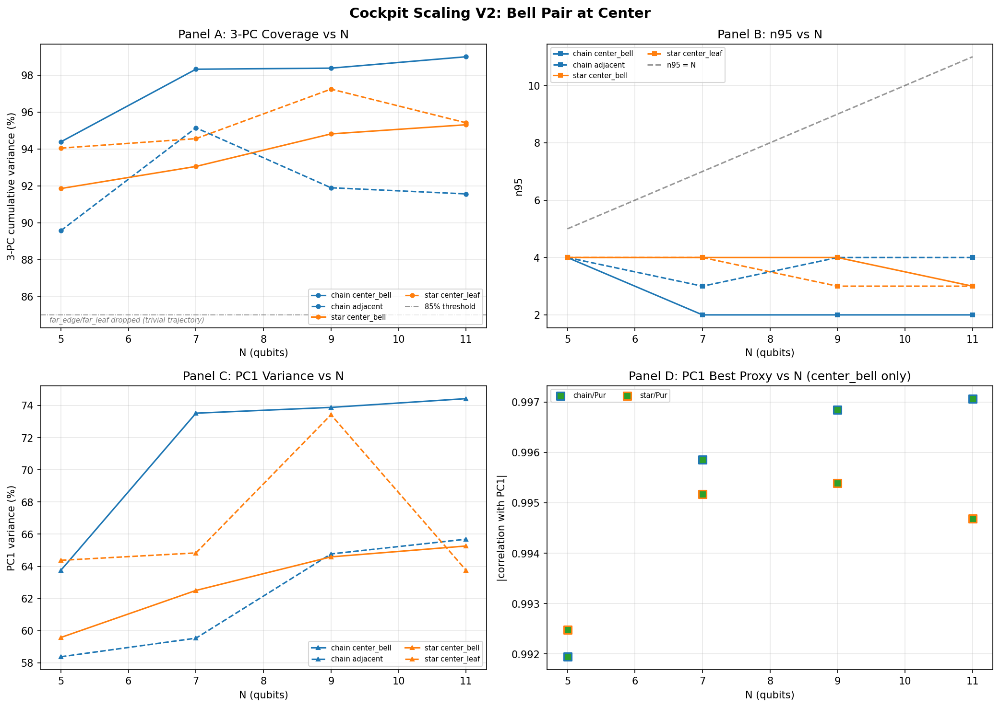

# Cockpit Scaling: Bell Pair Observers from N=5 to N=11

**Date:** April 7, 2026
**Status:** Complete (chain and star, N=5 through N=11)
**Scripts:**
[cockpit_scaling_analysis.py](../simulations/cockpit_scaling_analysis.py),
[Program.cs cockpit mode](../compute/RCPsiSquared.Propagate/Program.cs)
**Predecessors:**
[Cockpit Universality](COCKPIT_UNIVERSALITY.md) (the N=2-5 baseline that this document extends)

---

## What this document is about

The cockpit framework introduced in [Cockpit Universality](COCKPIT_UNIVERSALITY.md) was evaluated by PCA: the first three PCs of a selected simulated feature dashboard explain 88 to 96 percent of its trajectory variance for finite Heisenberg systems (N=2 to 5). This is a statement about computed features; it does not establish three hardware observables, and a hardware-monitoring protocol or cost remains open. The follow-up question here is whether the finite PCA pattern persists at the larger simulated sizes that the propagation engine can reach.

This document extends the finite calculation to N=7, 9, and 11 using the C# propagation engine, which uses its dense path at these sizes and reaches cases where the Python pipeline runs out of memory. We test two topologies (Heisenberg chain and star), with the Bell pair always placed on the two central qubits so that the observed pair is the same physical object regardless of system size. The result is a table of PCA variances, feature correlations, and separately measured ESD times, not a hardware-monitoring protocol.

The displayed ESD threshold times and PCA component counts are a finite association, not an identified mechanism. Concurrence crosses the stated numerical threshold at finite sampled times, and the fraction of each trajectory sampled after that crossing differs among the rows. Placing those timings beside `n95` is descriptive: it does not show that the crossing causes the component count, that chain boundaries are screened, or that star geometry prolongs entanglement.

In every displayed chain and star panel, the first three PCs explain above 90 percent of the selected-feature variance. The fall in `n95` is associated in these rows with the length of the post-ESD part of the sampled trajectory; the PCA does not by itself identify a mechanism or establish a measurement-cost advantage.

---

## Abstract

For Heisenberg spin chains and star topologies under uniform local Z-dephasing, with a Bell pair initialized on the two central qubits and the remaining qubits in `|+>` product states, the first three PCs explain 91.9 to 99.0 percent of the variance of the selected active simulated features across the displayed N=5 to N=11 trajectories. The effective dimensionality `n95` decreases from 4 to 2 for the chain and from 4 to 3 for the star. The sampled ESD times co-vary with that finite pattern, but the PCA does not establish the ESD mechanism. This covariance does not identify a cause. It does not establish a hardware measurement protocol. Purity has the largest absolute correlation with PC1 in every tested configuration; that proxy correlation is not an observable-count result.

---

*Four-panel finite summary for the Bell-pair observer (`center_bell`) across the displayed topologies and sizes. **Panel A** shows 3-PC cumulative variance: chain (blue) rises from 94.4 percent at N=5 to 99.0 percent at N=11, while star (orange) rises from 91.9 percent to 95.3 percent. The 0.85 line is a plotted reference line, not a hardware-usefulness threshold. **Panel B** shows `n95`: chain changes from 4 to 2 and star from 4 to 3. **Panel C** reports the PC1 variance fraction, without assigning its change to ESD. **Panel D** reports that Purity has the largest absolute correlation with PC1 in the eight displayed `center_bell` rows. These covariance summaries do not identify a cause or give PC1 one stable physical meaning.*

---

## 1. Method

### Initial state and pair selection

The initial state is `Bell+(c1, c2) tensor |+>^(N-2)` where `c1 = (N-1)/2` and `c2 = c1 + 1`. For odd N this puts the Bell pair on the two central qubits of the chain. For star topology there is no geometric center because all leaves are equivalent under the topology's symmetry, so the same index convention `(c1, c2)` selects two specific leaves; which leaves are chosen is irrelevant by symmetry. For each `(N, topology)` configuration we extract feature trajectories for three pairs:

- **center_bell pair** `(c1, c2)`: the Bell pair itself, the entangled observer that the cockpit framework is designed to monitor
- **adjacent pair** `(c1-1, c1)` (chain) or `(0, c1)` (star, the star center plus one Bell-pair leaf): a pair that is initially separable but Hamiltonian-coupled to the Bell pair
- **far_edge pair** `(0, 1)` (chain) or `(1, N-1)` (star): two `|+>` qubits at the chain boundary or two non-Bell leaves, far from the Bell pair

The center_bell pair is the headline subject. The adjacent pair provides context. The far_edge pair was included as an expected-trivial control class. See Section 6 for what this control class actually showed.

### Initial state choice and the V1 lesson

A previous version of this experiment (now archived) placed the Bell pair on the boundary qubits `(0, 1)` and analyzed the center pair as the observer. At N greater than 5, that center pair no longer contained a Bell-pair qubit and its concurrence stayed zero, so the 88 to 99.8 percent coverage was outside the headline entangled-observer scope. It was not PCA on numerical noise: seven active computed features, including a large purity change under local dephasing, still varied. The current experiment instead anchors the Bell pair to the center so that the headline pair is the same kind of object at every tested size.

### Sanity gates

Because the V1 experience showed that PCA can produce deceptively high coverage on near-degenerate trajectories, the analysis pipeline applies three sanity gates before running PCA on any `(N, topology, pair)` combination:

1. **Concurrence variation gate** (applied only to center_bell pairs): `std(concurrence)` over the trajectory must exceed 0.01. This ensures the entangled observer actually shows non-trivial entanglement dynamics.
2. **Feature richness gate** (all pairs): at least 4 of the 9 features must have `std > 1e-6`. Features below this threshold are dropped before standardization rather than being passed through with an epsilon-regularized denominator.
3. **Purity range gate** (all pairs): `purity.max() - purity.min()` must exceed 0.05.

All 8 center_bell configurations passed Gate 1. The lowest center_bell concurrence standard deviation was 0.118, more than ten times the threshold. One feature (ph03, the phase angle of the off-diagonal element) was dropped from chain center_bell PCA at N greater than or equal to 7 because its variance fell below 1e-6 (see Section 5).

### Anchor

At N=5 chain, the center_bell pair (2,3) is the Bell pair embedded between two `|+>` qubits on the left and one on the right. The C# code asserts at startup that the initial reduced state on (c1, c2) has purity 1.0 and concurrence 1.0; if either fails the run aborts. The PCA result for N=5 chain center_bell gave n95=4 and 3-PC coverage of 94.4 percent, with Purity as the PC1 proxy at correlation 1.00. These match the expected ranges for a Bell pair embedded in a small Heisenberg chain.

As an additional independent check, the trajectory of the `center_bell` pair was reproduced on April 7, 2026, by direct spectral evolution. The 32x32 Hilbert-space density matrix and Hamiltonian are distinct from the full 1024x1024 Liouvillian. Starting from the same initial state convention (`|Phi+><Phi+|_{2,3}` tensor `|+><+|^{otimes 3}`, with the spectator qubits in the pure `|+>` state), the spectral route and the C# dense propagation path agree to about 0.001 in concurrence at every sampled time point. Section 11 gives the scope of that numerical cross-check.

### Compute

The C# propagation engine ([Program.cs cockpit mode](../compute/RCPsiSquared.Propagate/Program.cs)) used its dense propagation path for all 8 configurations. Total runtime was approximately 19 minutes on the home PC (16-core, 128 GB RAM). The N=11 runs each took about 9 minutes and used roughly 4 GB RAM. The separate matrix-free option begins above this experiment's size range and was not used here.

---

## 2. Finite ESD timing and PCA association

### What we measured

Tracing the concurrence of the center_bell pair as a function of time for each `(N, topology)` configuration produces the following table:

| N  | Chain ESD time | Star ESD time |
|----|----------------|---------------|
| 5  | 0.9            | 0.5           |
| 7  | 1.1            | 2.0           |
| 9  | 1.0            | 3.8           |
| 11 | 1.0            | 3.9           |

ESD time here is defined as the first sampled time at which the concurrence drops below 0.001, which for these configurations is indistinguishable from exactly zero. The trajectory is sampled every 0.1 time units, so the ESD time has a resolution of 0.1.

### Chain: ESD time is approximately N-independent

For the chain topology, the four sampled threshold times cluster near 1.0. The Bell pair has the same immediate couplings and local dephasing rate in these rows, which suggests a locality question for a future controlled calculation. These four displayed rows do not identify a mechanism, do not isolate boundary distance, and do not show that intermediate qubits screen the boundary.

At N=5, concurrence first falls below 0.001 at `t=0.9` and later reaches about 0.114 at `t=2.0`; the displayed N=7, 9, and 11 samples show no corresponding revival. A revival in one reduced-state observable does not establish information backflow or failure of CP divisibility, and its absence at the sampled times does not establish a Markovian threshold or irreversible absorption. Those classifications require a channel-level test that this experiment did not run.

### Star: ESD time grows with N

For the star topology, the displayed threshold time increases from 0.5 at N=5 to 3.9 at N=11. The Bell pair sits on two leaves while the hub connects to every leaf; redistribution is one possible story, while monogamy remains an interpretive hypothesis worth testing. The four rows do not isolate either effect, do not provide an entanglement budget, and do not establish why the threshold time changes.

The finite star/chain contrast motivates a topology-controlled experiment; this PCA does not indirectly measure a topological property.

### Why this matters for the cockpit

The sampled post-threshold intervals contain several strongly correlated dashboard features, while earlier intervals include additional variation in concurrence and Bell fidelities. PCA summarizes that covariance; it does not label a quantum/classical phase or show that ESD creates a principal component.

In the displayed chain rows, the threshold occurs near `t=1` within a trajectory sampled to `t=20`, and PC1 explains up to 74 percent. The star rows have later thresholds and `n95=3` or 4. These quantities co-vary in this finite table, but no windowed-PCA intervention was run to assign the variance difference to the time before or after the threshold.

The PCA component count and sampled ESD times are associated measurements, not a derived causal chain. In particular, the table does not establish a classical phase after the threshold, a Markovian transition at N=7, or a one-parameter explanation of `n95`.

This is the core finite finding of the experiment. Section 8 offers a separate optical-cavity interpretation; it is not a derivation from the cavity census.

---

## 3. Chain results

| N  | n_active | n95 | 3-PC coverage | PC1 variance | PC1 best proxy |
|----|----------|-----|---------------|--------------|----------------|
| 5  | 9        | 4   | 94.4%         | 47%          | Purity         |
| 7  | 8        | 2   | 98.3%         | 70%          | Purity         |
| 9  | 8        | 2   | 98.4%         | 73%          | Purity         |
| 11 | 8        | 2   | 99.0%         | 74%          | Purity         |

The 3-PC coverage rises monotonically from 94.4 percent to 99.0 percent. The effective dimensionality `n95` drops from 4 to 2 between N=5 and N=7, then stays at 2 for N=9 and N=11. The active-feature count falls from 9 to 8 because the numerical `ph03` branch has sub-threshold variance in those chain rows. The global spin-flip symmetry makes the relevant pair coherence real at every tested N; apparent phase variation can instead come from a zero crossing or a `0`-to-`pi` branch change.

Purity has the largest absolute correlation with PC1 at every tested N, while the PC1 loadings also have similar magnitudes on von Neumann entropy and several Bell fidelities. At N=11 PC1 explains 74 percent of the selected-feature variance. That covariance does not identify a one-parameter mechanism or prove that a post-threshold trajectory is classical.

PC2 at N=11 chain is loaded primarily on `psi_plus` (-0.69), `concurrence` (+0.51), and `phi_plus` (+0.38), and explains 22.7 percent of the variance. Calling it a "pre-ESD signature" is only a reading suggested by those loadings; this analysis did not recompute PCA on separated time windows to establish that attribution.

Together, PC1 and PC2 cover 97.2 percent of the selected chain `center_bell` N=11 feature variance. PC3 adds another 1.8 percent. These are three principal components of the computed dashboard, not a certificate that three hardware observables suffice.

---

## 4. Star results

| N  | n_active | n95 | 3-PC coverage | PC1 variance | PC1 best proxy |
|----|----------|-----|---------------|--------------|----------------|
| 5  | 9        | 4   | 91.9%         | 51%          | Purity         |
| 7  | 9        | 4   | 93.0%         | 52%          | Purity         |
| 9  | 9        | 4   | 94.8%         | 54%          | Purity         |
| 11 | 9        | 3   | 95.3%         | 58%          | Purity         |

The star topology shows a flatter finite profile than the chain. Coverage rises from 91.9 to 95.3 percent; `n95` stays at 4 for N=5, 7, and 9 and is 3 at N=11. All nine computed features pass the variance gate in these rows. The pair coherence phase remains real by the same global spin-flip symmetry as in the chain; numerical `ph03` activity records zero crossings or a `0`/`pi` branch, not a continuously rotating phase. The different gate outcome does not establish a topological cause.

PC1 in star topology explains 50 to 58 percent of the selected-feature variance. The later sampled ESD thresholds and the larger `n95` values appear in the same four rows, but that association does not establish that longer ESD times cause the component count.

---

## 5. The 8-feature reduction at chain N greater than or equal to 7

At chain N greater than or equal to 7 the analysis script drops one feature (ph03) before standardization because its variance falls below 1e-6. This is reported in the `n_active` column above as 8 instead of 9.

The global spin-flip proof in Limitation 6 makes the relevant reduced coherence real at every N and in both displayed topologies. Thus `ph03` is restricted to `0` or `pi`; apparent variance arises near zero crossings or a 0-to-pi branch change. The chain N=7, 9, and 11 rows happen to remain on one branch, giving the reported standard deviation near `6e-18`.

The gate therefore drops `ph03` when that branch label carries no usable variance. Its retention in the displayed star rows reflects branch changes in those trajectories, not an N-dependent freezing mechanism or evidence that hub dynamics are intrinsically richer.

A future iteration of the cockpit feature set could replace ph03 with something more informative for chain topologies, for example the magnitude of `rho[0,3]` (which is non-trivially decaying) instead of its phase. This is logged as a follow-up question, not a problem with the current result.

---

## 6. The far_edge control pair and what it actually showed

The far_edge pair was included in the experiment as an expected-trivial control class: two `|+>` qubits at the chain boundary, far from the central Bell pair, expected to show degenerate dynamics dominated by local dephasing without quantum-information content. The expectation was that the sanity gates would catch and drop these configurations as trivial.

What actually happened: at N greater than or equal to 7, the chain far_edge pair has concurrence exactly zero throughout the trajectory (max = 0, std = 2.5e-22, which is floating point noise around zero) and ph03 exactly zero (std = 6.6e-18, same situation). However, the other features (purity, von Neumann entropy, Bell fidelities, psi_norm) do show variation as the two boundary `|+>` qubits evolve under the displayed finite protocol. Purity ranges from 1.0 to 0.256 over the trajectory, the same displayed numerical range as for the center_bell pair. Matching that one feature range does not make the two trajectories structurally identical.

This means: seven active selected features remain, the purity range is large, and Gates 2 and 3 both pass. Gate 1 does not apply to far_edge. The PCA on this trajectory gives n95=1 and 3-PC coverage above 99 percent: one covariance direction explains at least 95 percent of the variance within this selected dashboard. The row is not informative about the cockpit framework's ability to monitor entangled observers, and it does not establish that the full dynamics are one-dimensional or classical.

The far_edge pair therefore reports as "analyzed" rather than "dropped", but its high coverage number is not a contribution to the headline scaling result. The cockpit framework's relevant scope is the entangled observer class (center_bell), not arbitrary pairs in the system. Reporting the far_edge numbers in the same table as center_bell would be misleading; this section exists to make that explicit.

**Pipeline resolution (April 2026):** Rather than extending Gate 1 or adding a new gate, the analysis pipeline now tags every configuration with a `cockpit_relevant` boolean flag derived from its pair class. The `far_edge` and `far_leaf` classes are flagged `cockpit_relevant=False`; their PCA results remain in the JSON output for inspection but are excluded from the headline cockpit-relevance table in the TXT report. Gate logic is unchanged; data is not discarded. See `simulations/cockpit_scaling_analysis.py`, constant `COCKPIT_RELEVANT_CLASSES`.

---

## 7. Adjacent pair (informational)

| N  | Chain adjacent 3-PC | Chain adjacent n95 | Chain PC1 proxy | Star center_leaf 3-PC | Star n95 | Star PC1 proxy |
|----|---------------------|--------------------|-----------------|-----------------------|----------|----------------|
| 5  | 89.6%               | 4                  | Purity          | 94.0%                 | 4        | Purity         |
| 7  | 95.1%               | 3                  | Purity          | 94.6%                 | 4        | Psi-norm       |
| 9  | 91.9%               | 4                  | Psi-norm        | 97.2%                 | 3        | Psi-norm       |
| 11 | 91.6%               | 4                  | Psi-norm        | 95.4%                 | 3        | Psi-norm       |

The adjacent pair is initially separable (one `|+>` qubit and one Bell-pair qubit, initial purity 0.5, initial concurrence 0) but is Hamiltonian-coupled to the Bell pair. Its trajectory therefore picks up dynamics indirectly. The 3-PC coverage stays in the 89 to 97 percent range across all N for both topologies, comfortably above the 85 percent threshold.

The PC1 proxy label changes from Purity to Psi-norm at N=9 for the chain and at N=7 for the star. A proxy is the computed feature with the largest absolute correlation to a PC score, so this proxy switch is a correlation-label change. It does not establish a coherence-driven transition, a sharp N-threshold, or a topological mechanism; those remain follow-up questions.

---

## 8. Cavity reframing: the same result in optical language

Everything in this document so far has been written in quantum-information vocabulary: concurrence, entanglement, Bell-pair lifetime, and monogamy. The cavity vocabulary below is an interpretive translation. These time-domain PCA and ESD rows are **not derived from the cavity census**. The Absorption Theorem supplies exact **per-mode decay rates**, but those rates are **insufficient** by themselves to determine the first zero of **nonlinear ESD**.

**Interpretive invitation — not a result:** this section translates the measured trajectory into cavity language and asks which connections might be useful. It does not promote that language to a second proof of the data.

### Translation table

| Measured or computed object | Interpretive cavity question (not an identity) |
|-----------------------------|-----------------------------------------------|
| Bell-pair initial state on `(c1, c2)` | Could it be pictured as an input prepared at two sites? |
| Wootters concurrence | Is there a useful optical analogy for this nonlinear reduced-state functional? |
| First sampled concurrence threshold crossing | Can an absorption picture help organize the timing without predicting it? |
| Z-dephasing rate `gamma` | What is gained or lost by picturing local dephasing as illumination? |
| Heisenberg coupling `J` | Can coupling be pictured as internal cavity transport? |
| Concurrence revival in the N=5 row | What channel-level test would distinguish memory from finite-system recurrence? |
| `n95` of the selected dashboard | Why do a few feature-covariance directions explain these finite trajectories? |
| Purity's correlation with PC1 | Why does state purity correlate with the leading dashboard direction? |

### The Bell pair as cavity input

The Bell+ state on the central pair has the Pauli decomposition `rho_Bell+ = (1/4)(II + ZZ + XX - YY)`: two structure terms and two transverse terms. This is a decomposition into operators, not probabilities assigned to persistent components. The Absorption Theorem labels eigenoperator decay rates; Hamiltonian mixing means this initial decomposition does not by itself identify which part of Wootters concurrence decays at which rate.

The decomposition invites asking whether absorption language can help organize the finite threshold crossing. It does not answer the question: Wootters concurrence is a nonlinear function of a reduced density matrix, and the per-eigenmode decay identity alone does not determine its first zero.

### The chain vs star asymmetry as an aperture effect

The Absorption Theorem gives `Re(lambda) = -2*gamma*<n_XY>` for each Liouvillian eigenmode. Connecting those linear mode rates to a Bell-pair concurrence threshold additionally requires the expansion coefficients, phases, reduced-state map, and nonlinear Wootters construction. This document has not derived that connection.

**Chain invitation.** The four chain threshold times cluster near `t=1`. One may ask whether locality or eigenmode weights help explain that row, but no relevant-mode census or boundary-distance intervention was performed here.

**Star invitation.** The displayed star threshold times rise with N. An aperture analogy suggests asking how hub connectivity redistributes eigenoperator weights, but those weights were not compared across the four rows and no aperture mechanism is established.

The [finite cavity inventory](VEFFECT_CAVITY_MODES.md) separately reports, at N=5 with a different observable, 112 chain frequency bins with Q_max = 72.4 and 42 star bins with Q_max = 100.0. Setting those rows beside the cockpit trajectories suggests a comparison, but the time-domain PCA/ESD result is not a consequence or confirmation of that bin table.

### What `n95` actually counts

Here `n95` is the number of PCA directions needed to explain 95 percent of the covariance of eight or nine selected computed features. PCA directions are not Liouvillian eigenmodes, and `n95` is not a count of cavity resonances.

A low displayed `n95` means only that a few feature-covariance directions explain the selected dashboard. A collapsed-mode mechanism is not established, and PC1/PC2 cannot be identified with physical diffusion/coherent modes from this PCA.

Likewise, a higher displayed `n95` does not show that more light-bearing eigenmodes survive or that absorption is slower; those are separate spectral and dynamical questions.

The "first 3 PCs cover 88 to 96 percent" row from COCKPIT_UNIVERSALITY is only a finite covariance summary for its selected simulated features. Cavity language offers an interpretive question about why the rows are low-dimensional; it does not derive the PCA coverage or establish a three-observable cockpit.

### Purity as the natural cavity coordinate

Purity is the basis-independent state functional `Tr(rho^2)`. It equals one for any pure state, even when that state or its density operator has many components in a chosen basis; purity is not a Liouvillian-mode inverse participation ratio, especially for a generally non-normal eigenbasis.

Purity has the largest absolute correlation with PC1 in the displayed panels. Calling it a cavity coordinate is an interpretive gloss on that correlation, not a proof that Purity directly reads an eigenmode population or that it supplies a universal hardware monitor. The other computed features contribute to the PCA loadings; the experiment does not turn those loadings into measurement settings.

### Why this matters for what comes next

Three questions, not consequences, suggested by the cavity reframing:

1. **A nonlinear ESD predictor remains open.** The Absorption Theorem gives each eigenmode's rate `2*gamma*<n_XY>`. Wootters concurrence combines the full evolved density matrix nonlinearly, so no single rate or bin count determines its first zero. A successful predictor must retain the full spectral coefficients and phases, the reduced-state map, and the nonlinear Wootters threshold; interference is not established as the cause.

2. **Could topology act like an aperture?** The star/chain timing contrast motivates a calculation of eigenoperator weights and reduced-state concurrence under controlled topology changes. The current rows do not show that a wider optical aperture is the cause or that either topology "wins".

3. **How does the input change the dashboard?** The cockpit uses Bell+ as its canonical entangled observer. Individual eigenoperators with different `<n_XY>` have different decay rates, but an initial state is mixed by `H`; this section does not rank input states by absorption speed or prove an `II+ZZ` preparation immune. Comparing inputs remains an open experiment connected to [What Qubits Experience](../hypotheses/WHAT_QUBITS_EXPERIENCE.md) and [Gamma is Light](../hypotheses/GAMMA_IS_LIGHT.md).

The honest summary of this section: the trajectory solver cross-checks the Lindblad evolution and the spectral calculation independently verifies the per-mode absorption identity. The finite cavity census, the PCA rows, and the nonlinear ESD times remain different measurements. Cavity language may guide the next analytical attempt, but it is not itself the missing ESD predictor.

---

## 9. Verdict

**Finite PCA summary for the selected entangled-observer dashboards.**

For Bell-pair trajectories in Heisenberg systems under uniform local Z-dephasing, the first three PCs explain more than 90 percent of the variance of the selected active simulated features across the displayed N=5 to N=11 chain and star panels. The effective dimensionality `n95` decreases from 4 to 2 for the chain and from 4 to 3 for the star. This finite result does not establish that three observables suffice; hardware monitoring remains open.

The decrease in `n95` accompanies a longer post-ESD portion of the sampled trajectories: concurrence first falls below the stated threshold at about `t ~ 1` for the displayed chain rows and between `t ~ 0.5` and `3.9` for the star rows. This association helps organize the finite data, but neither PCA nor the absorption theorem alone derives the nonlinear ESD time or proves that it causes the component count.

Purity has the largest absolute correlation with the computed PC1 score in every analyzed configuration. It is therefore the leading candidate proxy in this finite simulation, not a demonstrated one-setting measurement of PC1.

**What the finite computation reports:**
- first-three-PC coverage stays above 90 percent for the selected feature dashboards through the displayed N=11 rows
- Purity has the largest absolute correlation with PC1 across the displayed topologies and sizes
- the reported PCA rows and ESD times are separate measurements whose association remains descriptive

**What is qualified:**
- the observed component counts are not a theorem about large N, arbitrary states, or a causal ESD mechanism
- principal components are not individual observables; a hardware protocol, validation, and measurement cost remain open
- The n95 numbers reported here are conservative for the entangled observer class only; an arbitrary pair can show low n95 for this selected dashboard even when concurrence stays zero (see Section 6), without classifying its full dynamics as one-dimensional or classical

---

## 10. Limitations

1. **Heisenberg interactions and Z-dephasing only.** All results assume the standard Heisenberg coupling (XX+YY+ZZ) and uniform local Z-dephasing. Other coupling schemes (XX-only, anisotropic, long-range) and other noise models (depolarizing, amplitude damping, non-Markovian) are not tested. The COCKPIT_UNIVERSALITY baseline included depolarizing noise at N=2-4 and showed similar dimensionality, but extending depolarizing tests to N=11 is a separate task.

2. **N=11 is the largest tested.** The propagation code has a separate matrix-free path for larger N, but it was not used in these N=5-11 rows. The scope is finite: no N=15 plateau prediction is made. Whether `n95=2` persists, and whether any ESD association persists with it, requires another run. A causal mechanism and Markovian threshold remain open.

3. **Three pair types per configuration.** Only the center_bell, adjacent, and far_edge (or center_leaf, far_leaf for star) pairs are extracted. The full pair-distance scan that is available at N=5 in COCKPIT_UNIVERSALITY (all 10 pairs) is not reproduced here. This is sufficient to answer the scaling question, but a comprehensive distance-resolved scaling map would require extracting more pairs per N.

4. **The far_edge control class is not informative for the cockpit claim (resolved April 2026).** As discussed in Section 6, the sanity gates allow `far_edge` pairs to be analyzed but their reported coverage is not a measurement of the cockpit framework's relevant scope. The pipeline now flags these configurations explicitly via `cockpit_relevant=False` and excludes them from the headline table; they remain in the JSON for inspection. See Section 6 pipeline resolution paragraph.

5. **The adjacent pair PC1 proxy transition (Section 7) is observed but not characterized.** It would be worth a separate experiment to find the exact N at which the transition occurs and whether it corresponds to a topological or spectral feature of the underlying Heisenberg system.

6. **The ph03 freezing under chain Z-dephasing (Section 5): RESOLVED 2026-06-04.** The off-diagonal element's phase is exactly 0 (or π) by the global spin-flip symmetry P = X^⊗N = Π² (the square of the palindrome conjugator; [Π², L] = 0 is the framework's known Z₂ parity symmetry). P commutes with the Heisenberg H (which is spin-flip symmetric) and with the Z-dephasing dissipator (P anticommutes with each Z_l, so the −1's cancel and the dissipator is P-invariant), and the initial state |Φ+⟩_pair ⊗ |+⟩^rest is P-invariant, so ρ(t) = Pρ(t)P for all t. P flips every spin, mapping the pair element ⟨00,e|ρ|11,e⟩ to ⟨11,~e|ρ|00,~e⟩; summed over the environment this gives ρ_pair[00,11] = ρ_pair[00,11]*, i.e. the coherence is exactly REAL, so ph03 = arg ∈ {0, π} exactly, at every N (confirmed bit-exact, |Im(coherence)| ~ 1e-16 for N = 5, 7, 9; [`simulations/phase_freezing_real_coherence.py`](../simulations/phase_freezing_real_coherence.py)). The earlier "frozen only at N ≥ 7" was a PCA-variance-gate artifact, not a symmetry threshold: ph03 reads as a clean 0 whenever the real coherence stays positive (the central pair at every N here), and only registers "variance" when the real coherence dips toward zero near an entanglement sudden death, where arg of a near-zero number is numerically noisy (or flips to π). The symmetry is universal; there is no N-threshold.

---

## 11. Cross-validation against direct spectral evolution (April 7, 2026)

The N=5 chain `center_bell` trajectory was independently reproduced by direct spectral evolution of the full Liouvillian, as a sanity check on the C# dense propagator and as a concrete application of the Absorption Theorem (Section 8). The script [path_d_bell_pair_absorption.py](../simulations/path_d_bell_pair_absorption.py) builds the 32x32 Heisenberg Hamiltonian, constructs the 1024x1024 Liouvillian (column-stacking vectorisation, so each Pauli string becomes one basis vector in operator space), and diagonalises it. Every right eigenoperator is decomposed in the Pauli basis to obtain the weighted average `<n_XY>` per mode. The initial state `|Phi+><Phi+|_{2,3}` tensor `|+><+|^{otimes 3}` is projected onto the eigenoperators and evolved to `rho(t)` at 301 time points between `t=0` and `t=3`. Reduced two-qubit density matrices and Wootters concurrence are then computed.

**Theorem verification.** The Absorption Theorem `Re(lambda) = -2 * gamma * <n_XY>` holds for all 1024 Liouvillian modes of the N=5 chain to a maximum deviation of 2.4e-14, consistent with floating-point precision. This is a redundant check (the theorem has already been verified across 1,342 modes in [Absorption Theorem Discovery](ABSORPTION_THEOREM_DISCOVERY.md)), but it confirms that the spectral pipeline used here is consistent with the existing proof.

**Trajectory match.** The spectral concurrence trajectory matches the CSV from `cockpit_scaling_N5_chain.csv` to a maximum deviation of 0.001144 (RMS 0.000353) across 31 sampled time points, within CSV write precision. The match includes the first threshold crossing at `t=0.9`, the revival to a peak of 0.158 at `t=2.1`, and the later crossing at `t=2.4`; it does not classify the channel as Markovian or non-Markovian. Purity matches to the same precision.

**Open analytical question.** There are 50 computed Liouvillian eigenmodes at `Re(lambda)=-0.2`, each with `<n_XY>=2.000000` to floating-point precision. A wider window `1.5 < <n_XY> < 2.5` contains 478 modes with total initial-state overlap 0.565; the 50-mode plateau carries 0.267 of that overlap. Within one backend-dependent eigenbasis of the degenerate plateau, the top 2, 6, and 15 coefficients carry about 32, 67, and 90 percent of its weight. A single-rate estimate gives `t~88`, far from the sampled concurrence crossing at `t=0.9`. This mismatch shows that one rate is insufficient; it does not establish destructive interference as the cause. A derivation must propagate the full density matrix through the nonlinear Wootters construction.

**Interpretive cavity question.** The broad coefficient distribution invites comparison with broadband excitation in a multimode cavity. It is not a spectral fingerprint of physical cavity illumination: the coefficients depend on an arbitrary basis inside the degenerate subspace, and the mapping from this expansion to concurrence has not been derived.

Wootters concurrence is computed from the ordered square roots of eigenvalues associated with the spin-flipped reduced-state construction. It is not a coherent sum of mode amplitudes. The present calculation shows only that the one-rate estimate fails; the cancellation or threshold structure responsible for the first zero remains to be derived.

The open problem is to derive the first zero of Wootters concurrence from the evolved density matrix and its spectral expansion. Here, broadband and dark-fringe language remains an interpretive question, not a reduction to a linear interference problem. Any closed form would have to retain the reduced-state and spin-flip eigenvalue operations that the analogy omits.

**Robustness note.** `numpy.linalg.eig` chooses an arbitrary basis within each degenerate eigenvalue subspace, depending on the BLAS backend, so the per-mode overlap distribution among the 50 plateau modes is not unique across machines; the percentages above are representative and may shift. The reconstructed density matrix and concurrence trajectory are basis-independent. The PCA result itself does not identify an individual Liouvillian mode as special.

**What this cross-validation establishes:**
1. The sampled `cockpit_scaling` trajectory agrees with the textbook Lindblad spectral solution to the stated tolerance. The C# dense propagator and spectral pipeline produce the same displayed dynamics.
2. The Absorption Theorem alone correctly identifies the absorption rate of every Liouvillian mode, but it is not yet sufficient to predict the ESD time of an entangled observer. ESD is a threshold effect on a nonlinear functional of the density matrix, and that nonlinearity is not yet folded into a closed-form prediction.

---

## 12. References

- [Cockpit Universality](COCKPIT_UNIVERSALITY.md) -- the N=2-5 baseline result, the framework definition
- [cockpit_scaling_analysis.py](../simulations/cockpit_scaling_analysis.py) -- the Python analysis script with sanity gates and dropping logic
- [Program.cs cockpit mode](../compute/RCPsiSquared.Propagate/Program.cs) -- the C# cockpit dispatch and trajectory generator
- [DensityMatrixTools.cs](../compute/RCPsiSquared.Propagate/DensityMatrixTools.cs) -- BellFidelity, Ph03, ExtractCockpitFeatures helpers
- [cockpit_scaling_results.txt](../simulations/results/cockpit_scaling/cockpit_scaling_results.txt) -- the full numerical output
- [cockpit_scaling_results.json](../simulations/results/cockpit_scaling/cockpit_scaling_results.json) -- per-configuration JSON dump for re-analysis
- [cockpit_scaling_curve.png](../simulations/results/cockpit_scaling/cockpit_scaling_curve.png) -- the four-panel scaling figure embedded above
- [path_d_bell_pair_absorption.py](../simulations/path_d_bell_pair_absorption.py) -- the spectral cross-validation script described in Section 11
- [path_d_comparison.png](../simulations/results/cockpit_scaling/path_d_comparison.png) -- visual overlay of empirical vs spectral concurrence and purity trajectories
- [the Absorption Theorem proof](../docs/proofs/PROOF_ABSORPTION_THEOREM.md) -- the Lindblad per-mode rate structure; insufficient alone for nonlinear ESD timing
- [Absorption Theorem Discovery](ABSORPTION_THEOREM_DISCOVERY.md) -- the empirical discovery of the absorption identity, the source of the `<n_XY>` interpretation used in Section 8
- [V-Effect Cavity Modes](VEFFECT_CAVITY_MODES.md) -- a separate finite topology/Q table, not a theorem derived or confirmed by the time-domain PCA rows
- [Optical Cavity Analysis](OPTICAL_CAVITY_ANALYSIS.md) -- the original Fabry-Perot reframing that introduced the cavity language used in Section 8
- [Gamma is Light](../hypotheses/GAMMA_IS_LIGHT.md) -- the hypothesis that gamma is external illumination, central to the Section 8 reading

---
