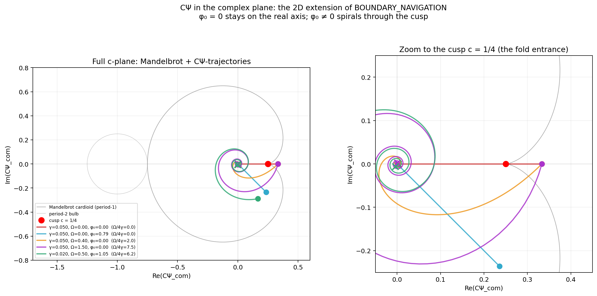
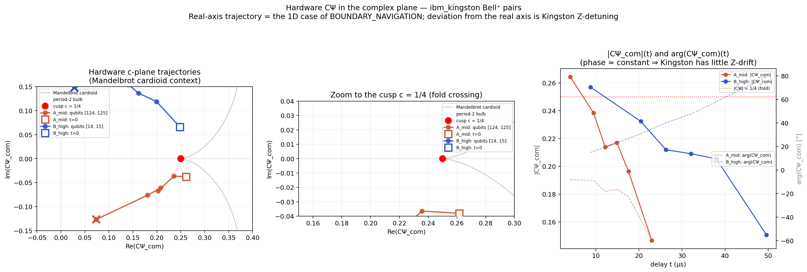

# CΨ in the Complex Plane: the 2D Extension of Boundary Navigation

**Status:** Draft, April 2026. Hardware-observed on Kingston; formal theoretical extension and deliberate-phase hardware run pending.
**Depends on:** [BOUNDARY_NAVIGATION](BOUNDARY_NAVIGATION.md), [CRITICAL_SLOWING_AT_THE_CUSP](CRITICAL_SLOWING_AT_THE_CUSP.md), [MANDELBROT_CONNECTION](MANDELBROT_CONNECTION.md)
**Input data:** [`data/ibm_cusp_slowing_april2026/`](../data/ibm_cusp_slowing_april2026/README.md) (ibm_kingston, 2026-04-16)
**Scripts:** [`cpsi_complex_plane.py`](../simulations/cpsi_complex_plane.py), [`hardware_cpsi_cplane.py`](../simulations/hardware_cpsi_cplane.py)
**Images:** [`cpsi_complex_plane.png`](../simulations/results/cpsi_complex_plane.png), [`hardware_cpsi_cplane.png`](../simulations/results/hardware_cpsi_cplane.png)

---

## Abstract

[BOUNDARY_NAVIGATION.md](BOUNDARY_NAVIGATION.md) defines CΨ = Tr(ρ²) · L1/(d−1) as a real scalar and uses θ = arctan(√(4CΨ−1)) as a one-dimensional compass toward the CΨ = 1/4 fold boundary. Every trajectory lives on the real axis of the Mandelbrot c-plane.

This document raises the framework by one dimension. Replacing the L1-norm of off-diagonals with the **signed sum** gives a complex-valued

    CΨ_com = Tr(ρ²) · (Σ_{i<j} ρ_{ij} + c.c.) / (d−1)

that carries phase information. Under pure Lindblad Z-dephasing the complex CΨ_com decays radially (same as real CΨ). Under dephasing plus a common Z-Hamiltonian (a detuning in the rotating frame), CΨ_com spirals in the c-plane toward the origin, passing the cusp at c = 1/4 under a definite angle determined by the ratio Ω / (4γ).

The hardware data from the 2026-04-16 cusp-slowing run on ibm_kingston already shows this 2D trajectory without any extra experiment: the two Bell⁺ pairs rotate in opposite directions at ~7 kHz and ~4 kHz residual Z-detuning respectively, producing logarithmic spirals. The real-axis picture of BOUNDARY_NAVIGATION.md is a projection; the underlying trajectory on any realistic hardware is 2D.

## Definition: complex CΨ

The original metric:

    CΨ = C · Ψ
    C  = Tr(ρ²)                                   (purity, real)
    Ψ  = ||ρ_off-diag||_1 / (d−1)                 (real L1 of off-diagonals)

The complex extension replaces the L1 norm with a signed sum:

    CΨ_com = C · Ψ_com
    Ψ_com  = 2 · Σ_{i<j} ρ_{ij} / (d−1)           (complex, signed sum of the upper triangle)

The factor 2 is chosen so that |CΨ_com| reduces to the original real CΨ whenever every off-diagonal has the same phase (e.g. Bell⁺ unphased). For a general state, the signed sum can have cancellations that L1 does not — different off-diagonal patterns with mixed phases can shrink or even vanish in Ψ_com while L1 stays large. For Bell⁺ dephasing this is not an issue (only ρ_{0,3} is non-zero), but it matters for generic multi-qubit states with many simultaneously populated coherences.

For Bell⁺ = (|00⟩+e^{iφ}|11⟩)/√2, ρ_{0,3} = (1/2)·e^{iφ}, so CΨ_com(0) = (1/3)·e^{iφ}.

|CΨ_com| replaces the original real CΨ as the "magnitude" coordinate. The fold boundary, originally a point at CΨ = 1/4 on the real axis, is now a **circle** in the c-plane at |c| = 1/4.

## Simulation (five trajectories)

See [`cpsi_complex_plane.py`](../simulations/cpsi_complex_plane.py). Five Bell⁺ configurations evolved under Lindblad with per-qubit Z-dephasing γ and common Z-Hamiltonian rotation Ω. Each trajectory traced for 400 time points.



| config | γ | Ω | φ₀ | t_max | Ω/(4γ) | Δφ_total | behavior |
|--------|--:|--:|----:|----:|--:|--:|--------|
| 1 | 0.05 | 0.0 | 0 | 20 | 0 | 0 | pure real-axis decay, through the cusp head-on |
| 2 | 0.05 | 0.0 | π/4 | 20 | 0 | 0 | ray through origin at fixed angle (no winding) |
| 3 | 0.05 | 0.4 | 0 | 20 | 2 | 8 rad ≈ 1.27 turns | gentle spiral |
| 4 | 0.05 | 1.5 | 0 | 20 | 7.5 | 30 rad ≈ 4.77 turns | tight spiral, clear helical signature |
| 5 | 0.02 | 0.5 | π/3 | 40 | 6.25 | 20 rad ≈ 3.18 turns | long-lived spiral starting off-axis |

The Mandelbrot cardioid (grey curve) and period-2 bulb are drawn for geometric reference. The cusp at c = 1/4 (red marker) is the 1D fold of BOUNDARY_NAVIGATION. Trajectories 1 and 2 go through it or beside it; trajectories 3-5 wind AROUND it, showing that the saddle-node geometry is traversed on a helical path in the 2D c-plane.

The ratio Ω/(4γ) gives the **rotation per e-fold of decay**, in radians. Over `k` e-folds of |CΨ_com| shrinkage, the total phase sweep is k · Ω/(4γ). The total winding on the complete trajectory is Ω · t_max / (2π) full turns — explicit in the Δφ_total column above.

## Hardware observation (no extra run needed)

The cusp-slowing run on ibm_kingston (2026-04-16) saved the full 4×4 density matrix at each delay. Computing CΨ_com from these matrices — without a new QPU call — reveals that both Bell⁺ pairs are ALREADY on 2D trajectories, because Kingston's rotating frame has residual Z-detuning on each qubit.



| pair | qubits | γ (1/μs) | rotation (deg) | rate (°/μs) | rate (rad/μs) | frequency (kHz) | direction |
|------|-------:|----------:|---:|---:|---:|---:|-----------|
| A_mid | 124, 125 | 0.00334 | −8° → −60° over 19 μs | −2.73 | −0.0477 | 7.59 | clockwise |
| B_high | 14, 15 | 0.00131 | +15° → +79° over 41 μs | +1.57 | +0.0274 | 4.36 | counter-clockwise |

The residual Z-detuning is different in sign and magnitude for the two pairs, producing two spirals that wind in opposite directions. Both trajectories still cross |CΨ_com| = 1/4 monotonically in magnitude (same as the 1D analysis documented in the [data README](../data/ibm_cusp_slowing_april2026/README.md)), but the angle at which each pair crosses the |c| = 1/4 circle is different.

### Full per-delay numbers (from the hardware JSON)

**Pair A (qubits 124-125):**

| t (μs) | Re(CΨ_com) | Im(CΨ_com) | \|CΨ_com\| | arg (°) |
|-------:|----------:|-----------:|-----------:|--------:|
| 4.05 | +0.2615 | −0.0380 | 0.2643 | −8.27 |
| 9.46 | +0.2356 | −0.0365 | 0.2384 | −8.80 |
| 12.16 | +0.2030 | −0.0671 | 0.2138 | −18.30 |
| 14.87 | +0.2082 | −0.0610 | 0.2170 | −16.34 |
| 17.57 | +0.1810 | −0.0762 | 0.1964 | −22.83 |
| 22.97 | +0.0737 | −0.1268 | 0.1467 | −59.84 |

**Pair B (qubits 14-15):**

| t (μs) | Re(CΨ_com) | Im(CΨ_com) | \|CΨ_com\| | arg (°) |
|-------:|----------:|-----------:|-----------:|--------:|
| 8.75 | +0.2483 | +0.0661 | 0.2569 | +14.91 |
| 20.42 | +0.1995 | +0.1190 | 0.2323 | +30.82 |
| 26.26 | +0.1619 | +0.1367 | 0.2119 | +40.17 |
| 32.09 | +0.1408 | +0.1544 | 0.2090 | +47.64 |
| 37.93 | +0.1088 | +0.1742 | 0.2054 | +58.01 |
| 49.60 | +0.0282 | +0.1480 | 0.1507 | +79.21 |

## Conceptual consequences

### 1. The fold is not a point, it's a circle

In the original BOUNDARY_NAVIGATION framing, the fold is a single point: CΨ = 1/4 on the real axis. In the complex extension, it is a circle: |CΨ_com| = 1/4 in the c-plane. Every direction of approach (every crossing angle) is geometrically distinct. The real-axis crossing is just one specific angle (arg(CΨ_com) = 0 at the moment of magnitude-crossing).

### 2. A new observable: the crossing angle

The crossing angle θ_cross ≡ arg(CΨ_com) at the moment |CΨ_com| = 1/4 is a new, phase-sensitive diagnostic. On Kingston's hardware data:

- Pair A: at |CΨ_com| ≈ 1/4 (around t = 5 μs), θ_cross ≈ −8°
- Pair B: at |CΨ_com| ≈ 1/4 (around t = 8-9 μs), θ_cross ≈ +15°

These are site-specific frame-rotation fingerprints. The original real-CΨ analysis discarded this information by taking L1 instead of signed sum.

### 3. Relation to F57 critical slowing

F57 says K_dwell = γ · t_dwell = 1.0801·δ for Bell⁺ under pure Z-dephasing. The dwell time is the duration for which |CΨ_com| stays in [1/4 − δ, 1/4 + δ].

Under added Hamiltonian rotation Ω, the 2D trajectory spirals but the RADIAL velocity d|CΨ_com|/dt is unchanged — Ω affects only the angular velocity. Therefore **F57's K_dwell prediction is Ω-invariant**: even in the 2D c-plane picture, the radial dwell time is identical to the 1D case. Measured γ-invariance stays valid with or without rotation.

What changes is the **arc length** the trajectory traces through the dwell-annulus. Straight radial crossing (Ω=0) covers 2δ of arc length. Spiral crossing (Ω>0) covers more. A natural 2D generalization:

    arc_length_dwell ≈ 2δ · √(1 + (Ω/(4γ·|CΨ_com|_cross))²)

This is a geometric measure, not a time measure. For a γ-invariance test that captures 2D structure, the arc length is the cleaner observable — but it requires a deliberate Ω injection on hardware to become measurable, since natural Kingston Ω is small.

### 4. Viennot's quaternionic direction

Viennot (2022, arXiv:2003.02608) studied decoherence + purification competition and found quaternionic Mandelbulb-like boundary structures. That is a DIFFERENT physical setup (extra purification channel, 4D quaternionic algebra) from ours. Our 1D → 2D move is pure information-unfolding within the same physics (the phase was already there, we just started reading it). Viennot's 4D comes from adding a physical feedback mechanism.

The two extensions are parallel, not a ladder. Our Kingston data gives the 2D complex-c picture directly; reaching Viennot's regime would require a new experiment with mid-circuit measurement + conditional feedback, which Heron r2 supports but we have not attempted.

## Open questions / to-verify

1. **Is Δφ = Ω · t the correct phase rule on hardware?** Simulation matches this trivially (Hamiltonian action). For hardware, the MEASURED rate (−2.73°/μs for pair A, +1.57°/μs for pair B) should be reproducible across days if Kingston's detuning is stable. Requires a second run on a different calibration day.

2. **What is arg(CΨ_com) at |CΨ_com| = 1/4 for Bell⁺ with Ω-drift?** Under pure dephasing + Ω rotation, the magnitude follows the F25 Bell⁺ closed form |CΨ_com|(t) = f·(1+f²)/6 with f = exp(−4γt) (rotation does not affect the magnitude), and the argument is arg(CΨ_com)(t) = φ_0 − Ω·t. At the radial crossing t_cross (solution of |CΨ_com| = 1/4), the crossing angle is simply arg_cross = φ_0 − Ω·t_cross. Linear in Ω — tunable on hardware via deliberate detuning.

3. **Can we deliberately steer the crossing angle?** Hardware run: H(q0), S(q0), CX(q0, q1), delay. The S-gate sets φ_0 ≈ π/2, so the spiral starts on the imaginary axis. Adding an explicit RZ(θ) during delay injects controlled Ω. This closes the loop between simulation and hardware.

4. **Does the crossing angle leave a signature post-fold?** Post-fold (below 1/4) the system is in the "classical regime" (real attractors exist). Whether the phase accumulated during 2D approach affects the chosen attractor is open. Measurable by tomography at delays past t_cross.

## Hardware run candidate (realistic parameters)

Same two-qubit-pair selection logic as `run_cusp_slowing.py`, with **deliberate phase injection**:

- Circuit: `H(q0); S(q0); CX(q0, q1); delay(t)` → initial arg(CΨ_com) ≈ π/2
- Optional RZ(θ_drift) insertion every 5 μs during the delay → controllable effective Ω
- Same two pairs A_mid (T2_min ≈ 150 μs) and B_high (T2_min ≈ 380 μs)

Realistic windings, given the 50 μs delay budget and Kingston's γ ≈ 0.002-0.003/μs:

| injected Ω (rad/μs) | detuning (kHz) | phase over 50 μs | turns |
|---:|---:|---:|---:|
| 0.05 | 8 | 2.5 rad | 0.4 |
| 0.13 | 20 | 6.3 rad | 1.0 |
| 0.25 | 40 | 12.5 rad | 2.0 |

Plot: the spiral in the c-plane for each injected Ω, with the Kingston-natural Ω subtracted or acknowledged. The visible winding count scales linearly with injected Ω, confirming the phase rule.

Budget: ~7 min QPU (108 circuits). Same session mode, same pre/post calibration drift check.

## What this doesn't claim

- **It does not extend the Mandelbrot set** to a true 3D object. The c-plane is still 2D (ℂ). "3D" here is c-plane × time, a fibration picture.
- **It does not add new physics.** The Lindblad equation is unchanged. The detuning was already in the hardware; we just started plotting the consequence.
- **It does not replace the 1D BOUNDARY_NAVIGATION picture** — the real-axis story is still correct as a projection. It's just incomplete.

## Reproducibility

```bash
cd simulations
python cpsi_complex_plane.py          # generates cpsi_complex_plane.png
python hardware_cpsi_cplane.py        # uses the Kingston JSON to make hardware_cpsi_cplane.png
```

Both scripts have zero QPU cost; the hardware script reads the already-saved JSON from the cusp-slowing run. Anyone who reproduces the cusp-slowing run (free tier, ~7 min QPU) can then reproduce both plots with no additional compute.

---

**Draft note — remaining refinements before commit:**

- The **simulation plot zoom** shows all five trajectories overlapping tightly near the cusp. Baselines (traj 1 and 2) could be dropped from the zoom panel to highlight the spirals.
- The **hardware plot center panel** (zoom) is tight; widening the imaginary axis to ±0.1 would make the spiral departures more visible.
- The "Hardware run candidate" section is a roadmap, not a committed experiment. If Tom wants to execute it, a separate TASK file branches out of this doc; otherwise it remains as motivation for future work.
