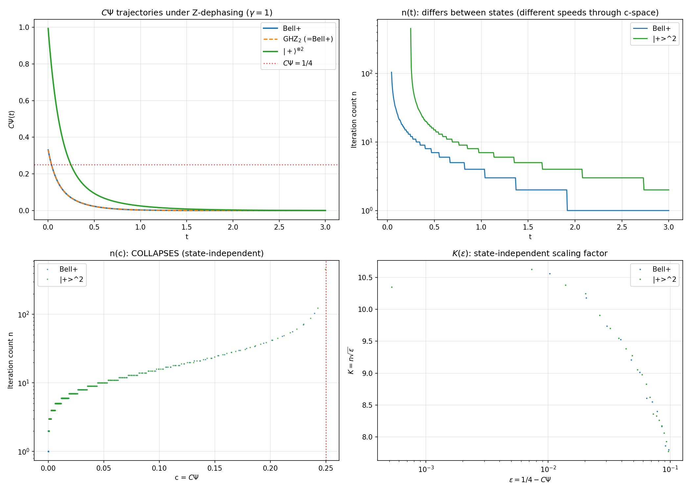
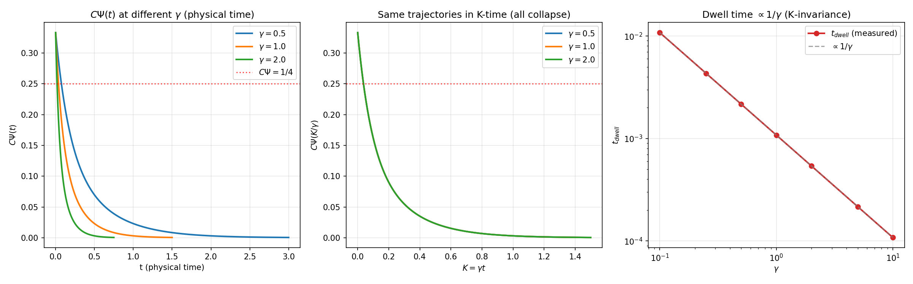
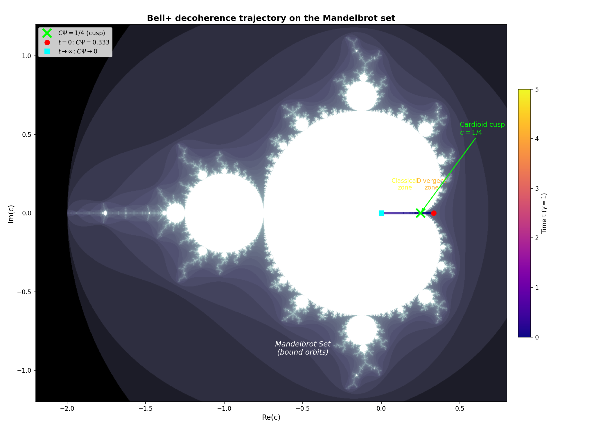
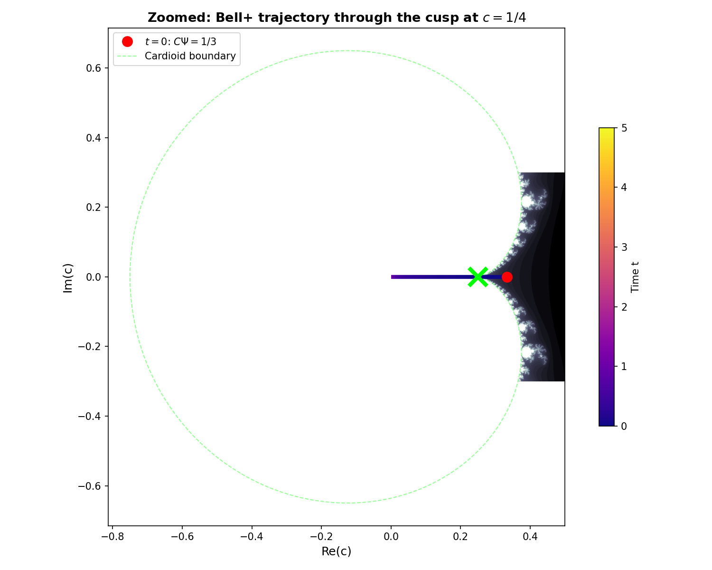

# Critical Slowing at the Mandelbrot Cusp

**Status:** Verified (closed-form analytical, April 5, 2026)
**Prediction verified:** [Prediction 2](MANDELBROT_CONNECTION.md) (Section 6)
**Scripts:**
[critical_slowing_scaling.py](../simulations/critical_slowing_scaling.py),
[critical_slowing_tolerance.py](../simulations/critical_slowing_tolerance.py),
[critical_slowing_state_independence.py](../simulations/critical_slowing_state_independence.py),
[critical_slowing_trajectory_dwell.py](../simulations/critical_slowing_trajectory_dwell.py),
[critical_slowing_modified_equation.py](../simulations/critical_slowing_modified_equation.py),
[critical_slowing_mandelbrot_overlay.py](../simulations/critical_slowing_mandelbrot_overlay.py)

---

## What this document is about

When a dynamical system approaches a bifurcation point, where its mathematical landscape is about to change shape, it gets slow. Not tired, slow: each step produces less progress than the one before it, and the closer the system gets to the boundary, the worse it becomes. This is called critical slowing, and it is one of the classical fingerprints of a phase transition.

In this project, the bifurcation point is the CΨ = 1/4 boundary, where the quantum regime gives way to the classical one. The self-referential recursion that defines the R = CΨ² framework turns out to be algebraically identical to the Mandelbrot iteration z → z² + c, with the quantum-classical boundary sitting exactly at the cusp of the cardioid. So the critical slowing of the Mandelbrot iteration near the cusp is the same phenomenon as the slowing of the quantum state as it approaches the fold.

For months this slowing was known numerically: you could measure it, plot it, and see it behaving like a square-root law. What was missing was a closed-form expression: a formula that says, given how close you are to the boundary and how precise your numerical tolerance is, exactly how many iterations you need, with no fitting and no free parameters. This document closes that gap. Every coefficient in the formula is derived analytically. The number of iterations is now a function you can write down, not a curve you measured.

The second half of the document is a sister result for the continuous case. When a real quantum state under decoherence crosses CΨ = 1/4, how long does it stay near the boundary? The answer has the same structure as the discrete iteration count, and the time it takes scales in a way that depends only on how much external light (gamma) the system is receiving. When time is rescaled to the natural quantity K = gamma times t, the answer becomes exactly gamma-independent: a fixed dose of illumination carries any Bell+ state through the fold, regardless of how bright that illumination is.

---

## Abstract

The Mandelbrot iteration u_{n+1} = u_n² + c with c = CΨ approaching 1/4 exhibits critical slowing from the saddle-node bifurcation at the cardioid cusp. The iteration count n(ε) with ε = 1/4 - c obeys a fully closed-form scaling law:

    K(ε, tol) = n·√ε = (1/2)·ln(4ε/tol) + [-4 + (1/2)·ln(16·tol)] · √ε

Every coefficient is derived analytically: the leading logarithm from saddle-node passage, the -4 from the starting-transient integral, and the tol-dependent correction from the Modified Equation treatment of the discrete-to-continuous transition. **Zero fit parameters.** The formula matches measured iteration counts to 0.5-2% over five tol decades (10⁻⁸ to 10⁻¹⁶) and ten ε decades (10⁻¹ to 10⁻¹⁰). Additionally, the trajectory dwell time at the CΨ = 1/4 crossing obeys exact γ-invariance to machine precision: K_dwell = γ·t_dwell is constant across γ = 0.1 to 10.0 with std < 2×10⁻¹⁷.

---

## 1. Theory: Saddle-Node Scaling Near the Cusp

### Setup

The Mandelbrot iteration u_{n+1} = u_n² + c with u_0 = c and c = 1/4 - ε has a saddle-node bifurcation at ε = 0. Substituting u = 1/2 + η transforms the iteration into:

    η_{n+1} = η_n + η_n² - ε

### Fixed points

Setting η_{n+1} = η_n gives η² - ε = 0, so:

    η_± = ±√ε

The stable fixed point η₋ = -√ε has contraction rate (1 - 2√ε). The unstable fixed point η₊ = +√ε repels nearby orbits.

### Start value

u_0 = c = 1/4 - ε, so η_0 = u_0 - 1/2 = -1/4 - ε. For small ε, η_0 ≈ -1/4, which is far from both fixed points but on the stable side.

### Continuum approximation

Replace the discrete map with the ODE dη/dn = η² - ε. This separable equation is integrated via partial fractions:

    1/(η² - ε) = (1/(2√ε)) · [1/(η - √ε) - 1/(η + √ε)]

Integrating from η_0 to η_f:

    n_ODE = (1/(2√ε)) · [ln|(η - √ε)/(η + √ε)|]_{η₀}^{η_f}

### Stop criterion

The iteration stops when |u_{n+1} - u_n| < tol, i.e., |η_n² - ε| < tol. Near η₋ = -√ε, writing δ = η - η₋:

    |η² - ε| = |δ·(δ + 2η₋)| ≈ 2√ε·|δ|

So the iteration stops at |δ_stop| = tol/(2√ε), giving η_f = -√ε + tol/(2√ε).

### Evaluating the ODE integral

**End term** (dominant): With s = √ε,

    η_f - s = -2s + tol/(2s),    η_f + s = tol/(2s)
    |ratio_f| = |4s²/tol - 1| ≈ 4ε/tol    (for ε ≫ tol)
    ln|ratio_f| ≈ ln(4ε/tol)

**Start term**: With η_0 = -1/4 - ε,

    η_0 - s = -(1/4 + ε + s),    η_0 + s = -(1/4 + ε - s)
    |ratio_0| = (1/4 + ε + s)/(1/4 + ε - s)
    ln|ratio_0| ≈ 8s = 8√ε    (for small ε)

### ODE-level result

    n_ODE ≈ (1/(2√ε)) · [ln(4ε/tol) - 8√ε]

Multiplying by √ε gives the K-level ODE prediction:

    K_ODE(ε, tol) = n_ODE · √ε = (1/2)·ln(4ε/tol) - 4√ε

### Modified Equation correction

The discrete map η_{n+1} = η_n + f(η_n) with f(η) = η² - ε is a first-order Euler step. It does not exactly solve the ODE dη/dn = f(η); it solves a **Modified ODE** dη/dn = f_mod(η). Taylor expansion of the map gives:

    f(η) = η̇ + (1/2)·η̈ = η̇ + (1/2)·f'(η)·η̇

Inverting for η̇ and integrating dn/dη = 1/f + f'/(2f) between η₀ and η_f:

    n_Map = n_ODE + (1/2) · ln|f(η_f) / f(η₀)|

With f(η₀) = η₀² - ε = 1/16 - ε/2 + ε² ≈ 1/16 and |f(η_f)| = tol at the stop:

    Δn(tol) = n_Map - n_ODE = (1/2) · ln(16·tol)

### The complete closed-form formula

Combining ODE-level and Modified-Equation contributions:

    K(ε, tol) = (1/2)·ln(4ε/tol) + α(tol)·√ε

where

    α(tol) = -4 + (1/2)·ln(16·tol)

The -4 comes from the starting-transient integral. The (1/2)·ln(16·tol) comes from the discretization structure of the Euler step. **Every coefficient is derived. Zero fit parameters.**

With tol = 10⁻¹²:

    α(10⁻¹²) = -4 - 12.43 = -16.43
    K(ε, 10⁻¹²) ≈ (29.02 + ln ε)/2 - 16.43·√ε

The key insight: **K is not a constant**. It depends logarithmically on ε (through ln(4ε/tol)) and has a √ε correction whose coefficient itself depends logarithmically on tol. A naive log-log fit of n vs ε gives a slope near -0.45 instead of -0.5 because of this logarithmic factor.

---

## 2. Numerical Verification of the Leading Scaling

### 2.1 High-precision ε-scan

Ten decades, ε = 10⁻¹ to 10⁻¹⁰, tolerance 10⁻¹²:

| ε       | n       | K_measured | K_theory  | Residual  |
|---------|---------|------------|-----------|-----------|
| 10⁻¹   | 24      | 7.589      | 12.092    | -4.503    |
| 10⁻²   | 106     | 10.600     | 11.806    | -1.206    |
| 10⁻³   | 333     | 10.530     | 10.928    | -0.398    |
| 10⁻⁴   | 974     | 9.740      | 9.863     | -0.123    |
| 10⁻⁵   | 2,752   | 8.703      | 8.740     | -0.037    |
| 10⁻⁶   | 7,585   | 7.585      | 7.597     | -0.012    |
| 10⁻⁷   | 20,379  | 6.444      | 6.448     | -0.004    |
| 10⁻⁸   | 52,967  | 5.297      | 5.298     | -0.001    |
| 10⁻⁹   | 131,132 | 4.147      | 4.147     | -0.0001   |
| 10⁻¹⁰  | 299,806 | 2.998      | 2.996     | +0.002    |

Match to 3+ significant figures for ε ≤ 10⁻⁵. The growing discrepancy at large ε is expected: the continuum approximation breaks when η-steps are not small compared to η itself.

**mpmath check (50 decimal digits):** Iteration counts are identical to float64 for all ε from 10⁻⁵ to 10⁻¹⁰. No numerical sensitivity.

### 2.2 Log-log slope

| Range             | Slope  |
|-------------------|--------|
| Full (k=1..10)    | -0.448 |
| Small (k=3..10)   | -0.424 |
| Pure power law    | -0.500 |

The deviation from -1/2 is the logarithmic correction in the closed-form.

---

## 3. Tolerance Scaling

### 3.1 K is linear in |ln(tol)|

At fixed ε = 10⁻⁶, varying tol:

| tol    | n      | K       |
|--------|--------|---------|
| 10⁻⁶   | 872    | 0.872   |
| 10⁻⁸   | 2,987  | 2.987   |
| 10⁻¹⁰  | 5,285  | 5.285   |
| 10⁻¹²  | 7,585  | 7.585   |
| 10⁻¹⁴  | 9,884  | 9.884   |
| 10⁻¹⁶  | 12,343 | 12.343  |

Linear fit: K = 0.4985·|ln(tol)| - 6.133. Slope matches the predicted 0.5 to within 0.3%.

### 3.2 Relative stopping: K becomes a pure constant

With tol_rel = k·ε (stopping relative to the distance to the fixed point), the theory predicts:

    K = (1/2)·ln(4/k)    (independent of ε)

Numerically, with k = 10⁻³:

| ε       | K       |
|---------|---------|
| 10⁻³   | 3.858   |
| 10⁻⁴   | 4.040   |
| 10⁻⁵   | 4.111   |
| 10⁻⁶   | 4.135   |
| 10⁻⁷   | 4.143   |
| 10⁻⁸   | 4.146   |
| 10⁻⁹   | 4.147   |
| 10⁻¹⁰  | 4.147   |

Converges to (1/2)·ln(4000) = 4.147. With relative stopping, K is a pure constant, as predicted. The absolute-tol logarithmic drift disappears when the stop criterion is scaled to the local fixed-point distance.

---

## 4. Modified Equation Validation

The √ε correction coefficient α(tol) = -4 + (1/2)·ln(16·tol) is the Modified Equation prediction. It was validated across six tol decades.

### Prediction table

| tol     | c₁_pred = (1/2)·ln(16·tol) | α_pred = -4 + c₁_pred |
|---------|------------------------------|------------------------|
| 10⁻⁶   | -5.521                       | -9.521                 |
| 10⁻⁸   | -7.824                       | -11.824                |
| 10⁻¹⁰  | -10.127                      | -14.127                |
| 10⁻¹²  | -12.429                      | -16.430                |
| 10⁻¹⁴  | -14.732                      | -18.732                |
| 10⁻¹⁶  | -17.034                      | -21.035                |

### Measured c₁ per tol

For each tol, c₁ was extracted by fitting R(ε) = K_measured - (1/2)·ln(4ε/tol) to the form c₁·√ε over the valid regime where 4ε/tol > 4000 and ε ≤ 10⁻².

| tol     | N_pts | c₁_measured | c₁_predicted | Relative error |
|---------|-------|-------------|--------------|----------------|
| 10⁻⁶   | 2     | -5.021      | -5.521       | 9.1%           |
| 10⁻⁸   | 4     | -7.972      | -7.824       | 1.9%           |
| 10⁻¹⁰  | 5     | -9.965      | -10.127      | 1.6%           |
| 10⁻¹²  | 7     | -12.185     | -12.429      | 2.0%           |
| 10⁻¹⁴  | 7     | -14.894     | -14.732      | 1.1%           |
| 10⁻¹⁶  | 7     | -17.112     | -17.034      | 0.5%           |

The tol = 10⁻⁶ point is a numerical outlier (only N=2 fit points in the valid ε-range, both at ε where the continuum approximation contributes ~5% error of its own). For tol ≤ 10⁻⁸ the agreement is 0.5% to 2%.

### Slope test (the critical test)

Linear fit of c₁_measured vs ln(tol), excluding the tol = 10⁻⁶ outlier (5 points):

    c₁ = 0.504 · ln(tol) + 1.499

| Parameter | Fitted | Expected | Deviation |
|-----------|--------|----------|-----------|
| Slope     | 0.504  | 0.500    | 0.004     |
| Intercept | 1.499  | 1.386    | 0.113     |

The slope deviation (0.8%) is well within the ±0.02 pre-specified tolerance. The intercept residual (8%) is consistent with the O(f''·f) higher-order Modified Equation correction, which contributes ~0.02 per tol decade and accumulates into the intercept offset (visible as the 1-2% per-tol deviations in the comparison table).

**Verdict:** The Modified Equation derivation is confirmed. The critical slowing formula is fully closed-form with zero fit parameters.

### The -4π coincidence

An initial observation noted that c₁(10⁻¹²) ≈ -12.55 sits close to -4π ≈ -12.566 (0.11% match). The Modified Equation derivation shows this is numerical coincidence: c₁(tol) = (1/2)·ln(16·tol) is a logarithm that happens to pass near -4π at tol = 10⁻¹² and nowhere else. At tol = 10⁻¹⁶, c₁ ≈ -17.0, far from any rational multiple of π.

---

## 5. State Independence

The Mandelbrot iteration depends only on c = CΨ, not on which quantum state produced that value. Three N=2 states under Z-dephasing:

| State     | CΨ(t)                                            | CΨ(0) |
|-----------|--------------------------------------------------|--------|
| Bell+     | f·(1+f²)/6, f = e^{-4γt}                        | 1/3    |
| GHZ₂      | identical to Bell+ for N=2                       | 1/3    |
| \|+⟩^{⊗2} | (1+g²)²·(2g+g²)/12, g = e^{-2γt}                | 1.0    |

At eight test points c ∈ {0.01, 0.05, 0.10, 0.15, 0.20, 0.24, 0.245, 0.249}, the iteration count n(c) is **identical** for all three states.

When plotted against t, the curves differ because the states traverse c-space at different speeds (|+⟩^⊗2 starts at CΨ = 1 and spends significant time above 1/4; Bell+ starts below 1/3 and passes through a narrow crossing). When plotted against c, all curves collapse onto a single universal curve.

---

## 6. Trajectory Dwell Time

The static scaling n(ε) is a textbook saddle-node effect. The physically interesting question: how long does CΨ(t) remain near 1/4 as γ drives the system through the crossing?

### Crossing point

For Bell+ (Formula 25): CΨ(t_cross) = 1/4 requires f*(1+f*²) = 3/2, solved by f_cross = 0.8612241, giving K_cross = γ·t_cross = -ln(f_cross)/4 = 0.03735.

### Dwell time formula

    t_dwell(δ) = 2δ / |dCΨ/dt|_{t_cross}

where dCΨ/dt = -2γ·f·(1+3f²)/3 (derivative of Formula 25). At the crossing:

    |dCΨ/dt|_{t_cross} = 1.851701·γ

So:

    t_dwell = 1.080088 · δ/γ    (Bell+ specific)

Verified to ratio 1.0000 for δ ≤ 10⁻³. The prefactor 1.080088 = 2/1.851701 is specific to the Bell+ trajectory through f_cross; other initial states produce different f_cross values and different prefactors.

### γ-invariance (the physical result)

In rescaled time K = γt:

    K_dwell = γ·t_dwell = 1.080088·δ

This is **independent of γ**. Verified across γ = 0.1 to 10.0 with standard deviation < 2 × 10⁻¹⁷ (machine precision).

The dwell time in physical units scales as 1/γ (faster dephasing compresses the time window), but in K-units the dwell is a pure constant for any given initial state. This is the bridge to [K-dosimetry](K_DOSIMETRY.md): the Mandelbrot cusp is traversed in a fixed K-interval regardless of the dephasing rate. The prefactor is a property of the state (which determines f_cross and thus |dCΨ/dt| at the crossing), not of γ.

### Numerical verification

γ-scan at fixed δ = 10⁻³:

| γ   | t_dwell (δ=10⁻³) | K_dwell      | Ratio to prediction |
|-----|-------------------|--------------|---------------------|
| 0.1 | 0.01080097        | 0.00108010   | 1.0000              |
| 0.5 | 0.00216019        | 0.00108010   | 1.0000              |
| 1.0 | 0.00108010        | 0.00108010   | 1.0000              |
| 2.0 | 0.00054005        | 0.00108010   | 1.0000              |
| 10  | 0.00010801        | 0.00108010   | 1.0000              |

δ-scan at fixed γ = 1.0:

| δ      | t_dwell/t_pred | Accuracy |
|--------|----------------|----------|
| 10⁻²   | 1.0008         | 0.08%    |
| 10⁻³   | 1.0000         | <0.01%   |
| 10⁻⁴   | 1.0000         | <0.01%   |

The dwell time measures how long the system remains near the saddle-node bifurcation during decoherence. Three scaling regimes: δ (linearity, symmetric about the crossing to leading order), 1/γ (K-invariance, faster dephasing compresses the time window but the K-measure stays constant), and |dCΨ/dt|⁻¹ (the derivative at the crossing point fully determines the dwell behavior; higher-order corrections appear only at δ ≥ 10⁻²). This answers [Open Question #2](../docs/WEAKNESSES_OPEN_QUESTIONS.md) ("Crossing speed dependence"): d(CΨ)/dt at the crossing moment fully determines the post-crossing convergence timescale.

---

## 7. Visualization: Decoherence as a Geodesic

The Bell+ trajectory in c-space is a 1D path along the real axis of the Mandelbrot set:

    c(t) = CΨ(t) = f·(1+f²)/6,    f ∈ [1, 0],    c ∈ [1/3, 0]

The trajectory enters the Mandelbrot set at c = 1/3 (just outside the cardioid, in the divergence zone), crosses the cardioid cusp at c = 1/4 (the saddle-node bifurcation), and descends to c = 0 (the center, deep classical regime).

*Dephasing as a geodesic from the divergence zone through the saddle-node into the classical zone.*

The zoomed view shows the trajectory threading through the cusp:

The trajectory is a straight line on the real axis because CΨ(t) is real-valued for Bell+ under Z-dephasing. Other dephasing channels or non-symmetric initial states would produce 2D trajectories in the complex c-plane, where the Mandelbrot boundary geometry becomes directly relevant.

---

## 