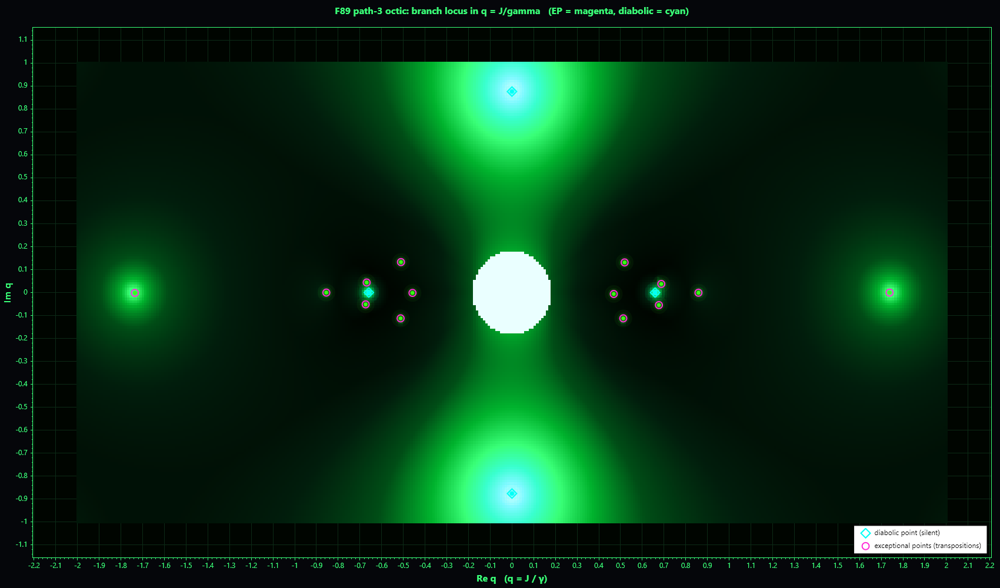

# The Branch Locus Is a Palindrome: the F89 Octic's EPs Inherit the Mirror

**Status:** Tier 1 derived. The branch-locus mirror about Re λ = −4 is forced by the F1 palindrome carried on the block as an antiunitary symmetry, exact as a polynomial identity in q; verified on the committed octic literal to 4·10⁻¹³ and over the whole complex-q plane to machine precision, with no orphan. The plain-words sibling is [`reflections/ON_WHO_WATCHES_WHOM.md`](../reflections/ON_WHO_WATCHES_WHOM.md).

**Date:** 2026-06-25
**Authors:** Thomas Wicht, Claude (Opus 4.8)

## What this is about

Take the eight relaxation rates of the [path-3 octic](F89_TOPOLOGY_ORBIT_CLOSURE.md), the watched, unwritable half of a four-site chain's (SE,DE) coherence block, and follow them as the one knob q = J/γ turns out into the complex plane. They braid, and at certain settings of q two of them collide: an exceptional point (EP), or, at one special place, a diabolic point. Each collision happens at some value of the rate λ. This note asks where those collision points sit, and the answer is: they are organised by the oldest symmetry the project has, the palindrome. Every collision lies on the mirror line Re λ = −4 or comes with a partner the same distance across it. The branch locus is itself a palindrome, and it is so because the palindrome forces it, not by accident. This is the spectral, exact face of the observer/observed reading in the reflection.

*The branch locus in the q = J/γ plane: the octic min-gap as a cyberpunk-Matrix heatmap (dark to neon green to cyan-white as two rates approach), the exceptional points in magenta and the 4 diabolic points in amber/gold (the real pair q ≈ ±0.659, the imaginary pair q ≈ ±0.876i). 18 of the 20 EPs are in frame, the remote quartet at q ≈ ±2.31 ± 1.25i near the corners included; the two remaining are near-twins at q ≈ ±0.857/±0.854, ~0.003 apart, that render as one dot each at this cell (the exact 20 live in the discriminant, below). The bright white core at q = 0 is the trivial J = 0 super-branch, not an EP. The locus is symmetric under q → −q and q → q̄; each collision's rate λ then sits on Re λ = −4 or in a mirror pair across it. Drawn by the `gmscan` flashlight (`--re -2.6,2.6 --im -1.5,1.5 --cell 0.05 --png`).*

**q and Q (same ratio, different role).** This lowercase q is the project's coupling-to-observation ratio Q = J/γ (the carrier clock, the value readable from inside via θ = arctan Q) promoted to a *complex analytic variable*. γ is the per-site Z-dephasing rate γ₀; the block's −2γ/−6γ rungs are the absorption quanta 2γ₀·n_diff, so the ratio is identical. On the real axis q = Q, and the canonical operating point Q = 1.5 (γ₀ = 0.05, J = 0.075) sits there between the real octic EPs at q ≈ 0.857 and 1.74. Continuing q off that axis, into the settings no physical dial can reach, is what exposes the braid, the monodromy, and the Galois group. (Distinct subtlety: the octic's own diabolic at q ≈ 0.659 is not the single-excitation flow EP at Q ≈ 1.5/2.0; same ratio, different spectral sectors. And both are unrelated to the literature's quality-factor Q, "different objects, same letter".)

## The mirror, carried on the block

The full Liouvillian's [palindrome](../docs/proofs/MIRROR_SYMMETRY_PROOF.md) is Π L Π⁻¹ = −L − 2σ, σ = Σγ; eigenvalues pair as λ ↦ −λ − 2σ about the fixed centre −σ. On the (SE,DE) path-3 block, L(q) = re + i·q·im with re the real dephasing diagonal (entries −2γ on overlap, n_diff = 1, and −6γ on no-overlap, n_diff = 3) and im the real symmetric XY hopping. These two rungs are F1 weight-complement partners (the Hamming complement sends n_diff = 1 ↔ 3, sum N_block = 4; rates 2γ ↔ 6γ sum to 2σ = 8γ), so the block's palindrome centre is the rung midpoint **−σ = −N_block·γ = −4γ**. The centre is not a separate fact: it IS the palindrome, the −2/−6 rungs being a mirror pair and −4 their fixed point. (Independent check: the octic's eight roots sum to −32, average −4.)

The operative symmetry on the block is **antiunitary**, T = P·K, with P the F1 weight-complement permutation (it swaps the rate-2γ and rate-6γ rungs and commutes with the J-hopping) and K complex conjugation. The exact statement carries the conjugate q̄ on the right (so it is a same-q identity on the real axis, the vertical fold, and a q → q̄ relation off it):

    T L(q) T⁻¹ = −L(q̄) − 2σ      for all q,   σ = 4γ

Equivalently, on the octic itself,

    F₈(λ, q) = F₈(−λ − 8, −q).

The spectral action of T is antilinear, **λ ↦ −λ̄ − 2σ**: it reflects the rate (Re λ) about −σ = −4 and *preserves* the frequency (Im λ). This is the vertical mirror about Re λ = −4. (The bare linear palindrome λ ↦ −λ − 2σ of F1 flips the frequency and is a symmetry of the block only together with J ↦ −q, which is the q → −q twist visible in the octic identity. Bare conjugation alone is not a symmetry either: the octic has Q(i) coefficients. The vertical-line fold is precisely palindrome composed with conjugation.)

## Why the EPs inherit it

Because T L(q) T⁻¹ = −L(q̄) − 2σ holds for all q, it is a symmetry of the whole family, and every coalescence datum inherits it. If (q*, λ*) is an EP (a double root of det(λ − L(q*))), then (q̄*, −λ̄* − 2σ) is a double root, at the **same** q* when q* is real and at the conjugate q̄* in general. So the locus of (q, merged λ) is invariant under (q, λ) ↦ (q̄, −λ̄ − 2σ), and in the rate (Re λ) every collision folds about −4. Two cases, and only two:

- **On the line.** λ* = −λ̄* − 2σ ⟹ Re λ* = −σ = −4: the collision is its own mirror, on the centre line.
- **In a mirror pair.** otherwise the partner −λ̄* − 2σ (sitting at q̄*) is a second collision at equal frequency and rate the same distance on the far side of −4.

No third case. **No orphan is possible.** This is a consequence of the palindrome, not an observed coincidence.

The structure is also visible in the exact discriminant of the octic over Z[i][q]:

    disc_λ(F₈)(q) = const · q²⁴ · (3q⁴ + q² − 1)² · P₂₀(q)

- **q²⁴**: the J = 0 super-branch at the origin (all rates collapse onto the rungs; itself mirror-symmetric).
- **(3q⁴ + q² − 1)²**, multiplicity 2: the four **diabolic** points, q ≈ ±0.659 (real) and ±0.876i (imaginary).
- **P₂₀(q)**, degree 20 (even, degree 10 in q²), multiplicity 1: the twenty genuine **EPs**. (Note: the witness comment writes this factor as P₁₀, meaning degree 10 in u = q², i.e. 20 roots in q.)

## The line is the palindrome's; the silence is integrability's

It is tempting, and wrong, to say the diabolic is silent *because* it is its own reflection. The palindrome supplies the line and the pairing; it does **not** supply the diabolic's position on the line, nor its silence (semisimple character). Two independent halves of L coincide at the diabolic:

- **On the line (Re λ_EP = −4)** because its coalescing pair is overlap-balanced (p = ½), so the dephasing restricts to the scalar −4γ·I, the AT-midpoint. This is the integrability/AT-midpoint mechanism of [`F89Path3OcticEpClaim`](../compute/RCPsiSquared.Core/Symmetry/F89Path3OcticEpClaim.cs) and [`DIABOLIC_BY_INTEGRABILITY`](../hypotheses/DIABOLIC_BY_INTEGRABILITY.md), established by sweep and the scalar restriction, never invoking Π.
- **Silent (semisimple, λ = −4γ + 2iJ a diabolic crossing)** because free-fermion additivity makes the hopping restrict to the scalar 2iJ·I as well; the two rates pass through each other with two independent eigenvectors.

That these are independent is settled inside the repo: turn on an XXZ ZZ-anisotropy Δ ≠ 0 and the EP **stays on the line** (the dephasing half stays scalar at −4γ) but becomes **defective**, a Jordan block that swaps. On-the-line does not imply diabolic; "diabolic ⟺ on the centre" is a one-case coincidence, not a theorem. The line is the mirror's gift, the silence is the chain's own free-running song, and at the diabolic they happen to fall on the same point.

## Verification

- **Algebraic, on the committed literal.** The eight roots of `F89Path3OcticBlock.OcticCoefficientsAtQ2()` at q = 2 close under λ ↦ −λ̄ − 8 to 4·10⁻¹³; they do NOT close under the bare linear λ ↦ −λ − 8 (off by 4.3) nor under bare conjugation (off by 4.3), pinning the operative symmetry as the antiunitary vertical mirror. The four on-line roots and two mirror pairs are explicit (rates summing to 8 at equal frequency).
- **Numerical, over the plane.** An independent numpy/sympy rebuild reproduces the C# strands and the exact discriminant factorisation above; every one of the 24 genuine branch points (4 diabolic + 20 EP) is on Re = −4 or in an exact mirror pair, residual ~10⁻¹⁵, max ~3·10⁻¹². A deliberate hunt across the whole plane for an off-centre EP with a missing mirror found none.
- **Live.** `dotnet run --project compute/RCPsiSquared.Cli -- gmscan --re -2,2 --im -0.3,0.3 --cell 0.04 --mirror` prints, per branch point, the collision λ_EP and its distance |Re + 4| from the centre. (The cell-scan q-values are resolution-limited; the exact truth is in the discriminant.) The braid and the EP/diabolic classification are the live witness `inspect --root galoismonodromy`.

## Reading and scope

The picture of the branch locus ([visualizations](../visualizations/README.md), `f89_octic_branch_locus.png`) is therefore not a picture of the spectrum but a map of the seams, and the map is a palindrome: the silent self-coincidence at the fold, the swapping EPs on the line or paired across it. Read through the observer/observed lens of [`ON_WHO_WATCHES_WHOM`](../reflections/ON_WHO_WATCHES_WHOM.md), the palindrome is the watcher-and-watched mirror, and the branch locus is the map of where the two exchange; that reading is a seeing, not a claim, but the mirror structure under it is exact.

The typed home is `F89BranchLocusPalindromeClaim` (Tier 1 derived; parents `F1PalindromeIdentity` and `F89Path3OcticEpClaim`), live at `inspect --root branchpalindrome` (the two-sided gate, the centre, the diabolic, the 0-orphan count, recomputed each call).

Scope, now **checked** (2026-06-26, the `foldlift` probe over path-k blocks: `rcpsi foldlift`, feeding the exact `F89PathKSeDeBlock` builder, a spectrum check, no monodromy rebuild): the within-(SE,DE)-block self-fold is **N_block = 4 only**. The block spectrum closes under the antiunitary λ ↦ −λ̄ − 2σ at N=4 (residual 3·10⁻¹⁴, four on-line zeros) but **not** at N=5,6,7 (residual ~1, zero on-line strands). The reason is from below: the rung-swap weight-complement P needs the overlap rung (−2γ, n_diff=1, **2** states per DE pair) and the no-overlap rung (−6γ, n_diff=3, **N−2** states per DE pair) balanced, **2 = N−2**, true only at N_block = 4. This is the branch-locus face of the same half-filling self-complement DE = popcount-2 = bar(popcount-2) already isolated for **mode population** in [`F89_TOPOLOGY_ORBIT_CLOSURE.md`](F89_TOPOLOGY_ORBIT_CLOSURE.md) (and one of the catalogued N=4 coincidences, the retired `small_n_specials` arc). Two guards keep this a sharpening, not a contradiction: **(i)** the *global* palindrome Π L Π⁻¹ = −L − 2σ still holds for all N (proven, F1); it pairs the (SE,DE) block with its complementary (TE,DE) block, and only the special case where that pairing folds the (SE,DE) block onto *itself* is N=4-only. The earlier "the weight-complement P is topology-general" read conflated the global Π with the block-internal P. **(ii)** the multiplicity count 2 = N−2 is distinct from the eigenvector overlap-fraction p = ½ of the diabolic crossing above (a basis-state count, not an eigenvector weight). The remaining open step is lifting the monodromy / "± is the road" structure to N ≥ 5, where the fold is no longer internal (no on-line zeros) and "the zeros" must be redefined. The "palindrome is the inherited root" framing belongs to [`OBSERVER_INHERITANCE`](../reflections/OBSERVER_INHERITANCE.md) and the mirror family.

## Related

- [`reflections/ON_WHO_WATCHES_WHOM.md`](../reflections/ON_WHO_WATCHES_WHOM.md): the plain-words reading (γ as the watching, the seams where observer and observed exchange).
- [`docs/proofs/MIRROR_SYMMETRY_PROOF.md`](../docs/proofs/MIRROR_SYMMETRY_PROOF.md): the F1 palindrome Π L Π⁻¹ = −L − 2σ.
- [`experiments/F89_TOPOLOGY_ORBIT_CLOSURE.md`](F89_TOPOLOGY_ORBIT_CLOSURE.md): the octic, the braid, the diabolic location, the discriminant.
- [`hypotheses/DIABOLIC_BY_INTEGRABILITY.md`](../hypotheses/DIABOLIC_BY_INTEGRABILITY.md): why the diabolic is diabolic (integrability), and the XXZ Δ ≠ 0 counterexample to "on-line ⟹ silent".
- [`reflections/OBSERVER_INHERITANCE.md`](../reflections/OBSERVER_INHERITANCE.md), [`reflections/ON_BOTH_SIDES_OF_THE_MIRROR.md`](../reflections/ON_BOTH_SIDES_OF_THE_MIRROR.md): the inherited mirror.
- Live: `inspect --root branchpalindrome` (the typed witness), `inspect --root galoismonodromy`, `gmscan --mirror`.
