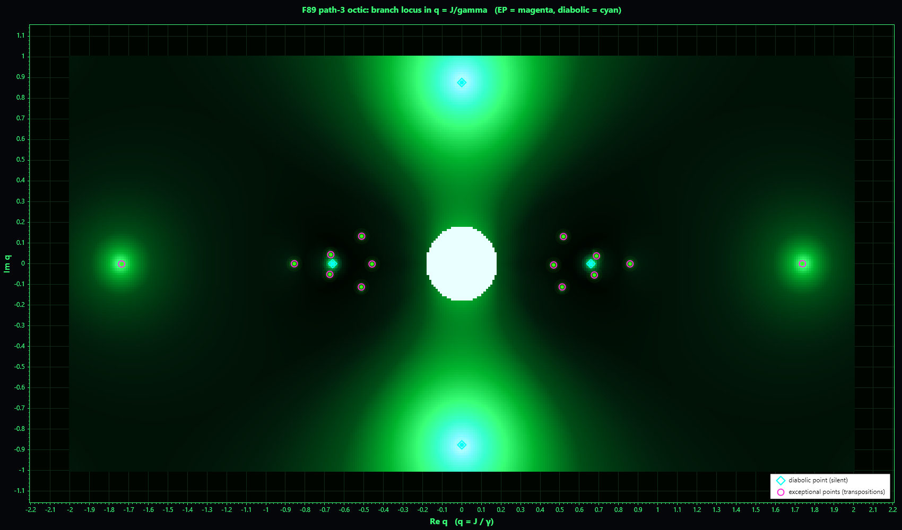

# The Branch Locus Is a Palindrome: the F89 Octic's EPs Inherit the Mirror

**Status:** Tier 1 derived. The branch-locus mirror about Re λ = −4 is forced by the F1 palindrome carried on the block as an antiunitary symmetry, exact as a polynomial identity in q; verified on the committed octic literal to 4·10⁻¹³ and over the whole complex-q plane to machine precision, with no orphan. The plain-words sibling is [`reflections/ON_WHO_WATCHES_WHOM.md`](../reflections/ON_WHO_WATCHES_WHOM.md).

**Date:** 2026-06-25
**Authors:** Thomas Wicht, Claude (Opus 4.8)

## What this is about

Take the eight relaxation rates of the [path-3 octic](F89_TOPOLOGY_ORBIT_CLOSURE.md), the watched, unwritable half of a four-site chain's (SE,DE) coherence block, and follow them as the one knob q = J/γ turns out into the complex plane. They braid, and at certain settings of q two of them collide: an exceptional point (EP), or, at one special place, a diabolic point. Each collision happens at some value of the rate λ. This note asks where those collision points sit, and the answer is: they are organised by the oldest symmetry the project has, the palindrome. Every collision lies on the mirror line Re λ = −4 or comes with a partner the same distance across it. The branch locus is itself a palindrome, and it is so because the palindrome forces it, not by accident. This is the spectral, exact face of the observer/observed reading in the reflection.

*The branch locus in the q = J/γ plane: the octic min-gap as a cyberpunk-Matrix heatmap (dark to neon green to cyan-white as two rates approach), the exceptional points in magenta and the 4 diabolic points in amber/gold (the real pair q ≈ ±0.659, the imaginary pair q ≈ ±0.876i). 18 of the 20 EPs are in frame, the remote quartet at q ≈ ±2.31 ± 1.25i near the corners included; the two remaining are near-twins at q ≈ ±0.857/±0.854, ~0.003 apart, that render as one dot each at this cell (the exact 20 live in the discriminant, below). The bright white core at q = 0 is the trivial J = 0 super-branch, not an EP. The locus is symmetric under q → −q and q → q̄; each collision's rate λ then sits on Re λ = −4 or in a mirror pair across it. Drawn by the `gmscan` flashlight (`--re -2.6,2.6 --im -1.5,1.5 --cell 0.05 --png`).*

**q and Q require a Hamiltonian conversion.** Here q_octic = J_F89/γ for H = J_F89·(XX+YY), with hopping 2J_F89. The carrier clock uses Q_carrier = J_carrier/γ for H = (J_carrier/2)·(XX+YY), with hopping J_carrier. For the same physical chain, J_carrier = 2J_F89 and q_octic = Q_carrier/2. Thus Q_carrier = 1.5 corresponds to q_octic = 0.75, not 1.5; the octic diabolic q_octic ≈ 0.659 corresponds to Q_carrier ≈ 1.318. Both use the same per-site dephasing rate γ=γ₀. Complex q_octic is analytic continuation, not a physical dial setting. Distinct spectral sectors still have distinct collisions after this normalization conversion. See `F90F86C2BridgeIdentity` and [GLOSSARY.md](../docs/GLOSSARY.md), "The coupling ratio q and Q".

## The mirror, carried on the block

The full Liouvillian's [palindrome](../docs/proofs/MIRROR_SYMMETRY_PROOF.md) is Π L Π⁻¹ = −L − 2σ, σ = Σγ; eigenvalues pair as λ ↦ −λ − 2σ about the fixed centre −σ. On the (SE,DE) path-3 block, L(q) = re + i·q·im with re the real dephasing diagonal (entries −2γ on overlap, n_diff = 1, and −6γ on no-overlap, n_diff = 3) and im the real symmetric XY hopping. These two rungs are F1 weight-complement partners (the Hamming complement sends n_diff = 1 ↔ 3, sum N_block = 4; rates 2γ ↔ 6γ sum to 2σ = 8γ), so the block's palindrome centre is the rung midpoint **−σ = −N_block·γ = −4γ**. The centre is not a separate fact: it IS the palindrome, the −2/−6 rungs being a mirror pair and −4 their fixed point. (Independent check: the octic's eight roots sum to −32, average −4.)

The operative symmetry on the block is **antiunitary**, T = P·K, with P the F1 weight-complement permutation (it swaps the rate-2γ and rate-6γ rungs and commutes with the J-hopping) and K complex conjugation. The exact statement carries the conjugate q̄ on the right (so it is a same-q identity on the real axis, the vertical fold, and a q → q̄ relation off it):

    T L(q) T⁻¹ = −L(q̄) − 2σ      for all q,   σ = 4γ

Equivalently, on the octic itself,

    F₈(λ, q) = F₈(−λ − 8, −q).

The spectral action of T is antilinear, **λ ↦ −λ̄ − 2σ**: it reflects the rate (Re λ) about −σ = −4 and *preserves* the frequency (Im λ). This is the vertical mirror about Re λ = −4. (The bare linear palindrome λ ↦ −λ − 2σ of F1 flips the frequency and is a symmetry of the block only together with J ↦ −q, which is the q → −q twist visible in the octic identity. Bare conjugation alone is not a symmetry either: the octic has Q(i) coefficients. The vertical-line fold is precisely palindrome composed with conjugation.)

## Why the EPs inherit it

Because T L(q) T⁻¹ = −L(q̄) − 2σ holds for all q, it is a symmetry of the whole family, and every coalescence datum inherits it. If (q*, λ*) is an EP (a double root of det(λ − L(q*))), then (q̄*, −λ̄* − 2σ) is a double root, at the **same** q* when q* is real and at the conjugate q̄* in general. So the locus of (q, merged λ) is invariant under (q, λ) ↦ (q̄, −λ̄ − 2σ), and in the rate (Re λ) every collision folds about −4. Two cases, and only two:

- **On the line.** λ* = −λ̄* − 2σ ⟹ Re λ* = −σ = −4: the collision is its own mirror, on the centre line.
- **In a mirror pair.** otherwise the partner −λ̄* − 2σ (sitting at q̄*) is a second collision at equal frequency and rate the same distance on the far side of −4.

No third case. **No orphan is possible.** This is a consequence of the palindrome, not an observed coincidence.

The structure is also visible in the exact discriminant of the octic over Z[i][q]:

    disc_λ(F₈)(q) = const · q²⁴ · (3q⁴ + q² − 1)² · P₂₀(q)

- **q²⁴**: the J = 0 super-branch at the origin (all rates collapse onto the rungs; itself mirror-symmetric).
- **(3q⁴ + q² − 1)²**, multiplicity 2: the four **diabolic** points, q ≈ ±0.659 (real) and ±0.876i (imaginary).
- **P₂₀(q)**, degree 20 (even, degree 10 in q²), multiplicity 1: the twenty genuine **EPs**. (Note: the witness comment writes this factor as P₁₀, meaning degree 10 in u = q², i.e. 20 roots in q.)

## The line and the N=4 twin-scalar restriction

It is tempting, and wrong, to say the diabolic is silent *because* it is its own reflection. The palindrome supplies the line and the pairing; it does **not** supply the diabolic's position on the line, nor its silence (semisimple character). Two independent halves of L coincide at the diabolic:

- **On the line (Re λ_EP = −4)** at the N=4 point: its coalescing pair is overlap-balanced (p = ½), and the dephasing restriction is the scalar −4γ·I, the AT-midpoint. This is the D-half of the [`F89Path3OcticEpClaim`](../compute/RCPsiSquared.Core/Symmetry/F89Path3OcticEpClaim.cs) twin-scalar restriction.
- **Silent (semisimple, λ = −4γ + 2iJ a diabolic crossing)** because the hopping restriction is also scalar, 2iJ·I. The N=4 twin-scalar restriction makes the full restriction λ·I, with two independent eigenvectors and no Jordan coupling; it is not a consequence of the mirror line alone.

The N=4 Delta=0 control in [DIABOLIC_BY_INTEGRABILITY](../hypotheses/DIABOLIC_BY_INTEGRABILITY.md) is certified diabolic. The sampled positive-Delta proposals remain split under the independent full-block certificate, so they establish neither persistence of an on-line degeneracy nor defective character. The palindrome proof is independent of this unresolved local-character question: the exact block identity supplies the mirror and its pairing, while local character requires its own strict restriction or Jordan test.

## Individual real branches at the N=4 crossing

For the one-end, equal-end and opposite-end XY bond profiles, the
[exact N=4 end-response calculation](../docs/proofs/PROOF_ROUTE_B_N4_SELF_FOLD.md)
supplies the additional condition that fixes individual branches: their
two leading q coefficients are real and distinct. The self-fold conjugates
these coefficients, so uniqueness forces it to return each branch to
itself. For real sufficiently small ε the emerging EP2 locations therefore
have real q and Re λ = −4 exactly. This holds to all orders locally;
no numerical ε radius is supplied. The seed is semisimple, but the
perturbed collisions are defective. The mirror fixes their decay rate,
not their character or frequency.

The proof includes a self-folded family with nonreal conjugate leading
coefficients: its branches are exchanged and leave real q. Thus the
positive leading discriminants of the actual N=4 block are essential.

## Verification

- **Algebraic, on the committed literal.** The eight roots of `F89Path3OcticBlock.OcticCoefficientsAtQ2()` at q = 2 close under λ ↦ −λ̄ − 8 to 4·10⁻¹³; they do NOT close under the bare linear λ ↦ −λ − 8 (off by 4.3) nor under bare conjugation (off by 4.3), pinning the operative symmetry as the antiunitary vertical mirror. The four on-line roots and two mirror pairs are explicit (rates summing to 8 at equal frequency).
- **Numerical, over the plane.** An independent numpy/sympy rebuild reproduces the C# strands and the exact discriminant factorisation above; every one of the 24 genuine branch points (4 diabolic + 20 EP) is on Re = −4 or in an exact mirror pair, residual ~10⁻¹⁵, max ~3·10⁻¹². A deliberate hunt across the whole plane for an off-centre EP with a missing mirror found none.
- **Live.** `dotnet run --project compute/RCPsiSquared.Cli -- gmscan --re -2,2 --im -0.3,0.3 --cell 0.04 --mirror` prints, per branch point, the collision λ_EP and its distance |Re + 4| from the centre. (The cell-scan q-values are resolution-limited; the exact truth is in the discriminant.) The braid and the EP/diabolic classification are the live witness `inspect --root galoismonodromy`.

## Reading and scope

The picture of the branch locus ([visualizations](../visualizations/README.md), `f89_octic_branch_locus.png`) is therefore not a picture of the spectrum but a map of the seams, and the map is a palindrome: the silent self-coincidence at the fold, the swapping EPs on the line or paired across it. Read through the observer/observed lens of [`ON_WHO_WATCHES_WHOM`](../reflections/ON_WHO_WATCHES_WHOM.md), the palindrome is the watcher-and-watched mirror, and the branch locus is the map of where the two exchange; that reading is a seeing, not a claim, but the mirror structure under it is exact.

The typed home is `F89BranchLocusPalindromeClaim` (Tier 1 derived; parents `F1PalindromeIdentity` and `F89Path3OcticEpClaim`), live at `inspect --root branchpalindrome` (the two-sided gate, the centre, the diabolic, the 0-orphan count, recomputed each call).

Scope, now **checked** (2026-06-26, the `foldlift` probe over path-k blocks: `rcpsi foldlift`, feeding the exact `F89PathKSeDeBlock` builder, a spectrum check, no monodromy rebuild): the within-(SE,DE)-block self-fold is **N_block = 4 only**. The block spectrum closes under the antiunitary λ ↦ −λ̄ − 2σ at N=4 (residual 3·10⁻¹⁴, four on-line zeros) but **not** at N=5,6,7 (residual ~1, zero on-line strands). The reason is from below: the rung-swap weight-complement P needs the overlap rung (−2γ, n_diff=1, **2** states per DE pair) and the no-overlap rung (−6γ, n_diff=3, **N−2** states per DE pair) balanced, **2 = N−2**, true only at N_block = 4. This is the branch-locus face of the same half-filling self-complement DE = popcount-2 = bar(popcount-2) already isolated for **mode population** in [`F89_TOPOLOGY_ORBIT_CLOSURE.md`](F89_TOPOLOGY_ORBIT_CLOSURE.md) (and one of the catalogued N=4 coincidences, the retired `small_n_specials` arc). Two guards keep this a sharpening, not a contradiction: **(i)** the *global* palindrome Π L Π⁻¹ = −L − 2σ still holds for all N (proven, F1). Its column bit-flip ρ[a,b] → ρ[a,bar(b)] pairs the (SE,DE) = (w₁,w₂) block with **(SE, w_{N−2}) = (w₁, w_{N−2})** (the bra index complements; n_diff(a,b) + n_diff(a,bar(b)) = N, so the two rungs complement, the [F89c lemma](F89_TOPOLOGY_ORBIT_CLOSURE.md)), and only the case where that partner *is* (SE,DE) itself (w_{N−2} = w₂, i.e. N=4) gives the within-block self-fold. The `foldcross` probe (`rcpsi foldcross`) confirms it: the cross-fold spec(SE,DE) ↔ spec(SE,w_{N−2}) under λ ↦ −λ̄ − 2σ holds to ~10⁻¹³ about σ = N for N = 4,5,6 (the two block centroids sit symmetric about −N, e.g. −4.4 / −5.6 about −5), while the (SE,DE) self-fold breaks at N ≥ 5. So the global palindrome **lifts to all N as a cross-block mirror**; the N=4 self-fold is the degenerate partner = self case. The earlier "the weight-complement P is topology-general" read conflated the global Π (which lifts, cross-block) with the block-internal P (N=4-only). **(ii)** the multiplicity count 2 = N−2 is distinct from the eigenvector overlap-fraction p = ½ of the diabolic crossing above (a basis-state count, not an eigenvector weight). So "where do the N=4 zeros go for N ≥ 5?" is answered: the on-line self-mirror strands become cross-block mirror partners ((SE,DE) ↔ (SE,w_{N−2})), not gone. The remaining open step is the monodromy / "± is the road" route structure *among* those cross-block partners, which still needs the path-3 witness generalized. The "palindrome is the inherited root" framing belongs to [`OBSERVER_INHERITANCE`](../reflections/OBSERVER_INHERITANCE.md) and the mirror family.

## Two mirrors in the end-bond response

The [N=4/5/6 end-bond studies](ROUTE_B_OTHER_N_UNFOLDING.md) reveal two
separate roles of the repository's mirrors. Spatial reversal R acts on both
indices of a coherence and leaves its disagreement count unchanged. Bra
complementation B changes only the bra index and sends disagreement k to
N-k. For example, at N=5 the cell |00001><00110| pays -6; its bra-complement
|00001><11001| pays -4. Their sum is -10, twice the palindrome center -5.
Spatial reversal preserves the -6 cell cost instead.

| Operation | Action on the end-bond problem | Exact consequence |
|---|---|---|
| Spatial reversal R, F131/F92 | Exchanges the two end strengths inside the same block | Odd end direction maps epsilon to -epsilon; on a scalar-parity two-plane the effective response is even |
| Palindrome bra leg B with conjugation, F89d | Maps (1,2) to (1,N-2), q to conjugate q and epsilon to conjugate epsilon | Entire eigenvalue and EP branches have mirror partners, including their Taylor coefficients and remainder bounds |

The two operations commute. Breaking spatial reflection by making the ends
unequal does not break the palindromic partner relation: the latter holds
for every real-coefficient XY bond profile in this study. Keeping spatial
reflection by changing both ends equally does not prevent the diabolic
crossing from opening into EPs. Neither statement is a contradiction:
spatial reversal sorts the allowed orders; the palindrome pairs the response.

For the selected crossings the partner coordinates are:

| N | Source and partner blocks | Source lambda | Partner lambda |
|---:|---|---|---|
| 4 | (1,2) to itself, 24D | -4+1.317965927 i | -4+1.317965927 i |
| 5 | (1,2) to (1,3), 50D | -4.791960365 | -5.208039635 |
| 6 | (1,2) to (1,4), 90D | -4.279627831-0.760231389 i | -7.720372169-0.760231389 i |

The N=4/5 q seeds are real. At N=6 the source q is
1.672594146+1.096813948 i and its partner is the conjugate. The rate reflects
about -N while the frequency is preserved. At N=4 the selected seed is its
own vertical-fold image; self-folding alone does not guarantee that every
perturbed q branch stays real or every merged eigenvalue stays on the line.

The [response transport proof](../docs/proofs/PROOF_ROUTE_B_N6_UNFOLDING.md#6-the-palindrome-transports-the-entire-response)
shows that the spectral projector conjugates and the reduced resolvent
minus-conjugates under B. Each virtual-mode contribution to the quadratic
response therefore has an equally large mirrored contribution. In particular,
the large N=4 response found by removing its nearest opposite-parity residue
has a matching image; the palindrome does not bound that response's size.

Every q-coordinate Taylor coefficient conjugates, while every nonconstant
lambda coefficient minus-conjugates. The N=6 certified epsilon radii
2^-20 (one end), 2^-18 (equal ends), and 2^-10 (opposite ends) transfer
unchanged to the (1,4) partner, as do the relative Taylor remainder bounds.
This uses the proven source certificate and exact mirror identity, not a
second numerical certification. It gives no new radius for the N=4/5 examples.

Reproduce the from-below checks with
`python simulations/route_b_mirror_response.py` and OPENBLAS_NUM_THREADS=1.
The [JSON](../simulations/results/route_b_mirror_response.json) retains 18
exact dyadic family identities, the disagreement-rung pairing, independently
rebuilt partner-plane readings and an incorrect-complex-epsilon control.
Conjugating q but forgetting to conjugate complex epsilon fails. The maximum
normalized next-coefficient error is below 4.2e-13; the full-space B2 transport
residual reaches about 1.84e-10 at the sensitive N=4 seed. These floating
readings corroborate the algebra, rather than proving it by a tolerance.

## Related

- [`reflections/ON_WHO_WATCHES_WHOM.md`](../reflections/ON_WHO_WATCHES_WHOM.md): the plain-words reading (γ as the watching, the seams where observer and observed exchange).
- [`docs/proofs/MIRROR_SYMMETRY_PROOF.md`](../docs/proofs/MIRROR_SYMMETRY_PROOF.md): the F1 palindrome Π L Π⁻¹ = −L − 2σ.
- [`experiments/F89_TOPOLOGY_ORBIT_CLOSURE.md`](F89_TOPOLOGY_ORBIT_CLOSURE.md): the octic and its factorisation; [`experiments/F89_PATH_K_GALOIS.md`](F89_PATH_K_GALOIS.md): the Galois verdict, the diabolic location, the discriminant.
- [`hypotheses/DIABOLIC_BY_INTEGRABILITY.md`](../hypotheses/DIABOLIC_BY_INTEGRABILITY.md): the N=4 twin-scalar character fact, the sampled Delta counterexample to "on-line ⟹ silent", and the separate Tier-2 protection hypothesis.
- [`reflections/OBSERVER_INHERITANCE.md`](../reflections/OBSERVER_INHERITANCE.md), [`reflections/ON_BOTH_SIDES_OF_THE_MIRROR.md`](../reflections/ON_BOTH_SIDES_OF_THE_MIRROR.md): the inherited mirror.
- Live: `inspect --root branchpalindrome` (the typed witness), `inspect --root galoismonodromy`, `gmscan --mirror`.
