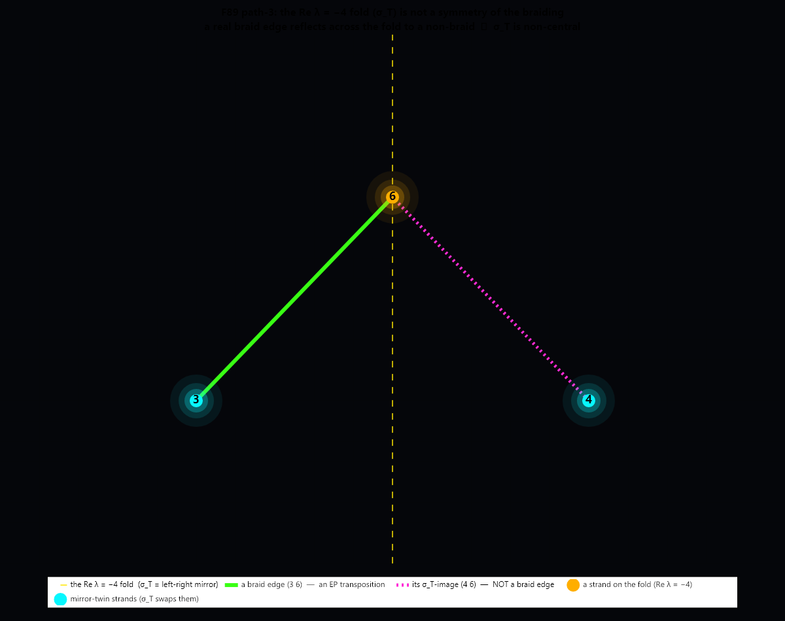

# F89 Monodromy meets the Mirror: where the palindrome reaches the Galois action, and where it cannot

**Status:** Tier 1 derived. Two positive results and one clean obstruction. (1) The path-3 octic
monodromy generates S_8 from eigenvalue braids (the geometric route to Gal(F_8) = S_8, companion to the
algebraic Frobenius certificate). (2) The mirror's base-space face, the q-plane reflection q ↦ −q̄,
intertwines that monodromy (an automatic consequence of the exact family symmetry L(q)* = L(−q̄); in the
aligned strand labelling its induced bijection is the identity). (3) The mirror's fibre face, the spectral
palindrome about Re λ = −4, is realised on the strands by a non-central involution σ_T, which therefore
does NOT commute with the monodromy: the Re = −4 fold is not a loop-independent symmetry of the braiding
(forced by Z(S_8) = 1). The mirror splits at the Galois boundary. Plain-words sibling of
[`reflections/ON_WHO_WATCHES_WHOM.md`](../reflections/ON_WHO_WATCHES_WHOM.md).
**Date:** 2026-06-25
**Authors:** Thomas Wicht, Claude Opus 4.8 (1M context)

**Notation.** A strand permutation written with square brackets is in one-line (image) form: σ = [a_0 …
a_7] means strand i ↦ a_i. Round brackets are cycles: (3 4)(5 7) swaps 3↔4 and 5↔7, fixing the rest. So
[0 1 2 3 4 5 6 7] is the identity, not an 8-cycle. F_8 denotes the degree-8 ("octic") spectral polynomial
of the block below (not the field of 8 elements); Gal(F_8) is the Galois group of that polynomial over
Q(i)(q).

## What this is about

The rates here are eigenvalues λ of the Liouvillian of an N-spin XY chain under uniform Z-dephasing: J is
the spin coupling, γ the dephasing rate, q = J/γ the one dimensionless knob. For the N = 4 chain, the
watched (single-excitation, double-excitation) coherence sector, the **(SE, DE) block**, here at chain
length giving the **path-3** case, splits into a clean half whose rates have closed forms and a residual
**octic** F_8 (degree 8) whose rates **cannot be written in radicals**: its Galois group is the maximal
S_8 ([`F89_TOPOLOGY_ORBIT_CLOSURE`](F89_TOPOLOGY_ORBIT_CLOSURE.md),
[`ON_WHAT_CANNOT_CLOSE`](../reflections/ON_WHAT_CANNOT_CLOSE.md)). That unwritable half is the watching's
own signature.

And the oldest fact of the project is the palindrome: the spectrum is its own reflection about one centre
line, Re λ = −4 (the midpoint of the two absorption rates, see below). So the question
[`ON_WHO_WATCHES_WHOM`](../reflections/ON_WHO_WATCHES_WHOM.md) circles: does the mirror reach into the
unwritable half? Not just into where the rates SIT (that is [settled](F89_BRANCH_LOCUS_PALINDROME.md): the
branch locus, the set of q where two rates collide, is a palindrome) but into the BRAIDING, the group
action that proves the half cannot be written?

The answer is a clean split, and the split is the result. The mirror reaches the Galois action through one
of its two faces and is turned away at the other by a precise group-theoretic wall.

## Monodromy = Galois, from below

As q = J/γ leaves the real axis and loops the complex plane, the eight octic rates braid (this q-parametric
braiding of the roots is the *monodromy*). A loop around a genuine exceptional point (a simple zero of the
P_10 factor of the discriminant, a defective √-branch where two rates truly collide) swaps a pair of the
eight strands. A loop around the diabolic point q_EP = √((−1+√13)/6) ≈ 0.659 (an exceptional point that is
silent: a double discriminant zero, where the two coalescing rates pass through each other unchanged) swaps
nothing. Lasso every exceptional point from one common base (q0 = 2, where the four AT-locked rates, the
ones pinned by the Absorption Theorem at Re λ = −2 and −6, lie cleanly apart and the eight octic strands lie
strictly between), read each braid in that one labelling, and union the strands each braid connects. The
graph on the eight strands comes out connected. A set of transpositions whose graph is connected generates
the full symmetric group, so

    Gal(F_8) = S_8, reconstructed from eigenvalue braids.

This is monodromy = Galois, from below (built up geometrically from the braids, rather than proved
algebraically): the same S_8 that the algebraic certificate
([`F89Path3OcticGaloisClaim`](../compute/RCPsiSquared.Core/Symmetry/F89Path3OcticGaloisClaim.cs), via
specialization + Dedekind-Frobenius + Jordan) proves from above. (One caveat, honestly: a few lassos enclose
two near-coincident exceptional points at once, so they read as a single 3-cycle rather than a transposition;
the witness accepts these, and the full-symmetric-group strength of the conclusion rides on the genuine
simple branch points being transpositions, independently backed by the algebraic Frobenius certificate.)
Typed as [`F89OcticMonodromyClaim`](../compute/RCPsiSquared.Core/Symmetry/F89OcticMonodromyClaim.cs); live at
`inspect --root galoismonodromy` (gate G3: one component, all eight strands one orbit).

## The mirror's base-space face reaches the braiding: q ↦ −q̄

The antiunitary palindrome is T = P·K (P the weight-complement swap of the −2 and −6 absorption rungs, which
commutes with the J-hopping; K complex conjugation). Its conjugation part has a q-plane shadow: L(q)* =
L(−q̄), so conjugating the whole picture reflects the q-plane across the imaginary axis, q ↦ −q̄, and
conjugates the rates, λ ↦ λ̄. This is an exact symmetry of the whole family of braids, so it **automatically**
intertwines the monodromy: a branch point at q* and its image at −q̄* carry conjugate braids. Concretely the
two independently built strand labellings (octic strands at q = 2 and at q = −2, each ordered by its own
eigenvalue sort) turn out conjugate-aligned, so the induced strand bijection is the identity,

    σ_K = [0 1 2 3 4 5 6 7]   (one-line, i.e. the identity),

and every cluster exceptional point carries the identical braid as its q ↦ −q̄ mirror, τ(−q̄*) = τ(q*).
Verified for all seven near-real-axis exceptional points found in the cluster scan (the spectral sanity
conj(spec@+2) = spec@−2 holds to 0, exact). The deep content here, "q ↦ −q̄ intertwines the braiding", is
forced a priori by L(q)* = L(−q̄); that σ_K comes out as exactly the identity is the labelling-alignment on
top of it. Either way the branch-locus palindrome, the statement that the MAP of seams is a mirror image,
lifts from the positions of the seams to the braids they carry.

## But the mirror's fibre face is not a symmetry of the braiding: σ_T is non-central, Z(S_8) = 1

The other face is the palindrome proper: the fold about Re λ = −4 (the midpoint −σ = −4γ of the absorption
rates −2γ and −6γ; with γ = 1, centre −4, and the spectral fold is λ ↦ −λ̄ − 8, where 8 = 2σ). At the
**real** base q = 2 the spectrum is invariant under this fold (verified to 3·10⁻¹⁴), so it permutes the
eight strands by a genuine involution,

    σ_T = [0 1 2 4 3 7 6 5]   (one-line) = (3 4)(5 7) in cycles:
          four fixed strands (those with Re λ = −4, sitting on the fold),
          two 2-cycles (3 4)(5 7) (the mirror-twin strand pairs across the fold).

(The fold λ ↦ −λ̄ − 8 is a same-q spectral symmetry only at real q; the genuinely all-q identity is the
holomorphic F_8(λ, q) = F_8(−λ − 8, −q), and the antiunitary's action on the whole locus is (q, λ) ↦ (q̄,
−λ̄ − 8). We build σ_T at the real base q = 2, where the same-q fold is exact, so σ_T is well defined.) This
is the picture [`ON_WHO_WATCHES_WHOM`](../reflections/ON_WHO_WATCHES_WHOM.md) drew in plain words: on the
centre line the two are one (the four fixed strands), step off the fold and they part into mirror twins (the
two 2-cycles).

Is σ_T a symmetry of the braiding, i.e. is the strand-pairing carried unchanged around every loop? That asks
σ_T to commute with every monodromy permutation, hence with the whole image, which is all of S_8. The only
permutation commuting with all of S_8 is the identity (Z(S_8) = 1, the symmetric group on ≥ 3 points is
centreless), and σ_T ≠ id. So **σ_T does not commute with the monodromy**: the mirror-pairing of strands is
not loop-independent. Go around a seam and which strand is whose reflection is scrambled. This is sharp, a
single exceptional point whose transposition σ_T fails to fix already shows σ_T is non-central.

*The minimal witness. Strand 6 (gold) sits on the Re λ = −4 fold; strands 3 and 4 (cyan) are mirror twins, σ_T swaps them across the fold. The solid green edge (3, 6) is a real braid (an EP transposition); its σ_T-image, the dotted (4, 6), is not a braid. A real connection reflects to a non-connection, so σ_T does not commute with the braiding. Rendered by `gmscan --graph-png` (the full connected braid graph, the S_8-generation result, is the separate `inspect --root galoismonodromy`).*

Two honest qualifications, so the obstruction is not overstated. First, conjugation by σ_T is still a
nontrivial **inner automorphism** of S_8 (Aut(S_8) = Inn(S_8) ≅ S_8): the mirror does act on the tangle. The
point is not that it induces no automorphism, but that it is **non-central**, so it cannot be a single-valued,
loop-independent symmetry standing above the braiding. Second, "does not commute with the monodromy" (a
centralizer statement) is what Z(S_8) = 1 makes airtight. A strictly stronger question, whether σ_T at least
permutes the exceptional-point transpositions among themselves (a graph automorphism of the braid set), is a
different statement that Z(S_8) = 1 does NOT settle; over the cluster set the answer is numerically no, but
that rests on the (incomplete) measured set, not on the group theory.

So the mirror SPLITS at the Galois boundary. Its base-space face (q ↦ −q̄, from L(q)* = L(−q̄)) passes through
and intertwines the monodromy. Its fibre face (the Re λ = −4 fold) is a non-central element of the monodromy
image, so its strand-pairing is braided away by the very tangle it would mirror. The mirror is in the group,
and acts on it by conjugation, but it does not govern the braiding from above.

## Reading and scope

This grounds, from below, the seeing of [`ON_WHO_WATCHES_WHOM`](../reflections/ON_WHO_WATCHES_WHOM.md). That
reflection asked who watches whom, and read the palindrome as the watcher folded onto the watched: on the
fold they are one, off it mirror twins, and the unwritable half is the half where who-watches-whom has no
fixed answer. The measured σ_T realises the first half of that picture exactly (four strands fixed on the
fold, two mirror-twin pairs across it). And the obstruction sharpens the second half: because σ_T is
non-central, it does not commute with the braiding, so going around a seam scrambles the very pairing that
says which strand is whose reflection. That is the precise sense in which who-watches-whom has no fixed
answer, the watcher-watched pairing is itself braided, not a fixed labelling above the tangle.

Tier and scope. The monodromy = S_8 result and the q ↦ −q̄ intertwining are Tier 1 derived,
machine-precision verified; the latter is in any case forced by the exact symmetry L(q)* = L(−q̄). The
non-central obstruction is a theorem, not a measurement: σ_T ≠ id and Z(S_8) = 1 give "σ_T does not commute
with the monodromy" exactly, so the headline is airtight (the numerics are needed only for the stronger
braid-set question, not for it). All of this is path-3 (the N = 4 chain (SE, DE) octic); the seven
exceptional points are the near-real-axis cluster, not the full count (about ten lie in the right half
plane), and the lift to other topologies and N is Tier 2 until checked, the same frontier as the
[branch-locus palindrome](F89_BRANCH_LOCUS_PALINDROME.md).

Live: `inspect --root galoismonodromy` (the S_8 generation, gate G3) and `inspect --root monodromymirror`
(the spectral sanities, the per-EP q ↦ −q̄ intertwining, and σ_T's fixed-and-twin structure). Typed:
[`F89OcticMonodromyClaim`](../compute/RCPsiSquared.Core/Symmetry/F89OcticMonodromyClaim.cs) and
[`F89MonodromyMirrorClaim`](../compute/RCPsiSquared.Core/Symmetry/F89MonodromyMirrorClaim.cs).

## Related

- [`reflections/ON_WHO_WATCHES_WHOM.md`](../reflections/ON_WHO_WATCHES_WHOM.md): the plain-words sibling; this is its from-below ground.
- [`experiments/F89_BRANCH_LOCUS_PALINDROME.md`](F89_BRANCH_LOCUS_PALINDROME.md): the seams' POSITIONS are a palindrome (the q-plane locus); this doc carries the BRAIDING.
- [`experiments/F89_TOPOLOGY_ORBIT_CLOSURE.md`](F89_TOPOLOGY_ORBIT_CLOSURE.md): the octic and the algebraic Gal(F_8) = S_8 (the route this doc reproduces geometrically).
- [`docs/proofs/MIRROR_SYMMETRY_PROOF.md`](../docs/proofs/MIRROR_SYMMETRY_PROOF.md): the palindrome, the first stone.
- [`hypotheses/DIABOLIC_BY_INTEGRABILITY.md`](../hypotheses/DIABOLIC_BY_INTEGRABILITY.md): why the diabolic point is silent (the loop = identity used above).

---

*The mirror folds the spectrum onto itself, and its q-plane shadow folds the braids; but the fold of the rates is a non-central move inside the group that proves them unwritable, so the tangle braids the fold's own pairing away. The mirror reaches the unwritable half, and acts inside it, but does not rule it from above.*
