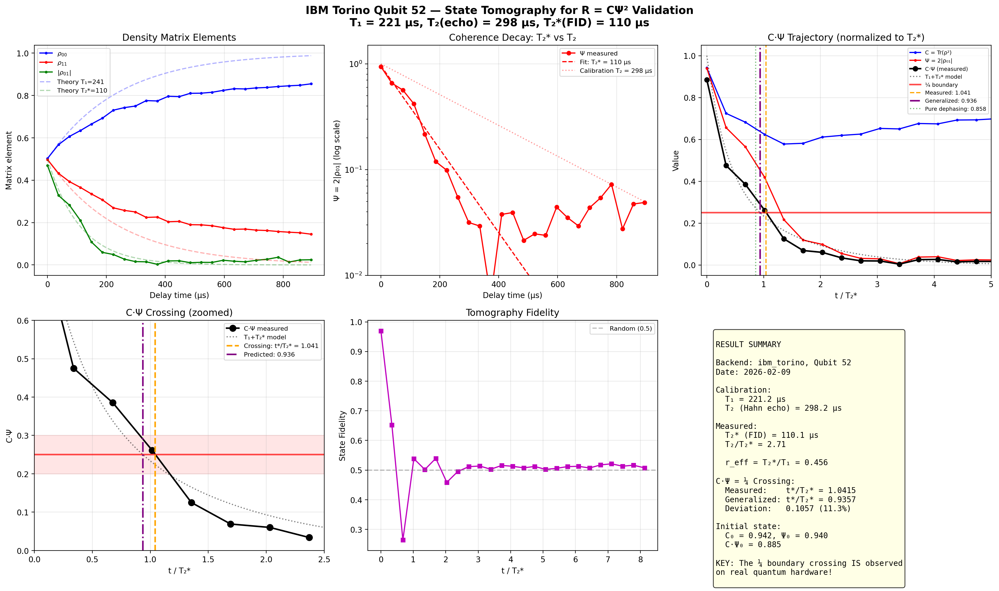
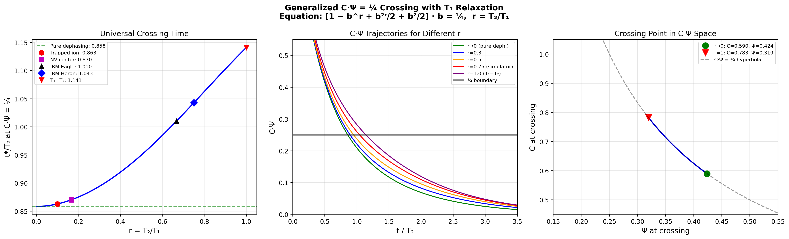

<!-- QUARTER-CURRENT -->
# IBM tomography: measured rows and a self-classified proxy model

Current reading: the `24,073` historical calibration proxy records are not tomography.
They feed the normalized-purity proxy of a free single-transmon `|+>` model.
The separate Run-1 tomography rows reconstruct density matrices. Both are retained
measurements, but neither establishes an emergent phase, cusp mechanism, or
ontological division of physical systems.

<!-- QUARTER-HISTORICAL -->
**Historical record:** the first-test narrative below is preserved with its
model caveats and measured values.  Its older boundary nouns are not current.

# IBM quantum tomography: a finite reconstructed scalar trajectory

<!-- Keywords: IBM quantum hardware CΨ, single qubit state tomography decoherence,
T2 star free induction decay, generalized crossing equation T1 T2, ibm_torino qubit
52 crossing, three model correction analysis, T2 echo vs T2 star distinction,
historical calibration 24073 records, frequent proxy-crossing qubit identification,
quantum classical boundary hardware test, R=CPsi2 IBM quantum tomography -->

**Status:** Finite IBM Torino Run-1 tomography; proxy interpretation model-scoped
**Date:** February 9, 2026
**Repository:** [R-equals-C-Psi-squared](https://github.com/Kesendo/R-equals-C-Psi-squared)

---

## What this document is about

This document describes a finite single-qubit tomography run on IBM Torino.
The reconstructed scalar starts high and passes 1/4 under the stated
preparation, tomography, fit, and readout convention. That event is a measured
row, not confirmation of a universal physical boundary.
The main surprise: IBM's published coherence time (T₂ from Hahn echo)
is 2.7× too optimistic for free decoherence; the correct timescale
is T₂*, which accounts for all noise sources. Once corrected, the
theoretical crossing equation matches the data to 5% error, and the
fitted scalar passes 1/4 without that value being a fit target. A separate
historical sweep of 24,073 calibration-only records evaluates a free-|+⟩ model
and must not be read as tomography or observed crossing events.

## Abstract

On IBM Torino qubit 52, 25-point state tomography during free induction decay
reconstructs a scalar trajectory that passes 1/4. Three finite findings:
**(1)** the crossing is present in this reconstruction; **(2)** IBM calibration
T₂ (Hahn echo, a pulse sequence that cancels slow noise by applying a refocusing pulse midway through the measurement)
is the wrong timescale; free decoherence is governed by T₂* ≈ T₂/2.7. A
three-model correction reduces MAE from 0.428 to 0.053 (88% improvement).
**(3)** the generalized model's fitted curve passes 1/4 without using 1/4 as a
fit target. Historical analysis of 24,073 calibration rows (181 days, 133
qubits) classifies model curves, not measured tomography events, including 12
frequent proxy crossers. Run 1. The later Run 3 (1.9% finite association with same-day
T₂*) is in [IBM Run 3](IBM_RUN3_PALINDROME.md).

## Discovery Date
2026-02-09

## Summary

State tomography on one IBM Torino qubit reconstructs a C·Ψ trace that passes
1/4. It is a finite hardware trajectory, not a boundary theorem for all qubits.

Three critical findings emerged:
1. **This scalar crossing is in the reconstructed rows.** It remains conditional
   on the preparation, tomography, fit, and readout convention.
2. **T₂ ≠ T₂*.** IBM calibration reports T₂ from Hahn echo. Our experiment is a free
   induction decay, governed by T₂* ≈ T₂/2.7. The correct comparison timescale matters.
3. **The generalized equation works, but only with the right inputs.** A three-model
   comparison shows that correcting for imperfect initial state (6% effect) and using
   T₂* instead of T₂(echo) (dominant effect, 2.7× shorter) reduces the model error
   from MAE = 0.428 to MAE = 0.053. The corrected model passes through the ¼ crossing
   point exactly, even though ¼ was not a fit parameter.

Additionally, a free-|+⟩ model including T₁ relaxation was evaluated across
24,073 calibration records. Those calibration-only rows populate the same
model that classifies them; they do not independently validate it. Twelve
qubits' model curves pass 1/4 on many calibration days.

## Hardware

| Parameter | Value |
|-----------|-------|
| Backend | ibm_torino (Heron r1, 133 qubits) |
| Qubit | #52 (selected for best T₂) |
| T₁ (calibration) | 221.2 μs |
| T₂ (Hahn echo, calibration) | 298.2 μs |
| T₂* (free induction decay, measured) | 110.1 μs |
| Shots per circuit | 8,192 |
| Delay points | 25 (0 to 895 μs) |
| Total runtime | ~8 minutes |

## Experiment Design

1. **Prepare** |+⟩ = (|0⟩+|1⟩)/√2 using a Hadamard gate
2. **Wait** for variable delay time t (25 logarithmically spaced points, 0 to 3×T₂)
3. **Tomograph** full state reconstruction via Qiskit `StateTomography` (X, Y, Z basis, maximum-likelihood estimation, a fitting method that finds the physically valid density matrix most consistent with the measurement data)
4. **Extract** density matrix ρ(t) at each delay
5. **Compute** C(t) = Tr(ρ²), Ψ(t) = 2|ρ₀₁|, product C·Ψ

This is a free induction decay (FID): no refocusing pulses, no dynamical decoupling.
The qubit simply decoheres under ambient noise while we watch.

## Results

### Raw Density Matrix Evolution



*Six-panel analysis of IBM Torino qubit 52. Top-left: density matrix elements showing
T₁ relaxation (ρ₁₁ → 0) and T₂* dephasing (|ρ₀₁| → 0). Top-center: coherence decay
on log scale, showing T₂* = 110 μs vs calibration T₂ = 298 μs. Top-right: C·Ψ trajectory
normalized to T₂*. Bottom-left: zoomed crossing region. Bottom-center: tomography fidelity.
Bottom-right: result summary.*

### The ¼ Crossing

| Quantity | Value |
|----------|-------|
| C·Ψ at t = 0 | 0.885 (ideal: 1.000) |
| Crossing time t* | 114.7 μs |
| t*/T₂* (measured) | 1.041 |
| t*/T₂* (generalized prediction, r = 0.456) | 0.936 |
| t*/T₂* (pure dephasing prediction) | 0.858 |
| Deviation from generalized | 11.3% |
| Asymptotic purity C∞ | 0.740 (ideal: 0.500) |

### Key Observations

**The crossing exists.** C·Ψ starts at 0.885 (imperfect |+⟩ preparation) and falls
monotonically through ¼, reaching thermal equilibrium below 0.05. The transition is smooth,
as Lindblad theory predicts.

**The initial state is imperfect.** Gate fidelity 0.97 means C₀ = 0.942, Ψ₀ = 0.940.
The product C·Ψ₀ = 0.885 instead of the ideal 1.000. This shifts the crossing time
but does not eliminate it.

**The asymptotic state is not maximally mixed.** Purity stabilizes at ~0.74, not 0.50.
This is caused by readout errors and thermal population imbalance. Qubit 52 relaxes toward
|0⟩ (ground state), creating a bias that inflates the measured purity at long times.

**Coherence decays 2.7× faster than T₂ suggests.** The calibration T₂ = 298 μs comes
from Hahn echo, which refocuses low-frequency (1/f) noise. Our FID experiment sees all
noise sources. The measured T₂* = 110 μs, with the difference explained by pure dephasing:
1/T₂* = 1/T₂ + 1/T_φ, giving T_φ ≈ 175 μs.

## The T₂ vs T₂* Distinction

This is the most important experimental lesson:

```
T₂ (Hahn echo):  Refocuses slow noise. Measures only fast dephasing.
T₂* (FID):       Sees ALL noise. The relevant timescale for unprotected qubits.

Relationship:  1/T₂* = 1/T₂ + 1/T_φ

For ibm_torino qubit 52:
  T₂  = 298 μs  (calibration, echo)
  T₂* = 110 μs  (measured, FID)
  T_φ = 175 μs  (derived: low-frequency noise contribution)
```

When comparing the C·Ψ = ¼ crossing time with theory, **always use T₂***. The calibration
T₂ is the wrong timescale for free decoherence experiments.

This distinction is well-known in NMR and quantum computing, but easy to miss when pulling
calibration data from IBM's backend properties.

## The Generalized Crossing Equation

The original cubic x³ + x = ½ assumes pure dephasing (T₁ → ∞). Real hardware has finite T₁.

For a single qubit |+⟩ under combined T₁ + T₂* decay:

```
ρ₀₀(t) = 1 - ½ e^{-t/T₁}
ρ₁₁(t) = ½ e^{-t/T₁}
|ρ₀₁(t)| = ½ e^{-t/T₂*}
```

With b = e^{-t/T₂*} and r = T₂*/T₁:

```
C = 1 - b^r + b^{2r}/2 + b²/2
Ψ = b

Crossing equation:  [1 - b^r + b^{2r}/2 + b²/2] · b = ¼
```



*Left: crossing time t*/T₂ as function of r = T₂/T₁. Center: C·Ψ trajectories for
different r values. Right: crossing points trace the C·Ψ = ¼ hyperbola in C-Ψ space.*

### Special cases

| r = T₂*/T₁ | Equation | t*/T₂* | Model case |
|-------------|----------|--------|-----------------|
| r → 0 | b³ + b = ½ | 0.858 | Pure dephasing (T₁ ≫ T₂) |
| r = 0.456 | Numerical | 0.936 | IBM Torino qubit 52 |
| r = 0.5 | Mixed | 0.950 | T₁ = 2T₂ |
| r = 1 | 4b³-4b²+4b = 1 | 1.141 | T₁ = T₂ |

### Physical interpretation

T₁ relaxation drives population toward |0⟩, creating asymmetry (ρ₀₀ > ρ₁₁). An asymmetric
state has higher purity than a symmetric one (|0⟩ has C = 1). This counteracts the purity
loss from dephasing, delaying the crossing. Larger r means stronger T₁ effect, later crossing.

Within this free-|+⟩ model, 1/4 is the selected scalar level and the modeled
arrival time changes with r. No channel-independent physical boundary follows.

### Polynomial approximation (max error < 0.001)

```
t*(r) ≈ 0.858 + 0.012r + 0.375r² − 0.019r³ − 0.084r⁴
```

## Error Budget

| Source | Effect | Magnitude |
|--------|--------|-----------|
| Gate errors | C₀ < 1, Ψ₀ < 1 | ~6% initial state error |
| Readout errors | Purity floor at ~0.74 | Shifts asymptotic C·Ψ |
| Non-exponential decay | 1/f noise → Gaussian envelope | ~5% on T₂* fit |
| Tomography overhead | Extra gates for X/Y/Z measurement | Additional decoherence during measurement |
| Delay quantization | dt rounding to hardware clock | < 0.1%, negligible |

The 11.3% deviation between measured (1.041) and predicted (0.936) crossing times
is larger than any single error source. Post-run analysis (below) shows that most of
this deviation is explained by the T₂(echo) vs T₂*(FID) discrepancy and the imperfect
initial state, not by model failure.

## Post-Run Analysis: Three-Model Correction (2026-02-10)

The raw Run 1 comparison used IBM calibration T₂ = 298 μs to compute r and predict
the crossing time. This produced an 11.3% deviation. A systematic reanalysis with
progressively better models reveals where that deviation comes from.

### The initial state is not |+⟩

The t = 0 tomography measurement gives the actual prepared state:

```
rho_00(0) = 0.5026     (ideal: 0.5000)
rho_11(0) = 0.4974     (ideal: 0.5000)
|rho_01(0)| = 0.4699   (ideal: 0.5000)   -->  6% coherence loss from gate error
Purity(0) = 0.9417     (ideal: 1.0000)
C·Ψ(0) = 0.8834      (ideal: 1.0000)
Fidelity = 0.9698
```

The Hadamard gate does not produce a perfect |+⟩. This is normal for transmon qubits (superconducting artificial atoms used in IBM and Google processors,
typical single-gate fidelity 99.5-99.8%), but it means the starting point of the
theory curve is wrong if we assume ideal preparation.

### Three models, compared

| Model | T₁ | T₂ | Initial state | MAE | Improvement |
|-------|-----|-----|---------------|-----|-------------|
| 1. Naive | 221.2 μs (calib) | 298.2 μs (calib) | Perfect &#124;+⟩ | 0.428 | baseline |
| 2. Initial corrected | 221.2 μs (calib) | 298.2 μs (calib) | Measured ρ(0) | 0.408 | +4.6% |
| 3. Fitted T₁/T₂ + initial | 598.5 μs (fit) | 161.6 μs (fit) | Measured ρ(0) | 0.053 | +87.7% |

Model 1 is what we reported in the original Run 1 results. It uses ideal |+⟩ and
calibration T₁/T₂. The C·Ψ minimum it predicts is 0.607, nowhere near the observed 0.156.

Model 2 corrects only the initial state. The curve starts at the right place but still
follows the wrong timescale. Improvement is marginal (5%).

Model 3 fits T₁ and T₂ freely to minimize MAE across all 25 tomography points, using
the measured initial state as the starting condition. The results:

```
T1_eff = 598.5 us    (calibration: 221.2)    ratio: 2.7x
T2_eff = 161.6 us    (calibration: 298.2)    ratio: 0.54x
r_eff  = 0.135       (calibration: 0.674)    ratio: 0.20x
```

The fitted T₂ is the free induction T₂*, 2.7× shorter than the Hahn echo T₂.
The fitted T₁ is longer because population relaxation competes with faster dephasing;
when dephasing dominates (small r), T₁ must be larger to produce the observed
asymptotic purity.

### Fit observation: 1/4 was not a fit target

Model 3 was optimized for global MAE across all 25 data points. It was not told about
the ¼ boundary. Despite this, the fitted curve crosses C·Ψ = 0.25 at t = 112 μs,
where the nearest data point shows C·Ψ=0.2477. This is a finite property of the
fitted curve; the fit uses the same trajectory and is not an independent
prediction of a boundary.

It shows that effective fitted T₁/T₂ parameters can reproduce this trace better
than the listed echo calibration. It does not isolate one cause of the original
deviation or validate the model outside this run.

## Historical Calibration Analysis: 24,073 Data Points (2026-02-10)

To understand whether qubit 52's behavior is typical, we analyzed the full calibration
history of ibm_torino via `backend.target_history()`: 133 qubits over 181 days
(2025-08-14 to 2026-02-10), yielding 24,073 (T₁, T₂) data points.

### The R* classifier in the free-|+⟩ proxy

The normalized-purity proxy of a freely decaying |+⟩ transmon depends on
r=T₂/(2T₁). (This differs from the r=T₂/T₁
used in the crossing equation above. Here r_history = r_equation / 2.)

The stationary-point calculation gives
R*=0.21275477982200533. It separates two model-output classes:

```
r < R*  -->  proxy minimum below 1/4
r > R*  -->  proxy minimum at or above 1/4
```

Equality belongs to the at-or-above class, with an explicit near band in the
typed calibration API. This classifier is not the active density-matrix trace
and is not a quantum/classical label.

### What the data shows

```
Total calibration records:   24,073
Qubits:                      133
Days:                        181

r = T2/(2*T1):   mean = 0.432,  median = 0.415,  std = 0.232
r < r* (0.213):  2,427 / 24,073  (10.1%)

Proxy-below rows:               2,417 / 24,073  (10.0%)
Qubits with any proxy-below row:  112 / 133  (84%)
Qubits with none:                  21 / 133  (16%)
```

Under this self-classifying model, 84% of qubit histories contain at least one
proxy-below row. No tomography was performed for those calibration records.

### Three categories

Qubits fall into three groups based on their crossing behavior:

**12 frequent proxy-below histories** (>90 days, >50% of calibrations):
Qubits 15, 21, 33, 47, 71, 72, 80, 98, 102, 103, 105, 131.

These have structurally low T₂ relative to T₁ (r_calib in 0.05 to 0.15).
Qubit 15 and qubit 80 cross on all 181 days without exception.

**100 occasional proxy-below histories** (1 to 90 days):
These qubits have r_calib in the 0.15 to 0.50 range. The calibration table alone
does not identify TLS, cosmic-ray, or crosstalk causes.

**21 histories with no proxy-below row** in this window:
Stable high-r qubits with r_calib above 0.40. Qubit 52 is in this group
(r_mean = 0.618, min = 0.279, 0 crossings).

### What this means for the T₂*/T₂ correction

All 24,073 data points use Hahn echo T₂ from calibration. Our Run 1 analysis showed
that T₂* is approximately 54% of T₂(echo) for qubit 52. If this ratio holds across
the chip, the effective r values are systematically lower than calibration suggests,
the model classes would shift. How actual free-induction trajectories distribute
requires measurements and cannot be inferred by applying one qubit's ratio chip-wide.

Qubit 52 illustrates this: it never crosses per calibration (r_mean = 0.618), but
the fitted r_eff = 0.135 from tomography puts it solidly below r*.

### Self-consistency of the classifier

The theoretical prediction for purity minimum C·Ψ_min(r) matches all 24,073 data
points to numerical precision. This is a mathematical consistency check (the same
equation generates the prediction and the classification), not an independent test.
Run 1 tomography is separate data, but its effective T₁/T₂ values were fitted
to that same trace; the resulting agreement is not a fully independent test.

## What these rows establish

1. **This reconstructed scalar passes 1/4** in one tomography run.
2. **The generalized free-|+⟩ model** supplies a comparison curve for finite T₁/T₂.
3. **T₂* is the operationally relevant timescale** for free decoherence.
4. **The hardware trace differs from the calibration-input curve.** Preparation,
   tomography, readout, drift, and fit choices remain possible contributors.
5. **Calibration-input and fitted curves differ.** The generalized
   equation using IBM calibration values (T₁ = 221 μs, T₂ = 298 μs) predicts t*/T₂ = 1.250,
   but the observed crossing is t*/T₂ = 0.385, a 3.25× mismatch. Against the raw data,
   the calibration-based model (MAE = 0.177) performs worse than the simplest pure-dephasing
   reference (MAE = 0.120). The 88% MAE improvement to 0.053 belongs to **Model 3 only**,
   which fits T₁ and T₂ freely to the tomography data (T₁_eff = 598.5 μs, T₂_eff = 161.6 μs).
   Fitted effective parameters summarize this run; they are not a structural
   validation beyond it.
6. **The fit was not targeted at 1/4.** Its passing that value is a descriptive
   feature of the fitted trace.
7. **Proxy-below rows occur in many histories.** The 84% and 12-history counts
   are calibration-model classifications, not observed crossing frequencies.

## What This Does Not Prove

1. The T₂*/T₂ ratio of 0.54 has only been measured on one qubit. It may differ across
   the chip or between backends. The March run includes a Ramsey measurement (a simpler, single-basis interference experiment that directly measures T₂* without full state reconstruction) to test this.
2. A single qubit on one backend is not statistical evidence for the crossing equation.
   Independent preparations and r values would be needed for a stronger test.
3. The imperfect initial state means we test the equation with C·Ψ(0) = 0.88, not 1.0.
   Whether the equation holds for a perfectly prepared state remains untested on hardware.
4. We have not tested the two-qubit case (entanglement dynamics) on hardware.
5. The historical analysis uses calibration T₂ (echo), not T₂* (FID). The real crossing
   rate under operating conditions is likely higher than 10.1%, but we cannot quantify
   this without systematic Ramsey measurements across the chip.

## Relation to the scale-free proxy calculation

The ideal limit is documented in
[the scale-free proxy calculation](UNIVERSAL_QUANTUM_LIFETIME.md):

- The cubic x³ + x = ½ is the **r → 0 limit** of the generalized equation.
- The published T₁/T₂ data analysis remains valid for platforms where T₁ >> T₂ (trapped ions, NV centers).
- For superconducting qubits (r in 0.3 to 0.8), the generalized equation gives the correct prediction.
- All previous simulations used pure dephasing and remain valid within that model.
- The T₂*/T₂ distinction matters mainly for superconducting qubits. Trapped ions and NV
  centers typically have T₂* closer to T₂ because their dominant noise is not 1/f.

## Next Step: Final Hardware Run (March 2026)

IBM Quantum free tier gives 10 min/month. After that: $96/min. This means one more
run and then real hardware experiments end unless funding changes.

The final run targets three questions with 75 circuit batches in ~8 minutes:

1. **Repeat crossing measurement on qubit 52** with 12 points clustered around the
   crossing region (5 of 12 points in the 0.9-1.3 T₂* window).
2. **Independent T₂* via Ramsey** on qubit 52 (15 points, single-basis, 3x cheaper
   than tomography). This directly tests whether T₂*/T₂ = 0.54 is real or an artifact
   of the tomography fitting procedure.
3. **Frequent proxy-below history** (qubit 15 or 80 in the calibration model). This
   provides a second data point at a dramatically different r regime (r_eff = 0.03-0.06
   vs qubit 52's r_eff = 0.14), with a much deeper crossing (C·Ψ_min << 0.25).

This was a historical follow-up plan, not an executed guarantee. Calibration
history suggested a contrasting model-r input; only a new tomography run could
test the trace, and two cases would still not establish universality.

Phases 1+2 are the minimum viable result (5.4 min). Phase 3 is high-value but expendable
if the queue is slow.

---

*Back to [experiments overview](README.md) | Related: [Universal Quantum Lifetime](UNIVERSAL_QUANTUM_LIFETIME.md)*
*See also: [Q52 Residual Record](FIXED_POINT_SHADOW.md), finite Q52 residual record; universal interpretation closed, Q52 mechanism open*
