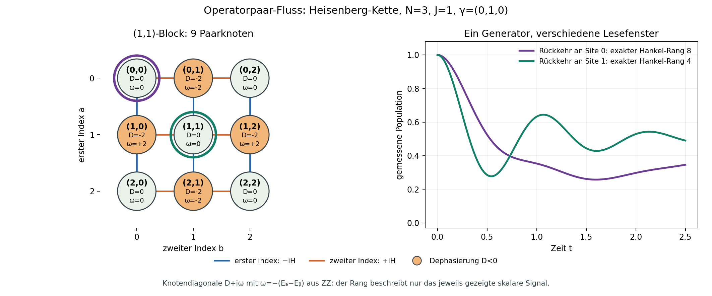

# Operatorpaar-Flussatlas: ein endliches Lesefenster

**Status (2026-09-26):** explorativer Modell- und Darstellungsversuch. Die Generatorvergleiche wurden für die offenen Heisenberg-Ketten `N=3,4,5` gerechnet; die exakten Signalränge betreffen ausschließlich den unten angegebenen `N=3`-Fall. Kein neuer physikalischer Satz und kein Hardwarebefund.

Eine Matrix ist hier nicht nur eine Zahlentafel: Jede Zelle `|a⟩⟨b|` ist ein Knoten. Die Hamilton-Dynamik verschiebt jeweils einen ihrer beiden Indizes, mit verschiedenen komplexen Vorzeichen. Lokale Z-Dephasierung belastet genau die Knoten, deren zwei Bitstrings sich am beobachteten Ort unterscheiden. So lässt sich sehen, welche Wege von einer konkreten Präparation zu einer konkreten Messung beitragen.



**Bildlesung:** Die Zeile ist der erste Paarindex `a`, die Spalte der zweite `b`.
Blaue Kanten tragen `−iH` auf `a`, orange Kanten `+iH` auf `b`. Jeder Knoten
zeigt `D` und `ω` seiner Diagonale `D+iω`. Der violett umrandete Knoten `(0,0)`
gehört zur violetten Rückkehrkurve an Site 0; der grün umrandete `(1,1)` zur
grünen Rückkehrkurve an Site 1.

## Bereits vorhandene Grundlage

| Repo-Eigner | Was der Versuch daraus nimmt |
| --- | --- |
| [Absorption theorem](../docs/proofs/PROOF_ABSORPTION_THEOREM.md) | Für `|A⟩⟨B|` ist die direkte dissipative Diagonale `−2 Σ_l γ_l [A_l≠B_l]`. Ein Knotenwert ist **keine** Eigenmoden-Zerfallsrate. |
| [JointPopcountSectors](../compute/RCPsiSquared.Core/BlockSpectrum/JointPopcountSectors.cs) und [Direct-sum decomposition](../docs/proofs/DIRECT_SUM_DECOMPOSITION.md) | Zahlenerhaltung schließt die `(1,1)`-Operatoren zu einem Block der Größe `N²`; diese Reduktion gehört bereits dem Repo. |
| [The flow endpoints](../simulations/the_flow_endpoints.py) | Baut den `(1,1)`-Block für den gleichförmigen XY-Fall bereits auf. Dieser Versuch zeichnet zusätzlich die ZZ-Knotenphasen, ortsabhängige `γ_l` und ein festes Ein-/Ausgabesignal. |
| [MirrorWorld](../compute/MirrorWorld/README.md) und [F157](../docs/ANALYTICAL_FORMULAS.md) | `Cone` nutzt den Ein-Anregungsraum; F157 zählt die Dunkelheit eines Sitzes unter dem **Hamiltonian-Krylovraum**. Der hier ermittelte Hankel-Rang gehört dagegen zum vollständigen dissipativen **Skalarsignal** und ist kein neuer F157-Wert. |

Gesichtet wurden außerdem die [Experiment-Übersicht](README.md), die [Begriffskarte](../docs/quantum/THE_LABEL_MAP.md), die Claims/Witnesses und die Confirmations-Oberflächen. Dieser lokale Versuch wird weder als neuer Claim noch als Hardware-Confirmation eingetragen.

## Festes Modell und Lesefenster

Wir verwenden `H=J Σ_b(XX+YY+ZZ)_b` auf der offenen Kette, `J=1`, lokale Z-Dephasierung `γ_l`, die Big-Endian-Sitekonvention und zeilenweise Vektorisierung. `|a⟩` bezeichnet den Zustand mit genau einer Anregung an Site `a`; `E_ab=|a⟩⟨b|`. Für jedes Paarknotenbild gilt

```text
L(E_ab) = −i Σ_c H_ca E_cb + i Σ_c H_bc E_ac
          − 2 Σ_l γ_l [a_l ≠ b_l] E_ab .
```

Im Ein-Anregungsblock ist `H_aa=J[(N−1)−2 deg(a)]` und der Nachbar-Hop `H_(a,a+1)=2J`. Daher trägt ZZ eine zusätzliche lokale Phase `−i(H_aa−H_bb)` bei. Bei `a≠b` kostet die reine Dephasierungsdiagonale genau `−2(γ_a+γ_b)`; bei `a=b` ist sie null. Null **direkte** Kosten bedeuten nicht, dass die Population unter der gekoppelten Dynamik konstant ist.

Das Signal ist `y(t)=tr(O exp(tL) ρ₀)`. Für die Ränge unten ist `ρ₀=|a⟩⟨a|` und `O=|b⟩⟨b|`, oder `O=I` für die Spur. Die exakten Ableitungen bei null sind `m_k=tr(O L^k ρ₀)`. In einer reellen hermiteschen `N²`-Basis hat die ganzzahlige `N=3`-Instanz einen ganzzahligen Generator. Der Rang der `9×9`-Hankel-Matrix `K_ij=m_(i+j)` ist die minimale Dimension einer homogenen, zeitinvarianten linearen Realisierung **dieses fest gewählten skalaren Signals**. Er beschreibt weder eine physikalische Zustandskodierung noch einen Messaufwand.

## Rechenergebnis

| Prüfung | Ergebnis | Aussagegrenze |
| --- | ---: | --- |
| Paargenerator gegen den unabhängigen vollen Framework-Liouvillian, `N=3,4,5`, jeweils ungleiche `γ_l=0.13+0.07l` | maximale Eintragsdifferenz `0.0` in allen drei endlichen Läufen | Keine Aussage über beliebiges `N` oder andere Kanäle. |
| Komplexe Präparation und hermitescher Off-Diagonal-Readout bei `N=3`, `t=0.37` | `|y_full−y_pair|=2.26×10⁻¹⁷` | Ein konkreter endlicher Zeitvergleich. |
| `N=3`, `γ=(0,1,0)`, Site 0 → Site 0 (Rückkehr) | exakter Hankel-Rang `8` von `9` | Nur dieses Ein-/Ausgabepaar. |
| `N=3`, `γ=(0,1,0)`, Site 1 → Site 1 (Rückkehr) | exakter Hankel-Rang `4` von `9` | Nur dieses Ein-/Ausgabepaar. |
| `N=3`, `γ=(0,1,0)`, Site 0 → Spur | exakter Hankel-Rang `1` | Spur bleibt konstant. |

**Warum vier statt acht?** Die Kettenreflexion vertauscht Site 0 und 2 und fixiert Site 1.
Im Ein-Anregungsraum zerfällt sie in den geraden Raum
`span{|1⟩, (|0⟩+|2⟩)/√2}` und den ungeraden Raum
`span{(|0⟩−|2⟩)/√2}`. Für das hier festgelegte Profil kommutieren sowohl `H`
als auch der einzige Sprung `Z₁` mit der Reflexion. Präparation und Rückkehrmessung
an Site 1 bleiben deshalb im geraden, zweidimensionalen Hilbertraum; dessen
hermitescher Operatorraum hat vier reelle Dimensionen. Der exakte Rang 4 schöpft
sie für dieses Signal aus. Site 0 enthält dagegen beide Paritäten und ihre
Kreuzkohärenzen: `4+1+4=9` Operatorrichtungen. Die beiden erhaltenen
Paritätssektor-Populationen liefern in einem einzelnen Skalarsignal nur **eine**
konstante Zeitfunktion; der exakte Rang 8 zeigt hier sieben weitere
unterscheidbare Zeitanteile. Das ist die [bereits beschriebene Hilbertraum-Blindheit
am Reflexionsfixpunkt](THE_BLIND_SITE.md), nicht allein eine Kovarianz der
Dichtematrix unter Reflexion. Der Signalrang bleibt ein anderer Gegenstand als
F157s Hamiltonian-Blindheitszahl.

Für die Rückkehr an Site 1 liefern die ganzzahligen Momente die **exakte** Rekurrenz

```text
y⁽⁴⁾ + 4 y⁽³⁾ + 40 y″ + 64 y′ = 0,
y(0)=1, y′(0)=0, y″(0)=−16, y⁽³⁾(0)=32.
```

Der führende `4×4`-Hankel-Block ist invertierbar; die Rekurrenz erfüllt alle verfügbaren Momente exakt. Da der ursprüngliche Generator nur neun Dimensionen hat, setzt sich diese Momentenidentität durch Cayley-Hamilton auf alle weiteren Ableitungen fort. Eine vierdimensionale Begleitmatrix reproduziert die neun-dimensionale Populationskurve bei `t=0.1,0.4,1.2` bis `10⁻¹⁰`. Die Gleichung ist eine **Signalbeschreibung**, keine neue Bewegungsgleichung für die gesamte Dichtematrix.

## Gegenproben und Wiederholung

Ein lokales transversales `X`-Feld koppelt aus dem Ein-Anregungsraum heraus; der Paargenerator verweigert dann den geschlossenen `(1,1)`-Block. Drei zeitweilige Mutationen ließen die Tests wie erwartet fehlschlagen und wurden zurückgenommen: falsches Vorzeichen auf der rechten Hamilton-Kante, umgekehrte Zuordnung ungleicher Site-Raten und ein um eine Site versetzter Readout-Vektor. Der Vergleich mit der direkten Dichtematrix-Gleichung nutzt einen echt komplexen Zustand, damit eine vertauschte Zeilen-/Spaltenkonvention sichtbar wird.

```powershell
python -m pytest simulations/tests/test_operator_pair_flow_atlas.py -q
python simulations/operator_pair_flow_atlas.py
```

Der zweite Befehl schreibt die [maschinelle Ergebnisdatei](../simulations/results/operator_pair_flow_atlas/operator_pair_flow_atlas.json) und die oben gezeigte Grafik. Der [Produzent](../simulations/operator_pair_flow_atlas.py) hält die Parameter und den vollständigen Rechenweg fest.

**Fortsetzung:** Der [Vergleich weiterer Ratenprofile und Ein-/Ausgabepaare](OPERATOR_PAIR_VIEW_COMPARISON.md) stellt exakte Rangkarten für `N=3,4,5` einem Hilbertraum-Paritätsfluss gegenüber. Ein numerischer Gewinn gegenüber den vorhandenen Blocksolverpfaden ist nicht gezeigt.
