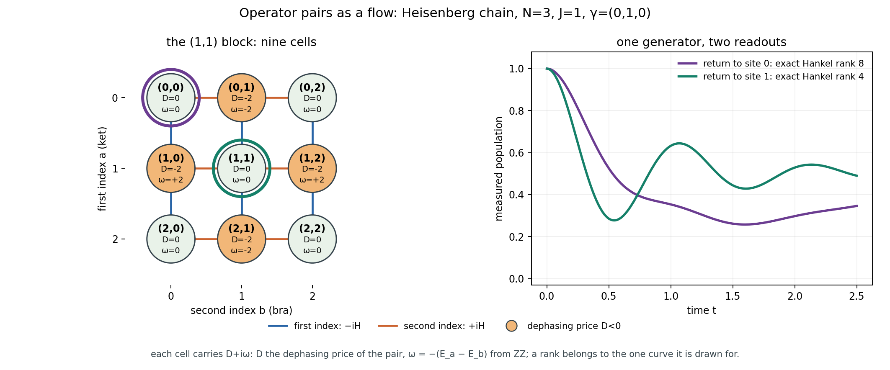

# Operator Pairs as a Flow: one block drawn cell by cell

**Status:** a drawing of an owned object, and two signals taken apart exactly, on open Heisenberg chains N = 3, 4, 5. No new law and no hardware claim. The ranks are exact over ℚ.
**Date:** 2026-09-26
**Authors:** Thomas Wicht, Codex (OpenAI), Claude (Anthropic)
**Script:** [`simulations/operator_pair_flow_atlas.py`](../simulations/operator_pair_flow_atlas.py), tests [`simulations/tests/test_operator_pair_flow_atlas.py`](../simulations/tests/test_operator_pair_flow_atlas.py)
**Data:** [`operator_pair_flow_atlas.json`](../simulations/results/operator_pair_flow_atlas/operator_pair_flow_atlas.json)
**Continued in:** [What one readout sees](OPERATOR_PAIR_VIEW_COMPARISON.md), where the ranks meet bounds read off owned objects

Heisenberg began in 1925 by throwing the orbits away and keeping the pairs. What can be observed of an atom belongs to two of its states at once, a transition with its frequency, and the matrix is the table of those pairs. His pairs were stationary states, and in that basis the Hamiltonian only turns each pair at its Bohr frequency. This page draws the table in the basis of sites instead, where the dephasing is diagonal and the Hamiltonian is the traffic between cells, for one block of a spin chain standing in light: the (1,1) block, a single excitation on the ket side and on the bra side. What it adds to 1925 is the light, and with it the super-operator level that [On the Soft Break](../reflections/ON_THE_SOFT_BREAK.md) names as what the language of 1925 did not have. Every cell |a⟩⟨b| is a place the flow can be. The Hamiltonian moves one of its two indices at a time, the ket with −iH and the bra with +iH. The dephasing puts a price on the cell, and the price depends only on where the two indices disagree. Drawn this way, one can follow the paths from a preparation to a readout, and see why one readout curve is simpler than another.



**Reading the picture.** Rows are the first index a (the ket), columns the second index b (the bra). Blue edges carry −iH on a, orange edges +iH on b. Each cell shows D and ω of its diagonal entry D + iω. The purple ring marks (0,0), whose return curve is purple on the right; the green ring marks (1,1), whose return curve is green.

## What the repo already holds

The sweep for this page went store by store; what each returned:

- **`reflections/`: the picture in words.** [On the Two Columns](../reflections/ON_THE_TWO_COLUMNS.md) tells it: a coherence is a link between two patterns, its bill is the light on the column where they differ, and only the motion moves boxes between the columns. [On the One Diagonal](../reflections/ON_THE_ONE_DIAGONAL.md) and [The View onto the Memory](../reflections/THE_VIEW_ONTO_THE_MEMORY.md) keep the same books.
- **`docs/proofs/` and one experiment: the price, the two particles, the diagonal.** A cell's D is the [Absorption Theorem](../docs/proofs/PROOF_ABSORPTION_THEOREM.md)'s cell cost in the coherence basis, −2Σ_l γ_l [a_l ≠ b_l]; it is a decay rate only where the cell is itself an eigenmode, and otherwise the source of a mode's rate as an average. [PROOF_FROZEN_BAND_SO4](../docs/proofs/PROOF_FROZEN_BAND_SO4.md) reads the ket index as one fermion species and the bra index as a second, the bra copy hopping with the transpose, and [XY Frozen Band](XY_FROZEN_BAND.md), after Medvedyeva, Essler and Prosen, reads the uniform dephasing there as a Hubbard interaction of strength 4γ on the double occupancy. [PROOF_UNIFORM_LAW](../docs/proofs/PROOF_UNIFORM_LAW.md) B0 gives H_SE = (N−1)J·Id − 2J·𝓛, 𝓛 the path Laplacian. [PROOF_MISSING_PHASE_SLOW_READOUT](../docs/proofs/PROOF_MISSING_PHASE_SLOW_READOUT.md) works in this block on the XY chain with light on the centre, and asks of its slow cluster whether the starting state excites it and whether the chosen measurement can read it.
- **F-registry and typed layer: the block's own laws.** `JointPopcountSectors` closes the (1,1) operators into a block of size N², the N × N Haken-Strobl density block, which MirrorWorld's `Cone` runs for the XY chain, without the ZZ term's diagonal. The [Coherence Horizon](../docs/proofs/PROOF_COHERENCE_HORIZON_SLOPE.md) (`CoherenceHorizonClaim`) finds its slow mode as a population coupled to the whole ladder of coherence ranges, F126 (`DephasingFrontRenewalClaim`) writes every single-excitation population at uniform γ exactly as a renewal series, F151 is the criterion under which the gauge on the signs of the hops commutes with the site reflection, and F157 with [The Blind Site](THE_BLIND_SITE.md) counts the Hamiltonian modes a dephased seat cannot touch.
- **OpenArcs.** The arc `site_resolved_vacuum_block` writes the block as I⊗M + conj(M)⊗I off the population rows, in its own ordering of the tensor factors, M the (0,1) generator of F152, and warns that the blocks around it go by several names in the repo, F140's single-excitation corner block being this one. This page calls it the (1,1) block.
- **`experiments/`, glossary, `docs/CAUGHT_ERRORS.md`.** [The Flow Between Two Singularities](THE_FLOW_BETWEEN_TWO_SINGULARITIES.md), parked, builds this block for the uniform XY chain in `simulations/the_flow_endpoints.py`, factors its characteristic polynomial exactly at N = 2, 3, and certifies by exact ranks that the eigenvalue coincidence at the coherence horizon is defective; this page adds the ZZ phases of the cells, site-dependent γ_l and one fixed readout curve. [The Bond and the Seat at fixed γ](THE_BOND_AND_THE_SEAT_AT_FIXED_GAMMA.md) ends by asking for a fixed-γ₀ observability criterion for its continuous trace, a rank over bond directions rather than over poles, which these pages do not answer; the [signal-processing view](SIGNAL_PROCESSING_VIEW.md) reads modal observability off other signals, and its Prony analysis reads a model order off a float rank of sampled Hankel matrices; the glossary has no entry for a signal rank; the ledger holds the row and column convention trap named under Controls.
- **Confirmations.** `ibm_ep_onset_may2026` flew single-excitation populations on a three-site chain, the flight of The Flow Between Two Singularities; no flight has measured a signal rank.

What none of them holds exactly is the object on the right of the figure: the rank of the moment-Hankel matrix of one fixed readout curve, which the Prony analysis estimates from samples and this page takes from exact moments. Checked for adjacency, the pieces were all there: the price is the Absorption Theorem's, the block is the one the arc and F140 name, and the rank's bounds are owned. [The continuation](OPERATOR_PAIR_VIEW_COMPARISON.md) bounds it by objects the repo already owns, F157's seat count for light on one seat and F140's frozen divisor on the R₉₀ locus, whose frozen space at the uniform point is Ω₂ (at N = 3 the line of the W-fidelity operator). The bounds meet most of the maps computed there, and that page names the ones they miss.

## The model and the reading window

H = J Σ_b (XX + YY + ZZ)_b on the open chain, J = 1, local Z-dephasing with rates γ_l, site 0 at the leftmost bit, and ρ vectorized row by row. |a⟩ is the state with its one excitation at site a, and E_ab = |a⟩⟨b|. The generator acts on a cell as

```text
L(E_ab) = −i Σ_c H_ca E_cb + i Σ_c H_bc E_ac
          − 2 Σ_l γ_l [a_l ≠ b_l] E_ab .
```

In the single-excitation block H_aa = J[(N−1) − 2 deg(a)] and the hop is H_(a,a+1) = 2J, so the ZZ term puts a phase −i(H_aa − H_bb) on each cell. For a ≠ b the dephasing price is exactly −2(γ_a + γ_b), and on the diagonal it is zero. A cell that costs nothing is not a cell that holds still: its edges carry the population away.

The readout is one curve, y(t) = tr(O e^{tL} ρ₀). For the ranks below ρ₀ = |a⟩⟨a| and O = |b⟩⟨b|, or O = I for the trace. Its derivatives at zero are m_k = tr(O L^k ρ₀), exact integers here, and the rank of the Hankel matrix K_ij = m_(i+j) is the order of the shortest linear recurrence the curve obeys, which is the number of poles of its Laplace transform tr(O (s − L)⁻¹ ρ₀), each counted with its order. An eigenvalue is a pole when its modes carry weight on both this preparation and this readout and do not cancel there; modes that share an eigenvalue count once, and only a Jordan block counts more than once. It is a property of one curve, not of the state and not of a measurement budget.

## What the computation gives

| Check | Result |
| --- | ---: |
| pair generator against the full framework Liouvillian, N = 3, 4, 5, unequal γ_l = 0.13 + 0.07 l | largest entry difference 0.0 |
| complex preparation and off-diagonal Hermitian readout, N = 3, t = 0.37 | \|y_full − y_pair\| = 2.26·10⁻¹⁷ |
| N = 3, γ = (0,1,0), return to site 0 | rank 8 of 9 |
| N = 3, γ = (0,1,0), return to site 1 | rank 4 of 9 |
| N = 3, γ = (0,1,0), site 0 to the trace | rank 1 |

## Why the centre return has rank four: it is a Bloch equation

The site reversal swaps sites 0 and 2 and fixes site 1. In the single-excitation space it splits into the even space span{|1⟩, (|0⟩+|2⟩)/√2} and the odd space span{(|0⟩−|2⟩)/√2}. With light on the centre alone, H and the one jump Z₁ both commute with the reversal, so a preparation at site 1 never leaves the even space. There H = [[−2, 2√2],[2√2, 0]] and Z₁ = diag(−1, 1): a two-level system with a detuning, a drive and pure dephasing. Its state is a Bloch vector and a trace, four real numbers, and the integer moments give the curve's recurrence exactly,

```text
y⁽⁴⁾ + 4 y⁽³⁾ + 40 y″ + 64 y′ = 0,
y(0) = 1, y′(0) = 0, y″(0) = −16, y⁽³⁾(0) = 32.
```

Its characteristic polynomial s(s³ + 4s² + 40s + 64) is the characteristic polynomial of that two-level Lindbladian, which the script checks symbolically: the factor s is the conserved trace, and the cubic is the characteristic polynomial of Bloch's equations of 1946, here with pure dephasing and no T₁ relaxation. The leading 4 × 4 Hankel block is invertible and the recurrence holds on every available moment; the generator has only nine dimensions, so Cayley-Hamilton carries it to every later derivative. In F157's terms the Krylov space of |1⟩ under H is the two-dimensional even space, blind(1) = 1, and the rank is (N − blind)² = 4.

The end return is the same system seen from the side. Its characteristic polynomial factors exactly as

```text
s · (s³ + 4s² + 40s + 64) · (s⁴ + 4s³ + 24s² + 32s + 64).
```

The cubic is the even qubit again. The quartic is the four real dimensions of coherence between the even qubit and the odd state: that state has energy 0 and no weight on site 1, so its partner in a coherence evolves by −iH_even − 2γ|1⟩⟨1|, and the script checks that block's polynomial too. Both parity populations are conserved, and one curve sees them as a single constant, so 1 + 3 + 4 = 8 = N² − blind(1).

## Controls

A local transverse X field couples out of the single-excitation space, and the pair generator refuses to close the block. The comparison with the direct density-matrix equation uses a genuinely complex state, so a swapped row and column convention would show; that convention has bitten the repo before (`docs/CAUGHT_ERRORS.md`, 2026-08-04, a column-stacked ρ under a row-stacked Liouvillian). The Bloch identification is gated against a wrong dephasing rate on the even qubit, and the end-return factorization against a wrong rate on the coherence block; neither may reproduce the curve.

```powershell
python -m pytest simulations/tests/test_operator_pair_flow_atlas.py -q
python simulations/operator_pair_flow_atlas.py
```

The second command writes the [result file](../simulations/results/operator_pair_flow_atlas/operator_pair_flow_atlas.json) and the figure above.
