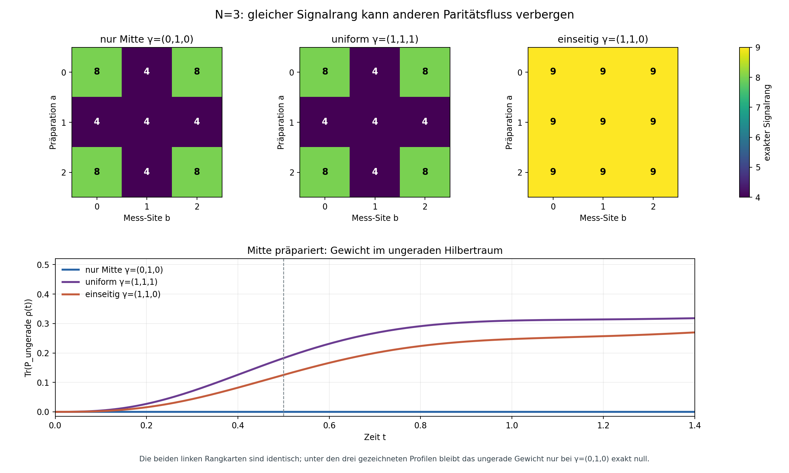
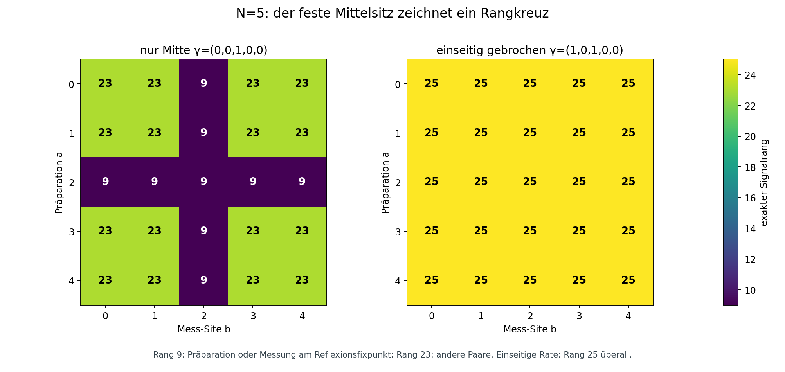

# Zwei Lesarten desselben Operatorflusses

**Status (2026-09-26):** endlicher Darstellungsversuch an offenen Heisenberg-Ketten mit `N=3,4,5`. Die angegebenen Signalränge sind für genau die acht Profile unten exakt zertifiziert; sieben waren vorab festgelegt, ein ratenabgeglichener Kontrollfall kam nach der ersten Auswertung hinzu. Der Vergleich liefert keine neue allgemeine Dynamikformel und keinen Hardwarebefund.

Wir präparieren eine einzelne Anregung an einer Site und lesen ihre Population an einer Site. Eine kleine Rangzahl sagt, wie kurz man **eine solche Messkurve** linear beschreiben kann. Sie legt weder die Kurve selbst noch die Bewegung im Inneren fest. Bei `N=3` haben Dephasierung nur in der Mitte und Dephasierung an allen drei Sites dieselbe vollständige Rangkarte für diese Präparationen und Messungen; ihre Rückkehrkurven an der Mitte sind bereits verschieden. Eine zweite Lesart macht den physikalischen Unterschied sichtbar: Bei alleiniger mittlerer Dephasierung bleibt der Zustand im reflexionsgeraden Hilbertraum. Bei uniformer Dephasierung wächst Gewicht im ungeraden Raum, also im Zustand `(|0⟩−|2⟩)/√2`.



In den Rangkarten ist die Zeile die Präparation an Site `a`, die Spalte die Populationsmessung an Site `b` (Sites zählen ab null). Die untere Kurve startet stets mit `|1⟩⟨1|`. Der Verlauf bei alleiniger mittlerer Dephasierung liegt exakt auf null; seine kleinen numerischen Abweichungen von null sind Rundung.

**Gleicher Rang ist nicht gleiche Kurve:** Schon die Site-1-Rückkehr `y_(1→1)` hat `y'''(0)=32` bei `γ=(0,1,0)`, aber `64` bei `γ=(1,1,1)`; bei `t=0.5` sind die Werte `0.2855171136` und `0.3656840572`. Die Paritätsablesung ist hier ein zweites Fenster auf den Zustand, keine Voraussetzung, um die Ratenprofile überhaupt zu unterscheiden.

## Wo dieser Versuch im Repo sitzt

Der [erste Operatorpaar-Flussatlas](OPERATOR_PAIR_FLOW_ATLAS.md) legt den `(1,1)`-Block, das Skalarsignal und die `N=3`-Rückkehrränge fest. Die [Blind-Site-Arbeit](THE_BLIND_SITE.md) und [F157](../docs/ANALYTICAL_FORMULAS.md) besitzen bereits die Hilbertraum-Blindheit des Reflexionsfixpunkts und den **Hamiltonian**-Krylovraum. [PROOF_ASYMPTOTIC_SECTOR_PROJECTION](../docs/proofs/PROOF_ASYMPTOTIC_SECTOR_PROJECTION.md) und [CAUGHT_ERRORS](../docs/CAUGHT_ERRORS.md) halten die Erhaltung der Hilbert-Paritätsprojektoren bei einem einzelnen reflektionsfixierten Z-Sprung fest. Die frühere [Signal-Processing-View](SIGNAL_PROCESSING_VIEW.md) verwendet modale Beobachtbarkeit für andere Signale. Hier wird keiner dieser Gegenstände umbenannt: Der Hankel-Rang ist der Rang eines **festen dissipativen Skalarsignals**; das ungerade Gewicht ist eine separate Zustandsablesung.

Vor dem Versuch wurden außerdem die F-Registry, `docs/proofs/`, die Experimente einschließlich Hardwareprotokollen, `simulations/framework/confirmations.py`, Glossar, OpenArcs und `docs/CAUGHT_ERRORS.md` nach Reflexion, Parität, Blindheit, Hankel-Rang und Beobachtbarkeit durchsucht. Ein bereits geflogener Hardwaretest dieses konkreten Rang-Paritäts-Vergleichs wurde dabei nicht gefunden; er wird nicht als Confirmation oder neuer Claim eingetragen. Die vorhandene Reflexionsmechanik ist der Ausgangspunkt, nicht ein neuer Fund.

## Messgegenstand und endliche Kontrollen

Fest sind `H=Σ_b(XX+YY+ZZ)_b` auf einer offenen Kette (`J=1`) und lokale Z-Dephasierung mit ganzzahligen Raten `γ_l`. `|a⟩` bezeichnet die einzelne Anregung an Site `a`. Für jedes geordnete Paar `(a,b)` lautet das skalare Signal

```text
y_(a→b)(t) = tr(|b⟩⟨b| exp(t L) |a⟩⟨a|).
```

Seine Ableitungen `m_k=y^(k)(0)` bilden die `N² × N²`-Momenten-Hankel-Matrix `K_ij=m_(i+j)`, `0≤i,j<N²`. Deren Rang ist die minimale Dimension einer homogenen zeitinvarianten linearen Realisierung **dieser einen Kurve**. Weder eine Dichtematrix-Kodierung noch die Zahl nötiger Quantenmessungen folgt daraus. Die reelle Basis aus Populationen sowie Real- und Imaginärteilen der Kohärenzen hat `N²` Koordinaten. Der [Produzent](../simulations/operator_pair_view_comparison.py) baut dafür unabhängig vom ersten Atlas einen ganzzahligen Generator.

| Kette und Ratenprofil `γ` | Exakte Rangkarte, Zeilen `a`, Spalten `b` |
| --- | --- |
| `N=3`, nur Mitte `(0,1,0)` | `[[8,4,8],[4,4,4],[8,4,8]]` |
| `N=3`, uniform `(1,1,1)` | `[[8,4,8],[4,4,4],[8,4,8]]` |
| `N=3`, einseitig `(1,1,0)` | alle Einträge `9` |
| `N=3`, ratenabgeglichen `(0,3,0)` | `[[8,4,8],[4,4,4],[8,4,8]]` |
| `N=4`, symmetrisch `(0,1,1,0)` | alle Einträge `15` |
| `N=4`, einseitig `(1,1,1,0)` | alle Einträge `16` |
| `N=5`, nur Mitte `(0,0,1,0,0)` | `9` auf mittlerer Zeile oder Spalte, sonst `23` |
| `N=5`, einseitig `(1,0,1,0,0)` | alle Einträge `25` |

`N=4` ist die Kontrolle ohne einzelnen Reflexionsfixpunkt. Die symmetrische Ratenliste allein bedeutet dort **nicht**, dass jeder einzelne Sprung mit der Reflexion kommutiert. Aus der Rangdifferenz `15→16` wird deshalb kein Satz über denselben Mechanismus wie bei der einzelnen mittleren Site abgeleitet.

Die zusätzliche `N=3`-Kontrolle `(0,3,0)` hält `Σγ=3` wie beim uniformen Profil `(1,1,1)` fest. Beide haben wieder dieselbe Rangkarte, doch nur bei mittlerer Dephasierung bleibt `w_−(t)=0`. Der Vergleich prüft damit die **Platzierung** der Raten statt nur ihre Gesamtsumme; er wurde nach der ersten Auswertung ergänzt und ist keine vorab festgelegte Entdeckungssuche.



## Warum gleicher Rang nicht gleicher Fluss ist

Für `N=3` sei `R|a⟩=|2−a⟩` die Site-Reflexion und `P_−=(I−R)/2`. Mit `ρ(0)=|1⟩⟨1|` lesen wir `w_−(t)=tr(P_−ρ(t))`. Sowohl `H` als auch der einzige Sprung `Z₁` im Profil `(0,1,0)` kommutieren mit `R`; daher ist `w_−(t)=0` für alle Zeiten. Bei `(1,1,1)` ist zwar der **gesamte** Lindbladian unter Reflexion kovariant, die beiden äußeren Sprünge kommutieren aber einzeln nicht mit `R`. Die Kovarianz erhält die Reflexionssymmetrie der Dichtematrix, nicht notwendig ihre Unterstützung im geraden Hilbertraum.

Ganzzahlige Generatorpotenzen liefern für `w_−` die exakten Ableitungen der Ordnungen `0,1,2,3` bei null:

| `γ` | `w_−^(0..3)(0)` | `w_−(0.5)` aus Matrixexponential |
| --- | --- | ---: |
| `(0,1,0)` | `(0,0,0,0)`; durch Symmetrie alle weiteren null | `0` bis auf Rundung |
| `(1,1,1)` | `(0,0,0,32)` | `0.1825552784` |
| `(1,1,0)` | `(0,0,0,16)` | `0.1254736457` |

Der physikalische Weg ist konkret: Der Hamiltonian baut aus der mittleren Anregung zunächst gleiche Endamplituden auf; dadurch gilt `Re ρ₀₂(t)=4t²+O(t³)`. Die äußeren Z-Sprünge kosten diese Endkohärenz, und im `N=3`-Block folgt exakt `w_−'(t)=2(γ₀+γ₂) Re ρ₀₂(t)`. Die Rate an der Mitte kommt in dieser Gleichung nicht vor. Daher ist `w_−(t)=(16/3)t³+O(t⁴)` bei uniformen Raten und `(8/3)t³+O(t⁴)` beim einseitigen Profil. Der Wert bei `t=0.5` wurde zusätzlich gegen die Evolution der **vollen** `2³ × 2³`-Dichtematrix geprüft. Gleiche `3×3`-Rangkarten der ersten zwei Profile verdecken also Unterschiede sowohl in den Messkurven als auch in einer anderen Zustandsablesung. Ein Skalarsignalrang ist ein vom Ein-/Ausgabepaar abhängiges Kompressionsmaß und keine vollständige Zustandsbeschreibung.

## Parität ist noch keine Mischung

Die Darstellung zeigt auch eine Grenze einer älteren [asymptotischen Deutung](../docs/proofs/PROOF_ASYMPTOTIC_SECTOR_PROJECTION.md): Ein mittlerer Z-Sprung erhält zwar die Reflexionsparität, erzwingt aber keinen maximal gemischten Grenzzustand innerhalb jedes Paritätsblocks. Bei `N=5` hat der ungerade Ein-Anregungsraum die Basis `u=(|0⟩−|4⟩)/√2`, `v=(|1⟩−|3⟩)/√2`. Darauf sind der mittlere Sprung `Z₂=I` und der Hamiltonian

```text
H_ungerade = [[2, 2],
              [2, 0]].
```

Der Anfangszustand `|u⟩⟨u|` ist kein Eigenprojektor dieses Hamiltonians: Er bewegt sich rein unitär, bleibt rein und hat zu `I_ungerade/2` jederzeit den Frobenius-Abstand `1/√2`. Da er beide verschiedenen Energien enthält, oszilliert er ohne Grenzwert. Der alte `blind_site.py scope`-Lauf startete dagegen von `|+⟩^5`, also mit **null** ungeradem Reflexionsgewicht; sein endlicher Vergleich mit einer pro Paritätsblock gemischten Referenz prüfte diesen Gegenblock nicht. Der exakte Block und ein äußerer-Sprung-Kontrollfall stehen im [Test](../simulations/tests/test_operator_pair_view_comparison.py). Die älteren Quellen sind auf diese Grenze eingegrenzt.

Auch „kein stationärer Cross-Sektor-Modus“ bedeutet nicht „alle Cross-Sektor-Moden klingen ab“: Das Vakuum hat Energie `4`, und ein Eigenzustand `d_±` des obigen blinden Blocks hat Energie `1±√5`. Die Kohärenz `|vac⟩⟨d_±|` erfährt am mittleren Z-Sprung keine Dephasierung und hat den rein imaginären Eigenwert `−i(4−(1±√5))`. Sie ist nicht stationär, bleibt aber ungedämpft. Damit ist die Trennung von stationär, ungedämpft und konvergent auch bei der gewählten Darstellung nötig.

## Warum die Karten exakt sind

Für `N≤4` werden die Ränge mit der bestehenden exakten SymPy-Momentenrechnung des ersten Atlas aus rationalen Matrizen bestimmt. Eine unabhängige ganzzahlige Hermitesch-Basis reproduziert die Ränge über beiden Primkörpern `1,000,003` und `1,000,033`.

Für `N=5` liefert jeder Primkörperrang zunächst nur eine **untere** Schranke für den rationalen Rang; Übereinstimmung zweier Primzahlen allein wäre kein Exaktheitsbeweis. Beim mittleren Profil schließen zwei obere Schranken die Lücke: Präparation **oder** Messung am fixierten Sitz lebt für das Signal im geraden Hilbertraum mit Dimension `3`, dessen hermitescher Operatorraum Dimension `3²=9` hat. Für alle Paare hat der ganzzahlige `25×25`-Generator über `ℚ` exakt Rang `22`, weshalb jeder Krylovraum in `span{ρ₀}+im L` liegt und höchstens `23` Dimensionen besitzt. Die modularen Hankel-Ränge erreichen `9` beziehungsweise `23`. Beim einseitigen `N=5`-Profil erreichen sie bereits die volle Blockdimension `25`. Damit sind alle angezeigten `N=5`-Werte exakt, ohne eine allgemeine `N`-Formel zu behaupten.

Der unabhängige Test vergleicht die neue ganzzahlige Generatorwirkung mit dem komplexen Paargenerator des ersten Atlas bei `N=3,4,5` sowie die Populationsmomente bei `N=4` unter ungleichen Raten. Weitere Tests vergleichen die Paritätskurve und die mittlere Rückkehr mit dem vollen Framework-Liouvillian und lehnen nicht zertifizierte Profile als „exakt“ ab. Die [Ergebnisdatei](../simulations/results/operator_pair_view_comparison/operator_pair_view_comparison.json) enthält alle Karten, Schranken, Rückkehr- und Paritätswerte.

```powershell
python -m pytest simulations/tests/test_operator_pair_view_comparison.py simulations/tests/test_operator_pair_flow_atlas.py -q
python simulations/operator_pair_view_comparison.py
```

**Nächste Frage:** Gibt es eine Darstellung, die schon vor der vollständigen Hankel-Rechnung die Gestalt einer Messkurve und die erhaltenen oder wandernden Hilbertraum-Gewichte erkennen lässt? Dieser endliche Vergleich empfiehlt, beides neben dem Signalrang zu zeigen; ein Rechenvorteil gegenüber den vorhandenen Blockverfahren ist nicht gezeigt.
