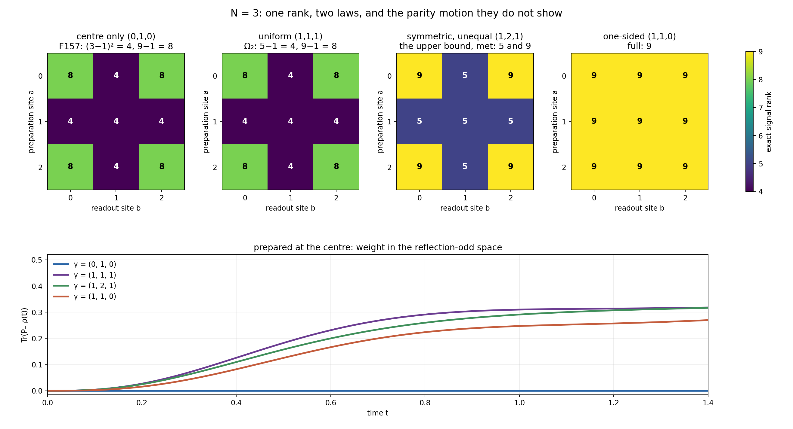
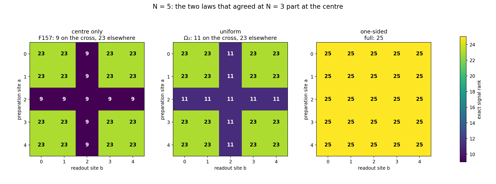

# What One Readout Sees: signal ranks in the (1,1) block

**Status:** exact rank maps over ℚ on open Heisenberg chains N = 3–7 and 9 at J = 1, and reachable dimensions to N = 12. Upper bounds read off owned objects, the F157 seat count for light on one seat, F140's frozen divisor on the R₉₀ locus and Ω₂ at its uniform point, meet most of the maps computed. Away from uniform light, every map that falls below its bound sits at a special coupling: on the R₉₀ locus at an exceptional coupling of the frozen divisor, where its root turns defective, and elsewhere where residues vanish while every eigenvalue stays simple; at the neighbouring values of J/γ tried, each meets its bound, and a rank that meets its bound at one coupling meets it at all but finitely many, since the moments are polynomials in J and a minor that is nonzero once vanishes only at finitely many points. Under uniform light the population curves split into one channel per eigenmode of the chain, derived here from F126's renewal and the Neumann pairing of PROOF_UNIFORM_LAW B0, and the channel sum meets every uniform map computed; a blind mode costs N + 1 dimensions. No new F-number and no hardware claim.
**Date:** 2026-09-26
**Authors:** Thomas Wicht, Codex (OpenAI), Claude (Anthropic)
**Script:** [`simulations/operator_pair_view_comparison.py`](../simulations/operator_pair_view_comparison.py), tests [`simulations/tests/test_operator_pair_view_comparison.py`](../simulations/tests/test_operator_pair_view_comparison.py)
**Data:** [`operator_pair_view_comparison.json`](../simulations/results/operator_pair_view_comparison/operator_pair_view_comparison.json)
**Starts from:** [Operator pairs as a flow](OPERATOR_PAIR_FLOW_ATLAS.md), which draws the block and defines the rank

Prepare one excitation at a site, read the population at a site, and ask how many exponentials the curve needs. The curve lives in the (1,1) block, one excitation on the ket side and one on the bra side. That number, the rank of the curve's moment-Hankel matrix, is the degree of the shortest recurrence the curve obeys: every eigenvalue whose modes carry weight on both the preparation and the readout without cancelling there, counted once, and more than once only inside a Jordan block. At N = 3, two very different ways of lighting the chain, on the centre alone and on every site, give the same rank at every pair of sites, and yet the physics differs: under central light a state prepared at the centre never enters the reflection-odd space, under uniform light it does. The maps agree because two different owned objects give the same numbers at N = 3. From N = 5 on they part.



The conventions are the flow page's: H = J Σ_b (XX + YY + ZZ)_b on the open chain, so the hop is 2J, and local Z-dephasing D(ρ) = Σ_l γ_l (Z_l ρ Z_l − ρ), which charges a cell −2γ_l for every site l where its two indices disagree. In every map the row is the preparation site a and the column the readout site b, sites counted from zero. The lower panel starts from |1⟩⟨1| each time; under central light its curve lies exactly on zero.

## What the repo already holds

The sweep went store by store; what each returned:

- **F-registry.** F157, the blind seat, with its one-sided modular reading; F140, the frozen divisor, λ = −4γ̄ at least ⌊N/2⌋ times at every J on the R₉₀ locus; F126, the exact renewal representation of the single-excitation populations at uniform γ, whose closed form and momentum closure are the infinite chain's; F152, the (0,1) block; F151, the bipartite gauge criterion; F124, the band-edge identity ‖M‖²_F + λ_min(M Mᵀ) = 2, one of whose readings is an observability Gramian for defect reconstruction; F123, the closure functional on the XY chain, whose half-filling survivor has the Neumann harmonic cos(π(j − ½)/N) as the continuum and diffusion-limit form of its density; F143, the seed rung, which reads the frozen kernel as the mode-chiral-odd sector, an XY-only reading that PROOF_R90_FROZEN_DIVISOR §7 carries to the Heisenberg chain in the site index. No entry computes the rank of a readout curve.
- **`docs/proofs/`.** [The span and node-lemma proof](../docs/proofs/PROOF_BLIND_SEAT_SPAN_AND_NODE_LEMMA.md): dim ker L_SE(j) = 1 + blind(j) wherever H is simple on the seat's Krylov complement, which a zero-free chain always is, and in §(c) the algebra of H and the seat splits as End(K) ⊕ ℂ[H|_W]. [PROOF_R90_FROZEN_DIVISOR](../docs/proofs/PROOF_R90_FROZEN_DIVISOR.md): the pencil proof of §3 builds the frozen modes inside the off-diagonal cells, §7 makes the multiplicity exactly ⌊N/2⌋ at the uniform point, §9 finds the root defective at the exceptional couplings, where its algebraic multiplicity gains a rung and the geometric one does not, Lemma 5 gives B Bᵀ for B_ak = ψ_k(a)², and Lemma 6 notes that the generator is complex symmetric in the cell basis. [PROOF_UNIFORM_LAW](../docs/proofs/PROOF_UNIFORM_LAW.md): item B0, the Neumann modes ψ_q of the chain with the complementary pairing f_(N−m) = −f_m; item B1, the ⌊N/2⌋-dimensional space Ω₂ at every N. [PROOF_N11_COMPRESSED_DENSITY](../docs/proofs/PROOF_N11_COMPRESSED_DENSITY.md): on the locus the dissipator compressed to the (1,1) zero-frequency room has its spectrum in [−4γ̄, 0], its lower end being F140's frozen root. [D10](../docs/proofs/derivations/D10_W1_DISPERSION.md), the one-magnon Hamiltonian as a graph Laplacian with Neumann standing waves, derived for the (0,1) block. [The Node Pair](../docs/proofs/PROOF_NODE_PAIR_RESOLVENT.md) §8, the undamped space of the block with light on the centre, on the XY chain. [PROOF_MISSING_PHASE_SLOW_READOUT](../docs/proofs/PROOF_MISSING_PHASE_SLOW_READOUT.md), on the XY chain with light on the centre and one detuned end bond at N = 7, which keeps track of three things for its slow cluster: which motion the dynamics allows, whether the starting state excites it, and whether the measurement can read it. [PROOF_DEPHASING_FRONT_RENEWAL](../docs/proofs/PROOF_DEPHASING_FRONT_RENEWAL.md), F126's proof, and [PROOF_DIFFUSION_RAYLEIGH_CLOSURE](../docs/proofs/PROOF_DIFFUSION_RAYLEIGH_CLOSURE.md) §3, F123's. Nothing on Hankel ranks.
- **`experiments/`, with the null results and the flights.** [The Blind Site](THE_BLIND_SITE.md) §5, the intersection law for several seats, the undamped (0,1) modes, and the odd-N centre; [The Seat That Cuts](THE_SEAT_THAT_CUTS.md) §5, and §7 with the Cramer identity for the blind count; [The Reflection Keeps Past and Future Apart](THE_REFLECTION_KEEPS_PAST_AND_FUTURE_APART.md) §2, the N = 3 reflection-even cubic p₃ and "The corner at every N" (Ω₂ is the whole −4γ root space at the uniform point), and §6, the W-fidelity law; [The Flow Between Two Singularities](THE_FLOW_BETWEEN_TWO_SINGULARITIES.md), parked, the same block on the XY chain, whose coherence horizon is a certified defective eigenvalue, and the page of the flight under Confirmations; [The Survivor is Spin-Flip-Odd and Reflection-Odd](SURVIVOR_FLIP_AND_REFLECTION_ODD.md) §2, which fixes the half-filling survivor's density profile by diffusion; [The Motion and the Missing Phase](THE_MOTION_AND_THE_MISSING_PHASE.md), the experiment the missing-phase readout proof belongs to; [The Exceptional Couplings](THE_EXCEPTIONAL_COUPLINGS.md), whose word warning keeps §9's exceptional couplings, on the corner block and in the algebraic multiplicity, apart from its own at the uniform point; [The Bond and the Seat at fixed γ](THE_BOND_AND_THE_SEAT_AT_FIXED_GAMMA.md), which ends by asking for a fixed-γ₀ observability criterion for its continuous trace, a rank over bond directions rather than over poles, which this page does not answer; the [signal-processing view](SIGNAL_PROCESSING_VIEW.md), whose Prony analysis (`simulations/prony_analysis.py`) builds sampled Hankel matrices of one signal and reads the model order off a float rank, the same invariant this page takes exactly from the moments, and whose joint pole analysis of the exact Liouvillian finds a mode with zero residue in one channel, a mode hiding from one curve.
- **`reflections/`.** Nothing on signal ranks.
- **Glossary.** The F157 blind-seat entry; nothing on Hankel ranks, peripheral spaces or the frozen divisor.
- **`docs/CAUGHT_ERRORS.md`.** The two 2026-09-26 entries on parity mixing and on modular counts, whose objects the sections on the flow and on the odd side below touch, and the entry on the repair behind them; the 2026-08-24 entry on the centre kernel.
- **OpenArcs.** `site_resolved_vacuum_block` (the (1,1) block as I⊗M + conj(M)⊗I off the population rows, in the arc's ordering of the tensor factors, M the (0,1) generator of F152); `compressed_density_laws`, the R₉₀-locus chain's own arc; `the_gate_that_does_not_gate`, a sweep with γ > 0 on at least ten of the eleven seats, where nothing is blind and neither of its candidate functionals separates the seats, and which carries the blind count's modular reading; `corner_beat`, which records a Jordan block of length three for the frozen root in the XY variant at N = 6.
- **Confirmations.** `ibm_ep_onset_may2026`: the per-site populations of a single-excitation walk on a three-site chain, XY coupling, dephasing on every site. No flight has measured a signal rank.
- **Typed layer.** `SeatCutBlindnessClaim` with its witness at `inspect --root blind`; `FrozenDivisorClaim` with `inspect --root divisor`; `DephasingFrontRenewalClaim`; `F71MirrorBlockRefinement` and `InhomogeneousGammaF71BreakingWitness` for the reflection under palindromic rates; `MirrorOrderSortingClaim` (F131); `MissingPhaseSlowReadoutClaim` with its witness at `inspect --root missingphasereadout`; `CoherenceHorizonClaim`, the slow mode of this block on the XY chain, where the channel law below does not hold. MirrorWorld's `BlindSeatTests` pins a blind superposition that moves while its seat stays empty.

Checked for adjacency against all of these: every bound below is one of these objects read as a statement about the rank of a population curve, which none of their homes states. The maps that fall below their bounds on the R₉₀ locus sit at the frozen divisor's exceptional couplings of PROOF_R90_FROZEN_DIVISOR §9. The channel law of the section on uniform light is F126's renewal closed on the finite chain by B0's pairing; for one excitation on the Heisenberg chain it makes the Neumann density profile exact, the harmonic the survivor-flip page reaches for the half-filling survivor of the same chain through diffusion, and F123 on the XY chain. The first way a mode hides below, a preparation that cannot excite it or a readout that cannot read it, is the pair of questions the missing-phase readout proof keeps track of for its slow cluster.

## What hides a mode

A curve is a scalar output of a linear system, and its rank counts the poles of its Laplace transform, each with its order; for a simple eigenvalue, whether its residue on the curve is nonzero. A mode drops out in one of three ways: the preparation cannot reach it or the readout cannot read it, it has no population content on either side, or it shares its eigenvalue with a mode the curve already sees, the whole kernel reading as one constant. The first is the pair of questions PROOF_MISSING_PHASE_SLOW_READOUT keeps track of for its slow cluster on the XY chain, whether the starting state excites a motion and whether the measurement can read it; the second is the first for every population preparation and readout at once; the third belongs to the curve, which sees one number per eigenvalue. Each bound below combines them; where a computed map falls below its bound, the paragraph says so. Two facts hold for every profile. Every map is symmetric, y(a → b) = y(b → a), because L is symmetric in the cell basis when H is real (PROOF_R90_FROZEN_DIVISOR Lemma 6). And a return is F157's count taken one level up, by the Cramer identity of The Seat That Cuts §7 applied to L instead of H. For any matrix the (j, j) entry of (s − L)⁻¹ is the principal cofactor over the determinant, and the rank of the curve is the degree of that fraction once reduced, so rank(j → j) = N² − deg gcd(χ(L), χ(L with the cell (j, j) struck)).

**Light on one seat j.** A preparation at a lives in End(K_a), K_a the span of everything H reaches from e_a and e_j (the jump at j needs e_j); for a = j that is the node-lemma proof's End(K) block. K_a has dimension N − c_a, where c_a counts the modes with a node at both a and j, The Blind Site's intersection law. Inside End(K_a) the kernel is the identity on K_a together with the projectors on the blind(j) − c_a blind modes of j that K_a contains, and one curve sees all of it as a single constant. A readout at b is bounded the same way. So

```text
rank(a → b) ≤ min(r_a, r_b),   r_a = (N − c_a)² − (blind(j) − c_a),
blind(j) = (gcd(2j+1, N) − 1)/2,   c_a = #{modes with a node at a and at j}.
```

On the seat itself c = blind(j) and r = (N − blind)². A site that shares none of the seat's nodes gets N² − blind(j). A site that shares some gets less: at N = 6 with light on seat 1, site 4 shares the node of the seat's blind mode and its row reads 25 like the seat's own, against 35 elsewhere; at N = 9 with light on the centre, sites 1 and 7 share mode 3 and read (9 − 1)² − 3 = 61. The bound is met at every entry of the one-seat maps at γ = J, the centre of N = 3, 5, 7 and 9 and seats 0 and 1 of N = 5 and 6, and of (0,3,0) at 3J. Its tightness is not rate-free. At γ = 2J the curves through a middle seat of an even chain, j = N/2 − 1, read N² − (N/2)² instead of N²: 12 on the row and column of seat 1 at N = 4, 27 on those of seat 2 at N = 6, and at N = 8 the reachable dimension from seat 3 and its return are both 48. Every eigenvalue of L stays simple there, so residues vanish rather than eigenvalues merging, and at γ = J, 3J and 4J the whole map meets the bound at N = 4 and 6, and the seat's return and reach do at N = 8. What makes those residues vanish at 2J is open (below).

**Light on every site.** Take Ω₂, the operators that commute with H and have no diagonal. Every cell of such an operator is a coherence between two different sites, so uniform dephasing charges it exactly −4γ while the commutator does nothing: Ω₂ is the whole −4γ root space of the uniform point, shared by L and L† (The Reflection Keeps Past and Future Apart §2, from PROOF_UNIFORM_LAW B1 and the frozen divisor's §7). With no diagonal it is orthogonal to every population preparation and every population readout. Its dimension is ⌊N/2⌋ at every N (B1; computed exactly here at N = 3–9), and at N = 3 it is the line of N|W⟩⟨W| − P₁, the operator of the W-fidelity law. So

```text
rank(a → b) ≤ N² − ⌊N/2⌋,
and at the centre of odd N, where preparation or readout is reflection-invariant,
rank ≤ ⌈N/2⌉² + ⌊N/2⌋² − ⌊N/2⌋.
```

The bound is met at every entry at N = 3, 4, 5 and 7, and at N = 8, where no seat is blind, every reachable dimension equals it. At N = 6 and 9 the off-centre blind seats fall below it; the section on uniform light below shows why, channel by channel.

**The R₉₀ locus.** Uniform light is one point of a larger set: every anti-palindromic profile, γ_l + γ_(N−1−l) the same for every l. There F140's frozen divisor holds at least ⌊N/2⌋ modes at −4γ̄, for every J, and the pencil proof of [PROOF_R90_FROZEN_DIVISOR](../docs/proofs/PROOF_R90_FROZEN_DIVISOR.md) §3 builds them inside the off-diagonal cells, so they carry no population; L† = L(−J) lies on the locus too, so they are population-free on both sides and no population curve sees them. Away from the uniform point that gives rank ≤ N² − (dim ker L − 1) − ⌊N/2⌋, met at every entry by (0,1,2) at N = 3 (8), (0,1,2,3) at N = 4 (14) and (0,1,2,3,4) at N = 5 (23). Two locus profiles fall below it at J = 1, and both sit at exceptional couplings of the frozen divisor in the sense of §9: other eigenvalues merge into −4γ̄, the algebraic multiplicity gains rungs while the geometric one stays ⌊N/2⌋, and the root turns defective. The kernel dimensions of (L + 4γ̄)^k for k = 1 to 4 read (2, 3, 3, 3) for (1,0,1,2,1) at N = 5, one Jordan block of length two beside a simple mode, and (2, 3, 4, 4) for (0,2,0,2) at N = 4, one block of length three beside a simple mode. A curve pairs the right chain of a block with the left one, and its eigenvectors on both sides are still the population-free frozen modes, so every pairing vanishes except the middle term of a block of length three: (1,0,1,2,1) reads 22, one below the bound, and (0,2,0,2) reads 12, two below, except between sites 0 and 2, which see that middle term and read 13. At J = 2 and 3 both profiles are semisimple at −4γ̄ and meet the bound, 23 and 14. A block of length three needs two rungs arriving at once. §9 found blocks of length two at its couplings with γ̄ ≠ 0 and asks in §12 whether that stratum's block stays 2×2; the `corner_beat` arc records blocks of length three in the XY variant at N = 6, at both of its profiles, as data points for that question ([CORNER_BEAT_HARDWARE_PREDICTION](CORNER_BEAT_HARDWARE_PREDICTION.md)), and (0,2,0,2) at J = 1 is one on the Heisenberg chain at N = 4. The frozen divisor's own pages do not carry either yet. At the uniform point the whole frozen space is Ω₂.

**Central and uniform light.** Write N = 2m + 1. On the cross, the row and column of the centre, the one-seat bound gives (m + 1)² and the uniform bound (m + 1)² + m² − m, equal only at m = 1. Off the cross they agree at every site that shares no node with the centre, and both read N² − m there: the centre's blind count and dim Ω₂ are both N − rank B for the matrix B_ak = ψ_k(a)² of Lemma 5, one read on its site side (the reflection-odd site space) and the other on its mode side (Ω₂). They are different spaces with the same dimension, which is how The Blind Site §5 can call F140's ⌊N/2⌋ a third thing and still meet the same number. At N = 3, 5 and 7 no other site shares a node with the centre, so the maps agree off the cross and differ on it by m(m − 1), zero only at N = 3. At N = 9 sites 1 and 7 share mode 3, and those rows read 61 under central light against 67 under uniform light.

**Any other profile.** The same three mechanisms give an upper bound for every profile: N² minus the conserved directions beyond the one every curve keeps, minus the operators of Ω₂ whose cells all sit at one nonzero dephasing rate, each of them a shared mode with no population content. On the cross of an odd chain under a reflection-symmetric profile, where a reflection-invariant preparation or readout cannot reach the reflection-odd operators, the reflection-invariant dimension ⌈N/2⌉² + ⌊N/2⌋² takes the place of N², a branch used where the kernel is one-dimensional. It is met by five profiles on this page that are neither one seat, uniform nor on the locus: at N = 4 with light on the two middle seats, (0,1,1,0), one element of Ω₂ has all its cells at the rate 2γ and every entry reads 15; with (1,1,1,0) none does and every entry reads 16; the symmetric (1,2,1) at N = 3 reads 5 on the cross, the full reflection-invariant dimension, and 9 elsewhere; the one-sided (1,1,0) at N = 3 reads 9 and (1,0,1,0,0) at N = 5 reads 25. It is not tight at every coupling: at N = 5 with γ = (0,1,0,1,0) and J = 1 the curves between seats 1 and 3 reach the bound, 25, while every curve that touches site 0 or 4 off the cross reads 23. That belongs to the coupling J = γ and not to the profile: every eigenvalue of L stays simple there, so residues vanish, and at J = 2 and 3 every entry meets the bound, so it meets it at all but finitely many couplings.

## The rank maps

Every map is at J = 1. "The cross" is the row and column of the centre site; "between sites 1 and 3" means preparation and readout both on sites 1 or 3, and likewise for sites 0 and 2.

| Chain and γ | Exact map | Bound |
| --- | --- | --- |
| N = 3, (0,1,0), and (0,3,0) with the total rate of uniform light | 4 on the cross, 8 elsewhere | one seat |
| N = 3, (1,1,1) | 4 on the cross, 8 elsewhere | uniform: the channel sum |
| N = 3, (1,2,1) | 5 on the cross, 9 elsewhere | other profile |
| N = 3, (1,1,0) | 9 everywhere | other profile |
| N = 3, (0,1,2) | 8 everywhere | R₉₀ locus |
| N = 4, (0,1,1,0) | 15 everywhere | other profile |
| N = 4, (1,1,1,0) | 16 everywhere | other profile |
| N = 4, (1,1,1,1) | 14 everywhere | uniform: the channel sum |
| N = 4, (0,1,2,3) | 14 everywhere | R₉₀ locus |
| N = 4, (0,2,0,2) | 13 between sites 0 and 2, 12 elsewhere | R₉₀ locus, below the bound 14 at this exceptional coupling |
| N = 4, (0,2,0,0) | 12 on the row and column of seat 1, 16 elsewhere | one seat, below the bound 16 at 2J |
| N = 5, (0,0,1,0,0) | 9 on the cross, 23 elsewhere | one seat |
| N = 5, light on seat 0 or on seat 1 | 25 everywhere | one seat |
| N = 5, (1,1,1,1,1) | 11 on the cross, 23 elsewhere | uniform: the channel sum |
| N = 5, (1,0,1,0,0) | 25 everywhere | other profile |
| N = 5, (0,1,0,1,0) | 13 on the cross, 25 between sites 1 and 3, 23 elsewhere | other profile, below the bound 25 at J = γ |
| N = 5, (0,1,2,3,4) | 23 everywhere | R₉₀ locus |
| N = 5, (1,0,1,2,1) | 22 everywhere | R₉₀ locus, below the bound 23 at this exceptional coupling |
| N = 6, light on seat 0 | 36 everywhere | one seat |
| N = 6, light on seat 1 | 25 on the rows and columns of sites 1 and 4, 35 elsewhere | one seat |
| N = 6, (0,0,2,0,0,0) | 27 on the row and column of seat 2, 36 elsewhere | one seat, below the bound 36 at 2J |
| N = 6, uniform | 26 on the rows and columns of sites 1 and 4, 33 elsewhere | uniform: the channel sum, below the Ω₂ bound at sites 1 and 4 |
| N = 7, light on the centre | 16 on the cross, 46 elsewhere | one seat |
| N = 7, uniform | 22 on the cross, 46 elsewhere | uniform: the channel sum |
| N = 9, light on the centre | 25 on the cross, 61 on the rows and columns of sites 1 and 7, 77 elsewhere | one seat |
| N = 9, uniform | 37 on the cross, 67 on the rows and columns of sites 1 and 7, 77 elsewhere | uniform: the channel sum, below the Ω₂ bound at sites 1 and 7 |



## Uniform light, channel by channel

Under uniform light the population curves come apart into one channel per eigenmode of the chain. F126 writes the single-excitation populations at uniform γ exactly as a renewal whose kernel is |G(t)|², with G = e^(−iHt) the clean propagator; its statement names a hopping matrix, but its derivation splits the generator at the diagonal refill and never uses the form of h, and `DephasingFrontRenewalClaim` states it for any hopping matrix h, so it holds for the Heisenberg H_SE here. On this chain that kernel is diagonal in the Neumann modes ψ_q of PROOF_UNIFORM_LAW B0. A product ψ_kψ_l is half the sum of two cosine harmonics of the site index, one at k − l and one at k + l. The pair (N − l, N − k) has the same gap E_k − E_l, because E_k + E_(N−k) is the same for every k, and its product carries the same first harmonic and the second with its sign reversed, by the identity behind B0's complementary pairing f_(N−m) = −f_m. So the cross terms between the two harmonics cancel pair by pair (a product with the flat mode has only one harmonic, and a pair with k + l = N is its own partner, its second harmonic vanishing), the kernel is diagonal at every t, and the renewal keeps it diagonal:

```text
y(a → b) = Σ_q ψ_q(a) ψ_q(b) Y_q(t),
```

one scalar curve Y_q per mode: the finite open chain's counterpart of the momentum closure F126 states for the infinite chain. The flat mode q = 0 carries the conserved total, one pole. For q ≥ 1 every gap in the channel's kernel has the form 8J sin(πq/2N)·sin(πx/2N) with x ≡ q (mod 2) and |x| ≤ N, each with positive weight, so the kernel has N + 1 distinct frequencies when q ≡ N (mod 2) and N otherwise, and the renewal turns a kernel with n frequencies into a curve with exactly n poles. The rank of y(a → b) is therefore at most the sum of these orders over the modes with no node at a or at b, with equality when no two of those channels share a pole. Equality holds at every uniform map on this page, at γ = J, and at γ = 2J and 3J for N = 3 to 6. Wherever the channels share no pole, the same argument fixes the eigenmodes: every mode of the block with population content carries the population profile of a single Neumann mode, and the modes of channel 1 carry ψ₁ ∝ cos(π(j − ½)/N), j = a + 1. That is the harmonic [the survivor-flip page](SURVIVOR_FLIP_AND_REFLECTION_ODD.md) §2 reaches for the half-filling survivor of the same chain through diffusion, and F123 ([PROOF_DIFFUSION_RAYLEIGH_CLOSURE](../docs/proofs/PROOF_DIFFUSION_RAYLEIGH_CLOSURE.md) §3) on the XY chain as a continuum and diffusion-limit form; for one excitation on the Heisenberg chain it holds exactly.

Summed over all modes the orders give N² − ⌊N/2⌋, the uniform bound, and a node removes its channel's whole order. F157's node condition, q(2j + 1) ≡ N (mod 2N), forces q ≡ N (mod 2), so every blind mode sits in the N + 1 class, and the return at seat j has rank at most

```text
N² − ⌊N/2⌋ − blind(j)·(N + 1).
```

The reachable dimension from |j⟩⟨j|, which is at least the rank of any curve that starts there, equals this number at every seat computed:

| N | Blind seats (blindness), the rest by reflection | Reachable there | N² − ⌊N/2⌋ | Gap |
| --- | --- | ---: | ---: | ---: |
| 6 | 1, 4 (1) | 26 | 33 | 7 |
| 8 | none | 60 at every seat | 60 | 0 |
| 9 | 1, 7 (1); the centre 4 (4) | 67; 37 | 77 | 10; 40 |
| 10 | 2, 7 (2) | 73 | 95 | 22 |
| 12 | 1, 4, 7, 10 (1) | 125 | 138 | 13 |

At the centre of an odd chain the blind modes are the odd ones, and the channel sum is the reflection bound again, since N² − ⌈N/2⌉² − ⌊N/2⌋² = m(N + 1); off the centre the same price is paid for nodes that come from F157's gcd rather than from the reflection. The mechanism is the Heisenberg chain's: the ZZ term's degree diagonal makes the one-magnon Hamiltonian a Laplacian with Neumann modes (D10, PROOF_UNIFORM_LAW B0), while on the XY chain the product of two sine modes is a combination of cosines, which are not modes of that chain, and already the second population moment fails to commute with H.

## Same rank, different flow

A rank counts eigenvalues; it does not say which. With ρ(0) = |1⟩⟨1| at N = 3, read w_−(t) = tr(P_− ρ(t)), where P_− = (I − R)/2 and R is the site reversal. Under central light, H and the one jump commute with R, so w_−(t) = 0 at all times. Under uniform light the whole Lindbladian is still reflection-covariant, but the two outer jumps do not commute with R one by one: covariance keeps the density matrix reflection-symmetric, not its support inside the even space. The integer generator gives the derivatives at zero:

| γ | w_−^(0..3)(0) | w_−(0.5) |
| --- | --- | ---: |
| (0,1,0) | (0,0,0,0), and all later ones zero by the symmetry | 0, by the same symmetry |
| (1,1,1) | (0,0,0,32) | 0.1825552784 |
| (1,1,0) | (0,0,0,16) | 0.1254736457 |

The path is concrete. H first builds equal end amplitudes out of the centre excitation, so Re ρ₀₂(t) = 4t² + O(t³). The outer jumps charge that end-to-end coherence, and in the N = 3 block, exactly, w_−′(t) = 2(γ₀ + γ₂) Re ρ₀₂(t); the centre rate does not enter. Hence w_−(t) = (16/3)t³ + O(t⁴) under uniform light and (8/3)t³ + O(t⁴) under the one-sided profile. The value at t = 0.5 is also checked against the evolution of the full 2³ × 2³ density matrix. Equal ranks do not mean equal curves either: the centre return has y‴(0) = 32 under (0,1,0) and 64 under (1,1,1), and at t = 0.5 it reads 0.2855171136 and 0.3656840572. Both returns have rank four with different recurrences: s(s³ + 4s² + 40s + 64) under central light, the Bloch equation of [the flow page](OPERATOR_PAIR_FLOW_ATLAS.md), and s(s³ + 8s² + 52s + 96) under uniform light, whose cubic is p₃ of The Reflection §2 at γ = J; the reflection-even part there also holds X₁ = 3|W⟩⟨W| − P₁ at −4γ, the line of Ω₂, which no population curve sees. The script reads both recurrences off the exact moments.

## Where the odd side goes

Under central light the reflection-odd side of the single-excitation space never mixes. At N = 5 it has the basis (|0⟩−|4⟩)/√2, (|1⟩−|3⟩)/√2; the centre jump is the identity there and H acts as [[2,2],[2,0]], so a pure state in it that is not an eigenvector moves unitarily forever. Other popcounts differ: The Blind Site's `scope` run certifies at N = 5 that the odd part at popcount 4 keeps all of its operators undamped as well, the centre jump acting there as −1, while those at popcounts 2 and 3 keep only their own identity and relax to it, and that the even side reaches the maximally mixed state on the even part of each sector; the scope section of [the asymptotic sector projection proof](../docs/proofs/PROOF_ASYMPTOTIC_SECTOR_PROJECTION.md#scope-and-limitations) carries the supports that converge outright. Undamped is not stationary: a coherence between the vacuum, energy 4, and an odd eigenstate d_±, energy 1 ± √5, is never charged by the centre jump and has the purely imaginary eigenvalue −i(4 − (1 ± √5)), the (0,1) block of F152 counted in The Blind Site §5. Counting both orientations, the vacuum pairs this way with the whole two-dimensional odd part at popcount 1, and the all-excited state |11111⟩ with the odd part at popcount 4, which is filled at the centre as it is: eight coherences that cross the parity. Together with the six even-side projector parts and the ten odd-side operators counted above, they close the count: the undamped space at the centre seat is exactly 6 + 10 + 8 = 24 dimensional (The Blind Site §6).

## Open

- **Residues that vanish at one coupling.** Why the curves through a middle seat of an even chain lose (N/2)² dimensions at γ = 2J, and the curves touching the end sites under (0,1,0,1,0) two at J = γ, with every eigenvalue of L simple in both cases and the bound met at the neighbouring values of J/γ tried; and whether the (N/2)² holds beyond N = 8.
- **The Jordan block of length three.** Carrying the (0,2,0,2) block and the corner beat's XY one into the frozen divisor's own pages (PROOF_R90_FROZEN_DIVISOR §9 and §12, F140, `FrozenDivisorClaim` and its witness), which record blocks of length two on the stratum with γ̄ ≠ 0, while the corner beat's page reads the XY blocks as needing the ZZ term removed, which (0,2,0,2) does not; and where else on the R₉₀ locus two rungs arrive at once, which a block of length three needs.
- **Shared poles.** The channel sum bounds every curve under uniform light, with equality when no two channels share a pole; that they never do, and so that the reachable dimension always equals the channel sum, is shown only where computed.

## Why the maps are exact

Every rank on this page is taken over ℚ in exact integer arithmetic: sympy's `DomainMatrix` for the Hankel and Krylov ranks and sympy's exact `Matrix.rank` for Ω₂, with no prime and no tolerance. The integer generator is checked against the complex pair generator of the flow page at N = 3, 4, 5, and against the population moments at N = 4 under unequal rates; the parity curve and the centre return are checked against the full framework Liouvillian. The channel law is checked in integers too: every population moment matrix commutes with H_SE up to the order Cayley-Hamilton requires, at N = 3–7, while on the XY chain the second one already does not. The middle-seat scan at γ = J to 4J takes the number of distinct eigenvalues from the square-free part of the exact characteristic polynomial. Each bound is gated both ways in the tests: it must meet its exact map where the page says it does, and a form with a mechanism removed must fail on a named map (the seat-only cap at N = 6, the one-seat bound without its inner kernel term at N = 9, the uniform bound without Ω₂, the other-profile bound on the R₉₀ locus, the Ω₂ bound against the channel sum at N = 6). The tests pin every map up to N = 7, the N = 9 entries that decide the one-seat kernel term, the reach at N = 6, 8 and 10, the middle-seat scan, the coupling scan with the frozen root's kernel dimensions, both N = 3 recurrences and the Cramer form of the returns at N = 3 to 5; the full N = 9 maps and the reach at N = 9 and 12 are recorded in the result file, whose producer reports a miss rather than failing on one.

```powershell
python -m pytest simulations/tests/test_operator_pair_view_comparison.py simulations/tests/test_operator_pair_flow_atlas.py -q
python simulations/operator_pair_view_comparison.py
```

The second command writes the [result file](../simulations/results/operator_pair_view_comparison/operator_pair_view_comparison.json), with every map, bound, reachable dimension, channel check and parity value, and both figures.
