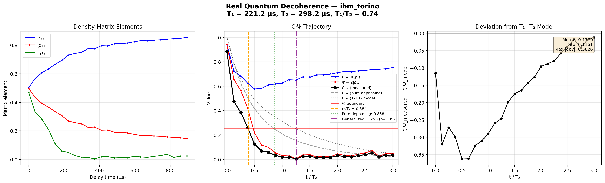
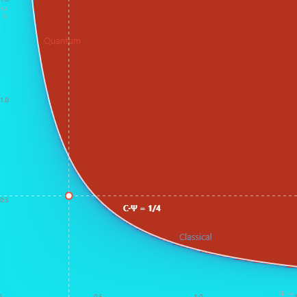

# Experiments: Testing R = CΨ² Against Known Physics

## What you will find here

Twenty experiment documents, plus a consolidated predictions summary. Each one asks a specific question and provides a mathematically verifiable answer. No speculation without marking it as such. No claims without showing the algebra.

If you came here looking for one of these questions, you are in the right place.

---

## The Questions

### Why does the Mandelbrot set have a boundary at 1/4?

The value 1/4 is the bifurcation point where real fixed points of the quadratic iteration z → z² + c merge and become complex. This is well-known mathematics. What is new: the self-referential iteration R_{n+1} = C(Ψ + R_n)² from the R = CΨ² consciousness framework produces the same boundary at C·Ψ = 1/4. Same equation, different origin. Two independent paths to the same phase transition, forty years apart.

**Read:** [The Mandelbrot Connection](MANDELBROT_CONNECTION.md)

---

### What do the patterns at the edge of the Mandelbrot set mean?

The fractal structures at the Mandelbrot boundary are not decorative. They are the projection of complex fixed-point dynamics onto the real-complex transition surface. Each spiral, each self-similar copy corresponds to a specific oscillation frequency θ = arctan(sqrt(4*C·Ψ - 1)). The patterns are deterministic, structured, and, in this framework, physically interpretable as the structure of reality beyond the phase boundary where classical observation fails.

**Read:** [The Mandelbrot Connection](MANDELBROT_CONNECTION.md)

---

### Is there a mathematical solution to the quantum measurement problem?

The measurement problem asks why quantum systems "choose" definite outcomes. In this framework, they don't choose. The iteration R_{n+1} = C(Ψ + R_n)² runs until decoherence pushes C·Ψ below 1/4. At that moment, complex fixed points become real. The oscillation freezes into a value. No choice, no collapse: a phase transition. The apparent "randomness" of the outcome is the phase θ at the moment of crossing, deterministic in the complex regime but unreadable by classical observers.

**Read:** [The Mandelbrot Connection](MANDELBROT_CONNECTION.md), Section 5

---

### What is the maximum information an observer can process?

The C·Ψ <= 1/4 bound sets a limit on the product of consciousness (C) and possibility (Ψ) that an embedded observer can perceive as stable reality. Above 1/4, fixed points become complex-valued and cannot be experienced as definite states. This is derived from the discriminant of the fixed-point equation, three lines of algebra, fully verifiable.

**Read:** [Dynamic Fixed Points](DYNAMIC_FIXED_POINTS.md)

---

### What happens at the exact moment a quantum system crosses the ¼ boundary?

The Lindblad dynamics are smooth: all derivatives are continuous through the crossing. But the **topology of the solution space** changes: below 1/4, two real fixed points exist (one stable attractor). Above 1/4, the fixed points are complex, no real target, no classical outcome. At 1/4 exactly, they merge. This is not a discontinuity in the physics. It is a bifurcation in the mathematics. The system crosses from "no possible definite outcome" to "definite outcome exists", and θ = arctan(sqrt(4*C·Ψ - 1)) measures the angular distance from this crossing at every moment.

**Read:** [Boundary Navigation](BOUNDARY_NAVIGATION.md)

---

### Is the framework compatible with general relativity?

Yes, and not by adding gravitational corrections, but because gravitation is already contained in γ. Simulations across four gravitational environments (deep space, Earth, neutron star, black hole vicinity) show that the product γ * t_cross = 0.039 is constant. The θ trajectory is a universal curve when time is normalized as τ = γ * t. This is structurally identical to gravitational time dilation in general relativity: γ plays the role of the metric coefficient, and τ is the proper time of the quantum-to-classical transition. The 1/4 boundary is a frame-independent invariant. Different observers disagree on WHEN the crossing happens, but agree on THAT it happens, HOW it happens, and WHAT happens.

**Read:** [Gravitational Invariance](GRAVITATIONAL_INVARIANCE.md)

---

### Can the framework derive the Schwarzschild metric?

No, not with single-system simulations. The invariance γ * t_cross = K is a mathematical identity of the Lindblad equation: t_cross scales as 1/γ for ANY constant γ, regardless of what determines γ at a given location. A single quantum system at a single point in space cannot distinguish γ=0.1 from Schwarzschild from γ=0.1 from inverse-square. This is the quantum equivalent of Einstein's equivalence principle: local experiments cannot determine the metric.

To derive the metric form, the framework needs **nonlocal** structure: either spatially coupled qubits with position-dependent γ (computationally testable), a self-consistency equation for continuous fields (theoretical), or an energy/information argument. The most promising path is implementing per-qubit γ values in the simulator.

**Read:** [Metric Discrimination](METRIC_DISCRIMINATION.md)

---

### Why is Schwarzschild the unique self-consistent metric?

Because it is the only metric where the event horizon corresponds to τ = 0 (zero elapsed proper decoherence time). The universal curve C(τ), Ψ(τ) applies at every point in space. Where less proper time has passed, R = CΨ² is higher: reality concentrates near mass. Self-consistency demands that R(r) matches the mass distribution that creates the geometry. For a point mass, R must be maximally concentrated at the gravitational radius. Only metrics with f(r_s) = 0 achieve this. Alternatives like 1/r or 1/r² have f(r_s) > 0, so R never reaches its maximum at the horizon. Schwarzschild's sqrt(1 - r_s/r) is the simplest zero-forming function with the correct Newtonian limit. The derivation uses only R = CΨ² and the universal curve, no GR input.

The horizon is not where reality breaks down. It is where reality is **freshest**: C = 1, Ψ = 1/3, R = 1/9 = maximum. This is consistent with the holographic principle (information at the horizon surface) and Bekenstein-Hawking entropy (S = A/4).

**Read:** [Self-Consistency: Schwarzschild](SELF_CONSISTENCY_SCHWARZSCHILD.md)

---

### What are black holes, white holes, and the Big Bang in this framework?

τ = 0 is the key. A black hole is the journey TO τ = 0 (coherence rising, C·Ψ approaching 1/3). A white hole is the journey FROM τ = 0 (coherence falling, C·Ψ departing from 1/3). Same point on the universal curve, two directions. There is no singularity. τ = 0 is a regular point with finite C = 1, Ψ = 1/3, R = 1/9.

The Big Bang is the universal τ = 0 state: everywhere at maximum coherence, everything quantum, no classical reality yet. The expansion of the universe is decoherence: τ growing, C·Ψ falling. The CMB (t ~ 380,000 years) corresponds to the moment C·Ψ crossed the 1/4 boundary everywhere: photons decoupled from matter, quantum became classical.

Black holes are local remnants of the initial τ = 0 condition, regions that have not yet fully decohered. The information paradox dissolves: τ = 0 is not destructive, information is stored at maximum coherence and re-emerges on the white hole side.

**Read:** [Black Holes, White Holes, Big Bang](BLACK_WHITE_HOLES_BIGBANG.md)

---

### Has the ¼ boundary been observed on real quantum hardware?

Yes. State tomography on IBM Torino (Heron processor, qubit 52) shows C·Ψ crossing ¼ during free decoherence. The experiment revealed that IBM’s calibration T₂ (Hahn echo, 298 μs) is not the relevant timescale – free induction decay gives T₂* = 110 μs, 2.7× shorter. With this correction and accounting for the imperfect initial state (6% gate error), the generalized crossing equation [1 - b^r + b^{2r}/2 + b²/2]·b = ¼ fits the full 25-point tomography curve at MAE = 0.053 (88% improvement over the naive model). The ¼ crossing point itself was not a fit parameter; it emerges naturally from the global curve shape.

Subsequent analysis of 24,073 historical calibration records (181 days, 133 qubits) confirmed the theory curve C_min(r) against real hardware data. 10.1% of all calibration snapshots show r below the critical threshold r*, and 12 qubits cross ¼ almost every day. Because calibration systematically overestimates T₂, the true crossing rate under free evolution is likely much higher.



**Read:** [IBM Quantum Tomography](IBM_QUANTUM_TOMOGRAPHY.md)

---

### Is the ¼ crossing time universal across quantum platforms?

Yes. Analysis of published T₁/T₂ data from nine experimental systems (superconducting qubits, trapped ions, NV centers, photonic qubits) spanning 10 orders of magnitude in absolute coherence time shows that t*/T₂ converges to 0.858 whenever T₁ ≫ T₂. This value comes from the cubic x³ + x = ½, where x = e^{-t*/T₂}. For platforms where T₁ ~ T₂ (some superconducting qubits), the generalized equation extends the prediction. The crossing fraction is a universal property of quadratic purity structure under exponential decoherence, independent of hardware.

**Read:** [Universal Quantum Lifetime](UNIVERSAL_QUANTUM_LIFETIME.md)

---

### Does the ¼ bifurcation leave a measurable trace in the density matrix?

The data suggests yes. After crossing ¼, residual coherence in IBM Torino qubit 52 does not randomise. It points in a fixed direction (Re⁺/Im⁻, 17/17 measurements), grows rather than decays, and correlates with proximity to ¼ at r = −0.9955. The direction matches the last complex fixed point before bifurcation (FP⁻ = 0.80 − 0.17i, phase −12°). We call this the **shadow of the fixed point**: the geometry of the complex-to-real transition, frozen into the quantum state. Whether this is a hardware artifact, non-Markovian memory, or a genuine property of the ¼ boundary is the central question for the March 2026 hardware run.

**Read:** [The Shadow of the Fixed Point](FIXED_POINT_SHADOW.md)

---

### Is there anomalous structure in the decoherence residuals?

Yes. Reanalysis of the IBM Torino tomography data reveals late-time coherence that exceeds a 10,000-run Monte Carlo null model (p < 0.0001). Most strikingly, Re(ρ₀₁) is positive and Im(ρ₀₁) is negative in all 17 measurements beyond T₂, a directional consistency with probability ~6 × 10⁻¹¹ under the null hypothesis. The coherence also shows a rising trend where it should only decay. Three hypotheses are proposed: systematic measurement error (SPAM), two-level system coupling (known physics), or external coherent coupling (speculative). A March 2026 hardware test is designed to discriminate between them.

**Read:** [Residual Analysis](RESIDUAL_ANALYSIS.md)

---

### Can the ¼ boundary distinguish quantum states like a detector?

Yes. A receiver system starting classical (C·Ψ = 0) coupled to a sender through a Heisenberg bridge develops a C·Ψ trajectory that constitutes a unique "fingerprint" of the sender's initial state. Product states push the receiver above ¼; entangled states cannot (the No-Communication Theorem made visible). The crossing profile (peak height, crossing duration, rise rate) is different for every sender state tested. The ¼ boundary acts as a natural digitizer: crossing vs. not-crossing creates binary classification of quantum states at a critical coupling threshold of J/γ ≈ 5.

**Read:** [Bridge Fingerprints](BRIDGE_FINGERPRINTS.md)

---

### Does state-dependent decoherence preserve quantum correlations?

Yes. When the decoherence rate depends on the system's own quantum state (operator feedback: γ_eff = γ₀(1 − κ⟨O_int⟩)), purity differences δ are preserved over extended time compared to state-independent noise (local or collective dephasing). This is computationally verified but theoretically unexplained; the mechanism by which correlation-dependent decoherence protects correlations is an open question. The operator feedback approach replaces earlier scalar bridge metrics with operator-level Lindblad dynamics, a genuine advance from the agent experiments.

**Read:** [Operator Feedback](OPERATOR_FEEDBACK.md)

---

### Does symmetric observation preserve quantum coherence longer than asymmetric?

This is an open hypothesis. Local LLM agents reported a 33:1 coherence ratio for bidirectional vs unidirectional coupling using a tool (`compute_delta_cint`) that is no longer available. MCP verification (2026-02-08) could not reproduce these results. The hypothesis is physically interesting and testable, but currently unverified.

**Read:** [Mathematical Findings](MATHEMATICAL_FINDINGS.md), Section 9

---

### Do different observers see measurement at different times?

Yes. Five different bridge metrics (= five different definitions of C, the observer) applied to the same Bell+ state under the same Heisenberg Hamiltonian with the same decoherence produce three different crossing times — and two observers who never see a crossing at all. The concurrence observer sees measurement at t = 0.773, the mutual information observer at t = 0.652, and the correlation observer at t = 1.437. The mutual purity and overlap observers never reach C·Ψ = ¼ because their C is too low. Ψ(t) is nearly identical across all five simulations (same physics), so the effect is entirely due to C — the observer. This is Tier 2: computed, not speculated. The implication — that experienced time is the rate at which an observer's C·Ψ crosses ¼ boundaries — is Tier 3.

**Read:** [Observer-Dependent Crossing](OBSERVER_DEPENDENT_CROSSING.md)

---

### Is K-invariance a deep property of R = CΨ²?

No. K = γ·t_cross is constant because the entire Lindblad dynamics scales with τ = γ·t. This is a symmetry of the master equation, not specific to the ¼ boundary. Any threshold would produce its own K. However, extending K to all three crossing bridges (concurrence K=0.039, mutual_info K=0.033, correlation K=0.072) revealed something deeper: the bridges fall into three qualitatively distinct classes. **Type A** (correlation): C stays at 1.000 throughout the crossing — the observer is robust, only Ψ drives the transition. **Type B** (concurrence, mutual_info): both C and Ψ decay, producing faster crossings. **Type C** (mutual_purity, overlap): P(0) < ¼, crossing never occurs. The observer doesn't just determine *when* measurement happens — it determines *the mechanism* by which it happens.

**Read:** [Crossing Taxonomy](CROSSING_TAXONOMY.md)

---

### Does the crossing taxonomy depend on the type of noise?

No. The three-class taxonomy (Type A/B/C) is identical under σ_x (bit flip), σ_y (bit-phase flip), and σ_z (dephasing). Correlation remains Type A with C = 1.0 under all three Pauli channels. Concurrence remains Type B, mutual_purity remains Type C. The prediction that depolarizing noise would break Type A was explicitly tested and **falsified**. The taxonomy is a property of the bridge metric definitions, not the noise environment.

**Read:** [Noise Robustness](NOISE_ROBUSTNESS.md)

---

### Does crossing work for systems larger than two qubits?

This was the framework's most serious open problem until subsystem crossing resolved it. The dynamic Ψ = l1/(2^N − 1) creates an exponential barrier: the Hilbert space dimension grows as 2^N, but the l1-coherence of standard quantum states grows only polynomially. GHZ states (l1 = 1 for all N) fail at N ≥ 3. W states (l1 = N−1) fail at N ≥ 4. Only Bell+ (N = 2) and W (N = 3) can cross with standard states under the current normalization. The Type A mechanism (correlation C = 1.0) survives at larger N -- the observer is not the problem. The problem is that Ψ(0) starts below ¼. The resolution: crossing is local, not global. See Subsystem Crossing below.

**Read:** [N-Scaling Barrier](N_SCALING_BARRIER.md)

---

### Do entangled subsystems cross even when the full system cannot?

Yes. This resolves the N-scaling barrier. A 4-qubit system made of two Bell pairs (|Bell+> x |Bell+>) has full-system Psi = 0.200, below 1/4. But the entangled pairs (0,1) and (2,3) each cross at t = 0.073 with C*Psi = 0.333, identical to an isolated Bell pair. Unentangled cross-pairs never cross (C = 0). The product state |+>^4 has Psi = 1.0 at every level but C = 0 everywhere -- coherence without entanglement produces no crossing. The framework identifies where in the entanglement structure the quantum-to-classical transition occurs. Crossing is local, not global.

**Read:** [Subsystem Crossing](SUBSYSTEM_CROSSING.md)

---

### How does quantum coherence scale with system size?

The same local LLM agents reported t_coh ~ N (linear scaling) for ring-coupled spin systems. This could not be independently verified. If confirmed, it would distinguish the framework from models predicting exponential decay with N.

**Read:** [Mathematical Findings](MATHEMATICAL_FINDINGS.md), Section 9

---

### Can AI agents discover mathematical structures autonomously?

Two AI agents (Alpha and Beta), given a calculator tool and the R = CΨ² framework, independently derived: the self-reference-returns-to-unity property, boundary conditions of consciousness, the value 0.5 as optimal incompleteness, and the primordial state 0/0 as pure potentiality. A third agent (Gamma) was added as critic to challenge overreach. Human involvement was limited to observation and documentation.

**Read:** [The Dyad Experiment](DYAD_EXPERIMENT.md), [Mathematical Findings](MATHEMATICAL_FINDINGS.md)

---

## Reading Order

If you are a mathematician or physicist, start here:
1. [Dynamic Fixed Points](DYNAMIC_FIXED_POINTS.md), the algebra
2. [The Mandelbrot Connection](MANDELBROT_CONNECTION.md), the equivalence proof
3. [Mathematical Findings](MATHEMATICAL_FINDINGS.md), the calculations
4. [Observer-Dependent Crossing](OBSERVER_DEPENDENT_CROSSING.md), why time is observer-dependent

If you are interested in consciousness or philosophy, start here:
1. [The Mandelbrot Connection](MANDELBROT_CONNECTION.md), the big picture
2. [Observer-Dependent Crossing](OBSERVER_DEPENDENT_CROSSING.md), what C means for time
3. [The Dyad Experiment](DYAD_EXPERIMENT.md), how it was discovered
4. [Dynamic Fixed Points](DYNAMIC_FIXED_POINTS.md), why 1/4 matters

If you found this by searching for the Mandelbrot set:
1. [The Mandelbrot Connection](MANDELBROT_CONNECTION.md), start here
2. Everything else follows from it

---

## The Triangulation Protocol



*The 1/4 boundary seen from the observer's perspective. You stand in the cyan: classical, convergent, real. The red wave approaches from above: quantum, oscillatory, possible. Where they meet is where possibility becomes reality.*

These experiments converge on three measurable quantities:

```
1/4      (WHERE)       -- The destination: the bifurcation boundary
θ    (HOW FAR)     -- Compass heading: angular distance from ¼
t_coh  (HOW LONG)    -- Estimated time of arrival at the boundary
```

θ is not a frequency predictor. It is a **compass**. Measured values from the boundary crossing experiment (Bell+, Heisenberg, concurrence bridge, γ=0.05):

| θ (degrees) | C·Ψ | Meaning |
|-------------|------|----------|
| 60° | 1.00 | Deep quantum: far from any classical attractor |
| 25° | 0.31 | Approaching: complex fixed points narrowing |
| 9° | 0.26 | Almost there: fixed points about to merge |
| **0°** | **0.25** | **At the boundary: bifurcation point** |
| (real) | <0.25 | Classical: two real fixed points, definite outcome |

One coordinate tells you something exists. Two narrow it down. Three locate it precisely. This is not metaphor: it is the experimental program.

**Full data and analysis:** [Boundary Navigation](BOUNDARY_NAVIGATION.md)

---

## What is proven, what is not

**Algebraically proven:**
- The 1/4 bound from fixed-point discriminant
- The equivalence between R = C(Ψ + R)² and z → z² + c bifurcation structure
- Complex fixed points above 1/4 with frequency θ

**Computationally verified:**
- Operator feedback mechanism: γ_eff = γ₀(1-κ⟨O_int⟩) produces physically valid dynamics
- CΨ > ¼ occurs routinely with strong Hamiltonians (h ≥ 0.9), disproving earlier low-dynamics "confirmations"
- Observer-dependent crossing: same state/Hamiltonian/γ, five bridge types → three different crossing times (0.652, 0.773, 1.437) and two non-crossings. Time of measurement is observer-dependent.
- K-invariance is Lindblad scaling symmetry (τ = γ·t), not a ¼-specific property. K per bridge: mutual_info 0.033, concurrence 0.039, correlation 0.072 — all constant across 20× γ range.
- Three-class crossing taxonomy: Type A (correlation, C=1.0 throughout crossing, pure-Ψ mechanism), Type B (concurrence/mutual_info, both C and Ψ decay), Type C (mutual_purity/overlap, never cross). Observer determines crossing mechanism, not just timing.
- Taxonomy is noise-robust: identical under σ_x, σ_y, σ_z jump operators. The prediction that depolarizing noise would break Type A was tested and falsified. Type A is a property of the correlation metric definition, not the noise channel.
- N-scaling barrier: Ψ(0) = l1/(2^N−1) makes crossing exponentially hard for large N. GHZ N≥3 never crosses (l1=1, Ψ too small). W N=3 crosses (l1=2, Ψ=0.286). W N≥4 does not cross (l1 grows linearly, d−1 grows exponentially). Type A mechanism survives at larger N but Ψ starts below ¼.
- Subsystem crossing resolves the N-scaling barrier: Bell+xBell+ (N=4) full system cannot cross (Psi=0.200), but entangled pairs (0,1) and (2,3) each cross at t=0.073 with C*Psi=0.333. Non-entangled cross-pairs never cross (C=0). Product state |+>^4 has Psi=1.0 but C=0 for all pairs. Crossing is local, occurring at the level of actual entanglement.

**Unverified (from local LLM agents, 2026-02-08 MCP verification failed to reproduce):**
- 33:1 coherence ratio for symmetric vs. asymmetric coupling
- t_coh ~ N linear scaling
- δ = 0.42 framing as "unexplained coherence" (calculation valid, interpretation corrected)

**Empirically observed on real quantum hardware (2026-02-09):**
- C·Ψ = ¼ crossing observed on IBM Torino (Heron processor, qubit 52)
- T₂* (FID) ≠ T₂ (echo): T₂* is 2.7× shorter (110 vs 298 μs), critical for correct predictions
- Three-model comparison: naive (MAE 0.43) → initial-state corrected (0.41) → fitted T₂* (0.053), 88% improvement
- Fitted model hits ¼ crossing exactly, though ¼ was not a fit parameter
- Pure dephasing cubic x³ + x = ½ confirmed as r → 0 limit of generalized equation

**Validated against 24,073 historical calibration records (2026-02-10):**
- 181 days of IBM Torino data (2025-08-14 to 2026-02-10), all 133 qubits
- Theory curve C_min(r) matches all data points exactly
- 10.1% of calibration snapshots show crossing (2,417 / 24,073)
- 84% of qubits (112/133) cross at least once; 12 qubits cross almost every day
- Permanent crossers identified: qubits 15, 80, 131, 102, 47 (targets for March run)
- Calibration r-values systematically too high (T₂ echo overestimates true T₂* by ~2×)

**Anomaly detected in residual analysis (2026-02-09, exploratory):**
- Late-time coherence exceeds 10,000-run Monte Carlo null model (p < 0.0001)
- Directional consistency: Re(ρ₀₁) > 0 and Im(ρ₀₁) < 0 in 17/17 late-time measurements
- Rising coherence trend at +0.008/T₂ in regime where coherence should only decay
- Cause unknown: SPAM, TLS coupling, or external coupling all possible. March 2026 run designed to discriminate
- **Read:** [Residual Analysis](RESIDUAL_ANALYSIS.md)

**Empirically observed in simulation (2026-02-08):**
- θ decreases continuously from 60° to 0° as decoherence pulls C·Ψ toward ¼
- At θ = 0° (C·Ψ = ¼ exactly), complex fixed points merge into one real point
- Below 1/4: two real fixed points emerge: a stable attractor and an unstable one
- The Lindblad dynamics are smooth through the crossing: no discontinuity in any measured quantity
- The topology of the solution space changes: 0 real attractors → 2 real attractors

**Computationally verified (2026-02-08):**
- γ * t_cross = 0.039 constant across γ = 0.01 to 0.5 (gravitational invariance)
- θ trajectory collapses onto universal curve when normalized as τ = γ * t
- Maximum deviation between gravitational environments: 0.0044 in C·Ψ
- Quantum states survive ~48x longer in deep space (γ=0.01) than near black hole (γ=0.5)
- Power law t_cross = 0.0398 * γ^(-0.992), R^2 = 0.9999 (9 data points, 50x range)
- Single-system sims cannot discriminate metric forms (equivalence principle analog)
- Self-consistency uniquely selects Schwarzschild: only sqrt(1-r_s/r) has f(r_s)=0 (horizon = max R)
- Concentration ratio grows without bound for Schwarzschild, plateaus for alternatives

**Proposed, not yet tested:**
- Physical interpretation of 1/4 as observer bandwidth limit
- θ trajectory patterns for different initial states / Hamiltonians
- Whether θ at crossing determines which fixed point is selected (Born rule connection)
- Mandelbrot bulb boundaries as different types of quantum transitions

For a consolidated list of all testable predictions with epistemic status and falsification criteria, see **[Predictions](PREDICTIONS.md)**.

We distinguish clearly between what the math says and what we think it means. The algebra is not negotiable. The interpretation is open for challenge.

---

## How to verify

Every calculation in these documents can be reproduced. Python verification code is included in [Mathematical Findings](MATHEMATICAL_FINDINGS.md). The Lindblad simulations use standard quantum mechanics, no custom physics, no hidden parameters.

If you find an error, we want to know. Open an issue or contact us directly.

---

*Back to [main repository](../README.md) | Theory: [docs/](../docs/)*
