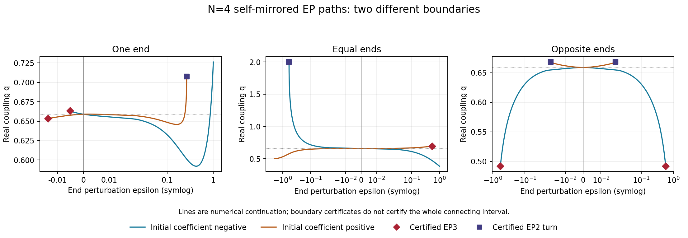

# How far the N=4 self-mirrored EP branches run

The N=4 real EP paths encounter two different boundaries: a triple
eigenvalue (EP3), or a turning point in the end-perturbation parameter
while the eigenvalue remains an EP2. Seven such boundary points are
certified by real-ball contraction and full-block rank minors. A separate
[connected-path certificate](ROUTE_B_N4_SECOND_ARM.md) joins the selected
equal-end germ to its turn and infinity, with two cross-parity coincidences
of character J₂ ⊕ J₁ along the incoming segment. The other seed connections
and the identification of first parameter turns remain numerical. The
seven point certificates alone do not prove maximal intervals.

The source is the [local self-fold theorem](../docs/proofs/PROOF_ROUTE_B_N4_SELF_FOLD.md).
The repository survey searched the F-registry, proofs, Core/Diagnostics,
OpenArcs, framework and experiments for arbitrary-end characteristic
polynomials and range certificates. F89d supplies the block fold, F131
the odd-profile evenness, and F163 the local reduction and branch transport.
The existing uniform-bond octic is not the asymmetric-end characteristic
polynomial. GLOSSARY fixes the coupling convention; CAUGHT_ERRORS requires
independent Jordan-character evidence. The Confirmations registry's
dephasing-half mirror measurement is not an EP-range experiment.



The ε axis is symmetric-logarithmic with a linear region around zero.
Line colors distinguish the two initial coefficient signs; marker shapes
distinguish certified boundary types. Unmarked line ends are finite
continuation limits. The [renderer](../simulations/route_b_n4_range_plot.py)
reads the stored paths and certificate directly.

## The measured paths and certified boundary points

Use γ = 1, Δ = 0, q = J/γ for H = J Σ wₛ(XX+YY), with hopping 2q.
The seed is q₀ = √((√13−1)/6), λ₀ = −4+2iq₀. Bond weights are
(1+ε,1,1), (1+ε/2,1,1+ε/2), or (1+ε/2,1,1−ε/2).
Branch labels refer to the initial q coefficient, not a global ordering
of eigenvalues. Opposite-end coefficients multiply ε²; the others ε.

| Profile and initial coefficient | Negative ε direction | Positive ε direction |
|---|---|---|
| One, −0.520880800 | EP3 at −0.005138273761 | Continued through +1 |
| One, +0.100646300 | EP3 at −0.013736634404 | EP2 turn at +0.264772609822 |
| Equal, −0.520880800 | EP2 turn at √2−2 ≈ −0.585786437627 | Continued through +1 |
| Equal, +0.100646300 | Continued through −1.99 | EP3 at +0.540020222278 |
| Opposite, −30.148714777 | EP3 at −0.580440290430 | EP3 at +0.580440290430 |
| Opposite, +37.494111388 | EP2 turn at −0.018111284338 | EP2 turn at +0.018111284338 |

“Continued through” is a finite numerical endpoint, not a singularity.
The opposite-end negative halves inherit the positive halves by exact
spatial reflection. The positive-bond domains are ε > −1, ε > −2 and
|ε| < 2 respectively; no domain boundary is mistaken for a singularity.

For both seed branches together, the first encountered limits are thus
approximately (−0.00513827,+0.26477261) for one end,
(−0.58578644,+0.54002022) for equal ends, and
(−0.01811128,+0.01811128) for opposite ends. These summarize the tracked
real paths, not certified whole intervals. Equal-end paths can pass
through other-parity coincidences inside these ranges, so the statement
is not that an isolated full-block rank-two plane persists everywhere.

## The exact polynomial and the two boundary mechanisms

The [polynomial producer](../simulations/route_b_n4_range_polynomial.py)
builds the centered full 24D matrix over an integer polynomial ring.
Bra complement and staggered site signs give the exact form

    det(λI−L) = P₄(x,y,a,b) P₈(x,y,a,b),
    x = (λ+4)²,  y = q²,  a,b = the two end weights.

The subscripts are degrees in x. The factor product is checked exactly,
and independent full-Hilbert-space determinants and a missing-bond
control check the assembly. The seed belongs only to P₈. For real q
and λ = −4+iω, use x = −ω² and y = q². Away from ω = 0 and q = 0,
the EP equations are P₈ = P₈,x = 0. Their Jacobian in (x,y) has
determinant −P₈,y P₈,xx. Thus its two failures are distinct:

- P₈,xx = 0 with P₈,xxx ≠ 0: spectral multiplicity grows to three.
- P₈,y = 0 with P₈,xx ≠ 0: spectral multiplicity stays two, but the
  projection of the EP curve onto ε turns.

At equal ends, use the selected spatial-parity frequency octic F:

    P₈(−ω²,q²,1+ε/2,1+ε/2) = F(ω,q,ε) F(−ω,q,ε).

The identity and both degree-eight multiplicities are checked exactly.
The seed-carrying factor is selected by its exact remainder at ω = 2q,
ε = 0 modulo 3q⁴+q²−1. Tracking F = Fω = 0 prevents a meeting with
the opposite parity from being mislabeled as the end of this branch.

The [ball certificate](../simulations/route_b_n4_range_certificate.py)
isolates each of the seven points with a real radius 10⁻²⁵ per coordinate
at 384-bit precision. For the three equations H = (P,Px,Pxx), or
H = (P,Px,Py), it constructs a fixed invertible Y and proves

    ‖I−Y DH‖∞ < 1,
    |Y H(center)|ᵢ + row_boundᵢ · radius < radius.

The resulting self-map is a contraction on the closed box, proving a
unique real root there. Displacing the center in ε by 0.001 makes the
same inclusion test fail. Nonzero derivative enclosures fix the root
multiplicity; nonzero spectator factors exclude additional eigenvalues.
A nonzero 23×23 minor of the full λI−L certifies geometric multiplicity
one. These are therefore actual EP3 or EP2 points, not merely small-gap
locations. A floating QR only chooses the minor; ball arithmetic proves
its determinant nonzero.

The certificate also bounds the curvature of ε along the real EP curve.
For a triple root, with x as local parameter,

    ε″ = −Py Pxxx / (Py Pxε−Pε Pxy).

For an EP2 turn, with y as local parameter,

    ε″ = −(Pyy−Pxy²/Pxx)/Pε.

These enclosures exclude zero. Consequently each certified point is a
genuine local end of real solutions in one ε direction. The negative
one-end points allow ε above the endpoint; the positive one/odd turns
and positive odd/equal EP3 points allow ε below the endpoint. The
equal-end negative turn allows ε above its endpoint. The same formulas
apply to F with coordinates (ω,q,ε).

## A closed boundary at equal ends

At the exact point (ω,q,ε) = (2,2,√2−2),

    F = Fω = Fq = 0,
    Fωω = 49152,  Fε = 65536√2,
    Fωq = −49152,  Fqq = 32768.

Eliminating ω gives reduced curvature
Fqq−Fωq²/Fωω = −16384. Hence

    ε−(√2−2) = (q−2)²/(8√2) + O((q−2)³).

Real EPs exist locally on the ε > √2−2 side. The eigenvalue remains
λ = −4+2i at the turning point with a size-two Jordan block. The loss
of a single-valued real q(ε) here is not an EP3.

## Coincidences that are not the end of fixation

The equal-end upper branch crosses ω = 0 numerically at
ε ≈ −1.32629034509733, q ≈ 0.512150882523673. Its selected octic has
Fωω and Fq nonzero there, so that branch continues through the crossing;
the opposite-frequency factor meets it and full-block isolation fails.
At the decoupled boundary ε = −2, q = 1/2, exact full-block nullities of
(L+4I), (L+4I)² and (L+4I)³ are 2,4,4: two size-two Jordan blocks,
not one EP4. The numerical approach to this boundary is not a proof of
continuation all the way from the seed to it.

For one-end variation, solving just 10⁻⁶ beyond each of its three
boundaries finds conjugate complex q values and vertically mirrored λ
values. Thus the pairing survives when individual real-axis fixation
fails. An untethered singularity solve can also find a nearby boundary
on another branch: those roots are retained as candidates in numerical
outputs, not chosen by their smallest |ε|.

## Reproduction and remaining question

```powershell
python simulations/route_b_n4_range_polynomial.py
python simulations/route_b_n4_range_one.py
python simulations/route_b_n4_range_even.py
python simulations/route_b_n4_range_even.py --algebra-only
python simulations/route_b_n4_range_precise.py
python simulations/route_b_n4_range_certificate.py
```

The one/equal/opposite producers retain high-precision path readings and
candidate roots; the certificate separately establishes the seven local
boundary objects. None of these is a Taylor convergence-radius theorem.
The remaining connection tasks concern the other seed germs and boundary
boxes, with exclusion or classification of intervening coincidences.
First-turn and maximal-interval claims need their own parameter-specific
checks beyond regularity of a q-parametrized branch.

The [second-arm study](ROUTE_B_N4_SECOND_ARM.md) follows the other side
of the exact equal-end turn toward q → ∞. It identifies the limit
ε = √3−2 and four exact local EP2 germs from an independently projected
Hamiltonian resonance. A chain of 197 uniform real-ball contractions
certifies the connection of the finite turn to the negative-√5 germ,
with full-block EP2 character for every finite q ≥ 2. Another 934 tiles
join the seed to the turn. Its selected R = +1 mode remains EP2; exactly
two encounters with R = −1 modes raise full-block multiplicity to three,
with Jordan structure J₂ ⊕ J₁.
