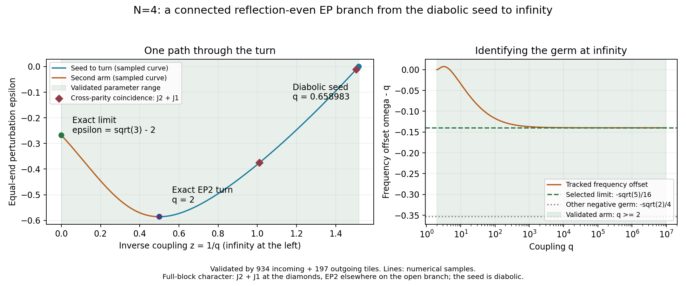

# From a diabolic seed to a Hamiltonian resonance

**Date:** 2026-09-09

## What this is about

Two modes of a four-spin chain can meet and still remain independent.
Changing the end bonds opens paths on which they instead share one
eigenvector. We follow one such path. What first looks like its end is a
bend: the path turns back in the end-bond parameter while the coupling
keeps growing. Following it all the way connects the original crossing to
a limiting resonance of the Hamiltonian. The story is one continuous path,
with the mirror symmetry helping us identify which modes meet along it.

## Abstract

The equal-end branch leaving the N = 4 diabolic seed with negative
dq/dε has a validated continuation through (ε,q,ω) = (√2−2,2,2)
to the negative-√5 Hamiltonian-resonance germ at infinity. There are
934 uniform real-ball tiles from the seed to the turn and 197 from
the turn to infinity. For every finite q > q₀ the selected mode is
an EP2 in the reflection-even sector. Two cross-sector coincidences
have full-block character J₂ ⊕ J₁; the seed itself is semisimple.

## Context and continuation

The [virtual product-state readout](ROUTE_B_N4_VIRTUAL_READOUT.md) tests
the measurable Jordan overlap at the exact turn and the shot cost of
distinguishing nearby end profiles with one fixed measurement.

The repo survey used F89d/F163, the uniform-octic inventory in Core and
Diagnostics, the F-registry, proofs, OpenArcs, framework, GLOSSARY,
CAUGHT_ERRORS and experiments. The uniform reference inventory has four
positive-real defective q loci, but neither that inventory nor its
complex-q monodromy proves an end-profile connection. The
[range note](ROUTE_B_N4_RANGE.md) supplies the exact turn and the sampled
incoming arm; the local self-fold proof supplies the exact seed germ.
[QST_BRIDGE](QST_BRIDGE.md) acknowledges engineered transfer
chains, but does not own this profile or this EP asymptote. F129's uniform
cosine-comb collision law and F88b/F98's popcount Krawtchouk identities
are different objects and are not premises here. The Confirmations
registry has no hardware measurement of this EP path.



The left panel uses inverse coupling, so infinity is the finite left
edge. The right panel distinguishes the approached germ from the other
negative germ. Lines render numerical samples; the green region marks
the parameter range of the validated branch. The
[renderer](../simulations/route_b_n4_second_arm_plot.py) reads the stored
path records and both continuation certificates.

## The model and the turn

The model remains N = 4, γ = 1, Δ = 0, q = J/γ with hopping 2q,
restricted to the full 24-dimensional coherence block with ket
popcount 1 and bra popcount 2.
The bond weights are (a,1,a), a = 1+ε/2, and λ = −4+iω.
The incoming arm starts at

    q₀ = √((√13−1)/6),  ω₀ = 2q₀,  ε = 0.

The incoming arm reaches ε = √2−2 at q = 2. At the turn,
F = Fω = Fq = 0 but Fε Fωω ≠ 0, so (ω,ε) are locally regular
functions of q. Their tangent is (dω/dq,dε/dq) = (1,0).
Locally, the q > 2 side turns toward larger ε and forms the second arm.

The [path producer](../simulations/route_b_n4_fold_path.py) follows the
intersection F = Fω = 0 by pseudo-arclength in (ω,q,ε). Its initial
tangent is exactly the q-increasing tangent above. It continues to
q ≈ 86.59458, then changes coordinates to z = 1/q and follows the same
double-root equations to z ≈ 10⁻⁷. Predictor correction is checked;
tangent orientation and polynomial residuals are retained. This is numerical
branch tracking. The separate bridge certificate below identifies the
same analytic second arm without relying on floating-point root matching.

The validated arm does not meet the uniform slice ε = 0.
Its compactified coordinates reach the negative √5 germ
derived below. An identification merely from a similar q value in the
uniform EP inventory would have selected the wrong object.

## Resolving the seed and joining the incoming arm

At the seed, the full eigenvalue has algebraic and geometric
multiplicity two, as proved by the
[exact matrix calculation](../docs/proofs/PROOF_ROUTE_B_N4_SELF_FOLD.md).
It is not an EP. Its characteristic determinant and its first parameter
derivatives vanish, so the ordinary EP-curve equations are singular there.

The [incoming certificate](../simulations/route_b_n4_incoming_certificate.py)
resolves this endpoint. Write Q = q₀ and use

    q = Q+(2−Q)t,  ω = 2Q+tv,  ε = tu,  0 ≤ t ≤ 1,
    S(u,v,t) = 27F(2Q+tv,Q+(2−Q)t,tu)/(256t²).

The numerator is exactly divisible by t² in the number field
3Q⁴+Q²−1 = 0 with Q > 0. At t = 0, Sᵥ = 0 fixes v linearly in u.
The remaining quadratic is exactly proportional to the local slope
equation after c = (2−Q)/u. Its negative root
u₀ = (2−Q)/c₋ selects c₋ ≈ −0.520880800087, the incoming germ.
The other root is positive. The Jacobian of (S,Sᵥ) in (u,v) is
nonzero at the selected endpoint.

The coefficients are enclosed from the positive nested-radical value
Q = √((√13−1)/6), after exact polynomial reduction. Algebraic
constants are never replaced by rounded decimal coefficients. A chain
of 934 uniform real-ball contractions covers t ∈ [0,1]. Its endpoint
enclosures are contained in the next uniqueness box, using the same
joining argument detailed for the outgoing bridge below. The final
box contains exactly the fold coordinates

    t = 1,  u = √2−2,  v = 2−2Q.

Thus it joins the already certified outgoing arm at the same exact
point. Wrong-seed, wrong-fold and missing-tile controls fail. For t > 0,

    Fε = (256/27)t Sᵤ,  Fωω = (256/27)Sᵥᵥ.

The certificate excludes zero from Sᵤ, Sᵥᵥ and P₄, and keeps ω > 0,
u < 0 and 2+tu > 0. Consequently the selected reflection-even mode
is an EP2 for Q < q ≤ 2, with positive end bonds and −2 < ε < 0.
The opposite-sector octic is retained as a diagnostic rather than
incorrectly required to stay nonzero.

## Reflection-sector coincidences before the turn

Equal end bonds preserve spatial reflection R. The
[exact parity producer](../simulations/route_b_n4_parity_factors.py)
constructs integer orbit bases for the two 12-dimensional sectors and
proves their invariant-subspace identities. With B = −i(L+4I),

    det(ωI−B₊) = F(ω,q,ε) Q₄,₊,
    det(ωI−B₋) = F(−ω,q,ε) Q₄,₋,
    Q₄,₊ Q₄,₋ = P₄(−ω²,q²,1+ε/2,1+ε/2).

The selected octic therefore belongs to R = +1; its frequency-sign
partner belongs to R = −1. The producer rejects the swapped assignment.
This distinction matters whenever the two octics vanish together.

The [crossing certificates](../simulations/route_b_n4_incoming_crossing.py)
enclose two solutions of F = Fω = F(−ω,q,ε) = 0 in 384-bit real balls,
with coordinate radius 10⁻³⁰:

| q | ε | ω |
|---:|---:|---:|
| 0.6651211675237017 | −0.01164250655651217 | 1.3136606858010467 |
| 0.9893218998051270 | −0.37512063568099016 | 1.2307353848385674 |

At both, Fωω, Fε, the ω derivative of the opposite octic, and P₄
are nonzero. The R = +1 block has a defective double root, while
R = −1 contributes an independent simple root. Certified rank-22
minors of the full matrix independently bound its nullity by two.
Thus the full eigenvalue has algebraic multiplicity three and geometric
multiplicity two: **J₂ ⊕ J₁**, not an EP3. Spatial reflection prevents
the two sectors from mixing at these equal-end profiles. A certificate
requiring the opposite octic to stay nonzero would stop at such a
point even though the parity-resolved EP2 can continue.

There are exactly two such encounters on the incoming branch. The
incoming certificate excludes zero from the opposite octic on every
tile outside two connected parameter strips. Inside each strip it
certifies a constant nonzero sign of the derivative along the solution:

    g(u,v,t) = F(−(2Q+tv),Q+(2−Q)t,tu),
    h(t) = g(u(t),v(t),t),
    u′ = −Sₜ/Sᵤ,
    v′ = −(Sᵥₜ+Sᵤᵥu′)/Sᵥᵥ,
    h′ = gₜ+gᵤu′+gᵥv′.

The strip endpoints have opposite signs of h, giving exactly one
zero in each strip. The two independently certified crossing boxes
are transformed into (t,u,v) and contained in the corresponding
path uniqueness boxes. A bijection check matches one point to each
strip; omitted or duplicated crossing records fail. This proves both
association and completeness, not merely proximity of isolated roots
to the numerical curve. The outgoing certificate excludes the
opposite factor everywhere for q ≥ 2, so there are no further
cross-sector coincidences on the selected forward branch.

## Resolving infinity into four separate germs

Let F(ω,q,ε) be the exact seed-carrying frequency octic from the
[full-block polynomial producer](../simulations/route_b_n4_range_polynomial.py).
Set

    z = 1/q,  r = ω/q,  k = (ε+2)²,
    G(r,k,z) = z⁸ F(r/z,1/z,√k−2).

F is even in ε+2, so G is a polynomial, independent of the square-root
choice. Near (r,k,z) = (1,3,0), resolve the coincident frequencies by

    r = 1+zv,  k = 3+zu,
    K(u,v,z) = G(1+zv,3+zu,z)/(32z³).

The division is exact, and K is polynomial. Its leading term is

    H(u,v) = K(u,v,0) = (u+4v)(u−4v)²+40v−8u.

The EP equations become K = Kv = 0. At z = 0 their exact resultant is

    Res_v(H,Hv) = 1048576 (u²−8)(16u²−125).

There are four distinct real solutions, with paired signs:

    (u,v) = (±2√2, ±√2/4),
    (u,v) = (±5√5/4, ±√5/16).

All four Jacobians of (K,Kv) in (u,v) are nonzero. The implicit function
theorem therefore supplies four unique real analytic germs u(z),v(z).
At each, Hvv and Hu are nonzero. The other factors of the full
characteristic polynomial have nonzero leading terms:

    z⁶ P₄ → 16[(u−4v)²+64],
    z⁸ F(−ω,q,ε) → −6912.

Thus the full eigenvalue has algebraic multiplicity two at nonzero small
z. The nonzero ε derivative of its determinant excludes geometric
multiplicity two by the adjugate derivative identity. These are genuine
full-block EP2 germs, not just repeated roots of a selected factor.
The [exact germ producer](../simulations/route_b_n4_fold_infinity.py)
checks the factor identities, resultant, Jacobians and the next terms.
A deleted leading dephasing term makes the same four root checks fail.

## Which germ the finite arm approaches

The compact numerical continuation approaches
u₀ = −5√5/4, v₀ = −√5/16. At its final point the distance in (u,v)
to this germ is about 4.3·10⁻⁷, while the other three remain separated.
For this germ the exact expansions are

    ω = q−√5/16 + 2813/(1024q) + O(q⁻²),
    ε = √3−2−5√15/(24q)−1399√3/(2304q²) + O(q⁻³).

The [uniform real-ball certificate](../simulations/route_b_n4_infinity_ball.py)
proves a unique solution for every z ∈ [0,10⁻⁶], in a coordinate box
of radius 10⁻⁴ about (u₀,v₀). It uses 384-bit arithmetic, a fixed
inverse-Jacobian preconditioner and a contraction bound uniform in z.
The row bounds are below 0.0027 and the image bounds below 5.5·10⁻⁶,
strictly inside that box. A displaced-center control fails.
Enclosures of Ku, Kvv and both scaled spectator factors exclude zero
throughout. Consequently, for every finite q ≥ 10⁶ this tail consists
of real-q EP2s on Re λ = −4. The z = 0 endpoint itself is the resolved
Hamiltonian limit, not a finite-coupling Liouvillian EP.

The tail certificate is a local enclosure. The bridge certificate below
supplies the connection from q = 2. Neither certificate turns the
displayed asymptotic truncations into error bounds at moderate q.

## The validated bridge

The [bridge producer](../simulations/route_b_n4_bridge_certificate.py)
works directly with E = (K,Kv) on z ∈ [0,½]. At the finite turn,

    E(−2,0,½) = 0,
    ∂E/∂(u,v) = [[16,0],[16,48]],
    (du/dz,dv/dz) = (4,0).

Thus the turn in the ε projection is regular in z. The producer covers
the closed z interval with 197 adjacent rational parameter intervals.
For each interval I it chooses a real box B centered at c and a fixed
nonsingular real matrix Y. Outward-rounded 384-bit ball arithmetic
bounds the map

    T_z(x) = x−Y E(x,z)

uniformly for every z ∈ I. The row-sum bound on I−Y ∂E/∂x is below
one, and the image bound is strictly inside the chosen radius. Banach's
theorem gives one real root in the box for each z; the nonsingular
Jacobian gives local analyticity. Uniqueness here is within the box,
not a census of all roots of E.

The connection uses containment rather than mere overlap. Starting
from the exact turn, each tile encloses its lower-endpoint root by
intersected mean-value images. The derivative enclosure always covers
the original box, including the segment from the fixed center to the
shrinking endpoint enclosure. The entire resulting endpoint enclosure
must lie inside the next tile's uniqueness box. Consequently their
roots agree at the shared parameter, and local uniqueness joins their
analytic continuations. Exact rational endpoints exclude parameter
gaps. At z = 0, the exact negative-√5 root belongs to the final
uniqueness box, identifying the limiting germ.

Box and endpoint records retain exact dyadic midpoints and radii;
rounded display strings are not used for connection tests. Removing
a middle tile or substituting the other negative infinity germ makes
the same connection audit fail.

Every tile excludes zero from Ku, Kvv, z⁶P₄ and z⁸F(−ω,q,ε).
For finite z > 0,

    Fωω = 32z⁻⁵ Kvv,
    Fε = 64√k z⁻⁶ Ku.

The selected frequency root is therefore exactly double, with both
spectator factors nonzero. Its nonzero determinant ε derivative
forces rank 23 by the adjugate identity. This certifies a full 24D
EP2 at every finite q ≥ 2, excluding EP3 collisions or intersections
with the spectator factors on this eigenvalue branch.

The same boxes certify u < 0, k = 3+zu > 0 and r = 1+zv > 0.
With the positive-square-root bond convention, every finite point obeys

    −2 < ε = √k−2 < √3−2 < 0,  ω > 0.

Thus the path cannot return to the uniform end profile. The endpoint
z = 0 is its Hamiltonian limit, not an additional finite-q EP. The
certificate makes no claim that this arm exhausts the other real or
complex solutions. The incoming segment is covered by the separate
resolved-seed certificate above.

## The Hamiltonian and dissipator behind the polynomial

The limiting bond weights are

    a∞ = √3/2,  (a∞,1,a∞).

Their single-excitation Hamiltonian divided by q is the real symmetric
tridiagonal matrix with off-diagonals (√3,2,√3), whose eigenvalues are
exactly −3,−1,1,3. The two-excitation energies are sums of two distinct
single-excitation energies. Several ket–bra differences therefore have
the same frequency +q.

The [independent resonant projection](../simulations/route_b_n4_resonance_projection.py)
rebuilds the full commutator frequency matrix T₀ at this profile. Its
eigenvalue +1 is semisimple, has dimension five, and has spatial parity
+I. Let U span this real eigenspace and W = (UᵀU)⁻¹Uᵀ. Since

    a = √(3+zu)/2 = √3/2 + zu/(4√3) + O(z²),

the leading operator after subtracting iqI is

    M(u) = W[D + iu(T_left+T_right)/(4√3)]U.

Its determinant at μ = −4+iv is exactly

    det(μI₅−M(u)) = i[(u−4v)²+64] H(u,v) / 1024.

This independently reproduces H from the actual dephasing and hopping
matrices. The extra quadratic factor is nonzero for real u,v; its two
roots have leading decay rates −2 and −6. The remaining three modes
carry the cubic response. At each of the four real double-root points,
the effective matrix has exact rank four after subtracting μI, hence
one Jordan block of size two. Replacing the projected dissipator by the
scalar −4I removes these four roots. Equally spaced Hamiltonian energies
alone therefore do not supply the EPs: the dissipator's action in their
resonance space is essential.

U is not orthonormal; the displayed coordinates of M need not be
symmetric. Neither physical nonnormality nor a state-population claim
is inferred from those coordinate entries. This projection explains
the limiting operator; the compactified polynomial proves the actual
finite-q EP germs.

## What the path tells us about the mirror

The mirror keeps each real germ on Re λ = −4, but does not select just
one of the four germs at infinity. Selection comes from the validated
continuation from the exact seed through the turn. At two intermediate
points the full spectrum acquires a third coincident mode, while
reflection keeps its eigenvector separate from the EP2's Jordan chain.
The
endpoint at infinity has finite bond ratios and diverging q; in these
units this is a strong-Hamiltonian limit, not a finite operating point.

The selected forward branch is therefore connected for every finite
q > q₀. Its seed is diabolic, its reflection-even mode is an EP2
throughout the open branch, and its full-block character is J₂ ⊕ J₁
at precisely the two tabulated crossings and an isolated EP2 elsewhere.
This does not enumerate the other seed germs or the full real and
complex parameter locus, nor supply a complex-ε Taylor convergence disk.

## Reproduction

```powershell
python simulations/route_b_n4_fold_infinity.py
python simulations/route_b_n4_resonance_projection.py
python simulations/route_b_n4_fold_path.py
python simulations/route_b_n4_infinity_ball.py
python simulations/route_b_n4_bridge_certificate.py
python simulations/route_b_n4_self_fold.py
python simulations/route_b_n4_parity_factors.py
python simulations/route_b_n4_incoming_crossing.py
python simulations/route_b_n4_incoming_certificate.py
```

Each producer stores a corresponding JSON in simulations/results.
