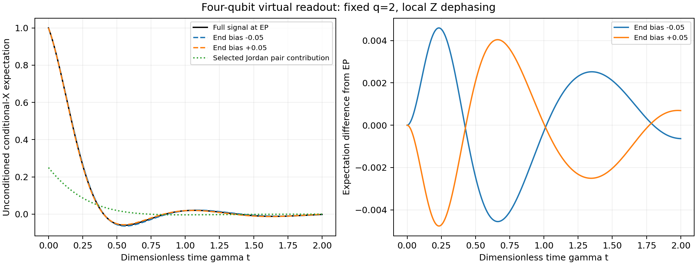

# Reading the four-qubit EP with a product preparation

**Date:** 2026-09-09

## What this is about

A special point in an equation is only the start of an experiment. We need
to prepare something simple, let it evolve, and ask a measurement a concrete
question. Here we prepare four spins and watch one quantum coherence fade.
The calculation finds that the chosen signal contains a contribution from
the exceptional point, where two modes share one eigenvector. Yet a small
change in the end bonds changes the measured signal only slightly. This is
our first estimate of how much repetition that difference would cost, before
choosing a machine or designing a hardware run.

## What the repo already held

The stores were searched by the primitive this note uses: the readout discrimination
power of a Lindblad trajectory under a parameter perturbation, on the (1,2) coherence
block of the N=4 XY chain with Z dephasing.

The Diagnostics half answers.
[`ReadoutFisher`](../compute/RCPsiSquared.Diagnostics/Foundation/ReadoutFisher.cs) is a
live readout lab: `DiscriminationMax` sums (p_A − p_B)²/p_clean over the outcomes of a
rotated basis and maximises it over the time grid.
[`ReadingPowerWitness`](../compute/RCPsiSquared.Diagnostics/Foundation/ReadingPowerWitness.cs)
reports that the classical Fisher information of a bond defect is monotone increasing in
Q across its swept grid Q = 20 down to 1, in the Z, X and Y readouts, so nothing peaks
anywhere on that grid; it is gated at N=4 by
`ReadingPowerWitnessTests.NoEpPeak_InAnyBasis_FiMonotoneInQ`. Its grid contains no point
at the N=4 coherence horizon Q*(4) = 1.87874 and stops at Q = 1, so it is a statement
about that sweep and not about a specific degeneracy. Neither object has a `Claim` in
`compute/RCPsiSquared.Core/`.

[`COHERENCE_HORIZON_EP_SENSOR_DEBATE`](COHERENCE_HORIZON_EP_SENSOR_DEBATE.md) parked the
metrological verdict in June, saying it "needs an input-output measurement model the
toolkit does not carry", and records Wiersig and Rotter's "the QFI can be further
increased by moving away from the EP".
[`F130_HW_INFEASIBILITY`](F130_HW_INFEASIBILITY.md) is the genre precedent: a
design-stage null result with no QPU spent.

The OpenArcs registry is not silent. The arc `zeros_connecting_structure` records that
"the loud transition IS the EP amplification studied as EP-SENSING
(COHERENCE_HORIZON_EP_SENSOR_DEBATE, the Petermann factor)", and the arc
`f124_inverse_problem_resolution_seam` names `ReadingPowerWitness` and
`inspect --root decoder` directly.

What did come back empty: `docs/ANALYTICAL_FORMULAS.md` holds no F number for shot cost
or a Fisher readout, its nearest entry being F124's matched-filter resolution limit;
`docs/proofs/` holds nothing on readout cost; the `Claim` graph in
`compute/RCPsiSquared.Core/` holds nothing on discrimination; `fw.Confirmations` has no
hardware measurement of any exceptional point; `docs/GLOSSARY.md` defines no house term
for Petermann factor, SNR, shot or Fisher information, though its q versus Q entry
applies, this note being in the q book with hop 2J; `docs/CAUGHT_ERRORS.md` holds EP
character mislabelling and nothing on measurement cost.

## What this settles, and what it does not

This note does not compare the exceptional point against a neighbour, and says so
itself below: it "establishes numerical overlap and a baseline measurement cost, not
experimental EP certification or a metrological advantage", and adds that it does not
demonstrate an advantage over a non-EP operating point. Half a million shots per setting
is the price of a transverse parameter comparison, and it is the input the sibling notes
then improve on. The EP-versus-off-EP verdict is theirs, not this one's.

## Abstract

The [connected equal-end branch](ROUTE_B_N4_SECOND_ARM.md) supplies an exact
EP at q = 2, ε = √2 − 2, λ = −4 + 2i. This experiment asks whether a simple
physical preparation and measurement see its Jordan component, and how much
the measured mean changes when the end bonds move away from that point.
Full density-matrix propagation in the N = 4 XY model with local Z
dephasing confirms a nonzero Jordan contribution for a product preparation
and a three-outcome local readout. At γ = 1, biases Δε = ±0.05 require
598,838 and 721,419 ideal shots per setting for mean SNR 5 at the best
sampled times. All outcomes count. This establishes numerical overlap and
a baseline measurement cost, not experimental EP certification or a
metrological advantage.

## Protocol

Use four XY-coupled spins with local Z dephasing, γ = 1, hopping matrix
elements 2q times the bond weights (1 + ε/2, 1, 1 + ε/2). Time τ is γ times
physical time. Hold q = 2 fixed and compare ε with ε ± 0.05. These are
transverse parameter comparisons, not motion along the EP branch.

Prepare (|0001⟩ + |0011⟩)/√2, with site zero the least significant bit.
This is a product state: site zero is excited, site one is in |+⟩, and the
other two sites are in |0⟩. Measure X on site one and Z on the three other
sites. Assign the X outcome ±1 when the spectator bits match 001, and zero
otherwise. No shots are discarded or renormalized.

Writing A = ρ₁₁ + ρ₃₃ and S = 2 Re ρ₁₃, the three probabilities are
(A + S)/2, (A − S)/2, and 1 − A. The mean is S and its single-shot variance
is A − S². Populations are propagated along with the coherence in the full
16-dimensional Hilbert space, using the 256-dimensional density generator.

## What the calculation finds

The selected λ = −4 + 2i Jordan pair contributes

S_pair(τ) = 2 Re [exp((−4 + 2i)τ) (a + bτ)],

with numerical a = 0.125 + 0.0208333333333334i and b = 0.0833333333333333.
In particular b is nonzero: this preparation and readout couple to the
nilpotent part. These values are numerical evaluations, not a new exact
closed-form proof. The full signal contains other modes; the component is
a spectral decomposition, not a separately measured probability or signal
available without additional processing.

For two independent datasets of M shots each, the difference-of-means SNR is
|S_other − S_EP| √M / √(Var_other + Var_EP). Searching 401 equally spaced
times in 0 ≤ τ ≤ 2 gives:

| End bias Δε | Best grid time | Mean difference | M for mean SNR 5, each setting |
|---|---:|---:|---:|
| −0.05 | 0.685 | −0.00452102 | 598,838 |
| +0.05 | 0.680 | +0.00402065 | 721,419 |

Each row costs 2M shots in total. These are separate pairwise comparisons,
with a common measurement time within each pair. A scan over many times
would require additional shots. The model assumes perfect preparation,
readout and calibrated q, γ and ε; no hardware errors or calibration cost
are included. SNR 5 is a mean-to-standard-deviation ratio, not a specified
hypothesis-test power or a certificate of an EP.

The simple protocol has a nonzero Jordan overlap but a small parameter
contrast. Distinguishing these means does not establish Jordan character:
ordinary background modes also change with ε. Nor does it demonstrate a
metrological advantage over a non-EP operating point. This follows the
distinction already made in [the sensor discussion](COHERENCE_HORIZON_EP_SENSOR_DEBATE.md).

## Reproduction and checks

Run `python simulations/route_b_n4_virtual_readout.py`, preferably with
OPENBLAS_NUM_THREADS=1. It writes
`simulations/results/route_b_n4_virtual_readout.json` and the figure above.
The producer checks the independent full generator against the framework's
24-dimensional (1,2) block, full versus block evolution, matrix exponential
versus exponential action, trace and Hermiticity over the grid, sampled
positivity, and valid measurement probabilities. A Hamiltonian-off control
recovers exp(−2τ) and rejects the wrong exp(−4τ) decay.

The Jordan component uses a radius-0.2 Riesz contour around −4 + 2i,
converged at 128 versus 256 points. Projector rank by trace, idempotency,
nilpotent square, and the projected propagator identity are checked. These
are numerical guards; the exact EP itself is supplied by the branch work.

The [finite preparation/readout search](ROUTE_B_N4_READOUT_SEARCH.md)
extends this baseline at fixed resources, including two off-EP centers.
