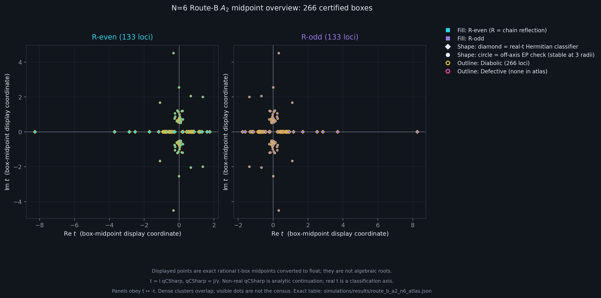
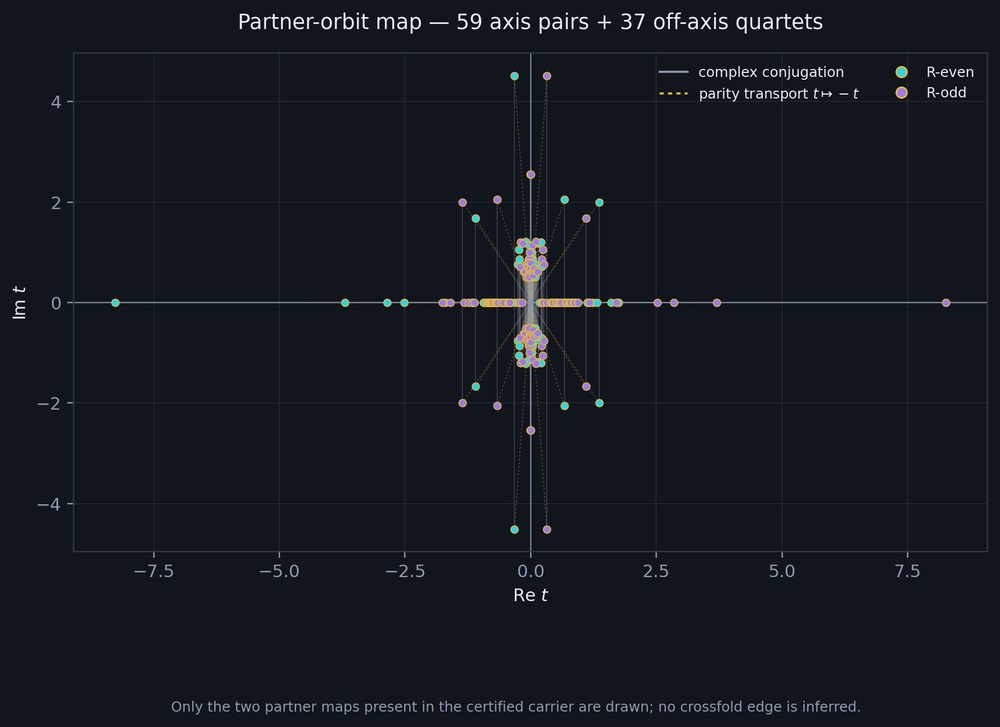
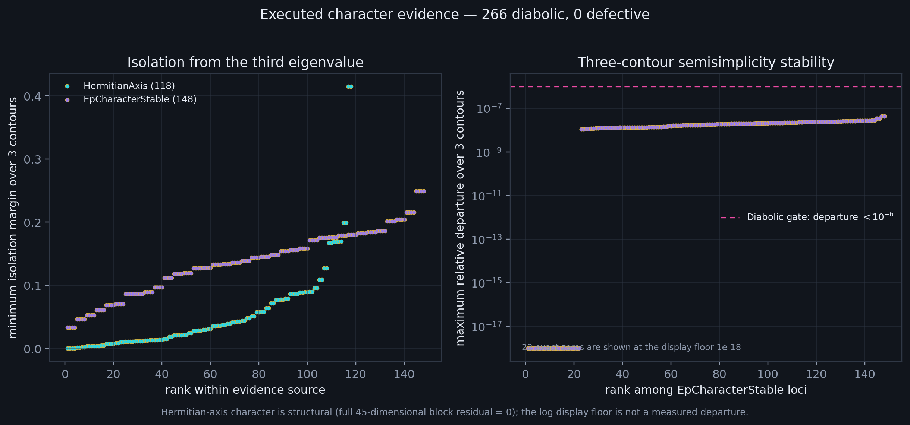

# The N=6 Route-B A₂ Locus Atlas

**Status:** Executed finite-N atlas. The exact schema-3 carrier supplies 266 isolated direct-*t* A₂ loci; the C# full-sector classifier consumes every locus once and reports 266 diabolic crossings, 0 defective points and 0 unresolved loci. This is an N=6 result, not an all-*N* theorem.

**Date:** 2026-09-08

**Authors:** Thomas Wicht and Codex

## What this is about

A search has found many places where modes of the six-spin chain meet.
This atlas asks what kind of meetings they are and how the mirror arranges
them. Equal eigenvalues alone do not mean that the modes have lost their
independence. In this inventory they remain independent at every classified
crossing. The map gives the later end-bond experiments their starting
points, including crossings reached by mathematical continuation into
complex coupling rather than by a physical control knob.

## Abstract

The exact N = 6 Route-B carrier contains 266 isolated direct-t A₂ loci.
Classification in the full SE-ket/DE-bra block identifies all 266 as diabolic,
with no defective or unresolved entries. The atlas displays this finite
inventory and its mirror relations using t = i qCSharp and Λ = 2λ.
It supplies a map and character audit of the stored crossings, not an
all-size theorem or a hardware measurement.

## Model and prior work

**Physical scope and coordinates:** Open uniform nearest-neighbour XY chain
(Δ=0, zero field) with uniform local Z-dephasing γ=1, restricted to the
SE-ket/DE-bra coherence block. The carrier uses the same `qCSharp=J/γ`
normalization as the earlier N=4 work, but stores the N=6 search plane as the
exact quarter-turn *t*=i·`qCSharp`; its spectral coordinate is Λ=2λ. Thus a
reported isolation margin in physical λ units is the carrier's Λ margin
divided by two. Complex *t* (equivalently complex *q*) is analytic
continuation, not a physical coupling.

**What the stores returned.** `docs/THE_DOUBLE_ROOT.md` already carried the N=5
and N=6 inventories, so what follows is that inventory's picture and its orbit
bookkeeping, not a second measurement. `docs/ANALYTICAL_FORMULAS.md` returned
F89c and F89d, the second of which fixes where these loci's partners sit and is
used below. The OpenArcs registry's `diabolic_over_higher_n` owns the over-*N*
question and records the N=7 F₅₃ layer as unmeasured.
`experiments/F89_BRANCH_LOCUS_PALINDROME.md` is the N=4 predecessor and supplies
the mirror this layer inherits. `docs/proofs/PROOF_CODIM1_BY_ADDITIVITY.md`
supplies the semisimplicity mechanism and its boundary. The typed layer answers
in both halves, and unevenly. `RouteBN6A2UnfoldingClaim` (F163) owns the
unfolding and is live at `inspect --root n6unfolding`, and its witness loads
this page's inventory and reports the 266-locus count at inspect time, so the
CENSUS is held by a claim and a witness both.
`RouteBN5RealQSemisimpleClaim` (F164) owns the N=5 real-q locus and, with it,
the N=6 real-q exclusion; `F89CrossFoldSimilarityClaim` owns the fold at
`inspect --root crossfold`. F164 also carries the character
split, naming the 118 Hermitian-axis and 148 generic-complex loci and reading
`ExactRankExecuted = 0` as a statement about the classifier's route rather than
about the loci. One number on this page is held by no claim and no witness at
all, the minimum isolation margin: it lives in
`RouteBA2N6CharacterClassifier` and is gated only in the reconciliation
category, which is the third place a verdict can sit, an xUnit trait with
neither a `Claim` nor a witness above it. `docs/CAUGHT_ERRORS.md` returned its three
2026-06-21 entries, the EP-character trilogy, which is why character here is an
executed verdict and never an inferred one. `fw.Confirmations` holds one
EP-labelled hardware node whose own record states that no EP, mode coalescence
or Jordan structure was measured, so nothing on hardware bears on the character
of this layer.

## A map after the search

The Route-B calculation did not merely return a count. It left 266 small
isolation boxes in the complex *t* plane: 133 pairwise disjoint boxes in each
R-parity, each one carrying an algebraic double root and two exact involutions:
complex conjugation within one R-parity and
parity transport *t* → −*t*. The atlas is the moment those boxes stop being a
list and become a place we can revisit.



*Every point is drawn at the midpoint of its exact rational isolation box,
converted to a floating-point display coordinate. The marker is therefore a
representative of a certified box, not the algebraic root itself. Cyan is
R-even, violet R-odd; diamonds are the 118 real-*t* `HermitianAxis` readings,
circles the 148 off-axis `EpCharacterStable` readings. The gold outline records
the executed verdict Diabolic. Magenta is reserved for Defective, of which the
atlas contains none.*

The colour and shape carry different questions. Parity says which residual
sector owns the locus. Shape says how its local character was established.
Neither is allowed to stand in for the other, and the absence of magenta is a
measured outcome rather than an empty design choice.

## Ninety-six rooms, not 266 unrelated points

The two partner maps close the inventory into 96 orbits. The 59 real-axis
orbits have size two: conjugation fixes each point and parity transport joins
the even and odd loci at opposite *t*. The remaining 37 orbits have size four:
conjugation supplies the upper/lower pair and parity transport supplies its
opposite-parity image.



*Solid grey joins the carrier's conjugation partners; dotted gold joins its
parity partners. These are the only edges present in the schema-3 artifact.
The cross-fold that joins each locus to a partner in a neighbouring block is
drawn nowhere here, because that block is not in this dataset; it is stated
below, where it is inherited rather than read off the figure.*

This is the useful compression: 266 certified local events become 96 rooms
without discarding a locus. It is also a practical search index. A later
perturbation can be asked whether it moves an entire room coherently, splits a
conjugate pair, or breaks the parity transport. The map does not answer those
questions in advance; it makes their controls visible.

## How we know the crossings are silent

Algebraic multiplicity two comes from the exact A₂ carrier. Geometric
multiplicity is a separate question and passes through the full
45-dimensional R-parity block at the exported seed.



On the real-*t* axis the full block is Hermitian to an executed residual of
exactly 0.0 in this run, so every algebraic double root there is semisimple.
Off the axis, `EpCharacter` reads the isolated two-dimensional restriction at
three radii. Every radius must enclose exactly the same pair and all three must
agree on character. The diabolic gate requires relative departure below
10⁻⁶; the defective gate would require geometric multiplicity one and
departure above 5·10⁻². The smallest middle-contour isolation margin is
0.06589058580248003 in physical λ units at γ=1. No exact-rank fallback was
executed, and the source artifact's `exactRankCertificates` array is empty.
For 22 off-axis loci the recorded maximum relative departure is exactly 0.0;
the logarithmic evidence plot places those markers at a 10⁻¹⁸ display floor,
which is not a measured departure.

| Inventory reading | R-even | R-odd | total |
|---|---:|---:|---:|
| certified direct-*t* A₂ loci | 133 | 133 | 266 |
| `HermitianAxis` | 59 | 59 | 118 |
| `EpCharacterStable` | 74 | 74 | 148 |
| `ExactRankExecuted` | 0 | 0 | 0 |
| Diabolic, alg=geo=2 | 133 | 133 | 266 |
| Defective / unresolved | 0 | 0 | 0 |

## Provenance and reproduction

The source of geometry is
[`simulations/results/route_b_a2_n6.json`](../simulations/results/route_b_a2_n6.json),
SHA-256
`c4b19015a750e56a55b0c8fdba3d05534c0c133bc5355a74eb89b77020532d47`.
The broader double-root interpretation and the boundary to other N live in
[`THE_DOUBLE_ROOT.md`](../docs/THE_DOUBLE_ROOT.md).

The atlas manifest binds that digest to every accepted character reading and
orbit:

```powershell
dotnet run --project compute/RCPsiSquared.Cli -c Release -- route-b-n6-atlas --out simulations/results/route_b_a2_n6_atlas.json
python simulations/route_b_a2_n6_atlas.py --manifest simulations/results/route_b_a2_n6_atlas.json --out-dir visualizations
```

The manifest is not an independent measurement. It is a deterministic view of
the exact inventory after the existing reconciliation gate has accepted all
266 executed readings. The renderer refuses changed source bytes, count drift,
an incomplete orbit partition, a non-diabolic verdict, or fewer than three
contour readings.

## The earlier flashlight

The ancestor is
[`F89_BRANCH_LOCUS_PALINDROME`](F89_BRANCH_LOCUS_PALINDROME.md), the N=4 reading
of this same layer, and its picture
[`f89_octic_branch_locus.png`](../visualizations/f89_octic_branch_locus.png).
That document is where the mirror this atlas inherits is proved. With T the
antiunitary weight-complement symmetry carried on the block,
T L(q) T⁻¹ = −L(q̄) − 2σ, so every coalescence either lies on Re λ = −σ or
carries a partner the same distance across it, and no orphan is possible. The
separation of the N=4 locus is algebraic, read off the exact discriminant
disc_λ(F₈) = const · q²⁴ · (3q⁴ + q² − 1)² · P₂₀(q): twenty exceptional points at
the simple zeros of P₂₀, four diabolic points at the zeros of the quartic factor
that enters squared. The min-gap heatmap is the picture of that locus and is
resolution-limited, which is why the near-twins at q ≈ ±0.857 and ±0.854, 0.003
apart, render as one dot each.

This atlas does something narrower and later. It maps only the N=6 direct-*t*
A₂ layer, with no heatmap and no A₁ exceptional points. The two figures share a
visual grammar: magenta for defective seams, gold for silent crossings, and the
same `qCSharp` normalization; the displayed N=6 *t* plane is exactly the N=4 *q*
plane quarter-turned by multiplication with i. They do not share N, sector, or
dataset. They do share the mirror, and at N=6 that mirror leaves the block.

## The partner block is this one, folded

At N=4 the mirror folds the (SE,DE) block onto itself, and that self-fold is
what puts one diabolic on the real *q* axis, at q ≈ ±0.659. It is an N=4
property: it needs the overlap rung (2 states) and the no-overlap rung (N−2
states) balanced, so 2 = N−2. At N=6 the fold leaves the block. The exact
statement is F89d, the cross-block antiunitary similarity

    L_(1,N−2)(q̄)  =  −P · conj(L_(1,2)(q)) · Pᵀ  −  2N·I

with P the bra-complement permutation, machine zero for N = 4..9 at every *q*,
real and complex; live at `inspect --root crossfold`, typed as
[`F89CrossFoldSimilarityClaim`](../compute/RCPsiSquared.Core/Symmetry/F89CrossFoldSimilarityClaim.cs).
At N=6 the partner is the (SE, w₄) block, which the witness names (SE,QE).

This is a similarity of the whole block, not a statement about single points,
and it is onto. The displayed map is antiunitary rather than linear: the
permutation
[`BraComplementPermutation`](../compute/RCPsiSquared.Core/F89PathK/WeightCoherenceBlock.cs)
supplies the basis bijection, onto because C(n, wBra) = C(n, n−wBra) and the ket
weight is unchanged, here 6·15 = 90 on both sides, and the entry conjugation,
q → q̄ and the affine shift complete it. Each of those factors preserves the
dimensions of generalized eigenspaces, which is why the layer split travels with
the spectrum rather than merely alongside it: a branch that is constant in q
stays constant in q, so no rate-locked strand can arrive as a residual one. The
rungs are the visible face of that. (SE,DE) carries −2γ and −6γ, (SE, w₄) carries
−6γ and −10γ, and r ↦ −r − 2N sends −2γ to −10γ while holding −6γ fixed: the two
blocks share one rung and exchange the other.

The A₂ layer of the partner block is therefore this atlas, conjugated in *q* and
reflected in λ: the same 266, the same characters and coalescence gaps, at
(q̄, −λ̄ − 12). The count holds per R-parity as well, 133 and 133, because the
bra-complement commutes with the site reflection, so the grading rides along.
That is a structural consequence and not a census. No second enumeration of the
(SE, w₄) A₂ layer has been run, here or anywhere else in the repo.

That the partner really is a different block is measured rather than inferred,
and the measurement is the `foldlift` probe recorded with the palindrome: the
(SE,DE) spectrum closes under λ ↦ −λ̄ − 2σ at N=4, residual 3·10⁻¹⁴ with four
on-line strands, and fails at N=5, 6 and 7, residual ~1 with none. The atlas
cannot add to that reading. Its λ enclosures are not the certified object: the
tight boxes are in *t*, at most 4·10⁻²⁹ wide, while the derived λ boxes reach
10¹⁰⁸ and 76 of them straddle Re λ = −6. Only the *t* geometry above is
certified at the width the figures imply.

What the fold does not supply is the count. It relates 133 at N=6 to itself, not
to N. That number remains the measured degree of one exact factor.

## Boundary of the atlas

The map establishes the finite N=6 inventory, its two exact partner
involutions, and the executed local character at the committed seeds. It does
not turn box midpoints into exact roots, establish the character at Δ > 0, prove
stability under disorder or topology changes, reach any coherence block outside
the folded pair, or settle the F₅₃ N=7 doubled layer. On Δ the repo's position is
sharper than caution: every sampled positive-Δ proposal at N = 4, 5 and 6 is
Uncertified under strict full-block checking, and only the Δ=0 controls remain
Diabolic with alg=geo=2.

One lift a reader may expect here is absent for a reason the registry already records.
[F150](../docs/ANALYTICAL_FORMULAS.md)'s support-parity law would give a q-evenness on a
fold-fixed block, and this block is not one: `(1,2)@N=6` is F150's own **negative
control**, fold-fixed on neither leg, measured at sign 0 on F_res and on the full
characteristic polynomial. So the inventory below is built without that lift, and
correctly.

The local end-bond question has an exact answer in
[F163](../docs/proofs/PROOF_ROUTE_B_N6_UNFOLDING.md). The degree-133 A₂ factor
is irreducible, and one real, Hermitian embedding carries semisimplicity to
every conjugate. The parity transport covers all 266 loci. Changing one end
or both ends equally opens two local EP branches at first order; changing
the ends oppositely opens them at second order. The leading locations have
a quadratic algebraic formula. The family theorem supplies no uniform radius
and does not alter the stored classifier routes or its empty exact-rank-fallback
array. For `N6-E-A2-T-007`, the [ball-arithmetic companion](../docs/proofs/PROOF_ROUTE_B_N6_REMAINDER_BOUND.md)
certifies explicit conservative disks and the corrected Taylor remainder for
both branches of all three profiles.

The mirror therefore does something more specific than hold these crossings
together: it decides which perturbation orders can reach the two-plane.
The equal-end change keeps the mirror and still opens the crossing; the
opposite-end change must leave the plane and return before its first effect
appears. The exact result comes from the same finite atlas, read as one
algebraic family rather than as 266 separate numerical points.
