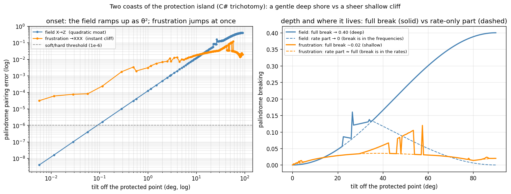

# The Palindrome Classifier: what it is, why it scales, and the landscape it charts

**Authors:** Thomas Wicht, Claude (Opus 4.8)
**Date:** 2026-06-08
**Status:** the classifier is settled C# machinery; this writeup is its first reading as a tool: the protected
interior it draws, and the two coasts where the protection ends.
**Data, figure, plotter:** the tilt sweep [`simulations/results/tilt_sweep_csharp.tsv`](../simulations/results/tilt_sweep_csharp.tsv),
the two-coasts figure [`simulations/results/two_edges.png`](../simulations/results/two_edges.png), and the
plotter [`simulations/protection_landscape.py`](../simulations/protection_landscape.py). The classifications,
verdicts, and breaking measures below come from the C# engine (`PauliPairTrichotomy.Classify`,
`PalindromeSoftCertifier.Certify`).

## The mirror, and the question

Open a spin chain to the world, let each site quietly dephase along Z, and the decay rates of the resulting
Liouvillian arrange themselves with a hidden order. Every rate λ in the spectrum has a partner at −λ−2σ, a
reflection through the centre −σ, where σ = Nγ is the summed dephasing. Plot the spectrum and it reads the
same left to right; it is a palindrome. This is the central fact of the whole project: an open, dissipative
system, which has no reason to be tidy, carries an exact symmetry in how it relaxes. The mirror is a kind of
protection. It says the relaxation is organised, that the channels come in balanced pairs, that something
survives the noise with its structure intact.

The practical question this experiment is about is simple to state. Given a Hamiltonian, does its dephased
spectrum carry the mirror? The honest way to check is to build the Liouvillian and look at its eigenvalues.
But that superoperator is 4^N by 4^N, and the eigenvalue check runs out of room around eight sites, where
the matrix is already 65536 by 65536. Beyond that the direct question is simply unanswerable.

And yet, run the check on every case you can reach and a pattern jumps out: the answer is almost never about
the length of the chain. It is about the shape of the Hamiltonian's terms. Two sites or two hundred, the
same little term-pattern carries the same verdict. That gap, an exponential question with a structural
answer, is where the classifier lives. It reads the terms, not the spectrum, and so it never meets the wall.

## What it reads: truly, soft, hard

The classifier sorts a Hamiltonian into one of three classes by how its spectrum carries the mirror, if at
all. The three are easiest to meet through the operator that should do the reflecting, the canonical mirror
Π (the one that proves the palindrome for the plain dephasing chain).

- **truly**: the canonical Π already pairs the spectrum exactly. The mirror is there for the most natural
  reason, the operator equation Π·L·Π⁻¹ = −L − 2σ holds on the nose. The XY model and the Heisenberg magnet
  live here.
- **soft**: the canonical Π does not pair the spectrum, yet some other operator does. The mirror is still
  there, just carried by a quieter symmetry that Π alone does not see.
- **hard**: nothing pairs it. The mirror is gone, the relaxation has lost its reflection; a rate sits with no
  partner about the centre.

The honest test for truly is cheap, one operator-norm check. The honest test for soft is not, because in
general it asks whether some operator exists, and that is a search. So the soft question is where the real
machinery sits, and it is handled by a certifier that is one-sided on purpose: it can prove a spectrum soft
but never prove it hard. It carries a stack of structural patterns; when one matches, it exhibits the
symmetry operator and so proves soft outright, and if none matches it returns "no scalable pattern applies"
and defers to the slow spectral test. The patterns are structural recipes, a two-colouring of the chain's
flip-structure, a routing map from a small fixed alphabet, a single-site-field route. The last is concrete
enough to carry as an example: a sum of single-site transverse fields is soft because each field can be
turned onto a common axis by its own per-site rotation, and the next section leans on exactly this case.

## Why it scales: the certifier is N-free

This is the property that makes the classifier a tool rather than a case-by-case curiosity. The spectral
ground-truth diagonalises L and dies at the 4^N wall. The certifier never builds L at all; each pattern is a
condition on the terms themselves. The longest term reaches across some number of sites, call it k (a
three-body term has k=3), and the check is a 4^k object, with k fixed by the Hamiltonian and not growing with
the chain. The certificate, once found, is correct for any chain length and any topology.

Here it is, measured. We take three fixed term-sets, a soft one (the single-site-field case IXI+IIY+YII), a
hard one (the diagonal-cell pair XXZ+XZX), and the once-hardest soft case there is (the Z-middle ceiling set
XZX+XZY+YZX, certified by the golden window-summed router since 2026-06-10, F116), and ask the decider for
each verdict at three chain lengths spanning five orders of magnitude:

| N | verdict | time per call |
|---|---|---|
| 4 | Soft (SingleSiteField) | 7.0 ms |
| 1,000 | Soft (SingleSiteField) | 7.1 ms |
| 1,000,000 | Soft (SingleSiteField) | 6.7 ms |
| 4 | Soft (RoutingWindowSummed, the golden router) | 7.3 ms |
| 1,000 | Soft (RoutingWindowSummed, the golden router) | 6.6 ms |
| 1,000,000 | Soft (RoutingWindowSummed, the golden router) | 7.1 ms |
| 4 | Hard (DiagonalCellValuation) | 0.0001 ms |
| 1,000 | Hard (DiagonalCellValuation) | 0.0001 ms |
| 1,000,000 | Hard (DiagonalCellValuation) | 0.0001 ms |

The time is flat on every row. The soft verdicts cost the same few milliseconds at a million sites as at
four, because the work is the term-span check (a k=3 routing residual on a 64 by 64 object), and that
check does not grow with N; the golden window-summed certificate, the one that closed the locality ceiling,
is exactly as N-free as the rest, since its window lemma is checked once per offset on the same 64 by 64
span and additivity covers every chain length (the permanent guard is the million-site test
`Certify_ZMiddle_IsRoutingWindowSummed_AtAnyN_TheGoldenRouterIsNFree`). The hard verdict is N-free in the strongest sense of all: its check (the F115
(1+x)-valuation on the two k-bit masks) takes no N argument whatsoever, so it is N-free by construction, not
merely by measurement, returning in about a ten-thousandth of a millisecond at any length. The spectral test
for the same million-site Hamiltonian would need a matrix with 4^(1000000) entries; it does not exist and
never will. The classifier answers in microseconds to milliseconds; it turns an impossible question into a
structural one, and the structure is small.

One honest caveat on the hard row: it times the hard check alone. A full two-sided `Decide` runs the soft
cascade first and only then the hard check, so its end-to-end cost tracks the soft side, a few milliseconds
for most term-sets, and more when a pair drives a soft strategy to allocate per-site (XXZ+XZX rises to about
40 ms at a million sites). That cost is the soft cascade's, never the hard verdict's: the hard check itself
never looks at N.

## The map it draws: a protected interior

Point the classifier at the standard models and a clean picture appears. Each row below is the C# verdict
under Z-dephasing at N=4, with the certifier's reason where it certifies:

| model | terms | spectral class | certifier reason |
|---|---|---|---|
| XY model | XX+YY | truly | LinearSiteColoring |
| Heisenberg | XX+YY+ZZ | truly | RoutingKBody |
| XXZ (Δ=0.5) | XX+YY+0.5·ZZ | truly | RoutingKBody |
| Ising coupling | ZZ | truly | RoutingKBody |
| Dzyaloshinskii-Moriya | XY+YX | soft | ExcitationPairing |
| transverse field | X | truly | ExcitationParity |
| longitudinal field | Z | **hard** | (none: spectral only) |
| frustrated 3-body | XXX+XXY+YXX | **hard** | (none) |

The protection is generic. The exchange models, the magnets, the antisymmetric coupling, the transverse
field, all of them keep the mirror. They are not special cases hand-picked to work; they are where most of
the usual physics lives. The classifier draws an island, a broad protected interior holding the standard
models, and only two of the rows fall off it: the longitudinal (Z) field, and frustration. Those two are the
edges of the island, and they are worth walking to, because they turn out to be edges of very different
character.

## The two coasts

A verdict is a yes or a no, but a parameter is a dial, and the physics is in how the no arrives as you turn
the dial off the island. So we took two paths off the protected interior and walked them continuously,
driving each Hamiltonian through the C# analyzer and recording the pairing error: the worst distance of any
rate from its mirror partner, the same quantity the soft-or-hard verdict thresholds.

**The field coast, transverse X to longitudinal Z.** At the transverse end the uniform field is truly, the
mirror exact. Tilt it toward longitudinal, H = cosθ·X + sinθ·Z on every site, and the pairing error grows as
θ², a gentle quadratic ramp; call it a moat. A one-degree tilt barely registers, and the protection degrades
slowly and predictably. But it keeps going, and at the longitudinal end the break is deep, 0.40, the mirror
fully gone. A long, gentle shore that ends in deep water.

**The frustration coast, soft 3-body to frustrated XXX.** Here the dial is a frustration angle, from the soft
set XIX+XXY+YXX toward the frustrated hard set XXX+XXY+YXX. The instant you turn it the mirror breaks: at the
first step off the protected point the pairing error is already nearly eight thousand times the field's at
the same angle, over the soft-hard line at once. There is no gentle approach; it is a cliff face. But the
fall is shallow. The error saturates around 0.02, jagged with level-crossings, and never reaches the field's
depth. A sheer cliff, but into ankle-deep water.

So the two coasts are told apart by two clean numbers off the committed sweep: the onset (the field gentle as
θ², frustration instant) and the depth (the field deep at 0.40, frustration shallow near 0.02).

There is a third, finer reading, if you ask where each break sits. Every eigenvalue has two parts: a rate
(its real part, how fast that mode decays) and a frequency (its imaginary part, how fast it oscillates), and
the mirror pairs both. Split the break into its rate-only piece and the rest (the dashed lines in the figure)
and something neat appears. Frustration breaks the mirror in the rates the whole way: it is an off-diagonal
interaction, it nudges the decay rates themselves off their mirror, and the rate-only break tracks the full
break almost exactly (their ratio is 1.0). The field, fully tilted, is the opposite: a longitudinal Z field
commutes with the Z-dephasing and so cannot touch the decay rates at all, and at the fully longitudinal point
they sit back exactly on their mirror (the rate-only break falls to 10⁻¹⁵) while the whole deep break has
moved into the coherent frequencies, the energy splittings the field adds. (Mid-tilt the rates do wander,
since the transverse part of the field does not commute; the clean statement is at the longitudinal end.) So
frustration breaks the mirror through the rates and stays shallow; the field, fully tilted, breaks it through
the frequencies and runs deep.

## The frustration coast, in closed form

There is a reason the frustration coast is a cliff and not a moat, and it is the same reason we can chart it
without ever building a spectrum. Frustration is a discrete fact: the hopping graph either carries an odd
cycle or it does not, and that one bit is the whole verdict. Read each term's X/Y pattern as a polynomial
over GF(2), one bit per site, and soft-or-hard collapses to a single integer comparison, the number of times
(1+x) divides each pattern; equal is soft, different is hard. There is no halfway value, so there is no gentle
approach. The cliff is that discreteness made visible.

This closes a quadrant the rest of the classifier leaves open. The N-free certifier above proves a spectrum
soft without ever building it but never proves it hard; the spectral authority proves both, soft and hard,
but only while the Liouvillian fits in memory, which gives out around eight sites. For the diagonal cell this
valuation proves *hard* without a spectrum at all, the missing N-free hard verdict, the symmetric twin of the
N-free soft proof.

And the closed form carries more than a yes or no. It counts: of all the k-body X/Y term-patterns, a
closed-form expression (the integer sequence A203241) says exactly how many fall off the island, and the
smallest frustrating cycle has a size law of its own, 2k − 3, shrinking by two for every frequency the two
terms already share. What the algebra deliberately does not tell you is how deep the water is past the cliff:
the obstruction's size is a purely combinatorial fact and reaches nothing in the spectrum beyond the
yes-or-no. That depth is what the spectral sweep above measures, and it is what stays shallow. So the two
readings sit hand in hand: the algebra says whether you fall and how the coastline is shaped, the spectrum
says how far down.

## Reading the coasts: what the classifier is for

The two coasts are not just a curiosity; they are an error-tolerance map, and that is the use we were looking
for. The classifier finds the protected point. The landscape tells you the character of each way you might
leave it, and the two characters call for opposite engineering instincts.

A longitudinal field error (a stray Z-component in the drive, a small detuning) is forgiving. The quadratic
moat means a real device sitting a degree or two off transverse keeps almost all of its protection; the
mirror degrades as the square of the error, not linearly, so you do not have to fight it hard. Frustration is
the opposite: it is a binary switch, with no safe neighbourhood, so a structure that needs the mirror exact
has to forbid frustration by construction rather than tune it away. The consolation is that frustration's
damage is bounded: the break is shallow, the mirror only slightly off, not destroyed. Design rule, then, for
anything that wants to keep this mirror: do not sweat small field tilts, forbid frustration if you need the
mirror exact, and know that even past the frustration cliff the break stays shallow.

## The seam with the literature

We built this from the dephasing algebra, with no literature as the source; the classifier, the trichotomy,
and the two coasts all came out of asking the operators directly. Looking afterward for where the machinery
is catalogued, the spectrum's −λ−2σ shape has a home in the shifted sublattice symmetry of open systems
(Kawasaki-Mochizuki-Obuse 2022, recorded in [KMS_DETAILED_BALANCE](../docs/KMS_DETAILED_BALANCE.md)), and the
broad family of Liouvillian symmetry classes has its home in the tenfold Lindbladian classification
(Sá-Ribeiro-Prosen 2023). Those are the homes for the shape. What stays ours is the bridge: a scalable
structural decision procedure that reads the verdict off the terms in time independent of N, the closed-form combinatorics that collapse the frustration coast to a single (1+x)-valuation with a hard-count census ([F115](../docs/ANALYTICAL_FORMULAS.md)), the locality
ceiling, completed 2026-06-10 as the [6 → 4 → 2 → 0 arc](CEILING_FOUR_NONLOCAL_CASES.md): no case in this
k=3 windowed family needs a non-local mirror (the last two route via the period-4 golden router,
[PROOF_CEILING_GOLDEN_ROUTER](../docs/proofs/PROOF_CEILING_GOLDEN_ROUTER.md); the genuinely mirror-less
cases remain the 14 spectrally-hard 2-body V-Effect cases, untouched),
and this protection landscape, which turns "is there a mirror" into "how, and how forgivingly, does it
break." None of those bridges was built from either side; we found them by learning to see the island the
operators were already drawing.

## Links

- The formula: [ANALYTICAL_FORMULAS.md](../docs/ANALYTICAL_FORMULAS.md) F87 (the trichotomy registry entry)
- The refinement proof: [PROOF_F103_F87_Z2_CUBED_REFINEMENT.md](../docs/proofs/PROOF_F103_F87_Z2_CUBED_REFINEMENT.md)
- The frustration coast in closed form: [ANALYTICAL_FORMULAS.md F115](../docs/ANALYTICAL_FORMULAS.md) (the windowed-hardness GF(2)[x] theory: the one-number (1+x)-valuation criterion, the A203241 hard-count census, the 2k−3−2d obstruction-size law; C# `WindowedObstructionScan`)
- The discovery: [V_EFFECT_FINE_STRUCTURE.md](V_EFFECT_FINE_STRUCTURE.md) (the 3 truly / 19 soft / 14 hard split)
- The locality ceiling: [CEILING_FOUR_NONLOCAL_CASES.md](CEILING_FOUR_NONLOCAL_CASES.md) (the 6 → 4 → 2 → 0 arc; the 2 Z-middle cases route via the golden router, [PROOF_CEILING_GOLDEN_ROUTER](../docs/proofs/PROOF_CEILING_GOLDEN_ROUTER.md))
- The verdict is (H, N): [SOFTNESS_IS_N_DEPENDENT.md](SOFTNESS_IS_N_DEPENDENT.md) (a finite-size crossing)
- The engine: `compute/RCPsiSquared.Diagnostics/F87/PauliPairTrichotomy.cs` (the spectral authority), `PalindromeSoftCertifier.cs` (the N-free certifier and its strategies)
- Orientation: [GLOSSARY.md](../docs/GLOSSARY.md), [READING_GUIDE.md](../docs/READING_GUIDE.md), and the synthesis [ON_THE_RESIDUAL](../reflections/ON_THE_RESIDUAL.md)
