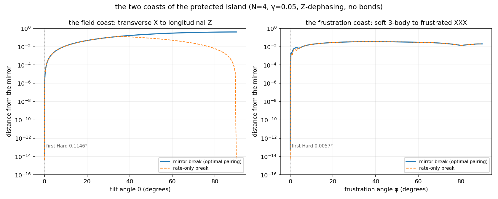

# The Palindrome Classifier: what it is, why it scales, and the landscape it charts

**Authors:** Thomas Wicht, Claude (Opus 4.8)
**Date:** 2026-06-08
**Status:** the classifier is settled C# machinery; this writeup is its first reading as a tool: the protected
interior it draws, and the two coasts where the protection ends.
**Data, figure, generator:** the two-coast sweep
[`simulations/results/two_coast_sweep.tsv`](../simulations/results/two_coast_sweep.tsv) and its figure
[`simulations/results/two_edges.png`](../simulations/results/two_edges.png), both written by
[`simulations/two_coast_sweep.py`](../simulations/two_coast_sweep.py). The numbers quoted below that
the sweep grid does not carry (the sub-grid laws, the other Hamiltonians, the other γ values) have
their own gate, [`simulations/two_coast_claims.py`](../simulations/two_coast_claims.py), which
recomputes each one and compares it to what this document says. The sweep is N=4, γ=0.05
(so σ = Nγ = 0.2), Z-dephasing on every site and **no bond terms**; the field coast is
H(θ) = Σ_l (cos θ·X_l + sin θ·Z_l) and the frustration coast
H(φ) = Σ_w (cos φ·XIX + sin φ·XXX + XXY + YXX) over the 3-site windows. The classifications and verdicts
come from the C# engine (`PauliPairTrichotomy.Classify`, `PalindromeSoftCertifier.Certify`) and are
carried over by angle from an older dump,
[`tilt_sweep_csharp.tsv`](../simulations/results/tilt_sweep_csharp.tsv), whose runner is no longer in the
repo: that column is the one thing here a reader cannot regenerate, and the parameters above were recovered
by reproducing its numbers rather than read off a source.

## The mirror, and the question

Open a spin chain to the world, let each site quietly dephase along Z, and the decay rates of the resulting
Liouvillian arrange themselves with a hidden order. Every rate λ in the spectrum has a partner at −λ−2σ, a
reflection through the centre −σ, where σ = Nγ is the summed dephasing. Plot the spectrum and it reads the
same left to right; it is a palindrome. This is the central fact of the whole project: an open, dissipative
system, which has no reason to be tidy, carries an exact symmetry in how it relaxes. The mirror is a kind of
protection. It says the relaxation is organised, that the channels come in balanced pairs, that something
survives the noise with its structure intact.

The practical question this experiment is about is simple to state. Given a Hamiltonian, does its dephased
spectrum carry the mirror? The honest way to check is to build the Liouvillian and look at its eigenvalues.
But that superoperator is 4^N by 4^N, and the eigenvalue check runs out of room around eight sites, where
the matrix is already 65536 by 65536. Beyond that the direct question is simply unanswerable.

And yet, run the check on every case you can reach and a pattern jumps out: the answer is almost never about
the length of the chain. It is about the shape of the Hamiltonian's terms. Two sites or two hundred, the
same little term-pattern carries the same verdict. That gap, an exponential question with a structural
answer, is where the classifier lives. It reads the terms, not the spectrum, and so it never meets the wall.

## What it reads: truly, soft, hard

The classifier sorts a Hamiltonian into one of three classes by how its spectrum carries the mirror, if at
all. The three are easiest to meet through the operator that should do the reflecting, the canonical mirror
Π (the one that proves the palindrome for the plain dephasing chain).

- **truly**: the canonical Π already pairs the spectrum exactly. The mirror is there for the most natural
  reason, the operator equation Π·L·Π⁻¹ = −L − 2σ holds on the nose. The XY model and the Heisenberg magnet
  live here.
- **soft**: the canonical Π does not pair the spectrum, yet some other operator does. The mirror is still
  there, just carried by a quieter symmetry that Π alone does not see.
- **hard**: nothing pairs it. The mirror is gone, the relaxation has lost its reflection; a rate sits with no
  partner about the centre.

The honest test for truly is cheap, one operator-norm check. The honest test for soft is not, because in
general it asks whether some operator exists, and that is a search. So the soft question is where the real
machinery sits, and it is handled by a certifier that is one-sided on purpose: it can prove a spectrum soft
but never prove it hard. It carries a stack of structural patterns; when one matches, it exhibits the
symmetry operator and so proves soft outright, and if none matches it returns "no scalable pattern applies"
and defers to the slow spectral test. The patterns are structural recipes, a two-colouring of the chain's
flip-structure, a routing map from a small fixed alphabet, a single-site-field route. The last is concrete
enough to carry as an example: a sum of single-site transverse fields is soft because each field can be
turned onto a common axis by its own per-site rotation, and the next section leans on exactly this case.

## Why it scales: the certifier is N-free

This is the property that makes the classifier a tool rather than a case-by-case curiosity. The spectral
ground-truth diagonalises L and dies at the 4^N wall. The certifier never builds L at all; each pattern is a
condition on the terms themselves. The longest term reaches across some number of sites, call it k (a
three-body term has k=3), and the check is a 4^k object, with k fixed by the Hamiltonian and not growing with
the chain. The certificate, once found, is correct for any chain length and any topology.

Here it is, measured. We take three fixed term-sets, a soft one (the single-site-field case IXI+IIY+YII), a
hard one (the diagonal-cell pair XXZ+XZX), and the once-hardest soft case there is (the Z-middle ceiling set
XZX+XZY+YZX, certified by the golden window-summed router since 2026-06-10, F116), and ask the decider for
each verdict at three chain lengths spanning five orders of magnitude:

| N | verdict | time per call |
|---|---|---|
| 4 | Soft (SingleSiteField) | 7.0 ms |
| 1,000 | Soft (SingleSiteField) | 7.1 ms |
| 1,000,000 | Soft (SingleSiteField) | 6.7 ms |
| 4 | Soft (RoutingWindowSummed, the golden router) | 7.3 ms |
| 1,000 | Soft (RoutingWindowSummed, the golden router) | 6.6 ms |
| 1,000,000 | Soft (RoutingWindowSummed, the golden router) | 7.1 ms |
| 4 | Hard (DiagonalCellValuation) | 0.0001 ms |
| 1,000 | Hard (DiagonalCellValuation) | 0.0001 ms |
| 1,000,000 | Hard (DiagonalCellValuation) | 0.0001 ms |

The time is flat on every row. The soft verdicts cost the same few milliseconds at a million sites as at
four, because the work is the term-span check (a k=3 routing residual on a 64 by 64 object), and that
check does not grow with N; the golden window-summed certificate, the one that closed the locality ceiling,
is exactly as N-free as the rest, since its window lemma is checked once per offset on the same 64 by 64
span and additivity covers every chain length (the permanent guard is the million-site test
`Certify_ZMiddle_IsRoutingWindowSummed_AtAnyN_TheGoldenRouterIsNFree`). The hard verdict is N-free in the strongest sense of all: its check (the F115
(1+x)-valuation on the two k-bit masks) takes no N argument whatsoever, so it is N-free by construction, not
merely by measurement, returning in about a ten-thousandth of a millisecond at any length. The spectral test
for the same million-site Hamiltonian would need a matrix of side 4^(1000000); it does not exist and
never will. The classifier answers in microseconds to milliseconds; it turns an impossible question into a
structural one, and the structure is small.

One honest caveat on the hard row: it times the hard check alone. A full two-sided `Decide` runs the soft
cascade first and only then the hard check, so its end-to-end cost tracks the soft side, a few milliseconds
for most term-sets, and more when a pair drives a soft strategy to allocate per-site (XXZ+XZX rises to about
40 ms at a million sites). That cost is the soft cascade's, never the hard verdict's: the hard check itself
never looks at N.

## The map it draws: a protected interior

Point the classifier at the standard models and a clean picture appears. Each row below is the C# verdict
under Z-dephasing at N=4, with the certifier's reason where it certifies:

| model | terms | spectral class | certifier reason |
|---|---|---|---|
| XY model | XX+YY | truly | LinearSiteColoring |
| Heisenberg | XX+YY+ZZ | truly | RoutingKBody |
| XXZ (Δ=0.5) | XX+YY+0.5·ZZ | truly | RoutingKBody |
| Ising coupling | ZZ | truly | RoutingKBody |
| Dzyaloshinskii-Moriya | XY+YX | soft | ExcitationPairing |
| transverse field | X | truly | ExcitationParity |
| longitudinal field | Z | **hard** | (none: spectral only) |
| frustrated 3-body | XXX+XXY+YXX | **hard** | (none) |

The protection is generic. The exchange models, the magnets, the antisymmetric coupling, the transverse
field, all of them keep the mirror. They are not special cases hand-picked to work; they are where most of
the usual physics lives. The classifier draws an island, a broad protected interior holding the standard
models, and only two of the rows fall off it: the longitudinal (Z) field, and frustration. Those two are the
edges of the island, and they are worth walking to, because they turn out to be edges of very different
character.

## The two coasts

A verdict is a yes or a no, but a parameter is a dial, and the physics is in how the no arrives as you turn
the dial off the island. So we took two paths off the protected interior and walked them continuously,
recording the pairing error: over all the ways of pairing the spectrum with its mirror image, the smallest
worst-partner distance any of them achieves. It is zero exactly when the palindrome holds, and it is the
quantity the soft-or-hard verdict thresholds, at 10⁻⁶ and in a cheaper version: `SpectrumPairs` pairs
greedily and forces the pairing to be an involution, which can only inflate the number, so the verdict errs
toward Hard and never the other way.

*A word on the meter, because it decides what the picture says. Greedy pairing gives an upper bound rather
than the distance, and it overshoots by more than a percent at 26 of the 190 field angles and 56 of the 190
frustration angles, widely enough to invent structure: it is what puts jagged level-crossings on the
frustration coast and what moves that coast's deepest break. The curves above pair optimally. The other
thing worth knowing about the meter is its ceiling: every eigenvalue of this Liouvillian has its real part
in [−2σ, 0], and the spectrum is closed under conjugation, so pairing each λ with the conjugate λ\* already
achieves |2Re λ + 2σ| ≤ 2σ. The meter can therefore never read more than 2σ, whatever the Hamiltonian.*

**The field coast, transverse X to longitudinal Z.** At the transverse end the uniform field is truly, the
mirror exact. Tilt it toward longitudinal, H = cosθ·X + sinθ·Z on every site, and the pairing error grows as
θ², a gentle quadratic ramp; call it a moat. A one-degree tilt barely registers (1.2·10⁻⁴, and a factor of
99 more at ten degrees), and the protection degrades slowly and predictably. But it keeps going, and at the
longitudinal end the break is 0.40, which is exactly 2σ: the meter's ceiling, from the paragraph above. A
long, gentle shore that ends as deep as this water gets.

**The frustration coast, soft 3-body to frustrated XXX.** Here the dial is a frustration angle, from the soft
set XIX+XXY+YXX toward the frustrated hard set XXX+XXY+YXX. The classifier reads Hard at the very first
sampled angle, 0.0057°, where the field at the same angle is still Soft, and the break there is already
nearly eight thousand times the field's (3.1·10⁻⁵ against 4.0·10⁻⁹). It is tempting to call that a cliff and
leave it, and the sweep alone cannot tell you whether it is one.

Followed below the grid it is not, though what replaces the cliff is not the field's law either. Down toward
zero the frustration break is quadratic too, 2.79·φ² with the angle in degrees, against the field's
1.22·10⁻⁴·θ² (which is 2σ·θ² with the angle in radians): a prefactor about twenty thousand times larger. That
law is a limit, and a narrow one: it is good to a percent only below about 2.6·10⁻⁴°, and already twenty
percent low at 10⁻³°. The field's own 2σ·θ² is good to a percent all the way out to 10° and to ten percent at
32°, though it too runs out (23% high at 45°, and past 57.3° it exceeds the meter's own ceiling). Both laws
describe a corner of their coast; the corners differ in size by four orders of magnitude in angle.

Leaving that corner, the frustration curve does not climb smoothly. It overshoots to 3.0·10⁻⁵ at 2.1·10⁻³°,
falls back by a third to 1.9·10⁻⁵ at 2.7·10⁻³°, and only then settles onto a shoulder that runs from
3·10⁻⁵ at 0.006° to 8·10⁻⁵ at 0.06°, a factor of 2.5 across a tenfold change in angle where the parabola
would have given a hundred, before rising again. That wobble is in the optimal meter, so it is structure
rather than the matcher, and it is the shoulder behind it that makes the coast look vertical at every angle
the sweep samples: by the time the grid starts, the break has already arrived.

The verdicts change where each curve crosses the classifier's 10⁻⁶ tolerance, between 0.0573° and 0.1146° on
the field and near 0.0006° here, so the Soft-to-Hard step is a threshold being crossed rather than a
discontinuity in the physics. Only the **truly** label switches genuinely at zero, and it is not a spectral
measurement at all but an exact operator identity. Both mirrors are exact at the protected point and inexact
at every angle beyond it. So the frustration coast is not a cliff in the size of the break. It is a much
steeper ramp with an early shoulder, which is the more useful thing to know.

And the fall is shallow. The error climbs to 0.0353 at 38°, dips back to 0.0138 at 80°, ends at 0.0199 fully
frustrated, and stays an order of magnitude short of the field's ceiling the whole way. Steep, but into
ankle-deep water.

Shallow and deep are worst cases, though, and it pays to see what that hides. At the field's longitudinal end
230 of the 256 eigenvalues still sit exactly on the mirror; of the 26 that do not, two miss by the full 0.40
and twenty-four by 0.20. At frustration's deepest point not one eigenvalue of the 256 has an exact partner,
and the median miss is 4·10⁻⁴. The field tears the mirror in a few places and leaves the rest exact;
frustration leaves nothing exact and nothing far off. Which of the two counts as worse is a question about a
device, not about the spectrum, and the meter answers only the first.

So the two coasts are told apart in two ways, neither of them the one we started with: the onset (quadratic
on both in the limit, with a prefactor twenty thousand times larger on the frustration side, and a shoulder
there that brings the break forward at every angle the sweep can reach) and the depth (the field at the
meter's ceiling of 0.40, frustration shallow at 0.035).

There is a third, finer reading, if you ask where each break sits. Every eigenvalue has two parts: a rate
(its real part, how fast that mode decays) and a frequency (its imaginary part, how fast it oscillates), and
the mirror pairs both. Run the same mirror test on the rates alone (the dashed lines in the figure) and the
two coasts separate again. It asks whether the list of rates is balanced about the centre and says nothing
about which frequency each rate is carrying, so it is not a piece you can subtract from the full break; it is
a relaxation of it. Projecting a pairing onto the real axis cannot lengthen any edge, so the rate-only break
is a lower bound on the full one, always. Where the two coincide, the break lives entirely in the rates.

Frustration breaks the mirror in the rates almost everywhere. It is an off-diagonal interaction, it nudges
the decay rates themselves off their mirror, and the rate-only break equals the full break at 170 of the 189
sampled angles off the island, the deepest point included (0.0353 at 38°, entirely in the rates). The
exceptions are 17 angles inside the first four degrees, where the phase part takes over for a stretch: at the
first sampled angle, 0.0057°, only 0.65% of the break is in the rates. That stretch has a floor as well as a
ceiling. Keep going down, below about 10⁻³°, and the rates are the whole break again, exactly as they are
above 4.5°. The phase-dominated window is a feature of the middle of the approach, not of the doorstep, and
two further angles near 80.5° fall a few percent short of the whole.

The field is the opposite at its far end, and gets there gradually. Out to 35° its break is purely a rate
break, the dashed line lying on the solid one. They part at 35.5°, exactly where the rate drift peaks at
0.1325, and from there the rate-only break falls away to 5·10⁻¹⁵ at the fully longitudinal point while the
full break keeps climbing to 0.40. At that end the rates sit back exactly on their mirror and the break is
entirely in which rate is paired with which frequency.

What does *not* happen there is the break moving into the frequencies. No spectrum of this kind can do that:
L maps Hermitian operators to Hermitian ones, so its spectrum is closed under conjugation, so the
imaginary-part multiset is symmetric about zero identically, and the frequency-only mirror test reads
1.3·10⁻¹³ or below at every angle on both coasts, protected and broken alike. The frequency list cannot come apart.
What breaks is the match. At the longitudinal end λ = −0.4 − 8i is promised a partner at 0 + 8i, a mode that
oscillates just as fast and never decays; the nearest the spectrum actually offers is −0.4 + 8i, a distance
of 0.4000 that is purely real. Every frequency is there, wearing the wrong rate.

And the mechanism at that end is worth naming exactly, because the obvious reading is the wrong one. A
longitudinal Z field does commute with the Z-dephasing, and that is not what protects the rates. What
commuting settles is something weaker and more useful: whether the field can move them at all, and the
operator it has to commute with is the rest of the Hamiltonian. A field diagonal in Z acts diagonally on the
coherence basis, which is where the dissipator is diagonal too, so once it also commutes with the bonds it
commutes with the whole Liouvillian; being anti-Hermitian it can then only add imaginary parts, and the rate
list is exactly what the bonds alone would give.

That is inertness, not protection, and the gap between the two is easy to miss. Put such a field on bonds
whose own rates are already off the mirror and they stay off it, unmoved, at any strength: the frustration
Hamiltonian at 38° on three sites plus h·Z on the fourth commutes trivially, having disjoint support, and the
rate break reads 1.17·10⁻² at h = 0, 0.5, 1 and 5 alike. The full break does move, from 1.17·10⁻² to
1.12·10⁻¹, so the field is inert on the rates only. Whether the mirror holds there is the bonds' business.

Four cases show both halves, at N=4, unit bonds, γ=0.05. With no bonds every longitudinal profile
keeps the rates on the mirror (3·10⁻¹⁷), there being nothing to break it. On an Ising ZZ chain so does every
profile, because ZZ commutes with all of them and its own rates are already mirrored. On an XY or a
Heisenberg chain only the uniform field commutes, and only there do the rates stay (10⁻¹⁴, against 8.9·10⁻²
and 1.0·10⁻¹ for the profile (1,2,3,4)). Uniformity is how a U(1)-conserving chain comes by that commutation,
which is the case [the mirror symmetry proof](../docs/proofs/MIRROR_SYMMETRY_PROOF.md) records at N=3; it is
not the criterion itself. Nor is uniform-or-not a switch: raise one site of a Heisenberg chain's field to
1+ε with the others at 1, and the rate break shrinks continuously with ε, 1.8·10⁻⁴ at ε=0.01 and 1.3·10⁻⁶ at
ε=10⁻⁴. The field coast's far end is uniform and bond-free, so it is the first of those cases outright: there
are no bonds whose rates could have been off the mirror to begin with.

So frustration breaks the mirror through the rates and stays shallow, while the field, fully tilted, leaves
both lists balanced and breaks only the pairing between them. Balanced is not unchanged: by the longitudinal
end the rate list has collapsed onto the bare dephasing ladder, evenly spaced about its own centre. And this
is a statement about the two far ends. In between it is the field that moves the rates furthest: its rate
break peaks at 0.1325, 3.75 times deeper than anything frustration reaches anywhere.

## The hard side, in closed form

Frustration is a discrete fact about a term-set: the hopping graph either carries an odd cycle or it does
not, and for one gated family that one bit is the whole verdict, readable without ever building a spectrum.
Take a Z-dephasing diagonal-cell Mixed **pair**: exactly two terms, each carrying an even number of X/Y
letters (at least two) and an odd number of Y/Z letters, and the two agreeing in the parity of their
Y-count. Read each term's X/Y pattern as a polynomial over GF(2), one bit per site, and
soft-or-hard collapses to a single integer comparison, the number of times (1+x) divides each pattern; equal
is soft, different is hard. There is no halfway value. Two fences come with it. Outside that gate
`PalindromeSoftCertifier` returns no verdict and defers to the spectral authority, so the family below is the
certified one, not everything the comparison might decide. And the comparison needs room: a chain with too
few windows for the obstruction to close is soft whatever the valuations say, which for a k-body pair means
N ≥ 2k−2 (`WindowedObstructionScan` records the case, IXZX+XIZX being soft below N=6 and hard from there).

The seam with the coast above is worth stating rather than glossing, because the two are easy to merge. The
frustration coast runs between two three-term sets and carries four terms at every angle in between, on a
continuous dial, so it sits outside that gate twice over. That is why its own row in the table above reads
"(none)" and its verdicts come from the spectral authority. The discreteness lives in the classification of
term-sets. It does not descend to a dial between two of them, where the break is a ramp.

This closes a quadrant the rest of the classifier leaves open. The N-free certifier above proves a spectrum
soft without ever building it but never proves it hard; the spectral authority proves both, soft and hard,
but only while the Liouvillian fits in memory, which gives out around eight sites. For the diagonal cell this
valuation proves *hard* without a spectrum at all, the missing N-free hard verdict, the symmetric twin of the
N-free soft proof.

And the closed form carries more than a yes or no. It counts: among the even-popcount k-bit X/Y masks of the
diagonal cell, a closed-form expression (the integer sequence A203241) counts exactly the hard mask-pairs,
2, 14 and 70 at k = 3, 4, 5, and dressed by the Klein and y-parity factor this gives the hard count of the
gated family, 448 at k=4. The dressing is where the gate shows up in the arithmetic: enumerating the strings
directly, 896 of the k=4 diagonal-cell pairs have differing valuations, and exactly the 448 of them that also
share their Y-count parity are the ones the certifier will speak for. And the hardness
obstruction, the smallest odd relation among the windowed shifts, has a size law of its own: over hard pairs
its maximum is min(2W − 1, 2k − 3 − 2d), where W is the number of windows and d the degree of the shared
non-(1+x) factor of the two masks. Each shared degree shrinks it by two; the d = 0 face is 2k − 3, which at
k=3 gives the always-triangle 3. What the algebra deliberately does not tell you is how deep the water is:
the obstruction's size is a purely combinatorial fact and reaches nothing in the spectrum beyond the
yes-or-no. That depth is what the spectral sweep above measures, and it is what stays shallow. So the two
readings sit hand in hand: the algebra says whether you fall, the spectrum says how far down.

## Reading the coasts: what the classifier is for

The two coasts are not just a curiosity; they are an error-tolerance map, and that is the use we were looking
for. The classifier finds the protected point. The landscape tells you the character of each way you might
leave it, and the two characters call for opposite engineering instincts.

A longitudinal field error (a stray Z-component in the drive, a small detuning) is forgiving. The quadratic
moat means a real device sitting a degree or two off transverse still has a mirror broken only in the fourth
decimal; the mirror degrades as the square of the error, not linearly, so you do not have to fight it hard.
(The classifier will nonetheless cross into Hard at about 0.09°, first recorded by the sweep's grid at
0.1146°. Its verdict is a yes-or-no about exactness, and
a device does not need exactness; that is the whole reason for measuring the depth beside the verdict.)

Frustration is not a switch, and calling it one was the sweep's grid talking. The budget is the honest way to
say what it is instead. At this sweep's N=4 and γ=0.05 a 1° field tilt costs 1.2·10⁻⁴, and the frustration
angle that costs the same is about 0.08°: at the scale a device lives at the budget is roughly twelve times
tighter, and that number is the shoulder talking, not the parabola. Deep below the shoulder the parabolas
take over and the ratio widens to 151. Neither figure is universal, and they do not move together: the
asymptotic ratio goes as γ⁻², running 9.7 at γ=0.2 and 605 at γ=0.025, while the device-scale one barely
stirs, 11 and 25 at the same two points. Their order even swaps at γ=0.2, where the asymptotic ratio drops
below the device-scale one. The device-scale figure is the stable one and the one to design against: across
that whole range you cannot tune frustration down to where a field tilt sits without controlling it more than
an order of magnitude more finely, so a structure that needs this mirror should forbid frustration by construction. The
consolation is that its damage is bounded even so: the break stays shallow, and at its deepest it is the
whole spectrum slightly off rather than any part of it far off.

Design rule, then, for anything that wants to keep this mirror: do not sweat small field tilts, forbid
frustration by construction rather than budgeting for it, and read the depth, not the verdict, when the
question is how much protection is left.

## The seam with the literature

We built this from the dephasing algebra, with no literature as the source; the classifier, the trichotomy,
and the two coasts all came out of asking the operators directly. Looking afterward for where the machinery
is catalogued, the spectrum's −λ−2σ shape has a home in the shifted sublattice symmetry of open systems
(Kawasaki-Mochizuki-Obuse 2022, recorded in [KMS detailed balance](../docs/KMS_DETAILED_BALANCE.md)), and the
broad family of Liouvillian symmetry classes has its home in the tenfold Lindbladian classification
(Sá-Ribeiro-Prosen 2023). Those are the homes for the shape. What stays ours is the bridge: a scalable
structural decision procedure that reads the verdict off the terms in time independent of N, the closed-form combinatorics that collapse the frustration coast to a single (1+x)-valuation with a hard-count census ([F115](../docs/ANALYTICAL_FORMULAS.md)), the locality
ceiling, completed 2026-06-10 as the [6 → 4 → 2 → 0 arc](CEILING_FOUR_NONLOCAL_CASES.md): no case in this
k=3 windowed family needs a non-local mirror (the last two route via the period-4 golden router,
[the golden router ceiling proof](../docs/proofs/PROOF_CEILING_GOLDEN_ROUTER.md); the genuinely mirror-less
cases remain the 14 spectrally-hard 2-body V-Effect cases, untouched),
and this protection landscape, which turns "is there a mirror" into "how, and how forgivingly, does it
break." None of those bridges was built from either side; we found them by learning to see the island the
operators were already drawing.

## Links

- The formula: [the F-formula registry](../docs/ANALYTICAL_FORMULAS.md) F87 (the trichotomy registry entry)
- The refinement proof: [the F103 refinement of F87](../docs/proofs/PROOF_F103_F87_Z2_CUBED_REFINEMENT.md)
- The hard side in closed form: [F115](../docs/ANALYTICAL_FORMULAS.md) (the windowed-hardness GF(2)[x] theory: the one-number (1+x)-valuation criterion, the A203241 hard-count census, the 2k−3−2d obstruction-size law; C# `WindowedObstructionScan`)
- The discovery: [the V-Effect fine structure](V_EFFECT_FINE_STRUCTURE.md) (the 3 truly / 19 soft / 14 hard split)
- The locality ceiling: [the four non-local cases](CEILING_FOUR_NONLOCAL_CASES.md) (the 6 → 4 → 2 → 0 arc; the 2 Z-middle cases route via the golden router, [the golden router ceiling proof](../docs/proofs/PROOF_CEILING_GOLDEN_ROUTER.md))
- The verdict is (H, N): [softness is N-dependent](SOFTNESS_IS_N_DEPENDENT.md) (a finite-size crossing)
- The engine: `compute/RCPsiSquared.Diagnostics/F87/PauliPairTrichotomy.cs` (the spectral authority), `PalindromeSoftCertifier.cs` (the N-free certifier and its strategies)
- Orientation: [the glossary](../docs/GLOSSARY.md), [the reading guide](../docs/READING_GUIDE.md), and the synthesis [On the Residual](../reflections/ON_THE_RESIDUAL.md)
