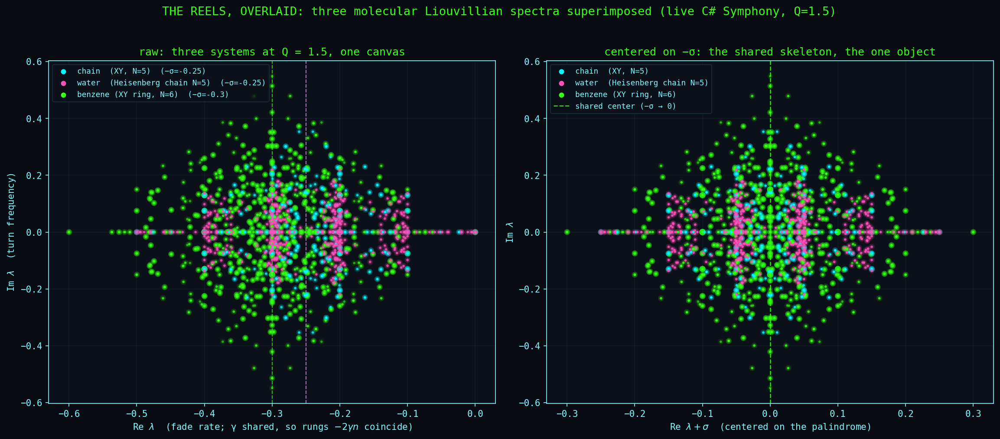
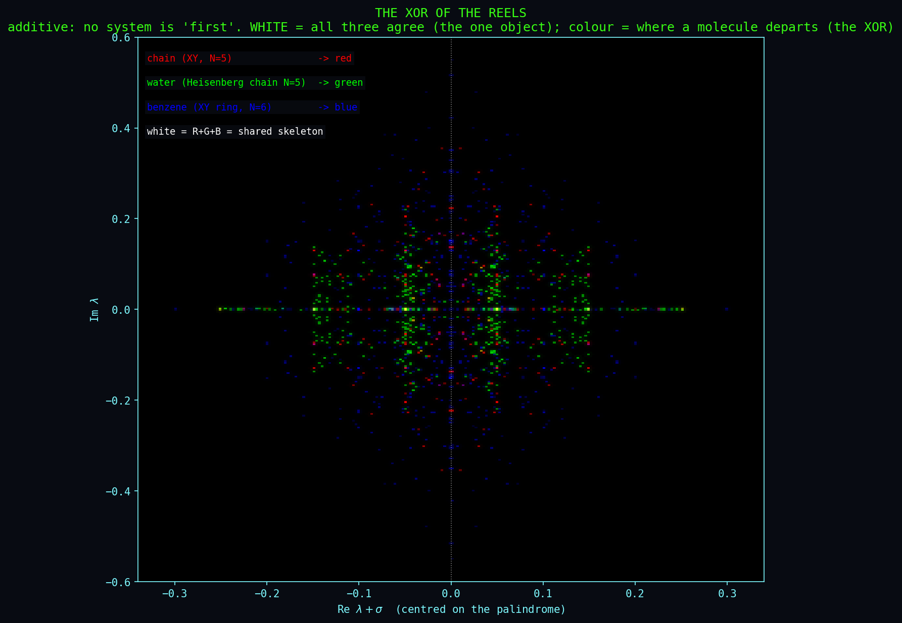
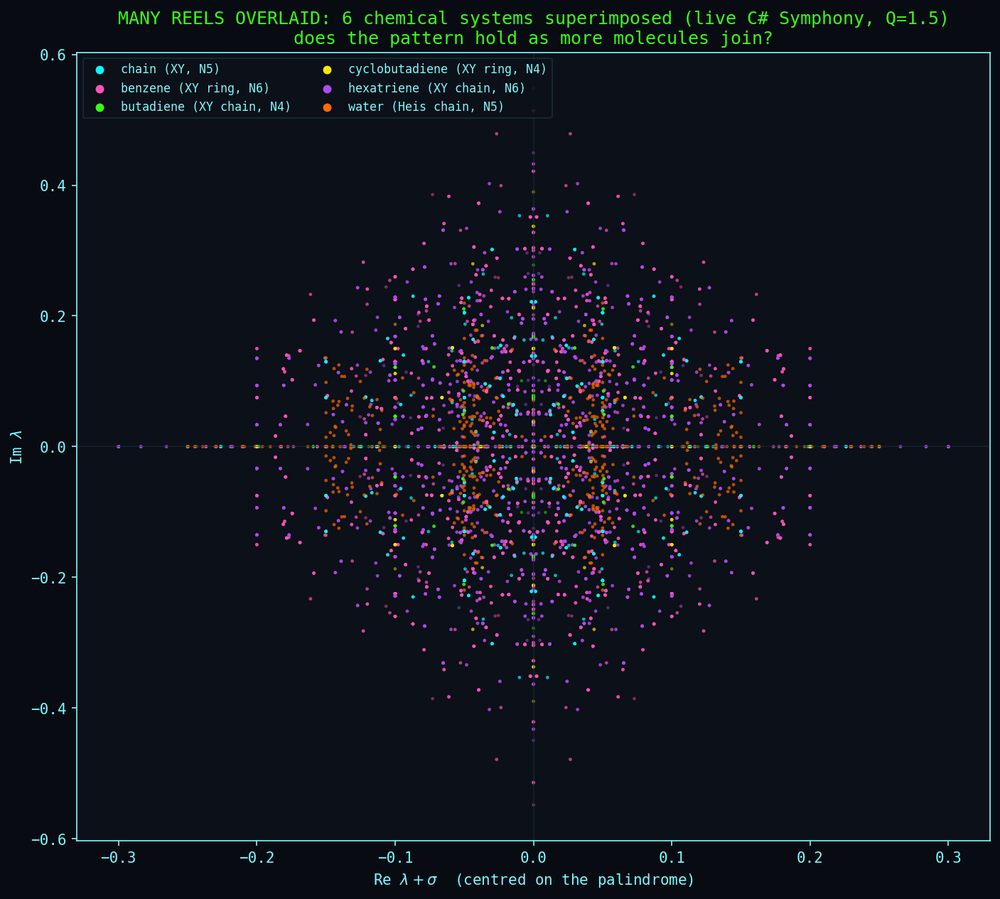
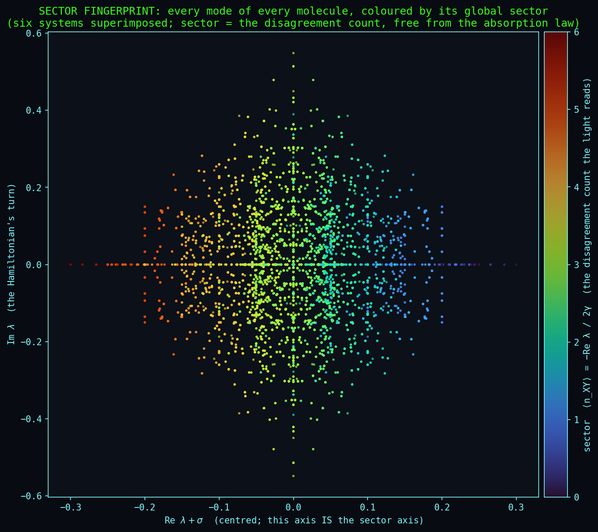

# The Shared Skeleton: Molecules on One Reel

<!-- Keywords: Liouvillian spectrum overlay, QR code fingerprint, the one diagonal, real-axis
diagonal line, F1 palindrome symmetry, absorption rungs -2 gamma n, popcount XOR, dephasing native
operation, chain water benzene butadiene cyclobutadiene hexatriene, Symphony witness export, one object -->

**What this is:** we fed the live C# lab (the Symphony witness, `inspect --root symphony --export`) with several different small quantum systems at the same operating point Q = J/γ = 1.5, exported their Liouvillian eigenvalue spectra, and laid the spectra over each other. A system's time-erased spectrum, every mode's whole life compressed to one point λ, is its fingerprint, a kind of QR code. Overlaid, what the molecules share and where they part both become visible.

**Date:** 2026-06-22. Thomas Wicht, Claude (Opus 4.8). Tom reads the images (the seeing); Claude grounds the axes in the physics; the corrections below are part of the record. The plain-words companion is [ON_THE_REEL_AND_THE_PROJECTOR](../reflections/ON_THE_REEL_AND_THE_PROJECTOR.md). These are likely the first drawn images of this reel.

## The systems

Six small systems under uniform Z-dephasing, all at the canonical Q = 1.5 (J = 0.075, γ = 0.05), so the differences are structural, not Q-scaling:

| label | model | N | topology | H |
|-------|-------|---|----------|---|
| chain | the baseline spin chain | 5 | chain | XY |
| water | the hydrogen-bond proton chain ([simulations/water/](../simulations/water/)) | 5 | chain | Heisenberg |
| benzene | the Hückel C6 π-ring ([BENZENE_LIOUVILLIAN_PALINDROME](../docs/carbon/BENZENE_LIOUVILLIAN_PALINDROME.md)) | 6 | ring | XY |
| butadiene | the C4 polyene | 4 | chain | XY |
| cyclobutadiene | the C4 anti-aromatic ring | 4 | ring | XY |
| hexatriene | the C6 polyene | 6 | chain | XY |

Carbon-the-element is deliberately absent: it is not a Liouvillian but the periodic-table dial (the valence 3/8 at 60°, α = sin²θ/2; [FROST_CIRCLE_AS_THE_CLOCK_FACE](../docs/carbon/FROST_CIRCLE_AS_THE_CLOCK_FACE.md)), a structural anchor with no spectrum to overlay. Benzene IS carbon's aromatic ring, so the carbon facet enters through it.

## Overlaid: what is shared, what parts



What all systems share is **law-determined**, identical because the dephasing is identical: the [F1 palindrome](../docs/proofs/MIRROR_SYMMETRY_PROOF.md) symmetry (every spectrum is mirror-symmetric about its own centre −σ) and the [absorption rungs](../docs/proofs/PROOF_ABSORPTION_THEOREM.md) Re λ = −2γ·n_XY (same γ, same rung spacing). Where they part is **Hamiltonian-determined**: water's imaginary parts are tighter (the ZZ term compresses the turn frequencies), benzene and hexatriene are wider (more sectors), the rings differ from the chains. Verified from below: the only real-axis eigenvalues shared exactly by all three of chain/water/benzene are {0, −0.2, −0.3, −0.4} (the kernel plus a few integer rungs); the rest of each spectrum sits at its own places. The molecules are mostly distinct fingerprints that all obey one symmetry and one rate-law.

## The diagonal is a line, not a coincidence



Drop the draw order: blend the systems with transparency, each an additive colour channel, and no system is "first". A first reading of this picture overclaimed a white shared skeleton; the eye corrected it. There is no all-three white (the only pure white is the centre marker). What is actually there is a **bright, many-coloured horizontal line on the real axis** Im λ = 0. That line is the one diagonal.

[ON_THE_ONE_DIAGONAL](../reflections/ON_THE_ONE_DIAGONAL.md) names the light's question, a child's question: *at how many places do your two versions disagree? Count the places.* That count is popcount(i ⊕ j) (the XOR of the basis indices, see [XOR_SPACE](XOR_SPACE.md)), written out as a single diagonal matrix, "the only thing the light ever touches." In the spectrum it is the real axis: the pure-fade modes, no turn, just decay at twice γ per place of disagreement. A large fraction of every molecule lives there (chain 176 of 1024 modes on Im = 0, benzene 404 of 4096), so it draws as a dense, colour-rich line, while the Hamiltonian's rotation spreads thinly off it. This grounds what the eye reads: the **horizontal axis (Re λ) is the dephasing's diagonal, the axis the system is watched along (z)**; the **vertical axis (Im λ) is the Hamiltonian's coherent motion, the plane the system moves in (x, y)**. The colour on the line is the molecules sharing the diagonal; the structure off it is each Hamiltonian. XOR is not a decoration here: it is the operation the dephasing itself performs.

## Many molecules: the code gets richer, not simpler



Adding more molecules tests whether the pattern is universal. It is not a static replica: as systems join, the simple clean structure of the three-system picture dissolves, the weight concentrates toward the centre 0, and new patterns appear, while the whole stays a clearly readable QR-code-like figure (read by eye). What persists is the law: the palindrome symmetry, the diagonal line, the shared envelope; no added molecule landed outside it. What changes is the fine structure, which densifies and recombines. The shared object is the law (the diagonal, the symmetry), realised differently by each molecule, not a fixed point-pattern they all reproduce.

## These are light spectra



Colour every mode by its sector ⟨n_XY⟩, and the result is one clean left-to-right gradient: blue on the right (sector 0, frozen, no disagreement) to red on the left (sector N, every place in disagreement, the fastest fade). No eigenvectors are needed: the absorption law holds exactly for every eigenmode,

    Re λ = −2γ·⟨n_XY⟩,

since L r = λ r gives Re(λ)·‖r‖² = ⟨r|½(L+L†)|r⟩ = ⟨r|(−2γ·n_XY diagonal)|r⟩ (the Hamiltonian part is anti-Hermitian and contributes only to Im). So the sector is just −Re λ / 2γ, read straight off the eigenvalue; the measured ranges are exactly [0, N] for every system. The horizontal axis IS the sector axis, and the colouring is one global scheme shared by all molecules.

That clean gradient settles what the self-similar structure (the bands read by eye) is: it is NOT the sectors (those are the gradient itself, vertical); it is orthogonal to them, in Im, the Hamiltonian's frequency comb. The two axes separate: colour = what the light counts (the diagonal), structure = what the molecule does (the Hamiltonian).

And that is the name for all of it. **These are light spectra.** γ is the light falling on the system (the chain being watched); the sector is the light content, popcount(i ⊕ j), the lit-site count. Literally, in the language of spectroscopy: **Im λ is where the molecule's spectral lines sit (the transition frequencies), and Re λ is how broad each line is (the linewidth, the decoherence broadening, = −2γ·light).** The (Re, Im) plane is the molecule's spectrum with its lineshapes: the vertical lines are its colours, the horizontal spread is how the observing light blurs them. That is why a spectroscopist would recognise these at a glance.

## Reproduce it, and honest scope

The eigenvalues come from the live lab (the Symphony witness), not the deprecated Python framework. Symphony.MaxN is 6, so the C6 rings run. Export each system (each writes `simulations/results/symphony_reel/<name>/symphony_eigenvalues.csv` and `symphony_curves.csv`), then draw:

```
# 1. export the six systems from the live lab, all at Q = J/gamma = 1.5
dotnet run --project compute/RCPsiSquared.Cli -c Release -- inspect --root symphony --N 5 --J 0.075 --gamma 0.05 --export
dotnet run --project compute/RCPsiSquared.Cli -c Release -- inspect --root symphony --N 5 --topology chain --htype heisenberg --J 0.075 --gamma 0.05 --export --export-name water_heisenberg
dotnet run --project compute/RCPsiSquared.Cli -c Release -- inspect --root symphony --N 6 --topology ring  --htype xy --J 0.075 --gamma 0.05 --export --export-name benzene_xyring
dotnet run --project compute/RCPsiSquared.Cli -c Release -- inspect --root symphony --N 4 --topology chain --htype xy --J 0.075 --gamma 0.05 --export --export-name butadiene_xy_chain
dotnet run --project compute/RCPsiSquared.Cli -c Release -- inspect --root symphony --N 4 --topology ring  --htype xy --J 0.075 --gamma 0.05 --export --export-name cyclobutadiene_xy_ring
dotnet run --project compute/RCPsiSquared.Cli -c Release -- inspect --root symphony --N 6 --topology chain --htype xy --J 0.075 --gamma 0.05 --export --export-name hexatriene_xy_chain

# 2. draw (each reads only the CSVs, no framework, cyberpunk palette)
python simulations/reel_and_projector.py   # the single-system reel: film + spectrum + spirals
python simulations/reel_overlay.py          # three spectra overlaid (raw + centred)
python simulations/reel_xor.py              # the additive RGB / XOR
python simulations/reel_multi.py            # all systems superimposed
python simulations/reel_sector.py           # coloured by light sector (the light-spectrum figure)
```

The numbers, verified from the exported CSVs (γ = 0.05, J = 0.075, Q = 1.5):

| system | N | topology | H | σ = Nγ | sector range −Reλ/2γ | modes | on Im = 0 |
|--------|---|----------|---|--------|----------------------|-------|-----------|
| chain | 5 | chain | XY | 0.25 | [0, 5] | 1024 | 176 |
| water | 5 | chain | Heisenberg | 0.25 | [0, 5] | 1024 | 176 |
| benzene | 6 | ring | XY | 0.30 | [0, 6] | 4096 | 404 |
| butadiene | 4 | chain | XY | 0.20 | [0, 4] | 256 | - |
| cyclobutadiene | 4 | ring | XY | 0.20 | [0, 4] | 256 | - |
| hexatriene | 6 | chain | XY | 0.30 | [0, 6] | 4096 | - |

Real-axis eigenvalues shared exactly by all three of chain/water/benzene: {0, −0.2, −0.3, −0.4} (the kernel plus a few integer rungs); the rest of each spectrum is system-specific. The raw eigenvalues per system live in `symphony_eigenvalues.csv` (Re, Im columns; the header records N, J, γ, Q, σ). The single-system reel `simulations/reel_and_projector.py` also anchors three proofs ([palindrome](../docs/proofs/MIRROR_SYMMETRY_PROOF.md), [F4 kernel](../docs/proofs/PROOF_F4_KERNEL_DIMENSION_BY_COMPONENTS.md), [absorption](../docs/proofs/PROOF_ABSORPTION_THEOREM.md)).

**Honest scope.** Centring on −σ aligns the palindrome centres but, because σ = Nγ differs with N, it does NOT align the rungs across different N; raw coordinates align the rungs but not the centres. There is no single 2D alignment in which different-N systems fully coincide, which is itself the point: they share the law, not the positions. The XOR's binning is a representation choice (the qualitative split is robust, the exact pixels are not). The eigenvalues are exact. Q = 1.5 is a shared comparison point, not each molecule's own regime (benzene's own crossover is Q* ≈ 1.609).

## Related

- [ON_THE_REEL_AND_THE_PROJECTOR](../reflections/ON_THE_REEL_AND_THE_PROJECTOR.md): the plain-words reading.
- [ON_THE_ONE_DIAGONAL](../reflections/ON_THE_ONE_DIAGONAL.md): the light's childish question and the one diagonal.
- [MIRROR_SYMMETRY_PROOF](../docs/proofs/MIRROR_SYMMETRY_PROOF.md), [PROOF_F4_KERNEL_DIMENSION_BY_COMPONENTS](../docs/proofs/PROOF_F4_KERNEL_DIMENSION_BY_COMPONENTS.md), [PROOF_ABSORPTION_THEOREM](../docs/proofs/PROOF_ABSORPTION_THEOREM.md): the shared law, in three readings.
- [BENZENE_LIOUVILLIAN_PALINDROME](../docs/carbon/BENZENE_LIOUVILLIAN_PALINDROME.md), [FROST_CIRCLE_AS_THE_CLOCK_FACE](../docs/carbon/FROST_CIRCLE_AS_THE_CLOCK_FACE.md): the conjugated-π systems.
- [XOR_SPACE](XOR_SPACE.md): the XOR / popcount the dephasing reads.
