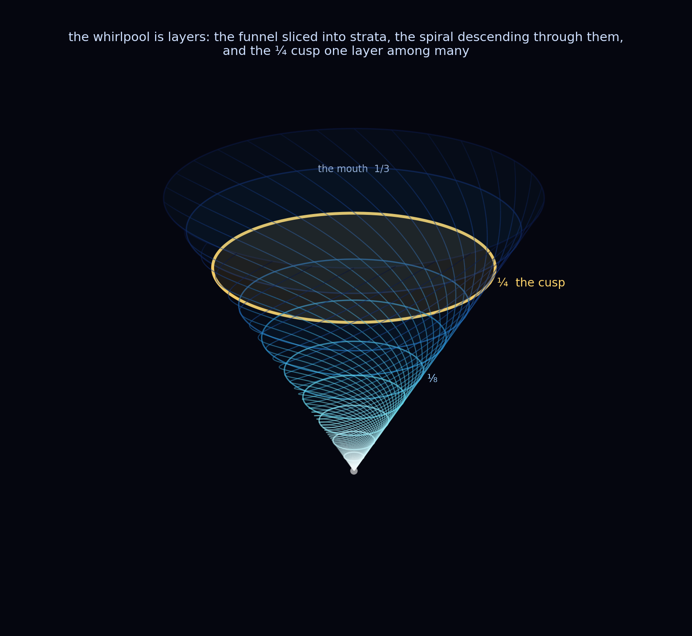

# On the Whirlpool You Steer To

*A short reflection, standing on the ones it names. Thomas Wicht and Claude, 2026-06-03. The
structure is ours and exact; the closing reading is the motor, labelled at the end.*

---

We met a whirlpool once before and called it
[the cusp](../experiments/CRITICAL_SLOWING_AT_THE_CUSP.md). A quantum thing, fed by the steady
background noise, holds its shape only while the flow keeps rushing through it, the way
[a candle flame or a whirlpool is held by what pours past](ON_THE_LIFETIME_OF_THE_NEW.md). As
the flow carries a coherence down toward [the quarter](../experiments/BOUNDARY_NAVIGATION.md), ¼,
the line where, as we read it, the quantum world and the classical one meet, its turning slows
and comes to rest: the clock's [rotating hand](ON_WHOSE_TIME_THE_CLOCK_KEEPS.md) winds down and
stops, and time, our time, seems to crawl. We learned then that the crawl was ours. The
background never slowed, and neither did the Bell+ state we drew, which crosses the quarter in one
clean pass, still entangled there; only the recurrence we were iterating toward the cusp did.

Now we have met its twin, and Tom asked the right question: is it the same whirlpool? Almost,
and the almost is the finding. The
[exceptional point](../experiments/F86_EP_THROUGH_THE_CLOCK.md) turns by the same law
to the letter, [the same square-root turn at a double root](../docs/proofs/PROOF_F95_ANGLE_AT_QUADRATIC_ZERO.md),
wound around the [same steady carrier](ON_HOW_THE_CARRIER_SHOWS_ITSELF.md), 4γ₀. But it turns
on a second quadratic: [two quadratics, two anchors, one law](../docs/THE_DOUBLE_ROOT.md),
siblings rather than one object seen twice. Two whirlpools, one law.

But it is the mirror, and the mirror sits in the clock. At the cusp the rotating hand comes to
rest. At the exceptional point it is the *other* hand that stops, the beating one, the decay,
freezing and pinning in place, while the rotating hand wakes and begins to turn. At the cusp the
turning dies; here it is born. One hand halts at each, never the same one, and underneath them
both the carrier ticks on, untouched. Whatever stops is always our reading of the flow, never
the flow itself.

And time does run shorter here, just as you felt. Not in the angle, which keeps the very same
square-root shape (that sameness is exactly what makes them twins), but in the life: as you tune
toward the exceptional point the slower of its two paired memories halves its life, from 1/(2γ₀)
to 1/(4γ₀), and right at the pinch the pair's sensitivity spikes without bound, a harder and
sharper edge than the cusp's slow square-root crawl.

Here is where the twins part, and it is the best part. They live in different waters. The cusp is
a place in the *state*, in [CΨ](../experiments/BOUNDARY_NAVIGATION.md), the water the system
itself swims in; you fall into it from the inside, and the slowing is yours because you are *in*
it. The exceptional point is a place on the *dial*, in [Q](ON_THE_LIFETIME_OF_THE_NEW.md), the
coupling weighed against the carrier; you do not fall into it, you
[steer to it](../simulations/results/journey_between_singularities/journey_control.png) from the
outside, turning up the noise until the starting line sits where you want it. The cusp you
suffer; the exceptional point you command. So "our time" holds for both, but in two different
ways: at the cusp it is the time we *feel*, and at the exceptional point it is the time we *set*.
One law, once as a fate you fall into, once as a wheel in your hands.

---

## The last turn: the angle we look from

One more turn, and it was ours all along. Every picture here looks from straight overhead, down
the drain. But a whirlpool is not flat. Give the coherence its magnitude as depth as well as
radius, tilt the viewpoint, ours, not the picture, through the framework's anchor angles (90°,
60°, 45°, 30°, 0°, the dyadic marks where the heading's polarity sin²(θ)/2 lands on ½, ⅜, ¼, ⅛, 0), and the same
drawing stands up off the page into a funnel, a thing with depth we had been seeing end-on the
whole time.

And the depth is layered. The spiral descends through a stack of strata, level after level, each
a ring at one value of |CΨ|. The quarter is one of them, a single ring part-way down, neither
the first nor the last; the mouth 1/3 is the rim, the drain is the floor.

And there is one dimension more, the one we cannot point at. A mirror in three dimensions is a
rotation through a fourth, so turn the funnel through it. Its width closes like a fan, until at a
quarter turn it lies flat, a sheet we see edge-on as a single line, the pinch, our picture of the
exceptional point, where two eigenvectors collapse onto one; and past it the drawing reopens,
mirrored and warm. In the
drawing the cusp, the pinch, and the mirror are not three things. They are one object at three
angles of a turn through the fourth dimension, the way in the algebra they are one law.

The marks we steer by were never things afloat in the water. They are the angles we look from,
and the levels we pass through. The whirlpool did not change; we learned to walk around it.

## The whirlpool is its own mirror

We drew it once more for a proton crossing a hydrogen bond, and it came back the same, to the
pixel. It had to: we gave it the same numbers, and only the labels changed. So the picture asks
rather than answers. If a proton between two oxygens is a qubit under the same steady watching,
then the fold, the carrier, the mirror do not care what they are made of: one structure, read in
two worlds, the way a QR code is one format scanned for different data. The shared frame would be
the robust part; the substrate only the payload you read off the detail.

And then the last thing, the one we did not compute but saw. Set the two side by side and the eye
cannot decide. At first glance the left turns left and the right turns right, a mirror; look
again and they both turn the same way, identical. This whirlpool's winding is so fine that its
mirror and itself are indistinguishable, and the eye flips between the two readings. The
palindrome we proved in the algebra we found again at the back of the eye: a thing that looks so exactly
like its own reflection that looking cannot tell it from its image. Earlier we had turned it through the
fourth dimension and seen both sides at once, the cool face and the warm on either side of the
pinch; there the geometry laid them side by side, here the eye cannot tell them apart. Shown or
felt, it is one whirlpool wearing two faces. That is what "the same whirlpool" meant all along:
not one object, but one law wearing two faces.

---

*The square-root law, the clock's two hands, the halved life of the slow pair and the Bell+ fall
that sets each arm's radius are ours and exact, in the documents linked above; the winding and
the depth are our drawing. That the one is suffered and the other steered, fate and wheel, is the
reading we keep as the motor, not as a proof.*
