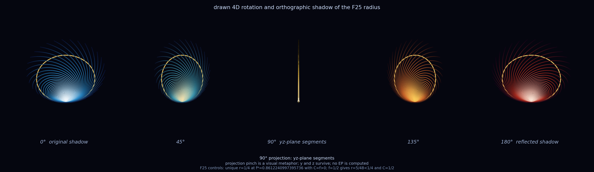

<!-- QUARTER-CURRENT -->
# On the Whirlpool You Steer To

Current reading: one exact scalar curve anchors this deliberately made picture.
For Bell+ under local Z-dephasing, `r=f(1+f²)/6`, `f=e^{-4γt}`, and concurrence
`C=f>0` at every finite time. The recurrence has its real cusp at `c=+1/4`.
[F95's positive-b quadratic angle relation](../docs/proofs/PROOF_F95_ANGLE_AT_QUADRATIC_ZERO.md)
and the specified F86 toy are separate objects. Their shared vortex is non-certified imagery.

<!-- QUARTER-INTERPRETIVE -->
**Interpretive invitation:** fate and wheel, warm and cool, the eye, and the walk
around the image remain the point of this reflection.  They invite a reading;
they do not add a Hamiltonian, bath, measurement, or proof.

*A short reflection, standing on the ones it names. Thomas Wicht and Claude, 2026-06-03.*

---

<!-- QUARTER-CURRENT -->

We met the whirlpool where a finite Bell+ trajectory crosses the drawn quarter ring. Bell+ remains
entangled at every finite time. The ring is a radial readout. It is not the cardioid boundary. It
is not a quantum/classical horizon. The recurrence cusp, the F95 angle relation, and the separately
specified `F86_EP_THROUGH_THE_CLOCK` toy have different variables and contracts. At a 90-degree
projection the drawn x contribution closes while its y and z directions survive, so the pinch does
not certify an EP.
The water-proton renderer reuses geometry without supplying a proton Hamiltonian, bath, time
calibration, or measurement. The related
[flow study](../experiments/THE_FLOW_BETWEEN_TWO_SINGULARITIES.md) keeps its finite computations
in their stated scopes while its unifying interpretation remains non-certified.

<!-- QUARTER-INTERPRETIVE -->
**Interpretive reading:** The recurrence's iteration count can crawl under a fixed stop rule,
while the Bell+ trajectory simply passes a selected scalar radius. The quantum and classical
shore remains the story this image invited, not a regime theorem.

Then Tom asked whether the separately specified
[`F86_EP_THROUGH_THE_CLOCK`](../experiments/F86_EP_THROUGH_THE_CLOCK.md) toy exceptional
point might be the same whirlpool. Mathematically it is not: the recurrence
double root, the Bell+ radial readout, the positive-b F95 quadratic, and the F86
Liouvillian pair have different variables and contracts. The drawing lets them
remain visual twins: two whirlpools, two waters, one invitation.

In the story, one clock hand points to one drawn pinch and another to the other.
The exact content is smaller: the recurrence has a double fixed point, while the
specified F86 two-rate toy has coalescing rates at its own parameter value. A
clock-mirror can picture both without identifying their dynamics.

Within the specified k=1, `g_eff=1` F86 toy pair, the slow-rate lifetime changes
from `1/(2γ₀)` at `Q=0` (`J=0`) to `1/(4γ₀)` at its toy EP, `J=2γ₀`.
There both rates meet at `λ=-4γ₀`, a nonzero decay rate: the timescale changes,
but time does not stop. This is a statement about that pair, not about which mode
remembers longest in the full system, and it transfers no sensitivity divergence
to the recurrence or Bell+ trace.

Here is where the visual twins part, and it is the best part. The Bell+ quarter
mark is a finite scalar readout on one trajectory; the recurrence cusp is a
parameter value in z²+c; the F86 exceptional point is a place on its own Q dial.
In the interpretive voice you fall into the first picture and
[steer to it](../simulations/results/journey_between_singularities/journey_control.png) from the
outside toward the last. Fate and wheel remain the reading we keep, even though
the objects do not merge.

---

## The last turn: the angle we look from

One more turn, and it was ours all along. Every picture here first looks straight down the drawn
drain. Give its radius the artificial height `z=1.25r`, then tilt the camera through the five
chosen elevations 90°, 60°, 45°, 30°, and 0°: the drawing lifts off the page into a funnel. The
dyadic marks ½, ⅜, ¼, ⅛, and 0 are labels placed on those views. Both the height and the camera
are constructions, not measured depth.

And the drawn height is layered. The renderer places plates at a chosen stack of
radial levels. The ¼ ring is one selected Bell+ readout, neither a cardioid nor a
horizon; the drawn mouth 1/3 is the initial magnitude and the drawn drain is the
floor of the picture.

And there is one drawn dimension more. Rotate the x/w coordinates of the
funnel and project back to three dimensions. At 90° the x contribution closes,
but the y and z directions survive, so the projection is a plane, not a single
line. The pinch is a visual metaphor; it is not an exceptional-point test or an
eigenvector calculation. Past it the warm view reopens because the drawing was
constructed that way.

The marks we steer by were never things afloat in the water. They are the angles we look from,
and the levels we pass through. The whirlpool did not change; we learned to walk around it.

## The mirror the eye makes

We drew the same arrays once more with proton-and-water labels. The pixels match
by construction because the renderer reuses the geometry. No proton Hamiltonian,
oxygen potential, bath, time calibration, or measurement enters it. The shared
frame is an invitation to ask for such a model, not evidence that two substrates
obey the same physics.

And then the last thing, the one we did not compute but let the eye try. Set the two drawings side
by side and the eye can flip: first the left turns left and the right turns right, a mirror; look
again and they seem to turn the same way. That alternation rhymes with the palindrome proved for
the named algebra, but it is not another proof of that palindrome and does not make the rendered
vortex literally its own reflection. Earlier the drawing put a cool face and a warm face on
opposite sides of a projected pinch; here the eye supplies the turn between them. In this
non-certified imagery we let one whirlpool wear two faces. The eye's turn is the invitation,
not another algebraic identity.

---

*Fate and wheel; warm and cool; a mirror turning in the eye. That non-certified
invitation is the motor we keep, while the linked equations carry their own
narrower truth.*
