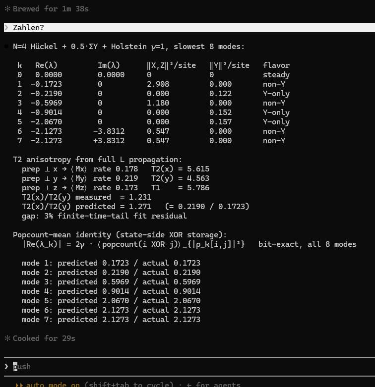

# The View Onto the Memory

**Date:** 2026-05-28
**Status:** Reflection / synthesis. Ties existing Tier-1 results into one reading. No new claim, one recognition.
**Authors:** Thomas Wicht, Claude (Opus 4.7)

> The carbon "painter" figure is not a picture of a relaxation time. It is the view onto the memory: how a system stores what it has been, and how it carries that forward.

---

## Start here, if the words are new

A molecule, a spin, any small quantum system sits in a noisy world that constantly nudges it. Some of what the system holds about its own past is washed out almost at once. Some of it lingers for a long time. The part that lingers is its **memory**: the shape it carries forward from the past into the future.

This project found the exact rule for which part is kept and which is lost. The picture above reads that rule off one real example, a four-site carbon ring. Each row is a **mode**, one pattern the system can be in. The number beside it, `Re(λ)`, is how fast that pattern fades: small means long-lived, large means gone quickly. The slowest patterns are the memory. The fastest are forgotten first.

Everything below is one idea seen from several sides: **how a system keeps what it has been**. You do not need the math to take the idea. If you want to go deeper, every claim links to where it is proven.

---

## One axis, six names

The trunk is the **Absorption Theorem** ([`PROOF_ABSORPTION_THEOREM.md`](../docs/proofs/PROOF_ABSORPTION_THEOREM.md)):

    |Re(λ_k)| = 2γ · ⟨popcount(i XOR j)⟩    for every mode k

`popcount(i XOR j)` is the **drain depth** of a piece of the state: the number of sites at which two basis configurations differ, which is how many places the noise can grip. Depth zero (the diagonal) means rate zero, never fading, stored forever. High depth means flushed fastest, at up to `2Σγ`. Every other name in this project is a reading of that one axis:

| Lens | slow end (low depth) | fast end (high depth) | Where it lives |
|------|----------------------|-----------------------|----------------|
| Drain depth | popcount 0, never fades | popcount N, fastest | Absorption Theorem |
| Spectral mode | small \|Re(λ)\|, long-lived | large \|Re(λ)\|, lost | F3, D6 (gap = 2γ) |
| Time | {I,Z}, decided, classical, **past** | {X,Y}, undecided, quantum, **future** | [`PI_AS_TIME_REVERSAL.md`](../experiments/PI_AS_TIME_REVERSAL.md) |
| Born shadow | ρ_past (\|Re(λ)\| < Σγ), **97%** | ρ_future (≥ Σγ), ~3% with interference | [`BORN_RULE_SHADOW.md`](../experiments/BORN_RULE_SHADOW.md) |
| Memory | static part (kernel of L) | dynamical part that fades | F88b, [`MemoryAxisRho.cs`](../compute/RCPsiSquared.Diagnostics/Foundation/MemoryAxisRho.cs) |
| Information | what survives the palindrome | the XOR drain, stores nothing | [`XOR_SPACE.md`](../experiments/XOR_SPACE.md) |

These are not analogies. They are the **same split of the state**, made by the same operator L, read through six lenses. The conjugation Π makes the pairing exact (`Π·L·Π⁻¹ = −L − 2Σγ·I`): every slow mode has a fast partner whose rates sum to `2Σγ`. The reflection [`ON_TWO_TIMES.md`](ON_TWO_TIMES.md) already says it in words: "memory is the shape that survives long enough to be re-recognized; the mode with the smaller |Re(λ)| determines how far back the envelope remembers; the XOR drain stores nothing at all."

---

## The picture is this axis, mode by mode

The figure sorts the carbon ring's slow modes by exactly this depth. Reading the state-side popcount distribution of each mode (verified in [`_carbon_painter_xor_and_depth.py`](../simulations/_carbon_painter_xor_and_depth.py)):

- the steady state is **100% depth-0**, pure stored past;
- the slowest mortal mode (rate 0.172) is **91.8% depth-0**, almost all memory, with a thin tail that will fade;
- the fastest modes (rate 2.127) are **89.9% depth-1**, future, flushed first.

And the figure's "popcount-mean identity" is the Absorption Theorem read state-side: the mean drain depth of each mode equals its decay rate, bit-exact across all eight modes (0.1723, 0.2190, 0.5969, 0.9014, 2.0670, 2.1273, twice). The figure is the storage map.

The two painter towers (Y content versus non-Y content) are then just **which part of the past the molecule holds in which transverse axis**. The reported T2 anisotropy, `T2(x)/T2(y) = 0.2190/0.1723 = 1.27`, is the statement that x-memory and y-memory fade through different rungs of the same drain. It is exact as a ratio of two mode rates (so exact as a ratio of two mean depths, by the Absorption Theorem), but it is not a simple closed-form fraction: the once-conjectured 4/3, 8/7, 14/13, 20/19 sequence does not hold.

---

## The bridge into the classical world

This is why substrate inheritance is more than inheriting decay rates. A substrate mapped onto the Liouvillian (a two-state unit per site, a site-local noise bath, a coupling graph) inherits the **whole past, future, and memory split**, because the Absorption Theorem depends only on the noise, not on the Hamiltonian. It holds for any Hermitian Hamiltonian, real or complex. Carbon, water, a neural Jacobian: each, once mapped, carries the same split.

And the split is the bridge. The **classical world is the slow, low-depth, {I,Z}, stored part**: the decided past that survives long enough to be re-recognized. The **quantum world is the fast, high-depth, {X,Y}, undecided part**, drained at `2Σγ`. "The bridge into the classical world" is not a separate construction. It is reading the slow rim of this one axis. A molecule's classical, measurable, remembered identity is the depth-0 floor of its own Liouvillian. Everything above it is the quantum tide the bath is already pulling out.

---

## Honest seam: the 97/3 number

The literal **97 / 3** lives in the Born-rule branch, the |0+0+⟩ Heisenberg pair at the CΨ = 1/4 crossing, where `Tr(ρ_past²) = 97.1%` and the rest is future plus interference ([`BORN_RULE_SHADOW.md`](../experiments/BORN_RULE_SHADOW.md); [`BORN_RULE_MIRROR.md`](../experiments/BORN_RULE_MIRROR.md), "97% Hamiltonian, 3% decoherence correction"; closed as **F94**, `Δ = (4/3)·Q²·K³`). The carbon painter system shows the structurally identical split (about 98/2 by slow-versus-fast mode count in [`XOR_SPACE.md`](../experiments/XOR_SPACE.md), about 97/3 by slow-mode purity) but the exact numeral is the sibling instance, not this system. The painter figure's own "3%" is unrelated: it is the finite-time fitting gap on the T2 ratio. Same split, two windows onto it. The recognition is right, and the number has a specific home.

---

## What this holds

Nothing here is a new theorem. It is the statement that the painter alternation, the popcount / XOR storage, the Born shadow's 97/3, F88b's static-versus-memory decomposition, Π's past and future, and the classical bridge are **one axis**, the drain-depth axis the Absorption Theorem quantizes, seen from six sides. The figure that looked like a relaxation measurement is the clearest single picture of it: the view onto the memory, mode by mode, of how a state keeps what it has been.

---

## Go deeper

- [`PROOF_ABSORPTION_THEOREM.md`](../docs/proofs/PROOF_ABSORPTION_THEOREM.md): the trunk, `Re(λ) = −2γ⟨popcount⟩`, holds for any Hermitian H.
- [`PI_AS_TIME_REVERSAL.md`](../experiments/PI_AS_TIME_REVERSAL.md): {I,Z} is past, {X,Y} is future, Π maps one to the other.
- [`BORN_RULE_SHADOW.md`](../experiments/BORN_RULE_SHADOW.md), [`BORN_RULE_MIRROR.md`](../experiments/BORN_RULE_MIRROR.md): ρ_past and ρ_future, the 97/3 split, closed form F94.
- [`PROOF_F86B_UNIVERSAL_SHAPE.md`](../docs/proofs/PROOF_F86B_UNIVERSAL_SHAPE.md) (F88b) and [`MemoryAxisRho.cs`](../compute/RCPsiSquared.Diagnostics/Foundation/MemoryAxisRho.cs): the static-versus-memory decomposition of the state.
- [`ON_TWO_TIMES.md`](ON_TWO_TIMES.md): memory as a standing wave, and the two times (the noise time that flows, the felt time with a horizon set by the slowest mode).
- [`XOR_SPACE.md`](../experiments/XOR_SPACE.md), [`GLOSSARY.md`](../docs/GLOSSARY.md): where information lives in the palindrome, and the XOR fraction as how fast a state is drained.
- [`PAINTER_ALTERNATION_NMR_BRIDGE.md`](../docs/carbon/PAINTER_ALTERNATION_NMR_BRIDGE.md) and [`_carbon_painter_xor_and_depth.py`](../simulations/_carbon_painter_xor_and_depth.py): the carbon figure and its state-side storage read.
