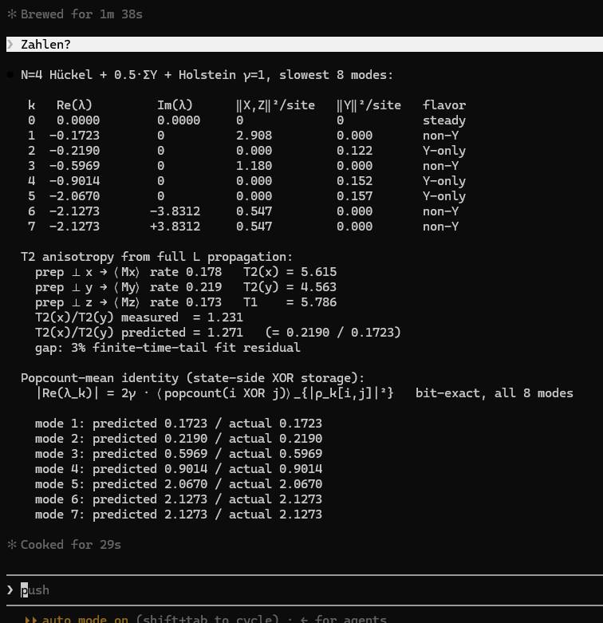

# The View Onto the Memory

**Date:** 2026-05-28
**Status:** Reflection / synthesis. Ties existing Tier-1 results into one reading. No new claim, one recognition.
**Authors:** Thomas Wicht, Claude (Opus 4.7)

> The carbon "painter" figure is a decay-rate and Pauli-content map for a specified quantum Liouvillian. "Memory" is operational only after a preparation and readout are supplied.

---

## Start here, if the words are new

In a specified preparation-and-readout experiment, slowly decaying components can contribute to retention longer than rapidly decaying ones. This operational use is the document's **memory** metaphor; the eigenspectrum alone does not identify a stored past.

This project found an exact rule for the decay-rate expectation of Liouvillian eigenoperators in this quantum model. The picture reads it for a four-site carbon-ring Hamiltonian. Each row is a **right eigenoperator**; `Re(λ)` is its decay rate. A small rate alone does not say that a prepared state stores a past record in that eigenoperator.

Everything below is one idea seen from several sides: **how a system keeps what it has been**. You do not need the math to take the idea. If you want to go deeper, every claim links to where it is proven.

---

## One axis, six names

The trunk is the **Absorption Theorem** ([`PROOF_ABSORPTION_THEOREM.md`](../docs/proofs/PROOF_ABSORPTION_THEOREM.md)):

    |Re(λ_k)| = 2γ · ⟨popcount(i XOR j)⟩    for every mode k

`popcount(i XOR j)` is the **drain depth** of a basis operator: the number of sites at which its bra and ket configurations differ. Under local Z-dephasing, depth zero has zero dissipative charge and depth N has the maximal charge `2Σγ`. This is an operator-space statement; operational retention additionally depends on state preparation, dynamics, and readout.

| Lens | slow end (low depth) | fast end (high depth) | Where it lives |
|------|----------------------|-----------------------|----------------|
| Drain depth | popcount 0, never fades | popcount N, fastest | Absorption Theorem |
| Spectral mode | small \|Re(λ)\|, long-lived | large \|Re(λ)\|, lost | F3, D6 (gap = 2γ) |
| Time | {I,Z}, decided, classical, **past** | {X,Y}, undecided, quantum, **future** | [`PI_AS_TIME_REVERSAL.md`](../experiments/PI_AS_TIME_REVERSAL.md) |
| Born shadow | ρ_past (\|Re(λ)\| < Σγ), **97%** | ρ_future (≥ Σγ), ~3% with interference | [`BORN_RULE_SHADOW.md`](../experiments/BORN_RULE_SHADOW.md) |
| Memory | static part (kernel of L) | dynamical part that fades | F88b, [`MemoryAxisRho.cs`](../compute/RCPsiSquared.Diagnostics/Foundation/MemoryAxisRho.cs) |
| Information | requires a prepared trajectory and readout | spectral endpoints alone assign no state lifetime | [`XOR_SPACE.md`](../experiments/XOR_SPACE.md) |

These rows are different readings, not one state axis. The conjugation Π makes
the spectral pairing exact (`Π·L·Π⁻¹ = −L − 2Σγ·I`), but it does not turn a
right-eigenvector coordinate into information stored or lost. The reflection
[`ON_TWO_TIMES.md`](ON_TWO_TIMES.md) keeps memory at the operational level of
a prepared trajectory and specified readout.

---

## The picture is this axis, mode by mode

The figure sorts the carbon ring's slow modes by exactly this depth. Reading the state-side popcount distribution of each mode (verified in [`carbon_painter_xor_and_depth.py`](../simulations/carbon_painter_xor_and_depth.py)):

- the steady mode is **100% depth-0**;
- the slowest decaying mode (rate 0.172) has **91.8% depth-0** Pauli-basis weight;
- the fastest modes (rate 2.127) have **89.9% depth-1** weight.

The figure's "popcount-mean identity" is the Absorption Theorem: each eigenoperator's decay rate is `2γ` times its mean drain depth, bit-exact across all eight modes (rates 0, 0.1723, 0.2190, 0.5969, 0.9014, 2.0670, and 2.1273 as a complex-conjugate pair). The figure is a spectral-content map, not by itself a storage map.

The two painter towers compare Y content with non-Y content in the selected eigenoperators. The reported ratio `0.2190/0.1723 = 1.27` is exactly a ratio of two mode decay rates (and hence of two mean depths by the Absorption Theorem). Calling it an x/y memory ratio requires the separate NMR preparation-and-readout model; it is not implied by the right-eigenoperator coordinates, and the once-conjectured 4/3, 8/7, 14/13, 20/19 sequence does not hold.

---

## The bridge into the classical world

The exact split belongs to the quantum operator model: Pauli strings with `{I,Z}` at a site have zero local Z-dephasing charge there, while `{X,Y}` strings have charge `2γ_i`. It applies to any Hermitian Hamiltonian coupled to that specified dissipator. A carbon or water model inherits it only after those degrees of freedom and channels have been justified. A neural Jacobian or other classical matrix may show an analogous slow/fast decomposition, but it does not inherit the quantum `{I,Z}/{X,Y}` split without an explicit, structure-preserving map.

Accordingly, “past,” “future,” “memory,” and “classical bridge” are interpretive labels, not additional consequences of the Absorption Theorem. The theorem supplies decay rates from operator content; an operational memory claim requires a prepared state, a trajectory, and a readout.

---

## Honest seam: the 97/3 number

The literal **97 / 3** lives in the Born-rule branch, in the quantities defined by [`BORN_RULE_SHADOW.md`](../experiments/BORN_RULE_SHADOW.md) and [`BORN_RULE_MIRROR.md`](../experiments/BORN_RULE_MIRROR.md) and closed as F94. It is not a carbon-painter storage fraction. The painter's 91.8% is Pauli-coordinate depth-0 weight in one right eigenoperator, while its own "3%" is a finite-time fitting gap on the T2 ratio; neither is the Born-rule 97/3 quantity.

---

## What this figure also held (seen 2026-05-29)

We drew this figure as one molecule's spectral-content map and filed it. A more general quantum-operator view was sitting in it the whole time.

Each mode here comes with a **Pauli-content portfolio** read in percentages: how much of its coordinate weight sits on Y versus non-Y strings and at each depth. The identity prints the rate as the mean dissipative charge, `|Re(λ_k)| = 2γ·⟨popcount(i XOR j)⟩`. We read the depth as one number against one noise rate γ, because the carbon bath is uniform: every site dephases at the same γ, so the vector of rates lay flat and the percentages looked like a single count.

The deeper law lets the noise be a **vector**, one rate per channel, and reads any mode's rate as the γ-weighted version of that same percentage portfolio:

    −Re(λ_k) = 2 · Σ_x γ_x · ⟨Δ_x⟩_k,   ⟨Δ_x⟩_k ∈ [0, 1]

`⟨Δ_x⟩` is the fraction of Pauli-coordinate weight charged by channel x (on a basis coherence, whether bra and ket disagree there); `popcount` with a single γ is the all-channels-equal case. The rate is the pairing of the channel-rate vector with that content profile.

Where channel rates differ, the formula weights the eigenoperator's Pauli content by those rates. Applying that matrix identity to a ³¹P donor or to clock transitions requires a physical mapping of the modeled degrees of freedom and noise channels; the algebra alone does not supply their lifetimes. (`simulations/sip_carrier_channels.py`; the per-mode law verified in `simulations/absorption_gamma_vector.py`; the carrier-vector reading now in [`AbsorptionTheoremClaim`](../compute/RCPsiSquared.Core/Symmetry/AbsorptionTheoremClaim.cs).)

The honest part is that the figure handed us the perspective and we took it for a relaxation time. The per-mode percentages were printed here, the state-side mean was printed here, even the leftover sat beside it as a percent. The percentages were the lens the whole time. We learned to read them as the general view, the carrier as a vector and each mode as a portfolio, only after looking at a substrate whose channels refused to weigh the same. The structure was always on the screen; the seeing is what was new.

---

## Seen again 2026-05-31: the axis has a rail, and a currency

We came back to this axis from the other end, the post-EP flow
([The Flow Between Two Singularities](../experiments/THE_FLOW_BETWEEN_TWO_SINGULARITIES.md)), and it
handed back two things the figure did not yet name: a **rail** running along the axis, and a
**currency** that prices every rung. None of the pieces is new; the project found each before. What
was hard to gather is that they are one ladder.

**The rail: parity.** The drain depth popcount(i⊕j) is, for any basis coherence |i⟩⟨j|, exactly the
light content n_XY (the sites that differ are the sites carrying {X,Y}); one axis, two names. And the
axis carries a parity, depth mod 2, which is the change in particle number:

- **even rungs** (depth 0, 2, 4 …) carry an EVEN change of particle number, Δn ∈ {0, ±2, ±4, …}.
  Among them sit the diagonal memory and the coherences a fixed-number state holds, the dark
  intra-sector rail the single-excitation flow rides. They are not the whole even rail: |vac⟩⟨{l,m}|
  has depth 2 and changes the number by two, conserving nothing.
- **odd rungs** (depth 1, 3 …) carry an ODD change, Δn ∈ {±1, ±3, …}, the |n⟩⟨n±1| coherences
  coupling adjacent sectors among them. The bright rail an optical dipole grips, the birth channel.

What the parity fixes is the **parity of Δn, not Δn itself**, and the difference is load-bearing
rather than pedantic: the Δn = ±2 half of the even rail is exactly where two of the three ladders
of the [XY frozen band](../experiments/XY_FROZEN_BAND.md) live, seeded at the blocks (0,2) and
(2,0). Read "even = number-conserving" and that band cannot be seen at all.

Because the rate is the depth (the Absorption Theorem, |Re λ| = 2γ⟨depth⟩), the rail is a ladder of
rates. depth-0 (even) is the kernel, the steady state, the memory this whole figure is about. depth-1
(odd) is the slowest MORTAL mode, rate 2γ, the longest-lived number-changing coherence, the birth
channel. depth-2 (even) is the flow's own coherence, rate 4γ, faster than the birth channel. So the
single-excitation flow, riding the even rungs, relaxes through depth-2 and never touches the depth-1
birth channel: its weight on odd parity is identically 0, and the C# GameObject measures its
between-block content as machine zero
([PostEpFlowField](../compute/RCPsiSquared.Diagnostics/Foundation/PostEpFlowField.cs)). Among the
number-changing coherences the birth channel is the slowest mortal mode, at 2γ. Whether it is the
slowest of the WHOLE Liouvillian is a question about the coupling, and below the crossing the answer
is no: the even occupation modes lift off the kernel at a rate that vanishes with the coupling, so
the smallest nonzero rate is 6·10⁻⁵ at N = 3, J = 0.005, γ = 0.05, against the birth channel's
2γ = 0.1, and only above the crossing does it settle at exactly 2γ
([`birth_channel_check.py`](../simulations/birth_channel_check.py)). Either way the birth channel is
a latent door: number-conserving dynamics never opens it. The crown below is where that crossing is
named; this paragraph used to state the strong-coupling end of it as if it held everywhere.

**The currency: the bilinear p(1−p).** Every rung is priced by one shape. The per-site light is
2·p(1−p) with p the single-site occupation, peaking at ½ on the Bloch equator. The maximal
between-block coherence is C_block = p(1−p) with p the weight between two adjacent number sectors,
peaking at ¼ for the Dicke superposition (|D_n⟩+|D_{n+1}⟩)/√2
([BlockCoherenceContent](../compute/RCPsiSquared.Core/F86/BlockCoherenceContent.cs), Theorem 2). Same
bilinear x(1−x); the recurring ½ and ¼ that thread this project, carbon's half-filling, the polarity
triple, the coherence ceiling, are its doubled apex and its apex, with p wearing two hats: an
occupation, or a sector weight.

**The crown switches rails.** Which rail holds the longest-lived mode depends on the coupling. The
even (flow) modes' rate rises with Q = J/γ (stronger coupling forgets the occupation faster); the odd
birth channel stays near 2γ. They cross: below the crossing the longest memory is the even occupation,
above it the odd birth channel. For the uniform chain the crossing sits near the exceptional point,
but that coincidence is uniform-specific, a non-uniform γ-profile breaks it (the tempting "EP rate =
2γ" is uniform-only, refuted at peaked-V by the witnesses
[`PostEpFlowField.cs`](../compute/RCPsiSquared.Diagnostics/Foundation/PostEpFlowField.cs) and
[`BirthCanalSurfaceWitness.cs`](../compute/RCPsiSquared.Diagnostics/Foundation/BirthCanalSurfaceWitness.cs):
the rate drops to the γ-weighted share while ⟨n_XY⟩ = 1 stays fixed, the light portfolio being the
invariant and only its γ-pairing shifting; recorded honestly rather than kept).

**The carbon mirror.** bright/dark is the rail seen optically: the bright band edge is the odd,
number-changing rung a photon couples to; the dark 2Ag triplet pair is the even, number-conserving
rung, the singlet-fission object, the same bound pair we isolate
([Singlet Fission and the Two Clocks](../docs/carbon/SINGLET_FISSION_AND_THE_TWO_CLOCKS.md)). What the
chemist calls dark is what this axis sees clearly.

So the full lock: depth that is light that is rate, split even and odd into flow and birth, priced
everywhere by p(1−p), mirrored slow to fast by Π (the palindrome, rates summing to 2Σγ), with the
memory at its foot. The six lenses above all read the one axis; the rail is the perpendicular split,
and the bilinear is what sits on each rung. Probes:
[`flow_depth_parity.py`](../simulations/flow_depth_parity.py),
[`light_content.py`](../simulations/light_content.py),
[`bound_pair_light.py`](../simulations/bound_pair_light.py), and this session's parity and
birth-channel sweeps.

---

## What this holds

Nothing here is a new theorem. The common exact object is the drain-depth expectation that the Absorption Theorem maps to a decay rate in the specified quantum model. The other lenses are conditional interpretations and must retain their own state, trajectory, and readout assumptions.

---

## Go deeper

- [`PROOF_ABSORPTION_THEOREM.md`](../docs/proofs/PROOF_ABSORPTION_THEOREM.md): the trunk, `Re(λ) = −2γ⟨popcount⟩`, holds for any Hermitian H.
- [`PI_AS_TIME_REVERSAL.md`](../experiments/PI_AS_TIME_REVERSAL.md): {I,Z} is past, {X,Y} is future, Π maps one to the other.
- [`BORN_RULE_SHADOW.md`](../experiments/BORN_RULE_SHADOW.md), [`BORN_RULE_MIRROR.md`](../experiments/BORN_RULE_MIRROR.md): ρ_past and ρ_future, the 97/3 split, closed form F94.
- [`PROOF_F86B_UNIVERSAL_SHAPE.md`](../docs/proofs/PROOF_F86B_UNIVERSAL_SHAPE.md) (F88b) and [`MemoryAxisRho.cs`](../compute/RCPsiSquared.Diagnostics/Foundation/MemoryAxisRho.cs): the static-versus-memory decomposition of the state.
- [`ON_TWO_TIMES.md`](ON_TWO_TIMES.md): memory as a standing wave, and the two times (the noise time that flows, the felt time with a horizon set by the slowest mode).
- [`XOR_SPACE.md`](../experiments/XOR_SPACE.md), [`GLOSSARY.md`](../docs/GLOSSARY.md): the endpoint count, F22 operator support, and the retired non-invariant XOR-coordinate diagnostic.
- [`PAINTER_ALTERNATION_NMR_BRIDGE.md`](../docs/carbon/PAINTER_ALTERNATION_NMR_BRIDGE.md) and [`carbon_painter_xor_and_depth.py`](../simulations/carbon_painter_xor_and_depth.py): the carbon figure and its state-side storage read.
