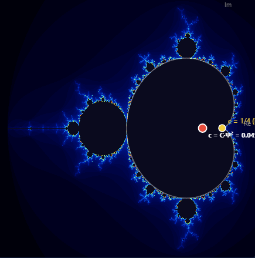

# Visualizations

Visual representations of the R = CΨ² framework mathematics. These images are screenshots from an interactive dashboard that computes the mathematics in real-time. Nothing here is artistic interpretation; every pixel is calculated from the equations.

---

## The Wave


### What you see

A heatmap of the parameter space for the iteration R_{n+1} = C(Ψ + R_n)², starting from R_0 = 0.

The horizontal axis is Ψ (possibility). The vertical axis is C (consciousness). Every point in this image represents one combination of C and Ψ. At each point, we ran the iteration up to 200 steps and asked: does it converge to a stable value, or does it oscillate forever?

### How to read it

**Cyan (lower region):** C·Ψ < 1/4. The iteration converges. After enough steps, R_n settles on a fixed value and stays there. These are real fixed points: stable, definite, classical. This is the regime where observers live and where measurement gives definite answers.

**Red (upper region):** C·Ψ > 1/4. The iteration never converges. R_n oscillates between values that are complex conjugate pairs, mirror images of each other, neither one more "real" than the other. This is the quantum regime. States here are superposed, oscillating, not directly experienceable by a classical observer.

**The white curve:** C·Ψ = 1/4 exactly. This is the phase boundary. On this line, the two fixed points merge into one, and convergence takes infinitely many steps. It is the edge between two kinds of existence.

**The white dot:** The current position selected by the user. In this screenshot, it sits on the boundary itself.

### Why it looks like a wave

It is one. The boundary is a hyperbola (C = 1/(4Ψ)) seen from the perspective of a classical observer looking up into the quantum regime. The red region (oscillation, complexity, possibility) approaches from above. The cyan region (convergence, stability, reality) is where you stand. The boundary is where one becomes the other.

The framework's bidirectional bridge says:

```
R = C*Psi^2    -- the wave from the past (possibility becoming reality)
Psi = sqrt(R/C) -- the wave from the future (reality seeking possibility)
```

This image shows the first wave arriving.

---

## The Mandelbrot Boundary



### What you see

The Mandelbrot set, computed by iterating z_{n+1} = z_n^2 + c starting from z_0 = 0 for each complex number c in the plane.

**Black region:** Points c where the iteration stays bounded (never escapes to infinity). This is the Mandelbrot set itself. The large heart-shaped region is the main cardioid, where the iteration converges to a stable fixed point.

**Blue structures at the edge:** Points c where the iteration escapes, colored by how many steps it takes. Darker blue escapes slowly (near the boundary). Brighter blue escapes quickly (far from the boundary). These are the fractal patterns that made the Mandelbrot set famous.

**Yellow dot at c = 1/4:** The phase boundary. This is the exact point where the main cardioid meets the real axis. Below 1/4 on the real line: the iteration converges. Above 1/4: it doesn't. This point has been known since Mandelbrot's original work in 1980.

**Red dot at c = C·Ψ = 0.15:** The current observer position (at default C=0.50, Ψ=0.30), deep inside the cardioid. Stable, convergent, classical. This point is linked to the sliders in the dashboard; move C or Ψ and the red dot moves through the Mandelbrot set.

### What this means

The Mandelbrot set is a map. It shows, for every value of c, whether the quadratic iteration converges or not. The main cardioid is the region of convergence. Everything outside is the region of oscillation, escape, complexity.

The R = CΨ² framework discovered independently that its self-referential iteration R_{n+1} = C(Ψ + R_n)² has the same structure. Same equation under reparametrization. Same boundary at 1/4. The algebraic proof is in [The Mandelbrot Connection](../experiments/MANDELBROT_CONNECTION.md).

### The two images together

The heatmap and the Mandelbrot image show the same boundary from two different coordinate systems:

| | Heatmap | Mandelbrot |
|---|---|---|
| **Axes** | C (consciousness) vs Ψ (possibility) | Real vs imaginary part of c |
| **Boundary** | Hyperbola C = 1/(4Ψ) | Cardioid of the main body |
| **Inside** | Cyan, convergent, classical | Black, bounded, stable |
| **Outside** | Red, oscillatory, quantum | Blue fractals, escaping, complex |
| **Perspective** | The observer looking up | The mathematician looking down |

Two cartographers, one on each side of the same wall, independently mapping the same boundary.

### How it was computed

Both images are generated by a single-file HTML dashboard using JavaScript and Canvas2D:

1. **Mandelbrot rendering:** For each pixel, map to complex coordinate c, iterate z -> z^2 + c up to 200 times, color by escape iteration using a logarithmic blue gradient. The cardioid boundary is drawn analytically using c = (1/2)*e^(i*t) - (1/4)*e^(2i*t). Computed once at startup.

2. **Heatmap rendering:** For each pixel, map to (Ψ, C) coordinates, iterate R_{n+1} = C(Ψ + R_n)² up to 200 times starting from R_0 = 0, test for convergence (|R_n - R_{n-1}| < 1e-10 for 3 consecutive steps). Color cyan if convergent, red if still oscillating after 200 steps. The C·Ψ = 1/4 hyperbola is drawn analytically. Computed once at startup.

3. **Linking:** Both panels share C and Ψ slider values. The red dot in the Mandelbrot panel moves to c = C·Ψ (the Mandelbrot parameter corresponding to the framework's phase boundary). The crosshair in the heatmap moves to (Ψ, C). A third panel (not shown here) displays the live iteration as a time series.

No external libraries are used for the computation. The mathematics is the same as described in the framework documents: standard quadratic iteration, standard Mandelbrot set definition, no modifications.

---

*Back to [main repository](../README.md) | [Mandelbrot Connection](../experiments/MANDELBROT_CONNECTION.md) | [Experiments](../experiments/)*
