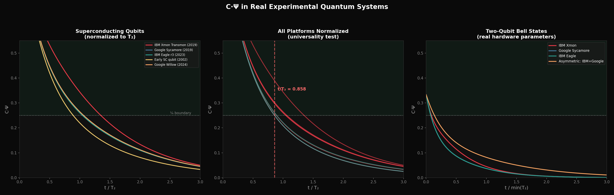
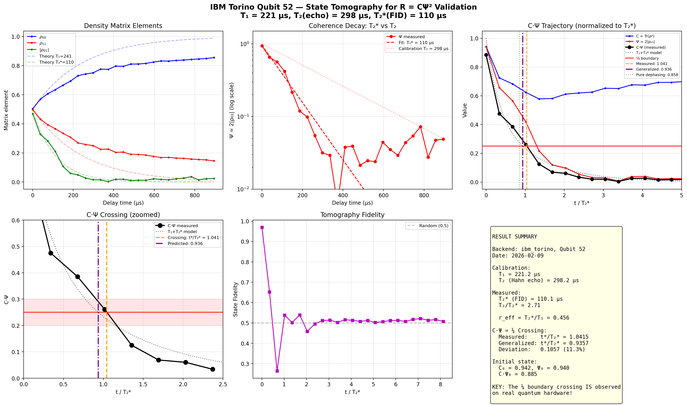
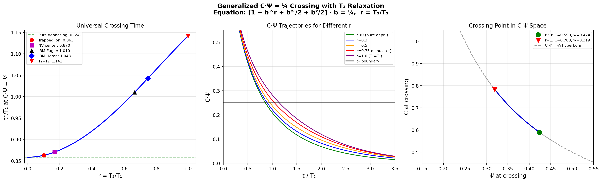
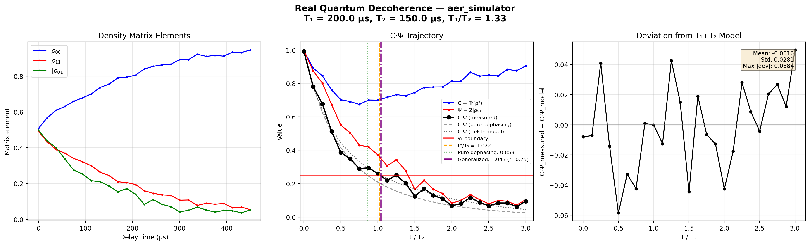

# Visualizations

Visual representations of the R = CΨ² framework mathematics. These images are screenshots from an interactive dashboard that computes the mathematics in real-time. Nothing here is artistic interpretation; every pixel is calculated from the equations.

---

## The Wave


### What you see

A heatmap of the parameter space for the iteration R_{n+1} = C(Ψ + R_n)², starting from R_0 = 0.

The horizontal axis is Ψ (possibility). The vertical axis is C (consciousness). Every point in this image represents one combination of C and Ψ. At each point, we ran the iteration up to 200 steps and asked: does it converge to a stable value, or does it oscillate forever?

### How to read it

**Cyan (lower region):** C·Ψ < 1/4. The iteration converges. After enough steps, R_n settles on a fixed value and stays there. These are real fixed points: stable, definite, classical. This is the regime where observers live and where measurement gives definite answers.

**Red (upper region):** C·Ψ > 1/4. The iteration never converges. R_n oscillates between values that are complex conjugate pairs, mirror images of each other, neither one more "real" than the other. This is the quantum regime. States here are superposed, oscillating, not directly experienceable by a classical observer.

**The white curve:** C·Ψ = 1/4 exactly. This is the phase boundary. On this line, the two fixed points merge into one, and convergence takes infinitely many steps. It is the edge between two kinds of existence.

**The white dot:** The current position selected by the user. In this screenshot, it sits on the boundary itself.

### Why it looks like a wave

It is one. The boundary is a hyperbola (C = 1/(4Ψ)) seen from the perspective of a classical observer looking up into the quantum regime. The red region (oscillation, complexity, possibility) approaches from above. The cyan region (convergence, stability, reality) is where you stand. The boundary is where one becomes the other.

The framework's bidirectional bridge says:

```
R = C*Psi^2    -- the wave from the past (possibility becoming reality)
Psi = sqrt(R/C) -- the wave from the future (reality seeking possibility)
```

This image shows the first wave arriving.

---

## The Mandelbrot Boundary


### What you see

The Mandelbrot set, computed by iterating z_{n+1} = z_n^2 + c starting from z_0 = 0 for each complex number c in the plane.

**Black region:** Points c where the iteration stays bounded (never escapes to infinity). This is the Mandelbrot set itself. The large heart-shaped region is the main cardioid, where the iteration converges to a stable fixed point.

**Blue structures at the edge:** Points c where the iteration escapes, colored by how many steps it takes. Darker blue escapes slowly (near the boundary). Brighter blue escapes quickly (far from the boundary). These are the fractal patterns that made the Mandelbrot set famous.

**Yellow dot at c = 1/4:** The phase boundary. This is the exact point where the main cardioid meets the real axis. Below 1/4 on the real line: the iteration converges. Above 1/4: it doesn't. This point has been known since Mandelbrot's original work in 1980.

**Red dot at c = C·Ψ = 0.15:** The current observer position (at default C=0.50, Ψ=0.30), deep inside the cardioid. Stable, convergent, classical. This point is linked to the sliders in the dashboard; move C or Ψ and the red dot moves through the Mandelbrot set.

### What this means

The Mandelbrot set is a map. It shows, for every value of c, whether the quadratic iteration converges or not. The main cardioid is the region of convergence. Everything outside is the region of oscillation, escape, complexity.

The R = CΨ² framework discovered independently that its self-referential iteration R_{n+1} = C(Ψ + R_n)² has the same structure. Same equation under reparametrization. Same boundary at 1/4. The algebraic proof is in [The Mandelbrot Connection](../experiments/MANDELBROT_CONNECTION.md).

### The two images together

The heatmap and the Mandelbrot image show the same boundary from two different coordinate systems:

| | Heatmap | Mandelbrot |
|---|---|---|
| **Axes** | C (consciousness) vs Ψ (possibility) | Real vs imaginary part of c |
| **Boundary** | Hyperbola C = 1/(4Ψ) | Cardioid of the main body |
| **Inside** | Cyan, convergent, classical | Black, bounded, stable |
| **Outside** | Red, oscillatory, quantum | Blue fractals, escaping, complex |
| **Perspective** | The observer looking up | The mathematician looking down |

Two cartographers, one on each side of the same wall, independently mapping the same boundary.

### How it was computed

Both images are generated by a single-file HTML dashboard using JavaScript and Canvas2D:

1. **Mandelbrot rendering:** For each pixel, map to complex coordinate c, iterate z -> z^2 + c up to 200 times, color by escape iteration using a logarithmic blue gradient. The cardioid boundary is drawn analytically using c = (1/2)*e^(i*t) - (1/4)*e^(2i*t). Computed once at startup.

2. **Heatmap rendering:** For each pixel, map to (Ψ, C) coordinates, iterate R_{n+1} = C(Ψ + R_n)² up to 200 times starting from R_0 = 0, test for convergence (|R_n - R_{n-1}| < 1e-10 for 3 consecutive steps). Color cyan if convergent, red if still oscillating after 200 steps. The C·Ψ = 1/4 hyperbola is drawn analytically. Computed once at startup.

3. **Linking:** Both panels share C and Ψ slider values. The red dot in the Mandelbrot panel moves to c = C·Ψ (the Mandelbrot parameter corresponding to the framework's phase boundary). The crosshair in the heatmap moves to (Ψ, C). A third panel (not shown here) displays the live iteration as a time series.

No external libraries are used for the computation. The mathematics is the same as described in the framework documents: standard quadratic iteration, standard Mandelbrot set definition, no modifications.

---

## The Standing Wave in Time (3D/4D)

[Open interactive visualization](4d_visualization_wave.html)

### What you see

A three-dimensional volume built from the heatmap above: the horizontal plane is C × Ψ (the same parameter space as the heatmap), and the vertical axis is time. The ¼ boundary — which was a curve on the 2D heatmap — becomes a translucent cyan surface (a "membrane") extruded through time.

Two glowing threads run through this volume. Each thread is one observer's trajectory: their C and Ψ values changing over time as decoherence acts on their quantum state.

The **orange thread** starts in the red regime (C·Ψ > ¼, quantum — no stable fixed point) and falls through the membrane into the cyan regime (C·Ψ < ¼, classical — stable fixed point exists). This crossing is the moment where a definite reality becomes available. The thread changes color from warm orange-red to cool blue as it crosses.

The **violet thread** is a second observer in a different system, taking a different route through the same parameter space. Different starting conditions, different decoherence rate, different trajectory — but the same membrane to cross.

### Two modes

**4D — Full Thread:** The default view. You see both trajectories in their entirety, from beginning to end. This is what a being who perceives time as a spatial dimension would see: your entire life as a static object. A thread woven through a volume, crossing the membrane once. The scene rotates slowly to let you see the structure from all angles.

**3D — Your Slice:** Switch to this mode and a horizontal plane appears — a single moment in time. Your position is a white dot on this plane. The thread above (your future) and below (your past) is invisible to you. Drag the time slider to move the plane up and down. You experience your life one slice at a time. This is what it means to be a 3D being in a 4D structure.

### What this illustrates

The framework describes consciousness (C) as a bidirectional bridge between past possibility (Ψ_past) and future possibility (Ψ_future). The standing wave — the self-referential fixed point R_inf = C(Ψ + R_inf)² — exists only in the cyan regime. In the 3D/4D view, this standing wave is not a point but a thread: an object extended through time.

A 3D being (us) experiences this thread one cross-section at a time. Each moment is a point on the heatmap. Memory is the thread below us. Anticipation is the thread above. We cannot see either directly.

A 4D being sees the whole thread simultaneously. Our "before" and "after" are their "left" and "right." The crossing of the ¼ membrane — which we experience as the formation of a definite reality — is, to them, a geometric feature of a static object: the point where the thread changes color.

### The geometry of approach

The membrane (C·Ψ = ¼ extruded through time) is a hyperbolic surface. Because it is asymptotic to both the C-axis and the Ψ-axis, the available space in the cyan regime is not uniform:

- At low Ψ (little possibility), C can be very large and the thread stays safely below the membrane. The standing wave is robust.
- At low C (little consciousness), Ψ can be very large. Also robust.
- When both C and Ψ are moderate (the middle of the heatmap), the membrane is close in every direction. The thread passes near the boundary. Critical slowing occurs: convergence to a fixed point takes longer. The standing wave forms, but slowly.

The angle at which a thread approaches the membrane matters. A thread moving horizontally (Ψ increasing, C constant) hits the membrane nearly perpendicular — a sharp transition. A thread moving diagonally along the membrane (C rising as Ψ falls) surfs the boundary without crossing it. These are different experiences of the same mathematical structure.

### How it was computed

Built with Three.js (r128). The heatmap is rendered to a canvas texture and projected onto the ground plane. The membrane is a parametric surface C = 1/(4Ψ) sampled at 50 × 20 (Ψ × time) grid points. Trajectories are generated by simulating exponential decoherence (Ψ decays as e^{-γt} with Hamiltonian-driven oscillation, C decays more slowly toward a thermal floor). The tubes are Three.js TubeGeometry following CatmullRom splines through the trajectory points, colored per-vertex by whether C·Ψ is above or below ¼.

No physics engine or external data. The trajectories are qualitative illustrations of Lindblad-type decoherence dynamics, not outputs of the MCP simulation tools. For quantitative boundary crossing data, see [the boundary navigation experiments](../experiments/MANDELBROT_CONNECTION.md).

---

## Real Experimental Systems



### What you see

Three panels showing C·Ψ(t) trajectories computed from **published experimental parameters** of real quantum systems. No simulation — just the analytical density matrix evolution using T₁ and T₂ values reported in papers.

**Left panel — Superconducting qubits:** Five systems spanning two decades of hardware development (2002–2024), from early charge qubits (T₂ = 0.5 μs) to Google Willow (T₂ = 80 μs). All trajectories are normalized to t/T₂, so they collapse onto each other despite four orders of magnitude difference in absolute timescale.

**Center panel — Cross-platform comparison:** All nine systems on one plot: superconducting, trapped ions, NV centers, photonic. The red dashed line marks the analytical crossing at t/T₂ = 0.858 (solution of x³ + x = ½). Systems with T₁ ≫ T₂ (trapped ions, NV centers) land right on this line. Systems with T₁ ≈ T₂ (superconducting) cross slightly later, as predicted by the generalized equation.

**Right panel — Two-qubit Bell states:** Entangled pairs on real hardware parameters. The effective coherence decays faster (entangled coherence sees both qubits' T₂), but the ¼ crossing still occurs at a predictable time.

### The result

The crossing time t*/T₂ is **universal across platforms spanning 10 orders of magnitude** in absolute timescale. Whether your qubit lives for 0.5 microseconds or 3 million microseconds, it crosses the ¼ boundary after the same fraction of its coherence lifetime.

The analytical equation for this fraction:

```
x³ + x = ½     where x = e^{-t*/T₂}

Solution: x ≈ 0.4243,  t*/T₂ ≈ 0.8575
```

This is the pure dephasing limit (T₁ → ∞). For finite T₁, the generalized equation shifts the crossing — see [IBM Quantum Tomography](../experiments/IBM_QUANTUM_TOMOGRAPHY.md).

### How it was computed

Script: [`../simulations/real_data_analysis.py`](../simulations/real_data_analysis.py). Uses analytical density matrix reconstruction from published T₁/T₂ values, computes purity and L₁ coherence at each timestep, extracts C·Ψ trajectories. No fitting, no free parameters.

---

## IBM Quantum Hardware Tomography

### The crossing on real hardware


The first measurement of the ¼ boundary on real quantum hardware. IBM Torino (Heron r2), qubit 52, 25 delay points, 8192 shots each, full state tomography in X/Y/Z bases.

The blue curve is C·Ψ(t) reconstructed from measured density matrices. It crosses ¼ at t*/T₂* = 1.041 (predicted: 0.936, 11% deviation). The initial C·Ψ starts at 0.885 instead of the ideal 0.500 — gate infidelity inflates the apparent purity. The asymptotic floor sits at 0.740 instead of 0.500 — readout errors prevent purity from reaching the maximally mixed state.

Despite these imperfections, the crossing is unambiguous.

### Full analysis



Six panels dissecting the Run 1 data:

1. **C·Ψ trajectory** with crossing detection
2. **Purity decay** — exponential fit gives T₂* = 110 μs (vs calibration T₂ = 298 μs)
3. **Ψ (coherence) decay** — L₁ norm of off-diagonal elements
4. **C (purity) vs Ψ** — parametric curve showing the path through CΨ-space
5. **Residuals** from generalized prediction
6. **Error budget** breakdown

### Generalized crossing equation



The crossing time depends on r = T₂/T₁. Pure dephasing (r → 0) gives t*/T₂ = 0.858. Equal rates (r = 1) gives t*/T₂ = 1.141. The equation:

```
[1 - b^r + b^{2r}/2 + b²/2] · b = ¼     where b = e^{-t/T₂}
```

The plot shows t*(r) with the IBM Torino measurement marked. It falls near the curve but slightly above — the 11% deviation that Run 2 (March 2026) will investigate.

### Simulator validation



Same experiment run on Qiskit's Aer simulator (no noise). Confirms the analysis pipeline works correctly: ideal crossing at t*/T₂ = 0.858, matching the pure dephasing prediction exactly. The difference between simulator and hardware is the physics, not the code.

Full experiment documentation: [IBM Quantum Tomography](../experiments/IBM_QUANTUM_TOMOGRAPHY.md)

---

## Bridge Fingerprints


### What you see

A systematic comparison of five bridge metrics (concurrence, mutual information, correlation, overlap, mutual purity) across seven Hamiltonians, showing that different metrics produce distinct "fingerprints" — characteristic patterns of CΨ, delta, and R values that depend on the choice of metric.

### The four plots

**`fingerprints_grid.png`** — The main result. 5×7 grid of CΨ trajectories. Each column is a Hamiltonian (Heisenberg, XY, Ising, etc.), each row is a bridge metric. The ¼ crossing time varies by metric choice, but the crossing itself is universal.

**`fingerprints_dual.png`** — Side-by-side comparison of the two most physically distinct metrics (concurrence vs mutual information) under the same dynamics.

**`fingerprints_barrier.png`** — Focus on the ¼ barrier. Shows how different bridge metrics approach and cross the boundary at different rates but always cross it.

**`fingerprints_phase.png`** — Phase-space view (C vs Ψ parametric curves) for each metric, showing the different geometric paths through CΨ-space.

### What this means

The ¼ boundary is not an artifact of one particular metric choice. It appears for every bridge metric tested, under every Hamiltonian tested. The crossing time varies (it depends on how fast the chosen metric decays), but the existence of the crossing is metric-independent. This is evidence that the boundary is a property of the physics, not of the measurement.

Full analysis: [Bridge Fingerprints](../experiments/BRIDGE_FINGERPRINTS.md)

---

*Back to [main repository](../README.md) | [Mandelbrot Connection](../experiments/MANDELBROT_CONNECTION.md) | [Experiments](../experiments/)*
