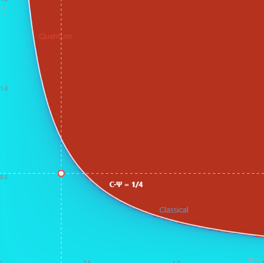
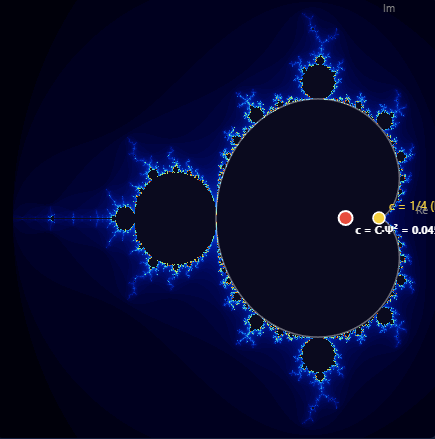
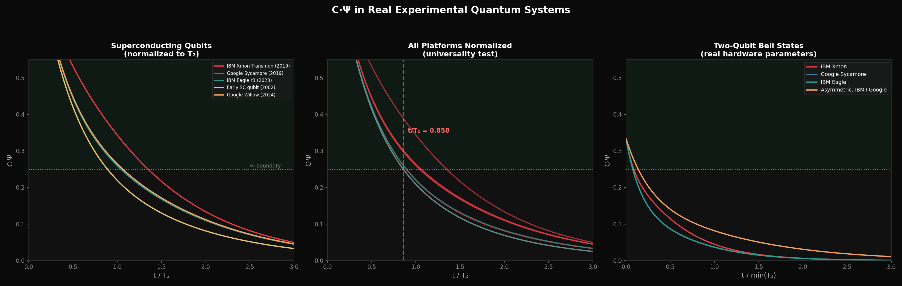
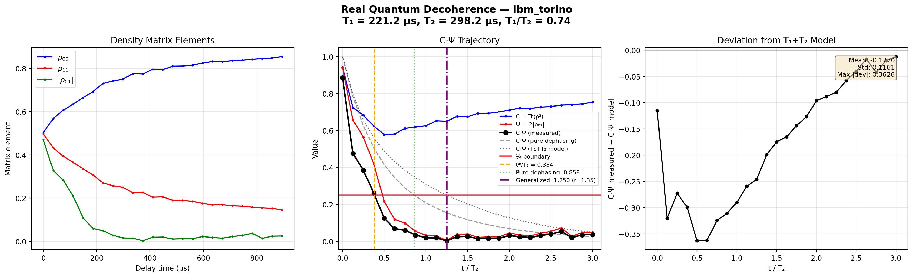
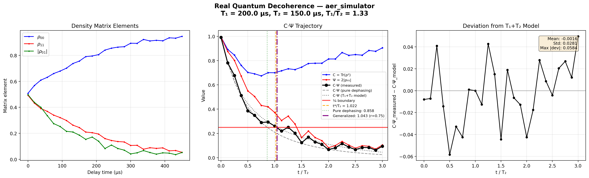
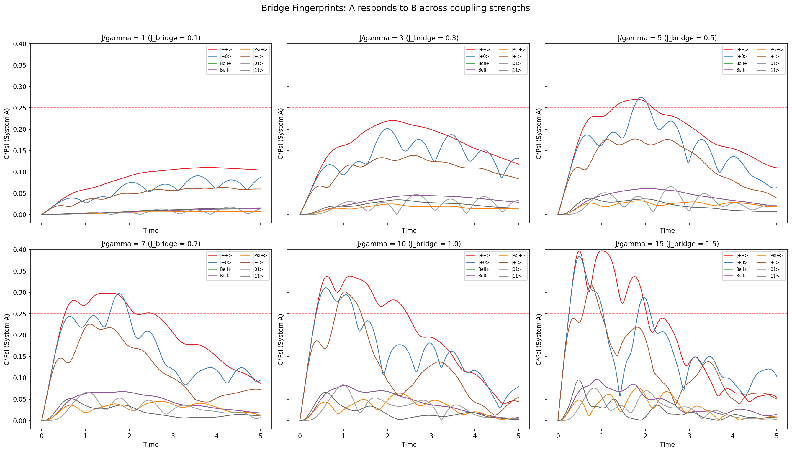
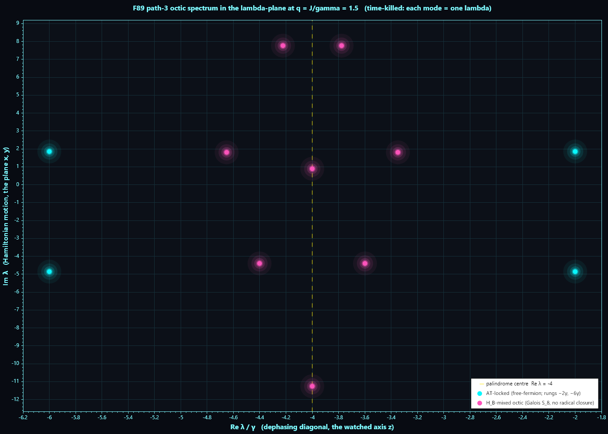
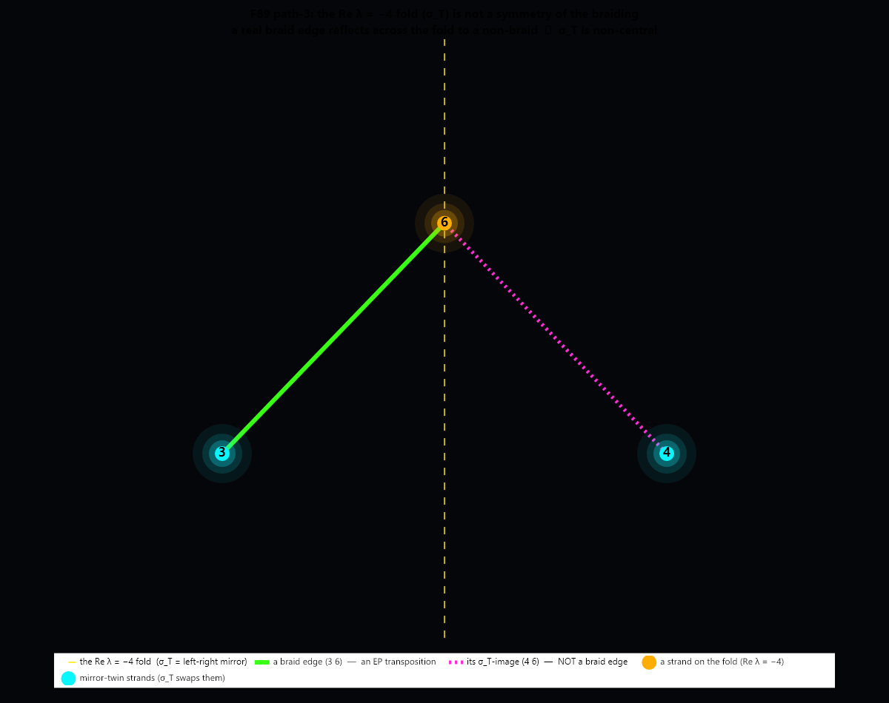

<!-- QUARTER-CURRENT -->
# Visualizations with explicit model and drawing seams

Current reading: each image combines calculated coordinates with deliberate
choices of projection, camera, color, annotation, and visual interpretation. A caption must
say whether it depicts an algebraic recurrence, a finite model trajectory, a
hardware sample, or an interpretive analogy; pixels alone certify none of those
identifications.

<!-- QUARTER-HISTORICAL -->
**Historical record:** the gallery notes below retain the labels that accompanied
the original images.  The regenerated companions and their current captions are
the authoritative disposition.

# Visualizations

Visual representations from the project's notebooks. Some coordinates are
calculated; camera, projection, color, annotation, interpolation, and metaphor
are authored choices. Pixels certify only the renderer's inputs and algorithm.

---

## The Wave



### What you see

A heatmap of the parameter space for the iteration R_{n+1} = C(Ψ + R_n)², starting from R_0 = 0.

The horizontal axis is Ψ (coherence). The vertical axis is C (coupling/purity). Every point in this image represents one combination of C and Ψ. At each point, we ran the iteration up to 200 steps and asked: does it converge to a stable value, or does it oscillate forever?

### How to read it

**Cyan (lower region):** for the displayed real recurrence inputs, the finite
iteration meets its convergence rule and approaches a real fixed point. The
color says nothing about classicality.

**Red (upper region):** the finite 200-step real-valued routine does not meet
the displayed stop rule. Complex roots of the fixed-point quadratic are an
algebraic fact; the color is not a quantum-state or observer regime.

**The white curve:** C·Ψ=1/4, where this recurrence's fixed-point quadratic has
a double root. The finite iteration count depends on its stopping rule; the
curve is not a phase boundary between kinds of existence.

**The white dot:** The current position selected by the user. In this screenshot, it sits on the boundary itself.

### Why it looks like a wave

It is a plotted hyperbola C=1/(4Ψ) with contrasting colors above and below.
The wave reading is visual interpretation, not a classical observer looking
into a quantum regime.

The framework's bidirectional bridge says:

```
R = CΨ² - the wave from the past (possibility becoming reality)
Ψ = sqrt(R/C) - the wave from the future (reality seeking possibility)
```

This image shows the first wave arriving.

---

## The Mandelbrot Boundary



### What you see

The Mandelbrot set, computed by iterating z_{n+1} = z_n^2 + c starting from z_0 = 0 for each complex number c in the plane.

**Black region:** Points c where the iteration stays bounded (never escapes to infinity). This is the Mandelbrot set itself. The large heart-shaped region is the main cardioid, where the iteration converges to a stable fixed point.

**Blue structures at the edge:** Points c where the iteration escapes, colored by how many steps it takes. Darker blue escapes slowly (near the boundary). Brighter blue escapes quickly (far from the boundary). These are the fractal patterns that made the Mandelbrot set famous.

**Yellow dot at c=1/4:** the real cusp of the period-one cardioid. It is the
double-root point of z²-z+c=0. This statement is about that recurrence, not every
quarter-valued readout in the repository.

**Red dot at c=C·Ψ=0.15:** a dashboard mapping chosen for the sliders. It is
inside the cardioid as a recurrence parameter; that does not classify a
physical state as classical.

### What this means

The Mandelbrot set is a map. It shows, for every value of c, whether the quadratic iteration converges or not. The main cardioid is the region of convergence. Everything outside is the region of oscillation, escape, complexity.

After rescaling, the fixed-point equation for R_{n+1}=C(Ψ+R_n)² has the
same quadratic form on the specified real slice. The map, variables, and
physical interpretation must still be stated separately.

### The two images together

The two panels place related quadratic shapes beside one another:

| | Heatmap | Mandelbrot |
|---|---|---|
| **Axes** | C (coupling) vs Ψ (coherence) | Real vs imaginary part of c |
| **Boundary** | Hyperbola C = 1/(4Ψ) | Cardioid of the main body |
| **Inside** | Cyan, finite stop met | Black, bounded orbit in this raster |
| **Outside** | Red, finite stop not met | Blue, escaped within the cap |
| **Perspective** | CΨ parameter space | Complex plane |

The resemblance is algebraic; the panels are not one universal physical boundary.

### How it was computed

Both images are generated by a single-file HTML dashboard using JavaScript and Canvas2D:

1. **Mandelbrot rendering:** For each pixel, map to complex coordinate c, iterate z → z² + c up to 200 times, color by escape iteration using a logarithmic blue gradient. The cardioid boundary is drawn analytically using c = (1/2)*e^(i*t) - (1/4)*e^(2i*t). Computed once at startup.

2. **Heatmap rendering:** For each pixel, map to (Ψ, C) coordinates, iterate R_{n+1} = C(Ψ + R_n)² up to 200 times starting from R_0 = 0, test for convergence (|R_n - R_{n-1}| < 1e-10 for 3 consecutive steps). Color cyan if convergent, red if still oscillating after 200 steps. The C·Ψ = 1/4 hyperbola is drawn analytically. Computed once at startup.

3. **Linking:** Both panels share C and Ψ slider values. The dashboard chooses
   c=C·Ψ for the red dot and (Ψ,C) for the crosshair; that UI mapping is not a
   physical identification. The historical interactive companion is not
   present in this checkout, so this README does not offer a dead link to it.

No external libraries are used for the computation. The mathematics is the same as described in the framework documents: standard quadratic iteration, standard Mandelbrot set definition, no modifications.

---

## The Standing Wave in Time (3D/4D)

> **Note:** This visualization is a qualitative illustration of the parameter space structure, not a simulation output. The trajectories are generated from simplified exponential decay models. The interpretive language ("consciousness as a bridge", "4D being") reflects the legacy framing; see [THE_CPSI_LENS](../docs/THE_CPSI_LENS.md) for the current description.

The prose below records what that historical visualization showed; no runnable
HTML artifact is currently tracked here.

### What you see

A three-dimensional volume built from the heatmap above: the horizontal plane is C × Ψ (the same parameter space as the heatmap), and the vertical axis is time. The ¼ boundary (which was a curve on the 2D heatmap) becomes a translucent cyan surface (a "membrane") extruded through time.

Two glowing threads run through this volume. Each thread is one observer's trajectory: their C and Ψ values changing over time as decoherence acts on their quantum state.

The **orange thread** is a simplified authored trajectory whose scalar passes
from above to below ¼. Its warm-to-cool change marks that equality; it does not
show a quantum-to-classical transition or definite reality becoming available.

The **violet thread** is a second illustrative curve with different parameters.
"Observer" and "membrane" are story labels.

### Two modes

**4D, Full Thread:** The default view. You see both trajectories in their entirety, from beginning to end. This is what a being who perceives time as a spatial dimension would see: your entire life as a static object. A thread woven through a volume, crossing the membrane once. The scene rotates slowly to let you see the structure from all angles.

**3D, Your Slice:** Switch to this mode and a horizontal plane appears, a single moment in time. Your position is a white dot on this plane. The thread above (your future) and below (your past) is invisible to you. Drag the time slider to move the plane up and down. You experience your life one slice at a time. This is what it means to be a 3D being in a 4D structure.

### What this illustrates

On the displayed real branch, the recurrence has real fixed points on one side
of the discriminant zero. The 3D/4D view extrudes that algebraic curve and adds
illustrative threads; it is not a dynamics simulation.

### The geometry of approach

The membrane (C·Ψ = ¼ extruded through time) is a hyperbolic surface. Because it is asymptotic to both the C-axis and the Ψ-axis, the available space in the cyan regime is not uniform:

- At low Ψ (little possibility), C can be very large and the thread stays safely below the membrane. The standing wave is robust.
- At low C (little purity/coupling), Ψ can be very large. Also robust.
- When both C and Ψ are moderate (the middle of the heatmap), the membrane is close in every direction. The thread passes near the boundary. Critical slowing occurs: convergence to a fixed point takes longer. The standing wave forms, but slowly.

The angle at which a thread approaches the membrane matters. A thread moving horizontally (Ψ increasing, C constant) hits the membrane nearly perpendicular: a sharp transition. A thread moving diagonally along the membrane (C rising as Ψ falls) surfs the boundary without crossing it. These are different experiences of the same mathematical structure.

### How it was computed

Built with Three.js (r128). The heatmap is rendered to a canvas texture and projected onto the ground plane. The membrane is a parametric surface C = 1/(4Ψ) sampled at 50 × 20 (Ψ × time) grid points. Trajectories are generated by simulating exponential decoherence (Ψ decays as e^{-γt} with Hamiltonian-driven oscillation, C decays more slowly toward a thermal floor). The tubes are Three.js TubeGeometry following CatmullRom splines through the trajectory points, colored per-vertex by whether C·Ψ is above or below ¼.

No physics engine or external data. The trajectories are qualitative illustrations of Lindblad-type decoherence dynamics, not outputs of the MCP simulation tools. For quantitative boundary crossing data, see [the boundary navigation experiments](../experiments/MANDELBROT_CONNECTION.md).

---

## Real Experimental Systems



### What you see

Three panels showing C·Ψ(t) trajectories computed from **published experimental parameters** of real quantum systems. No simulation, just the analytical density matrix evolution using T₁ and T₂ values reported in papers.

**Left panel, superconducting qubits:** Five systems spanning two decades of hardware development (2002-2024), from early charge qubits (T₂ = 0.5 μs) to Google Willow (T₂ = 80 μs). All trajectories are normalized to t/T₂, so they collapse onto each other despite four orders of magnitude difference in absolute timescale.

**Center panel, cross-platform comparison:** All nine systems on one plot: superconducting, trapped ions, NV centers, photonic. The red dashed line marks the analytical crossing at t/T₂ = 0.858 (solution of x³ + x = ½). Systems with T₁ ≫ T₂ (trapped ions, NV centers) land right on this line. Systems with T₁ ≈ T₂ (superconducting) cross slightly later, as predicted by the generalized equation.

**Right panel, two-qubit Bell states:** Entangled pairs on real hardware parameters. The effective coherence decays faster (entangled coherence sees both qubits' T₂), but the ¼ crossing still occurs at a predictable time.

### The result

The value t*/T₂=0.858 is common only inside the same ideal free-|+⟩,
pure-dephasing proxy model after normalization. Published T₁/T₂ numbers do
not establish a platform-independent physical lifetime or boundary.

The analytical equation for this fraction:

```
x³ + x = ½     where x = e^{-t*/T₂}

Solution: x ≈ 0.4239,  t*/T₂ ≈ 0.858
```

This is the pure dephasing limit (T₁ → ∞). For finite T₁, the generalized equation shifts the crossing; see [IBM Quantum Tomography](../experiments/IBM_QUANTUM_TOMOGRAPHY.md).

### How it was computed

Script: [`../simulations/real_data_analysis.py`](../simulations/real_data_analysis.py). Uses analytical density matrix reconstruction from published T₁/T₂ values, computes purity and L₁ coherence at each timestep, extracts C·Ψ trajectories. No fitting, no free parameters.

---

## IBM Quantum Hardware Tomography

### The crossing on real hardware



A finite IBM Torino run on qubit 52: 25 delay points, 8192 shots each, with
state tomography in X/Y/Z bases. The reconstructed scalar passes 1/4; the run
does not establish a universal boundary.

The black curve is C·Ψ(t) reconstructed from measured density matrices, on the figure's axis t/T₂ with the calibration's echo time T₂ = 298.2 μs. It crosses ¼ at t* = 114.7 μs, which that axis reads as 0.384; the figure's generalized line (1.250 at r = 1.35) is drawn on the same echo time. On the qubit's own free decay, T₂* = 110.7 μs, the crossing is t*/T₂* = 1.036, 9.1% after the generalized prediction 0.950 on the same T₂*. The initial C·Ψ starts at 0.885 instead of the ideal 1.000 (preparation and measurement errors lower both the initial purity and the initial coherence). The purity C (blue) falls to 0.58 at 149 μs and climbs back to about 0.75 by the end of the record, rather than toward the maximally mixed 0.500, because relaxation pulls the qubit toward |0⟩.

Within this reconstructed trace and convention, the sampled scalar crossing is clear.

### Full analysis


Six panels dissecting the Run 1 data:

1. **C·Ψ trajectory** with crossing detection
2. **Purity decay**: exponential fit gives T₂* = 110 μs (vs calibration T₂ = 298 μs)
3. **Ψ (coherence) decay**: L₁ norm of off-diagonal elements
4. **C (purity) vs Ψ**: parametric curve showing the path through CΨ-space
5. **Residuals** from generalized prediction
6. **Error budget** breakdown

### Generalized crossing equation


The crossing time depends on r = T₂/T₁. Pure dephasing (r → 0) gives t*/T₂ = 0.858. Equal rates (r = 1) gives t*/T₂ = 1.141. The equation:

```
[1 - b^r + b^{2r}/2 + b²/2] · b = ¼     where b = e^{-t/T₂}
```

The plot marks the curve at the ratios of a few platforms (trapped ion, NV center, IBM Eagle and Heron, T₁ = T₂); these are points of the curve, not measurements, and the Q52 record is not among them. Q52's crossing sits 9.1% above the curve on its own T₂* (t*/T₂* = 1.036 against 0.950 at r = 0.500); Run 3 (March 18) measured the crossing again on Q80, at 1.9%.

### Simulator validation



An Aer control reproduces the ideal model's arithmetic at t*/T₂=0.858. That
checks one path through the analysis; it does not prove all hardware/model
differences are physical rather than preparation, readout, fit, or code effects.

Full experiment documentation: [IBM Quantum Tomography](../experiments/IBM_QUANTUM_TOMOGRAPHY.md)

---

## Bridge Fingerprints



### What you see

A systematic comparison of five bridge metrics (concurrence, mutual information, correlation, overlap, mutual purity) across seven Hamiltonians, showing that different metrics produce distinct "fingerprints", characteristic patterns of CΨ, delta, and R values that depend on the choice of metric.

### The four plots

**`fingerprints_grid.png`**: A finite 5×7 grid of CΨ trajectories. Each column
is a Hamiltonian and each row a bridge metric. Crossings in this catalogue are
model- and metric-specific.

**`fingerprints_dual.png`**: Side-by-side comparison of the two most physically distinct metrics (concurrence vs mutual information) under the same dynamics.

**`fingerprints_barrier.png`**: A zoom around the quarter line for the displayed
cases; it is not an all-model guarantee.

**`fingerprints_phase.png`**: Phase-space view (C vs Ψ parametric curves) for each metric, showing the different geometric paths through CΨ-space.

### What this means

Every row in this finite grid happens to cross the selected line. Because the
metric is part of the plotted scalar and the catalogue is finite, the figure
does not establish metric independence or a boundary belonging to physics
rather than measurement.

Full analysis: [Bridge Fingerprints](../experiments/BRIDGE_FINGERPRINTS.md)

---

## The F89 Octic: One Object in Two Planes

The F89 path-3 octic is the eight relaxation rates of an N=4 chain's (SE, DE) coherence block whose Galois group over the control field q = J/γ is the full symmetric group S₈: there is no closed form, no radical formula for those rates. These two images are the same object seen in two complementary complex planes.

### The branch locus (the control plane q = J/γ)


Each pixel is the smallest gap between any two of the eight octic eigenvalues at that complex value of q = J/γ (the dimensionless ratio of Hamiltonian motion to dephasing). Dark, to neon green, to cyan-white tracks the gap shrinking toward a branch point; the bright cone shapes are where two rates nearly meet. Every branch point also carries a centred glow so each ring sits exactly on its dot.

**Magenta rings, the exceptional points (EPs):** defective square-root branch points, where two eigenvalues coalesce onto a single shared eigenvector. Loop q around one and two of the eight strands swap (a transposition). They are the simple zeros of the discriminant factor P₁₀(q²): degree 10 in u = q², so twenty EPs in q. Eighteen sit in this frame (the remote quartet at q ≈ ±2.31 ± 1.25i near the corners included); the last two are near-twins at q ≈ ±0.857/±0.854, ~0.003 apart, that render as one dot each at this cell.

**Amber/gold diamonds, the diabolic points:** a different kind of meeting, two eigenvalues coinciding but with two independent eigenvectors (semisimple, a double discriminant zero, the factor (3q⁴+q²−1)²). Loop around one and nothing swaps; it is silent. The real pair sits at q ≈ ±0.659, the imaginary pair at q ≈ ±0.876i.

**The white core at q = 0** is the q²⁴ super-branch, where every rate collapses onto the pure-dephasing rungs.

The whole figure is symmetric under q → −q and q → q̄ because the discriminant is a real polynomial in q². The few magenta points are the load-bearing skeleton: lasso each from a common base, read its transposition, and the transposition graph on the eight strands comes out connected, so the EPs generate S₈ = Gal(F₈). The Galois group reconstructed purely from eigenvalue braids: monodromy = Galois, from below.

### The spectrum (the output plane λ) at q = 1.5



The same block, but now every mode's whole life is compressed to one point λ (time-killed), at the fixed operating point q = 1.5, drawn in the reel palette so it lays beside the molecule spectra of [THE_SHARED_SKELETON](../experiments/THE_SHARED_SKELETON.md). Re λ is the dephasing diagonal (the axis the light arrives along, z); Im λ is the Hamiltonian's coherent motion (x, y); the palindrome centre is Re λ = −4γ.

**Cyan, the AT-locked roots,** pinned to the absorption rungs Re λ = −2γ (overlap) and −6γ (no-overlap), the free-fermion part with closed-form rates. **Pink, the H_B-mixed octic,** the eight rates that spread between the rungs, the part whose Galois group is S₈ with no radical closure.

### The duality

The two images are the fibre and the branch locus of one spectral covering λ(q). The λ-plane is the spectrum at a fixed q (the fibre); the q-plane is the set of q where that spectrum degenerates (the branch locus in the base). The same dephased-Liouvillian object, once in the output plane (λ, where the spectrum is read off) and once in the control plane (q = J/γ, the ratio of motion to arriving light). The branch-locus skeleton here is kin to the shared-skeleton diagonal of THE_SHARED_SKELETON: both are the sparse critical set that carries the whole structure, recognisable across the colour filter.

### The mirror and the braiding (the C-T witness)



The branch locus above is a palindrome, and the q → −q̄ reflection even carries the braids (mirror-image control values share the same swap). But the spectral fold itself, the mirror about Re λ = −4, does NOT pass into the braiding. It permutes the eight strands by an involution σ_T (strands on the fold are fixed, the rest come in mirror-twin pairs). This is the minimal witness that σ_T is not a symmetry of the braiding: strand 6 sits on the fold (gold), strands 3 and 4 are mirror twins (cyan, σ_T swaps them). The solid green edge (3, 6) is a real braid (an EP transposition); its σ_T-image, the dotted edge (4, 6), is NOT a braid. A real connection reflects to a non-connection, so σ_T does not commute with the monodromy: it is non-central (a permutation commuting with all of S₈ would be the identity, Z(S₈)=1). The mirror that folds the spectrum's positions is, inside the unwritable half, only one of the moves, not a rule above them. The result is [F89_MONODROMY_MIRROR](../experiments/F89_MONODROMY_MIRROR.md); the story in words is [ON_WHO_WATCHES_WHOM](../reflections/ON_WHO_WATCHES_WHOM.md).

### How it was computed

Both are drawn by the C# flashlight, the `gmscan` explorer (`compute/RCPsiSquared.Cli`, command `gmscan`), built on the live (SE, DE) block of the Object Manager. The branch points are found topologically (a non-identity monodromy loop around each grid cell, run in parallel over the grid), refined, and their transpositions assembled by lassoing each from a common base; the gap field is one parallel sweep, a 12×12 eigendecomposition per pixel. ScottPlot renders the PNGs.

```
dotnet run --project compute/RCPsiSquared.Cli -- gmscan --re -2.6,2.6 --im -1.5,1.5 --cell 0.05 --png visualizations/f89_octic_branch_locus.png
dotnet run --project compute/RCPsiSquared.Cli -- gmscan --lambda-png visualizations/f89_octic_spectrum_lambda.png
dotnet run --project compute/RCPsiSquared.Cli -- gmscan --graph-png visualizations/f89_monodromy_mirror_graph.png
```

The live witnesses are `inspect --root galoismonodromy` (the S₈ generation) and `inspect --root monodromymirror` (the mirror split: q → −q̄ intertwines the braiding, the Re λ = −4 fold σ_T does not); the Galois groups and the topology-writability classification live in [F89_TOPOLOGY_ORBIT_CLOSURE](../experiments/F89_TOPOLOGY_ORBIT_CLOSURE.md) and [F89_TOPOLOGY_CONTROLS_GALOIS_WRITABILITY](../experiments/F89_TOPOLOGY_CONTROLS_GALOIS_WRITABILITY.md).

## The N=6 Route-B A₂ Locus Atlas

The N=4 branch-locus image above was the flashlight. The N=6 atlas is the map
left after the direct-*t* search: 266 certified A₂ boxes, 133 per R-parity,
compressed by the carrier's conjugation and parity maps into 96 orbits.
The scope is the open uniform nearest-neighbour XY chain (Δ=0, zero field),
uniform local Z-dephasing γ=1 and the SE-ket/DE-bra coherence block. Coordinates
use *t*=i·`qCSharp` with `qCSharp=J/γ`, and Λ=2λ; *t* is the exact quarter-turn
of the earlier N=4 *q* plane, not a different coupling normalization.


Cyan/violet encodes R-even/R-odd, diamond/circle encodes
`HermitianAxis`/`EpCharacterStable`, gold outlines the 266 diabolic verdicts,
and magenta is reserved for a defective locus (none was found). Coordinates
are exact rational box midpoints converted only for display; the graphics do
not promote them to algebraic roots. The orbit map draws exactly the two
partner fields the schema-3 carrier holds; the F89d cross-fold, which sends
each locus to a partner in the (SE, w₄) block, joins nothing inside this
dataset and is carried by the note rather than by the figure.
In the log evidence panel, 22 exact-zero departures are placed at the labelled
10⁻¹⁸ display floor; that floor is not evidence.

The [scientific note](../experiments/ROUTE_B_N6_A2_LOCUS_ATLAS.md) owns the
interpretation and scope. Reproduce the manifest and all PNG/SVG pairs with:

```powershell
dotnet run --project compute/RCPsiSquared.Cli -c Release -- route-b-n6-atlas --out simulations/results/route_b_a2_n6_atlas.json
python simulations/route_b_a2_n6_atlas.py --manifest simulations/results/route_b_a2_n6_atlas.json --out-dir visualizations
```

---

*Back to [main repository](../README.md) | [Mandelbrot Connection](../experiments/MANDELBROT_CONNECTION.md) | [Experiments](../experiments/)*
